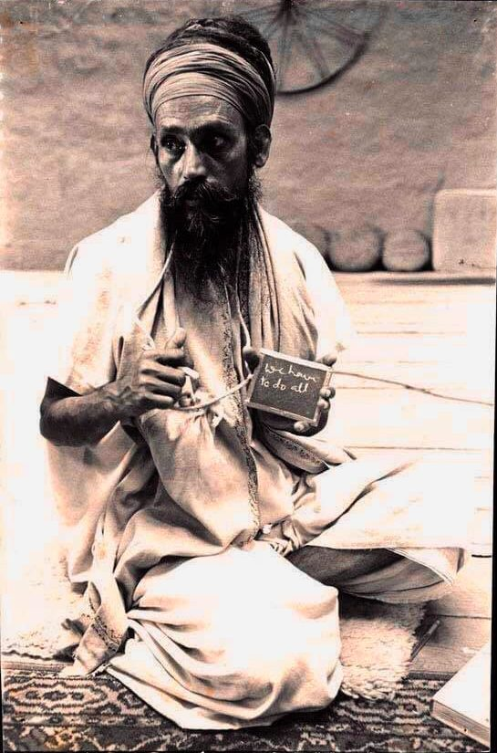

We live in uneasy times. Perhaps it has always been so, but with global news at our fingertips we’re aware of disturbing events as they happen. How can we live a balanced and peaceful life in the midst of the turmoil of the world?

Whatever we do in the world, our primary job is our own self development. When we are in a state of balance and harmony, the world around us automatically changes. Our perception, our outlook, affects our world, including our relationships with others.

*No one can please everyone. Your mental peace is more important. If you are in peace, then others around you will feel peace. So your best effort should be to work on yourself.*

There are many practical things we can do. You probably know what they are, but you may find you’re not consistent at following through and actually doing them, a common response when we’re overwhelmed.

Let’s start with the health of the body. Your body is the only one you’ll have in this lifetime. It’s your job to look after it - you know, food, exercise, sleep - all the basics. Other simple things you can do include going for walks in nature or doing asanas on your mat. None of it is complicated. I invite you to take an honest look at your habits, and see what you’re willing to commit to.

*The body is a boat which carries the soul in the ocean of the world. If it is not strong, or it has a hole, then it can’t cross the ocean. So the first duty is the fix the boat.*

Our minds also need care. We suffer from information overload, leading to worry and anxiety. Many people can’t sleep at night because their thoughts keep spinning. If, for example, you spend a lot of time on-screen - whether it’s news or Netflix, you’re feeding your mind with thoughts that continue to cycle. Everyone needs down time - time out from the constantly moving world in our lives, in our minds.

What habits are you willing to change? I don’t mean giving up fun; I mean choosing with awareness. Remembering your aim can get you back on track. If you want to be happy you can choose to shift from the habits that aren’t bringing you peace and happiness to those that do.

*Reducing negative qualities and developing positive qualities are not two different things.*

Understanding this intellectually and actually doing it are two different things, but it can be done.

*Progress depends upon your honesty.*

Be truthful with yourself in examining where your priorities lie. It might help to make a list of the values that mean the most to you, and see where your life is aligned with those convictions. If you truly want to live a balanced life, these principles will guide you. Of course, it’s not enough to be aware of them; action is required.

One of the most helpful things you can do for yourself is to commit to a daily meditation practice. Even 10-15 minutes a day, if it’s done regularly, can begin to still your mind, although the first thing you will notice is how restless your mind is, jumping from one thought to another. With regular practice, over time, these monkey minds begin to settle down.

*Faith, devotion and right aim are the three pillars that hold up the spiritual life. I don’t claim that I can give enlightenment. I say that anyone can attain it by their own effort. As long as we are not responsible for cleaning out our own garbage, we carry that garbage with us everywhere we go. No one is going to clean out our garbage for us; we have to do it ourselves.*

*The most important thing is the perfection of aim.*

Look after yourself, take care of your duties in the world, and be kind. Living by these principles simplifies your life. A simple, disciplined life is a balanced, peaceful life.

*A cotton thread can cut an iron bar if passed over it daily. If you work on yoga, yoga will work on you.*

---

Contributed by Sharada  
*All quotes in italics are from Baba Hari Dass*

---

**Sharada Filkow**, a student of classical ashtanga yoga since the early 70s, is one of the founding members of the Salt Spring Centre of Yoga, where she has lived for many years, serving as a karma yogi, teacher and mentor.
