## April 2019

***“I thank you God for this amazing day; for the leaping greenly spirits of trees and a beautiful blue true dream of sky; and for everything which is natural which is infinite which is yes.”  ~ e e cummings***

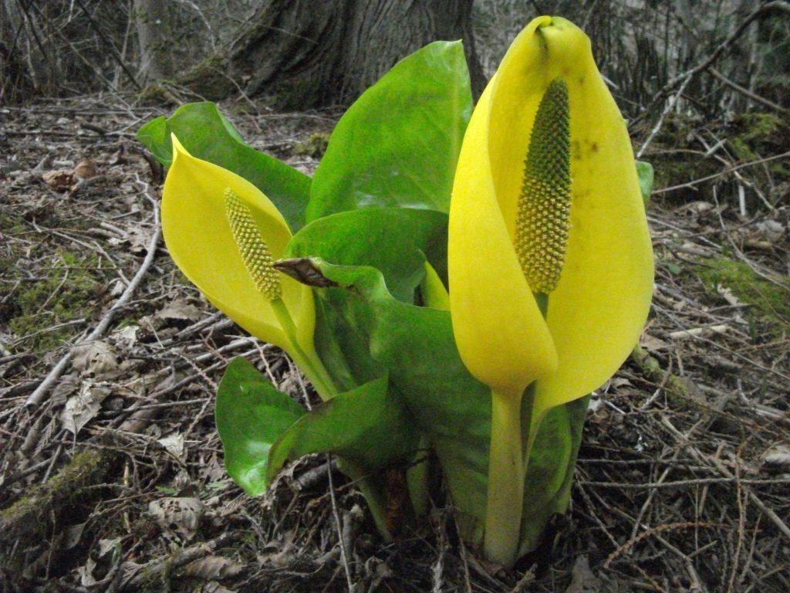

Dear friends,

The snow has melted, the flowers are blossoming again, and the frogs have awakened from their winter slumber. It is officially spring! We’ve been enjoying lunch in the sunshine on the mound and delighting in the beauty of of spring.

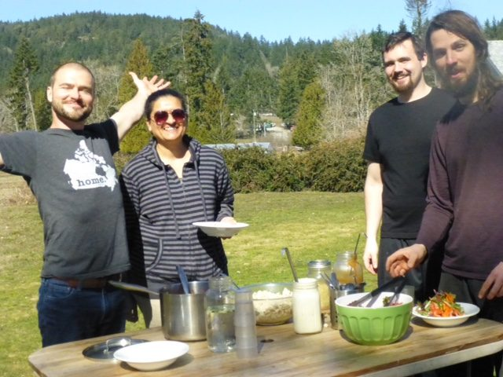

Lunch on the mound - Adam, Racquel, Alex and Daniel

During the winter a major renovation was undertaken in the program house; the wall between the satsang room and the dining room has been soundproofed, and what a difference it makes! You’ll notice how quiet it is when you’re in lying on your mat in savasana in the satsang room. Thank you to the renovation team - Ben, Daniel, Suneel and Adam.

In early March we celebrated Shiva Ratri, and although we had hoped it wouldn’t be necessary this year to chop through the ice on the pond for the immersion of the offerings, that turned out not to be the case. The ice was 4 inches thick! Suneel chopped a good-size hole, and every morning for several days, chopped through the layer of ice that had re-formed overnight. So that you can experience it virtually, here are some photos of the offerings going into the frozen pond.

- 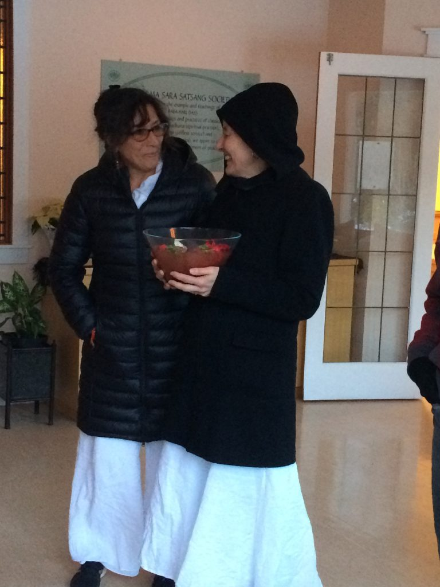

  Satya and Bhavani carrying flower offerings - getting ready to walk to the pond
- 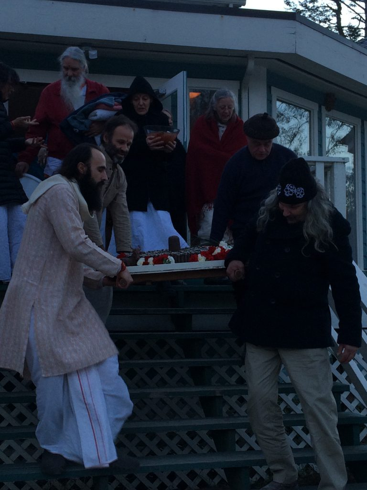

  Carrying the lingams down the front stairs, to take them to the pond.

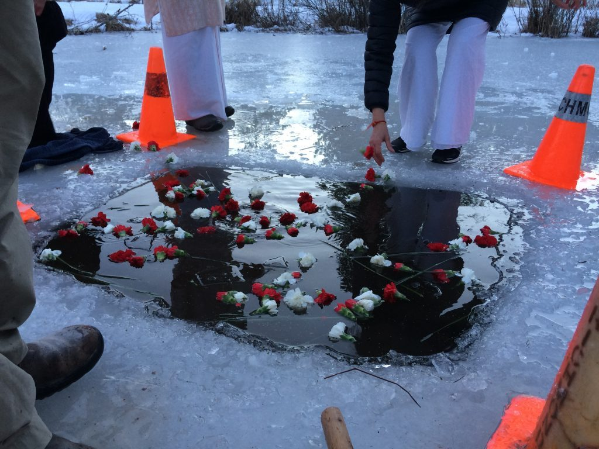

Offerings in the pond.

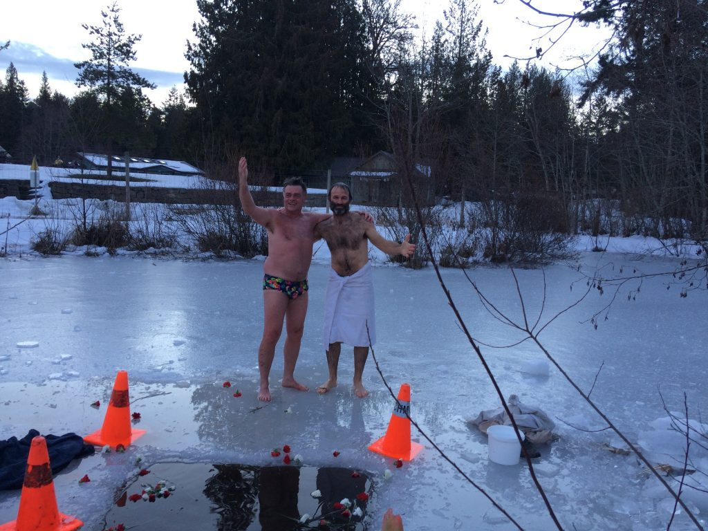

Dave and Raven standing barefoot on the ice (after their dip in the freezing water).

## Welcome!

Our residential community is growing. We are delighted to welcome new staff and karma yogis to our community! Welcome to Janell, Tessa and Hannah in the office, and Sadhana, Alex and Flo in the kitchen. The 2019 program season began with a Yoga Getaway on the weekend of March 22-24, and our program calendar for the coming season is looking full. It’s going to be a busy year!

## AGM Weekend

On the following weekend, we welcomed members of the Dharma Sara Satsang Society to the DSSS Annual General Meeting. Lots of people came together to join in all the activities of the weekend, including yoga classes, work parties, amazing meals, and more.

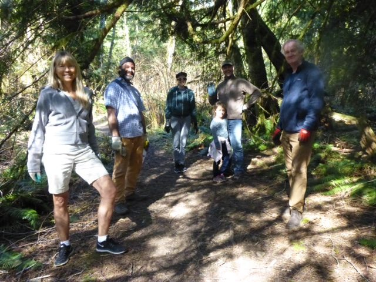

The trail cleanup crew.

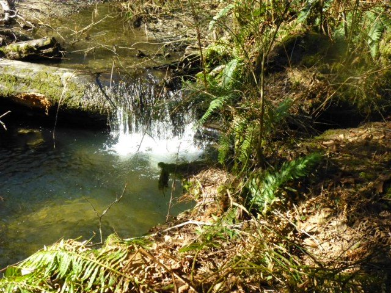

- 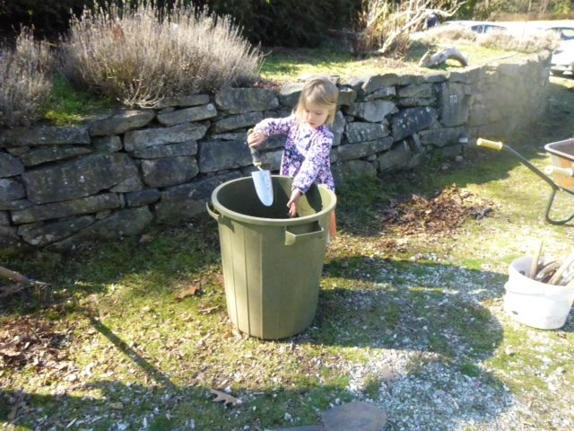

  Laurel working on the grounds cleanup crew
- 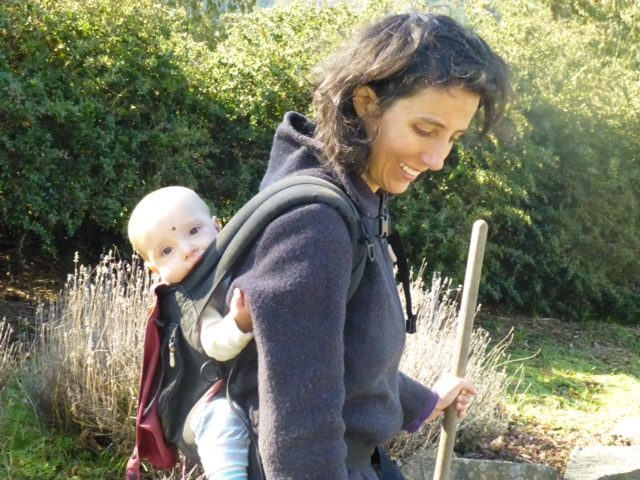

  Melinda with Audrey
- 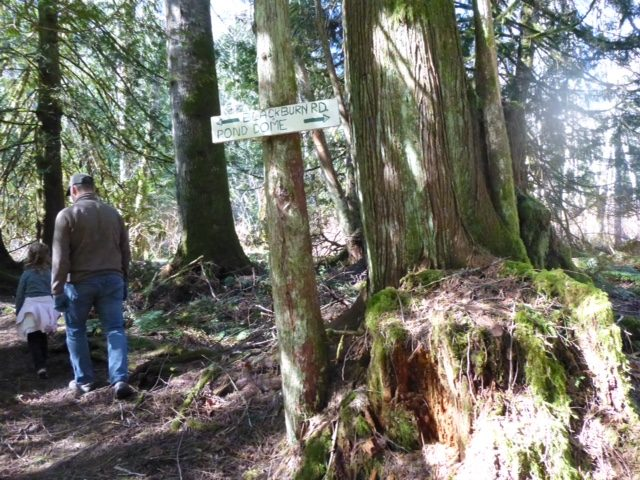
- 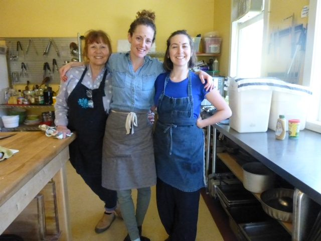

  Theresa, Sadhana, Flo

At the AGM, along with reports from all areas, a new board of directors was elected by acclamation.

Welcome to the new board members: Sean (Shyam) Crabtree (president), Willow Lampard (treasurer), Meera Bennett, Will Yogeshwar Humphrey, Natasha Jyoti Samson, and Tracy Chetna Boyd.

- 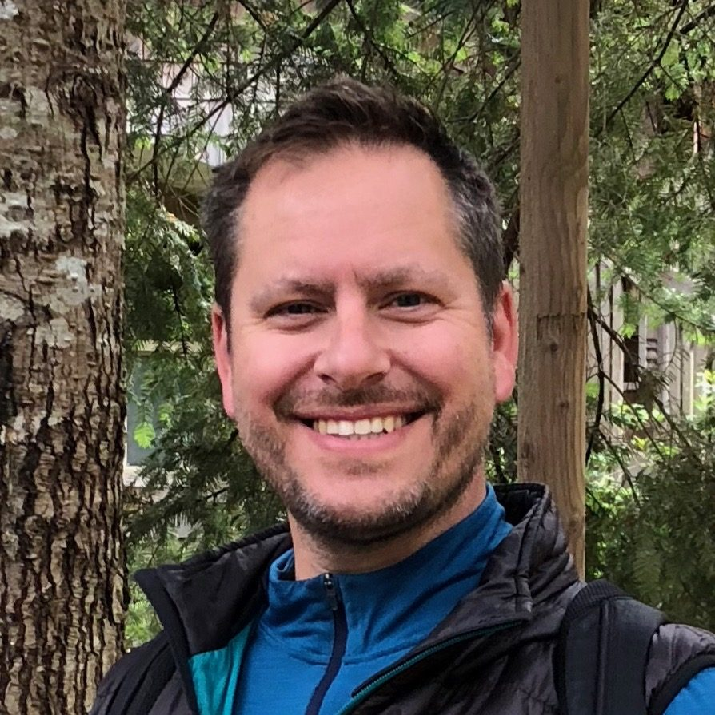

  Sean (Shyam) Crabtree
- 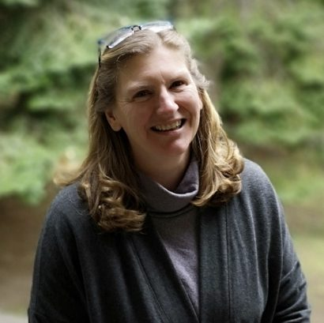

  Willow Lampard
- 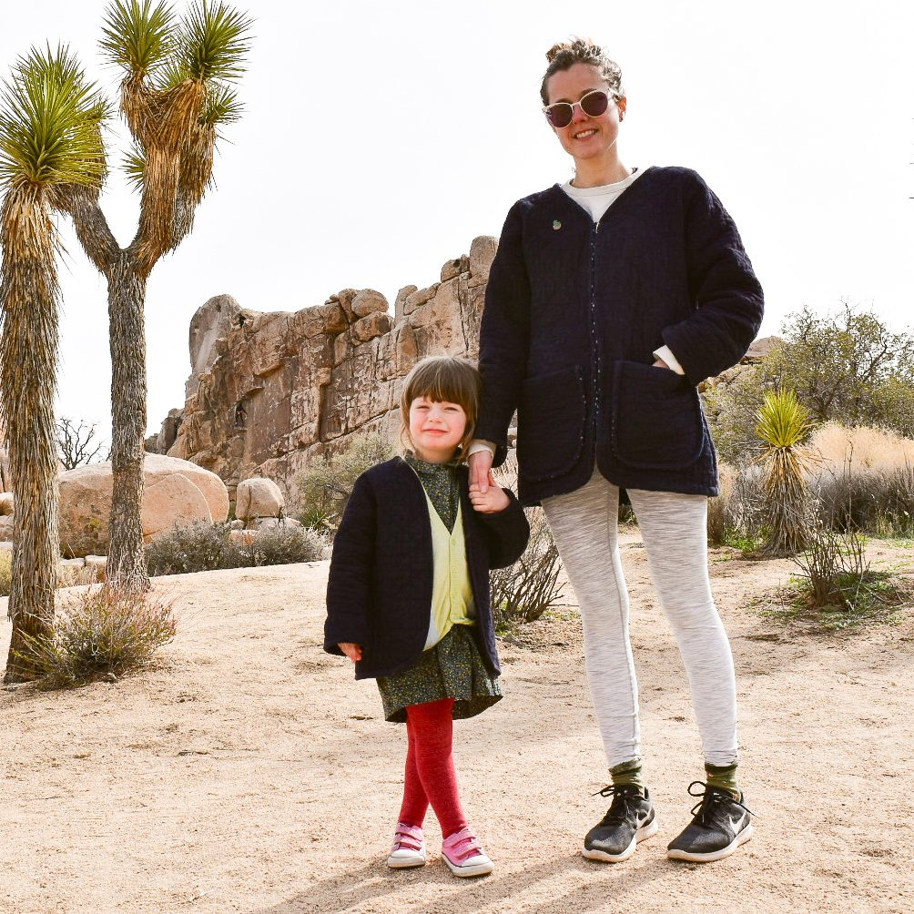

  Meera Bennett
- 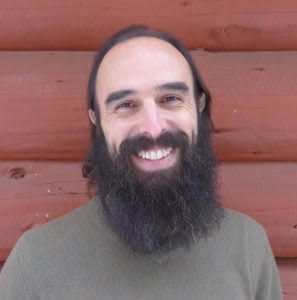

  Will Yogeshwar Humphrey
- 

  Natasha Jyoti Samson
- 

  Tracy Chetna Boyd

We offer our gratitude to the outgoing board for their dedication and hard work: Mark OmPK Classen (president), Sid Filkow (treasurer), Bhavani Chlopan, Meera Bennett, and Sean Crabtree.

As always, Wednesday kirtan and Sunday satsang continue each week, along with yoga sutra class with Yogeshwar on Sundays at 2:00 pm in the library. The first Residential Karma Yoga Program of the season has begun, and we are continuing to interview applicants for the other sessions of the [karma yoga program](https://saltspringcentre.com/programs-retreats/karma-yoga-program/). If you’re interested, check it out!

## Coming up

Our [200 hour Yoga Teacher Training](https://saltspringcentre.com/yoga-teacher-training/) will take place again this summer, on July 3-16 and August 10-20. Please share this information with anyone you know who might be looking for a residential YTT on beautiful Salt Spring Island, taught by an outstanding 20-member faculty who are dedicated to passing on the spiritual teachings that have enriched their own lives.

This year’s [Annual Community Yoga Retreat](https://saltspringcentre.com/programs-retreats/annual-community-yoga-retreat/) - our 45th consecutive year - will take place from August 1 -5. It will be a big celebratory gathering. Mark the dates on your calendar; don’t miss it!

## To read……

What happens when your spiritual teacher gives you a name you don’t relate to? What do you do when your plans don’t unfold as you thought they would? In ‘[What’s in a Name? Learning that Babaji may have been right after all](https://saltspringcentre.com/whats-in-a-name-learning-that-babaji-may-have-been-right-all-along/)’, Sarah Archana Russell ponders these questions and shares some stories of her life.

Living in uneasy times, how can we live a balanced and peaceful life? So much in the world and in our day-to-day lives is neither balanced nor peaceful. Life’s events may not be what we planned or hoped for. How can we live in the world and be happy and peaceful? [Living a Balanced Life](https://saltspringcentre.com/living-a-balanced-life/) is a reminder that we have a choice about how we respond to life.

Love,   
Sharada

*If you work on yoga, yoga will work on you.*  
*~ Baba Hari Dass*
