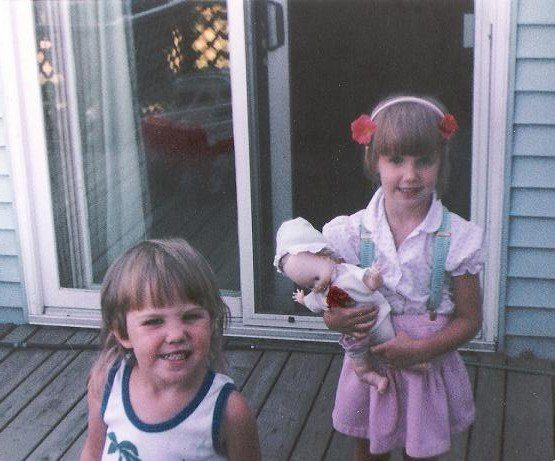
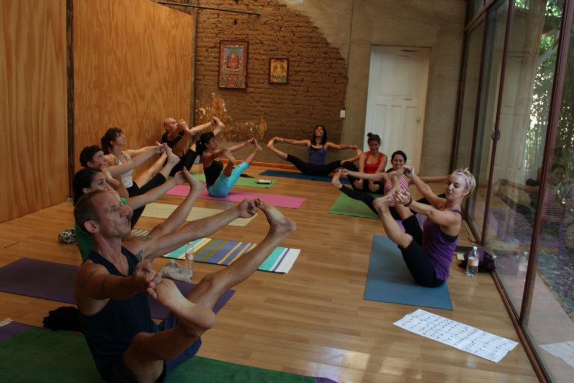
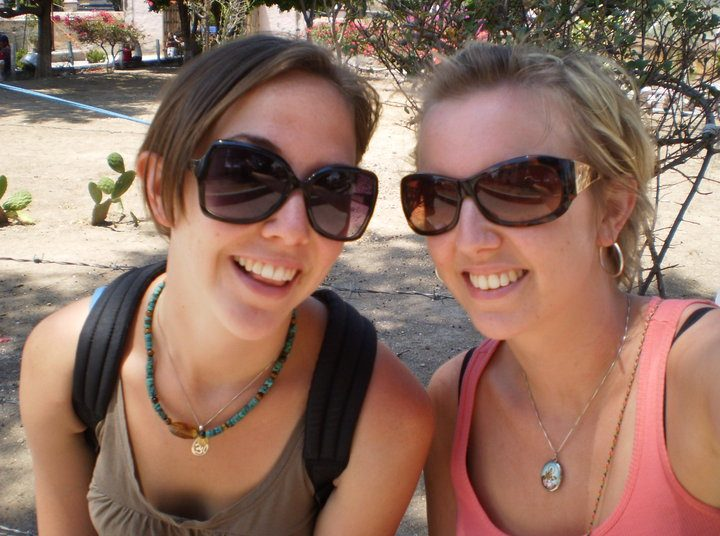
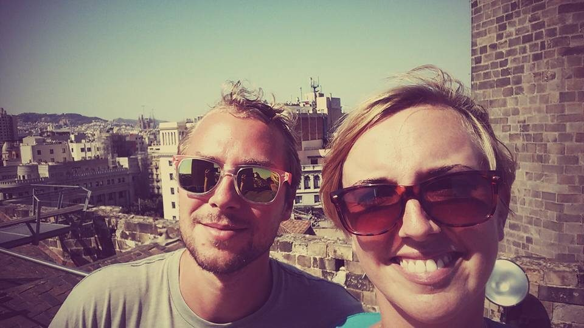
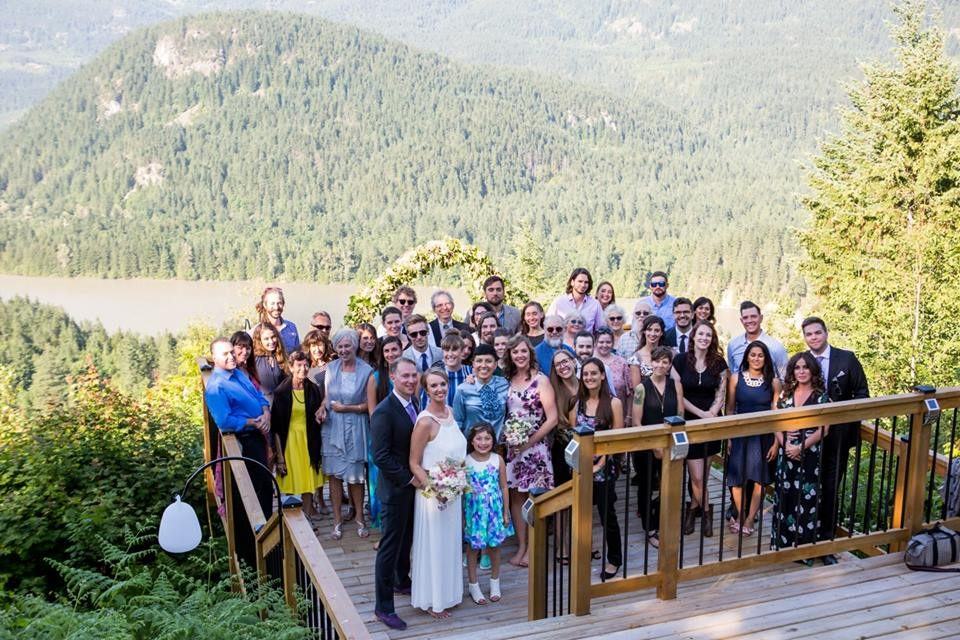
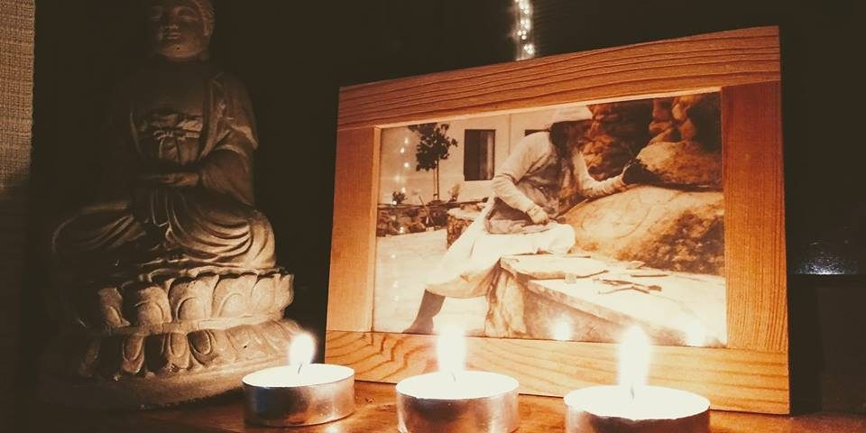

## Learning that Babaji may have been right all along.

**by Sarah Archana Russell**

Using a small white board and dry erase maker he asks me to write down my date of birth. I write ‘June 27 1985’. He looks down at the paper, looks back up at me and writes “Name is: Archana अर्चना It means worship of god. It is a name for goddess.” I say “thank you”. He nods and offers a gentle smile. I stand up and start walking away, thinking to myself *worships god? God? I don’t think so!*

For a long time, I didn’t like the name Babaji gave me – it just didn’t feel like me. I’ve never thought of myself as religious and I felt a little uncomfortable with the idea of worshiping something. Also, I didn’t quite know how I felt about the ‘God’ word. Even though I was baptized in the United Church, my family stopped attending church when I was quite young, maybe 5 or 6, around the time of my parent’s divorce. After that, I remember going to church only a handful of times, mostly around Christmas.

It wasn’t until a few years ago that I discovered that maybe Babaji was right, maybe Archana is the right name for me. Maybe it does actually suit me. We’ll get to this in a bit. But first, I’ll tell you how I got from Toronto to beautiful Salt Spring Island receiving a spiritual name from a master yogi.

Around 1989. My younger sister (Heather) and I at our first home in Rockwood, Ontario.

By the time I was 9, my mom, my sister, and I had moved into the heart of downtown Toronto, shortening my mom’s commute to work significantly (she worked wardrobe in the local theatre scene). Toronto was a great city to grow up in. The city taught me the importance of respecting others and celebrating diversity. Toronto exposed me to culture and the arts, inspiring me to follow my passion for contemporary dance in high school and university. Being independent in a large city also meant that I quickly developed excellent navigational skills and street smarts. In many ways, the city helped to raise me and even though I have been living in and around Vancouver for longer, Toronto still feels like home.

I attended a wonderful fine arts high school in Toronto, where I actually took my first yoga class. Asana was a great complement to my dance training and it was my introduction to mindfulness practices. I feel so fortunate to have been exposed to the teachings of yoga in my teens, at such a pivotal age. I’m certain that it helped me to stay grounded, be more self-aware, and foster a sense of compassion for myself and others.

I loved my life in Toronto and leaving it was tough, but in 2004 my mom, my sister, and I moved out west to be closer to our family on Vancouver Island. That fall, I started school at Simon Fraser University (where I met the man who would eventually become my husband!)

Exhausted from my first year of intense training and studying at SFU (I was in the Contemporary Dance program), I decided to spend the summer of 2005 out of the city. I wanted to do something different than early morning dance classes, paper writing, and cramming for midterms. I wanted to be somewhere that was, ideally, in nature, rooted in yoga, and with a focus on community – the Salt Spring Centre was perfect! I instantly fell in love with the land, the teachings, the people, and how the centre made me feel – like I was home. In 2008, my sister and I completed our YTT at the centre and I went on to do another 200hr YTT in Vinyasa yoga in 2012 and I recently finished my 500hr with Phoenix Rising Yoga Therapy.

2011. Having a great time teaching a class in Oaxaca, Mexico.

2011. Another photo of Heather and I in Oaxaca, where her wife is from. If you look closely, you can see that I'm wearing my Saraswati necklace.

As a yoga, meditation, and wellness educator for the past eleven years, I would say that my most substantial accomplishment has been teaching to diverse populations. I have had the privilege of working with youth, including Indigenous youth, youth with special needs, and youth facing multiple barriers, as well as numerous populations of adults, including adults with developmental disabilities, adults experiencing homelessness, and adults in active addiction recovery. Additionally, I feel honored to be able to support students as they journey through their YTT experience, both at the Salt Spring Centre where I was on faculty for five wonderful summers and ProHealth Yoga Teacher Training in New Westminster, where I am still on faculty.

After teaching yoga for a few years, I started to notice that students were opening up to me about the injury healing process, relationship issues, traumas, and stressors in their lives. It was during these conversations that I found myself becoming curious about their stories and the hidden systemic factors that lead to their issues. Also, I wanted to know how to better address these conversations in a supportive, empathetic, and helpful way. In January of 2013, I decided to take an introductory counselling course at a local community college and, after my very first class, I knew that I had made the right decision. I loved what I was studying so much that I decided to become a counsellor, so I spent a few years collecting all the necessary pre-req courses I needed to apply to grad school in counselling psychology. After finishing all the required courses, the minimum of three years work/volunteer experiencein human support services, and completing the lengthy application process, I ended up not getting into the masters in counselling program that I applied to. This was tough news to take.

At the time, I volunteered with Vancouver Coastal Health’s addiction support services. One day, I was chatting with another volunteer who was just finishing her counselling psychology master’s degree. She told me that while she greatly enjoyed her education and was excited about getting into the profession, she regretted not studying social work. She said that she thought counselling might be rather limiting and that social work (especially clinical social work) had the potential to open more doors. I had never thought about social work so I decided to look into my options. I found a non-BSW Masters in Social Work program (for students like me who had a degree in something other than social work) and decided to apply. Unfortunately, after putting in all the hours applying and writing my essay of intent, I didn’t get into that program either. This was also tough news to take. My ego was starting to feel a little quashed.

2016. My husband and I in beautiful Barcelona.

Frustrated by school, I decided to take a little break. In the summer of 2016, my partner and I backpacked through Europe. We had the pleasure of visiting 13 amazing countries and even got engaged at the top of the Eiffel Tower! It was a wonderful, carefree, relaxed summer and I feel so fortunate for all the adventures we had.

Overwhelmed with the cost of living in the Lower Mainland, we moved in with my mom on Gabriola Island when we returned from Europe in the fall of 2016. Gabriola Island is just a short ferry ride from Nanaimo so I started taking classes at Vancouver Island University. I was going to make another attempt at this school thing! After 2 semesters of full-time studies, I had the requirements for the Bachelors in Social Work program with the University of Victoria (which conveniently offered an online program). I applied and got in!

2017. Our wedding in Hope, BC.

I started the online program with UVIC in the spring of 2017. That summer my husband and I got married. We had a wonderful wedding in Hope, BC with 45 of our closest family and friends. After an amazing honeymoon in Bali, we moved our stuff out of storage and into an apartment in Maple Ridge (a suburb of Vancouver). As a Vancouverite, I honestly wasn’t keen on the idea of moving to the ‘burbs’ but we could no longer afford to live in Vancouver. After a year and a half of living in Maple Ridge, I have to say that I have enjoyed it. We are close enough to Vancouver that I can still work part-time and see my friends in the city and yet we can very easily get out in nature and explore all the beauty of the surrounding areas. Our decision was to live in Maple Ridge just until I finished my BSW and then move back to southern Ontario where I was applying to grad school again, but hopefully with better luck as I now had the undergraduate degree in the appropriate discipline (no offence to my Bachelors degree in Fine Arts!)

Having had the experience of applying to grad school before and knowing how amazingly competitive it is, I tried to be as smart as possible when it came to my applications. I spent a great deal of time this past fall/winter working on my applications and I was really happy with the academic and professional references I had. I also worked really hard to maintain my A average and I flew out to Ontario to have meetings at all three schools that I was applying to. Basically, my grad school applications consumed most of my thoughts and a lot of my energy. I felt confident that I would *finally* get into grad school.

A few weeks ago, I found out that I didn't get into my first-choice school. I actually felt most confident about my chances of getting into that program and even had one of the two people that I had meetings with at the school of social work basically say I was a 'shoo-in' and if I kept up my grades that I'd likely be offered a TA position. This conversation got me really excited and I started to look into housing options for my husband and myself, imagining our life in a new city and me at a new school. I was absolutely heartbroken that I didn't get in. Apparently, it's not enough to be a straight A student, with work and life experience, and great references. Yet again, my ego was crushed.

A few days later I heard from another school - they offered me a wait-list position. Again, I was upset with this but at least it's something. The third school told me that they had sent out offers of admission and I wasn’t one of them. Based on how many offers are accepted, the third school may be sending out more. I'm not going to lie - getting this news has been hard for me to take. As I said before, I initially went back to school in 2013 to study counselling, then psychology, then I changed to social work. I have been a student at 5 post-secondary schools. I have over 12 years of university experience. I am incredibly committed to my education and the idea that I might not get into an MSW program is inconceivable.

As a social worker, the areas of practice that I hope to focus on are mental health, addiction, and criminal justice and I am particularly interested in the intersection between them. As a recipient of the Jamie Cassels Undergraduate Research Award at the University of Victoria, I recently presented my research on harm reduction in the Canadian prison system and I am interested in pursuing similar research and work in graduate studies. At the research fair, the Dean of Human and Social Development introduced herself to me and congratulated me on my work. She asked if I liked the research experience and I said yes. Then she said, "Great! We'll see you for your Masters!". I didn't have the time or the energy to let her know that I wasn't applying to the UVIC MSW program as I'd like to do a program that is not online and has more of a clinical focus. I didn't have the energy to tell her that I have applied to other schools and I might not get in.

I'm usually a very optimistic and 'glass half full' kind of person. It feels weird to write my story with a bit of a gloomy tone, but it's how I feel and it's an honest reflection of what's going on for me. This experience has reminded me to let go of control, surrender, and trust the process and flow of my life, which is, in my opinion, yoga in action. This is where Babaji and his teachings come in. The ability to persevere and stay dedicated to my goal despite the obstacles, is something that I have learned from Babaji’s teachings. To remind me of this, I have a photo of Babaji on my altar. In the photo, Babaji is carefully, devotedly, and meticulously working on a rock wall. This photo gives me strength and determination.

To me, there are many similarities between yoga and social work. In both professions, I believe that my role includes providing the space and the opportunity for people to develop greater self-awareness and the capacity to access their own inner guidance, wisdom, and empowerment. I am passionate about helping others improve their personal and collective well-being, and I won’t let these school applications prevent me from fulfilling my dreams. I fully believe that we each have a unique purpose in life and mine can be summarized in the following words by Eva M. Forde:

2018. The photo of Babaji on my altar. I took this photo the day Babaji passed.

*“Social work is for those who have, themselves, experienced the power of their own humanity and have humbly embraced the truth that we are all one, that we all have value and worth, and that as we take up the call to empower others, we empower ourselves and we better the world.”*

Remember what I said before about how maybe Babaji was right, maybe Archana is the right name for me? Well, about ten years ago, I randomly (or perhaps, not so randomly) bought a pendant of the goddess Saraswati. For years, I wore this necklace around my neck. I hardly ever took it off. I loved the image of Saraswati and what she represents - learning, knowledge, wisdom, and the arts. Her name literally means provider of the essence (Sara) of the self (Swa) – how inspirationally beautiful is that? I highly doubt that my parents knew about this when they named me Sarah! Saraswati is usually depicted with many hands holding items with symbolic meaning — a *pustaka* (a book symbolizing true knowledge), a *mālā* (representing the power of meditation, inner reflection, and spirituality), and a musical instrument (representing creativity and the arts). Wearing this necklace was important to me and I found that it gave me much strength. I had little rituals with it, too. For instance, during meditation, I would hold Saraswati in my hands or at random times of the day I would catch myself running my thumb over the Om symbol that was inscribed on the back. I honoured Saraswati and what she represents. I have great respect for education (in all forms) and highly value the arts and I believe strongly in critical thinking, self-study (Svadhyaya), and life-long learning. Wearing this necklace and having little rituals associated with it, it’s almost as if, in a subtle way, I worshiped Saraswati. So, perhaps Babaji was right in naming me Archana, a name synonymous with honouring, praising, and worshipping a deity.
