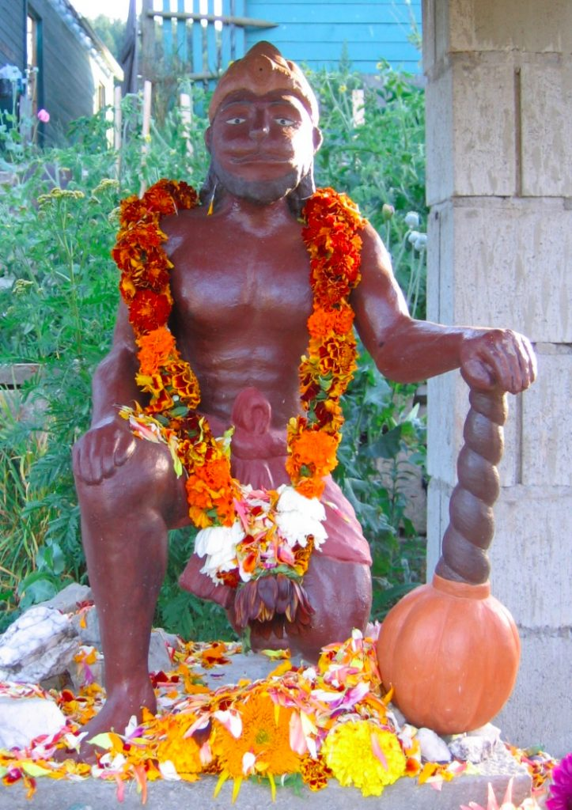

*by Yogeshwar Humphrey*

On Thursday, April 18th a small group of intrepid Hanumān bhaktas gathered at the Centre to celebrate Hanumān Jayantī, or Hanumān’s birthday. The date traditionally falls on the full moon of the lunar month of Chaitra in the Vedic calendar, which usually winds up being sometime between late March and late April in the Gregorian calendar.

At the Centre, observances began with an ārati to Hanumān at the temple down in the garden. This being Salt Spring Island in April, there was a steady downpour of cool spring rain to test the resolve of those who’d gathered. However, the participants were undeterred, and they continued the day’s observances by a parading a small figure of Hanumān around the land, accompanied by continuous kīrtan of Hanumān, Rām, and Sītā. Such parades are a tradition from India that Babaji brought to us, in which the deity represented in a temple symbolically gets to take a tour of the surrounding land and village to give its blessing on its festival day. After the parade, everyone headed into the Satsang Room for eleven repetitions of the *Hanumān Chālīsā*, a forty-verse song by the poet-saint Tulsī Dās that recounts Hanumān’s deeds and virtues. Finally, there was a special mantra-yajña in honour of Hanumān, followed by a delicious communal meal and a work party that afternoon to do some spring cleaning at the Pond Dome.

Hanumān is one the forms of the divine that was most dear to Babaji. Indeed, Babaji built a number of temples dedicated to him, including those at Kainchi Āśhram and Hanumān Garhi near Nainital in the foothills of the Himalaya, as well as the Saṅkaṭ Mochan Hanumān Temple at Mt. Madonna and the sweet, humble Hanumān shrines at the Salt Spring Centre.

Perhaps most strikingly, Hanumān is a monkey, or *vānara*, but he is no ordinary one. In the story of the *Rāmāyana*, Hanumān is the servant of Rām, and he plays a key role in helping to rescue Rām’s wife Sītā from the clutches of the demon king Rāvana, as many know. He is able to do so in large part thanks to his extraordinary power, for among other things he is Vāyu-Putra, the son of the wind-god Vāyu. Babaji often taught that the *Rāmāyana* was an allegory for the journey of yoga: Rāvana represents ego (*ahaṃkāra*) and the thinking mind in its service, Sītā represents the individual soul (*jīvātman*), and Rām represents the universal soul or God (*paramātman*). Rāvana’s abduction of Sītā thus symbolizes the way in which our own individual soul has forgotten, or been stolen away, by ego and the self-interested mind, and the reunion of Rām and Sītā represents the reunion of the self with the Self, or remembrance of our true nature as being, consciousness, and bliss. Hanumān, is the main actor in bringing about this reunion. And so, as the son of the Wind, he is said to represent *prāṇa*, or the life-force that animates the breath. For rāja- and haṭha-yogīs, he is therefore the breath stilled and sublimated in meditation. Likewise, for karma- and bhakti-yogīs, he is selflessness and devotion. In short, he represents the aids to reunion and remembrance of our true nature through the practices of yoga.

There are further parallels between Hanumān and the journey of yoga. As a young monkey, Hanumān was quite playful and more than a little rambunctious. Once, after rampaging through the forest and consuming all of its fruit, the still-hungry little Hanumān caught sight of the sun, and mistaking it for a delicious orange, leapt for it. Seeing that Hanumān might well reach the sun and snuff out the light that sustains life, the god Indra struck Hanumān on the chin, which some say gave Hanumān his name (*hanu* interpreted as jaw, and *man* interpreted as broken, with a broken jaw signifying humility or egolessness). Afterward, the various gods, feeling quite bad about the whole incident, gave Hanumān numerous boons granting him limitless strength and cleverness. The result was an even more powerful, rambunctious young monkey who was fond of disturbing the pūjās and meditations of forest sages, among other things. These sages, fed up with Hanumān, knew they could not undo the boons of the gods, and so they simply cursed him to forget that he had all of those powers. Only when his companions remind him of his powers can he bring about the great feats of heroism for which he’s famed in the *Rāmāyana*.

This forgetfulness points to our own situation as travellers on the path of yoga. Just as Hanumān has forgotten his power, so too have we forgotten our greater, more expansive identity as the Self. And, just as Hanumān remembers his true identity and power in the company of fellow seekers, so too do we remember ourselves as Self through the practice of yoga and the company of satsang.

There are many other stories of Hanumān, and many of them encapsulate the dynamic tension that makes him both interesting and accessible. He is at once a monkey and a god, virile yet celibate, mischievous yet just, powerful yet kind, a wild animal yet a devoted servant. Hanumān is a reminder that the spark of the divine can and does appear everywhere, even in monkeys. What’s more, Hanumān shows how our most problematic qualities can also be our greatest strengths. Walking the paths of yoga need not require cauterizing everything that makes us unique and becoming a spiritual robot. Rather, it’s a matter of turning the energies of our bodies and minds into an offering to one another and ultimately to Self. Hanumān’s simian energy, mischievousness, and ferocity aren’t undone, they’re just put into the service of Rām, to wonderful effect. We’ve all got some monkey in us, after all, it’s just a matter of what we do with it.  

---

***Yogeshwar Will Humphrey****lives on Salt Spring Island with his wife Rebecca. He first became involved with Babaji’s larger satsang during his time living at Mt. Madonna Center in 2006, as well as from 2008 to 2012. He completed his 200-hour and 500-hour YTT there in 2008 and 2011, respectively. After that, he completed an M.A. in Religious Studies at the University of Calgary just for good measure in 2016, with a thesis comparing meditative states in the Yogasūtra with movements in 20th century continental philosophy. He was also a pujari at the Sankat Mochan Hanuman Temple at MMC, and he continues to serve as one of the pujaris at SSCY. He was Operations Manager at SSCY for 2017 and 2018, and he continues to serve there as a teacher of pranayama, meditation, and yoga philosophy to residents at the Centre. He also hosts a weekly study group on the Yogasūtra at SSCY on Sunday afternoons, and he gives periodic workshops on all things yoga.*
