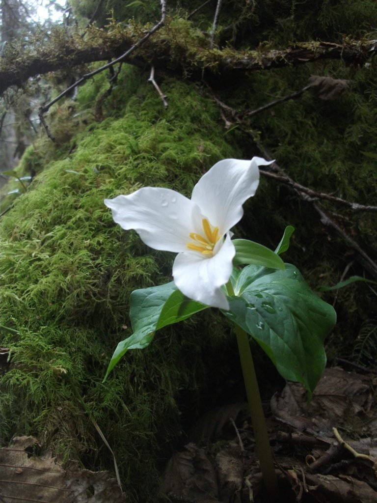
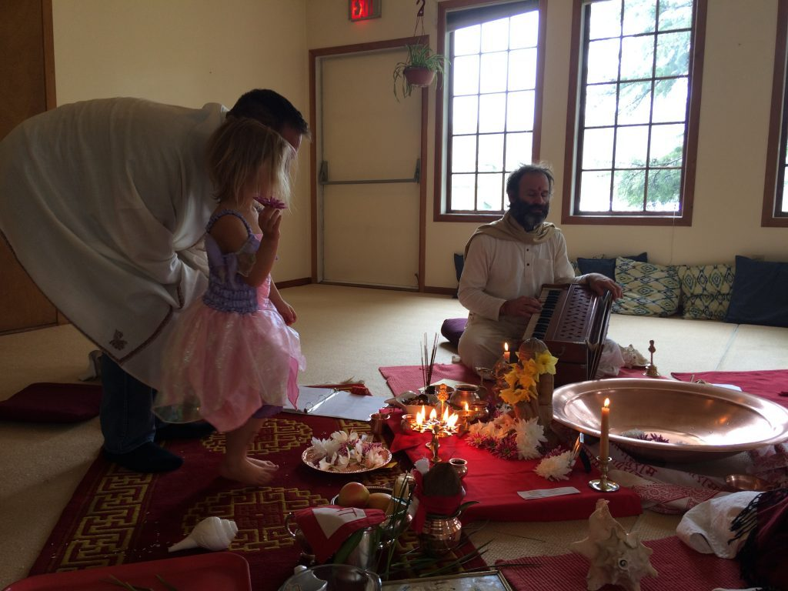
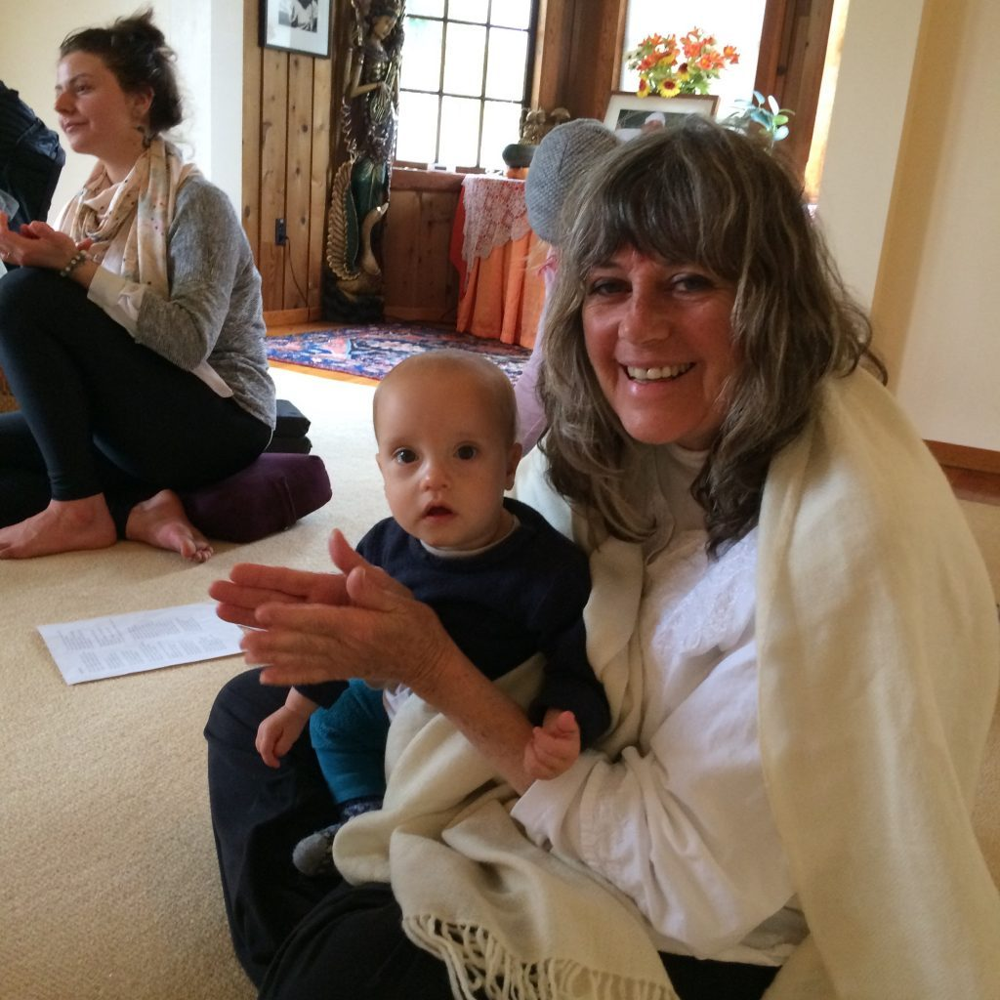
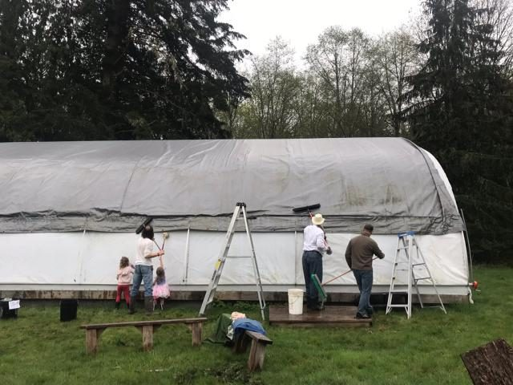
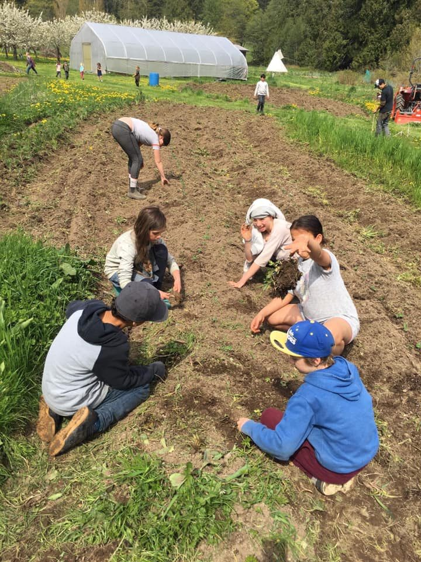
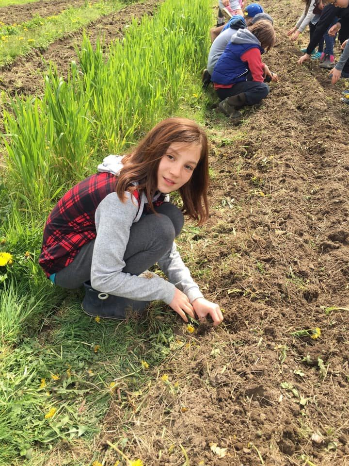

***Piglet noticed that even though he had a Very Small Heart, it could hold a rather large amount of Gratitude.***   
***~ A. A. Milne***

Dear friends,

We’re happy to welcome you to life at the centre in the lovely month of May. The sun is shining and the sky is blue - although by the time this arrives in your inbox there may be showers instead of sun. That’s what spring is like in the Pacific Northwest.

We’re delighted to welcome Courtenay back from her adventures in India. Welcome home!

We’re also welcoming Anuradha, our dear satsang  sister since the mid-70s, who spent many years living on Salt Spring, almost all of it here at the centre. We are very happy that Anuradha will be coordinating ACYR this year.

We also welcome Francis, our new farm coordinator. I hope you will get to meet him when you visit the centre, and have a chat with him. He’s an experienced and enthusiastic gardener.

All the karma yogis at the centre bring their talents and energy to the centre, taking care of everything with such attentiveness and positivity that it’s a joy to be around. Pranams to all the karma yogis for all that you do.

April was a full month, with the beginning of the first session of the Residential Karma Yoga Program, weekend programs, and ongoing study groups focussing on the Bhagavad Gita (Tuesday evenings) and Yoga Sutras (Sunday afternoons before satsang).

A highlight last month was the celebration of Hanuman Jayanti, the traditional date of Hanuman’s birthday. Hanuman represents the energy and vitality that animates us along the spiritual path, as well as the tireless energy of devotion and service. There was full morning’s celebration, followed by lunch and a work party, the main project being a thorough cleaning of the pond dome. Jai Sita Ram! Jai Hanuman!

Laurel offering a flower with her papa. Raven playing harmonium.

- 

  Lakshmi with Audrey at Hanuman Jayanti.
- 

  work party - cleaning the pond dome. Penny, Yogeshwar, Laurel, Suneel, Shyam.

### 45th Annual Community Yoga Retreat, other programs & events

This year’s [**ACYR**](https://saltspringcentre.com/programs-retreats/annual-community-yoga-retreat/) promises to be a big event. It is our 45th consecutive annual retreat, and the first retreat since Babaji’s passing. We hope to see many old friends and welcome many new friends. **The dates are August 1-5, and** [**registration**](https://saltspringcentre.com/programs-retreats/annual-community-yoga-retreat/pricing/) **is now open.** Don’t wait - register early for the early bird rate.

This year’s [**200 hour Yoga Teacher Training**](https://saltspringcentre.com/yoga-teacher-training/) program is filling up, but there is still space, so if you want to experience learning and practicing yoga in a beautiful and peaceful island setting in a loving and supportive environment, this program is a perfect choice. Find the details [here](https://saltspringcentre.com/yoga-teacher-training/).

We are also still interviewing applicants for the summer and fall sessions of our **[Residential Karma Yoga Program](https://saltspringcentre.com/karma-yoga-program/)**. If you’re interested in spending time at the Centre, learning, practicing, celebrating  and working in our community, please [apply here](https://saltspringcentre.com/form/?fid=12).

On May 12, beginning at 3:00 we will be celebrating the divine feminine in all forms, including Mother Earth, at the **Divine Mother Satsang**. There will be lots of Ma kirtan. Please join us if you can.

## Centre School news

As the Salt Spring Centre School moves toward the end of another school year, students will celebrate May Day by weaving ribbons around the May Pole, a school tradition begun by Usha more than 35 years ago. Everyone is welcome. Coming up soon after is the annual whole-school play at Mahon Hall in Ganges on May 10, 11 & 12. This year’s production is called ‘Rock Bottom’, a musical adventure set in the Stone Age. When they’re not in classes (inside and outside) or rehearsing for the play, students get to work in the school garden with Milo.

- 

  Centre School garden day
- 

## To read this month

To learn more about the symbolism of Hanuman, and the observances of his birthday, please read ‘[**Hanuman Jayanti**](https://saltspringcentre.com/hanuman-jayanti/)’ by Yogeshwar.

To add a bit of sweetness into your life, you might enjoy trying some of these [**Recipes from The Centre Kitchen’s Archives**](https://saltspringcentre.com/recipes-from-the-centre-kitchens-archives/): blackberry pie, sugarless breakfast cookies, poppy seed cookies, date squares and banana coconut cream pie.

Love,  
Sharada

*Love is a light that emanates from the heart and removes all differences, separation, and self-interest.  It shines equally for everyone.*  
*Love is a universal religion.*  
*~ Baba Hari Dass*
