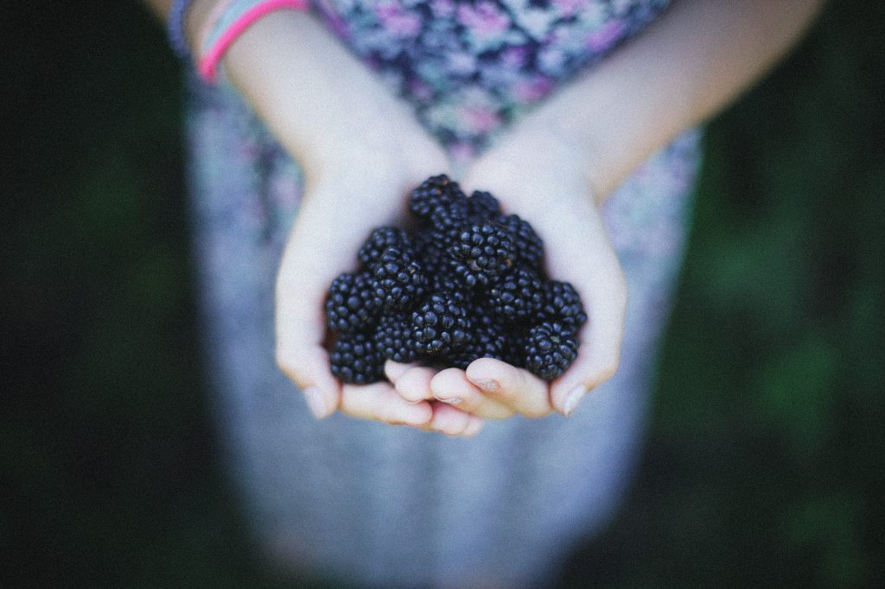

Periodically we like to share some of our popular recipes from both of the centre’s books: Salt Spring Island Cooking, published in 1989 and The Salt Spring Experience, published in 2001. Today’s focus is on sweet treats. I hope you enjoy them



### **Janis’ Sour Cream Blackberry Pie**

*Delicious made with either fresh or frozen blackberries.*

**Pastry for a 10” pie plate**

- 1 ¼ unbleached white flour
- ¼ tsp salt
- ½ cup butter, chilled and diced
- ¼ cup ice water

In a large bowl, combine flour and salt.

Cut in butter until mixture resembles coarse crumbs.

Stir in water, a tablespoon at a time until mixture forms a ball.

Wrap in plastic and chill for 4 hours or more.

Roll dough on floured board to fit pie plate.

**Filling**

- 4 cups blackberries (fresh or frozen)
- 1 cup sour cream
- 1/2 cup brown sugar
- 1 Tbsp. flour
- 1 tsp. lemon juice

Line the pie plate with pastry.

Wash the blackberries thoroughly and drain them well.

Mix the sour cream, brown sugar and flour.

Place the blackberries and 1 tsp lemon juice (or less if the blackberries are tart, none at all if you prefer) in the pie crust.

If the blackberries are very juicy, sprinkle a little flour on top of the pastry before adding the berries.

Cover the berries with the sour cream mixture.

Bake the pie at 425° for 10 minutes. Then reduce the heat to 325° F, and continue baking for 30-40 minutes until the berries are soft, juicy and bubbling.

**Variation 1:** Combine the berries and sour cream mixture before placing them in the pie crust.

**Variation 2:** Make enough pastry for a double-crust pie, and cover the berries with a top crust before baking.

---

### **Sugar-Free Carrot Coconut Cookies (aka Breakfast Cookies)**

- 1 ½ cups boiling water OR very hot apple juice
- 1 cup pitted dates
- 1 cup raisins
- 2 cups finely grated carrots
- 1 cup oil (or butter)
- 2 tsp vanilla
- 4 cups rolled oats
- 2 cups shredded unsweetened coconut
- 1 cup flour (of your choice)
- 1 tsp grated orange rind
- 1 tsp salt

Pour the boiling water or juice over the dates and raisins, and let sit for at least 15 minutes - the longer the better.

Puree them in a food processor or blender.

Mix the fruit puree, carrots, oil or butter, and vanilla until all is well blended.

Mix in the remaining ingredients and drop by the teaspoonful onto a greased cookie sheet.

Bake at 350° F for 15 minutes. When you remove them from the oven, let them rest on the cookie sheet for 5 minutes or so before sliding them onto a rack. Allow to cool completely before eating.

---

### **Poppy Seed Cookie**

- 1 cup butter
- ¾ cup brown sugar or cane sugar
- 2 tsp vanilla extract
- ¼ cup milk or almond milk
- 2 cups unbleached white flour
- 2 tsp baking powder
- Pinch salt
- ½ cup poppy seeds

Cream the butter and sugar, then add the vanilla and milk.

Mix the flour, baking powder, salt and poppy seeds.

Mix together the dry ingredients and wet ingredients.

Chill the dough for about half an hour, until it’s firm enough to handle.

Roll the dough into small balls and press them onto an oiled cookie sheet.

Bake at 350° F for 25-30 minutes.

---

### **Linda’s Date Squares**

**Filling**

- 1 lb chopped dates
- 1 cup water
- ¼ cup orange juice
- 3 Tbsp fresh lemon juice

**Crust**

- 1 ½ cups butter
- 1 ½ cups brown sugar or cane sugar
- 3 cups oats
- 3 cups flour (unbleached white or spelt)
- 1 tsp baking soda
- 2 tsp baking powder
- ½ tsp salt

In a saucepan, cook the dates and water until the dates are soft.

Add the orange juice and lemon juice, and cook until most of the liquid is absorbed.

To make the crust, cream the butter and sugar. Add the dry ingredients and mix well, either by hand or in a food processor.

To assemble, pat two-thirds of the crust mixture into the bottom of a greased 11x15 inch pan.

Using a spatula, spread the date filling evenly over the crust.

Press the remaining crust mixture on top of the dates.

Bake at 350° for 35-40 minutes or until lightly browned.

### **Banana Coconut Cream Pie (no cream, no eggs)**

- Pre-baked pie crust (Use recipe from Janis’ blackberry pie, and read directions for pre-baking.)
- 2 medium bananas (about 1 cup), mashed
- 2 13.5 oz tins coconut milk
- ⅓ cup arrowroot powder
- ⅓  cup water
- ¼ cup cane sugar
- 2 tsp vanilla extract
- 14 cup grated coconut

Blend the banana in a food processor, then add the coconut milk and blend them together.

Mix the arrowroot powder with the water, and add it to the banana mixture.

Add all the remaining ingredients except the coconut.

Blend until smooth.

Pour the mixture into a saucepan and cook it over medium-low heat until it begins to boil and thicken, stirring it constantly with a whisk.

Remove the saucepan from the heat and allow it to cool a bit before pouring it into a pre-baked pie shell.

Toast the coconut in a pan over medium-low heat until it begins to brown. Keep stirring so it doesn’t burn. Allow it to cool enough to handle, then sprinkle it over the pie.

Chill pie before serving.

**Prebaking the pie crust:** Peheat the oven to 375°. Prick the bottom of the pastry all over with a fork. One additional trick: Line the pastry with parchment paper, then fill with pie weights or dried beans or rice. Bake the pastry till it begins to turn golden brown around the edges (about 15-20 minutes). Remove from the oven and take out the parchment paper and pie weights. Then bake it a little longer until the bottom looks dry and flaky. Don't cook and eat the beans or rice, but you can save them for use the next time you prebake a piecrust.

```
Photo by Nine Köpfer on Unsplash
```
