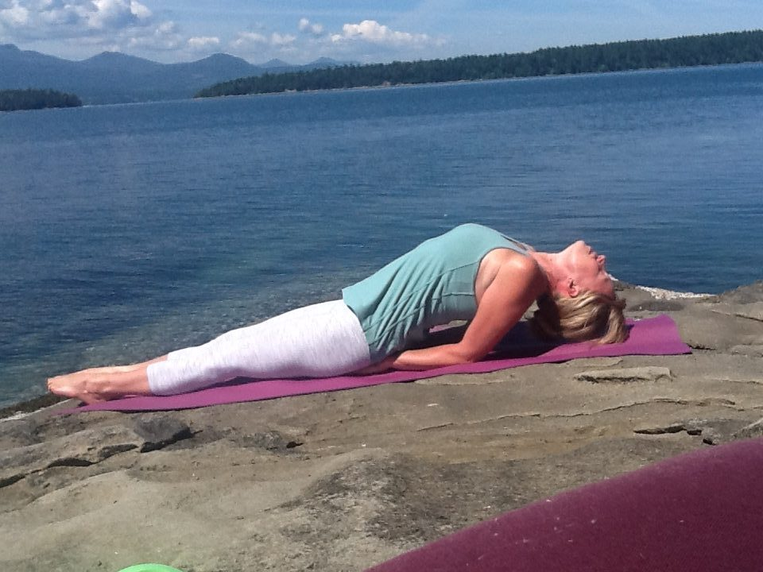
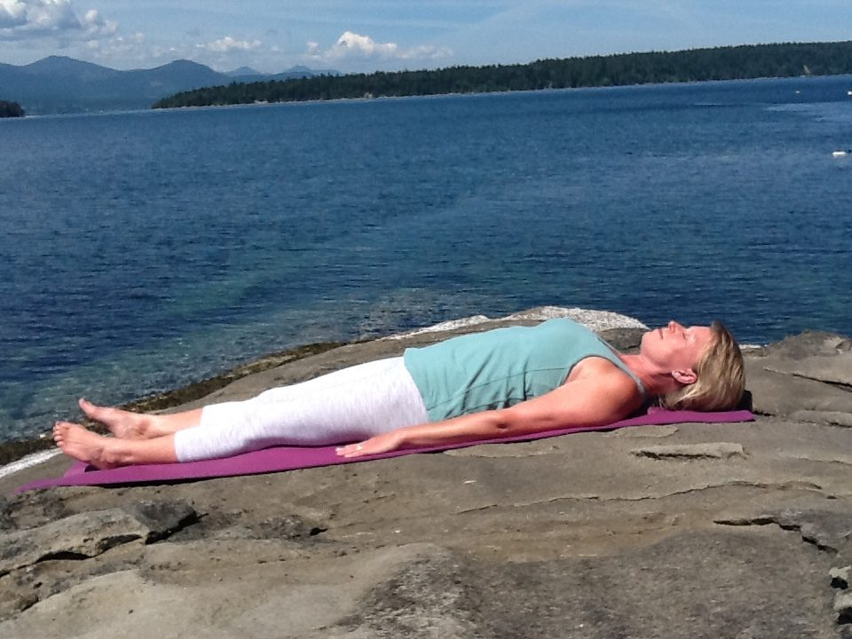
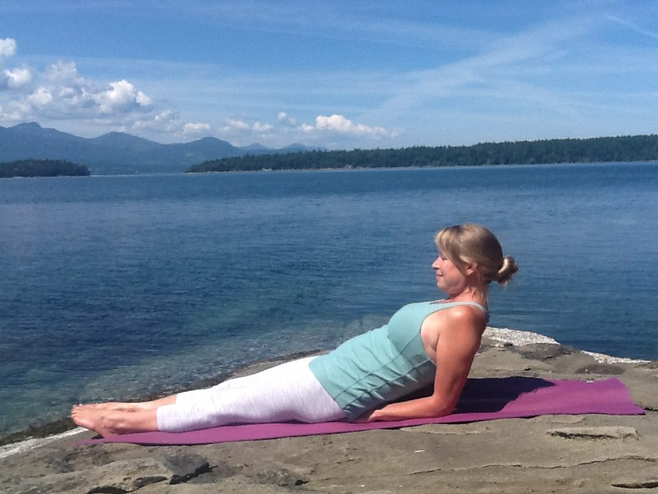
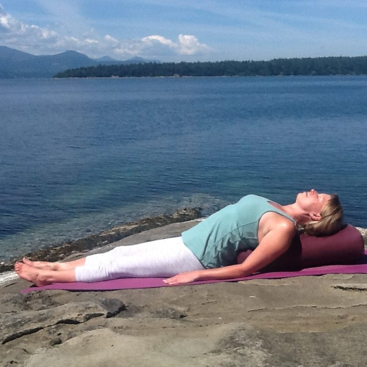
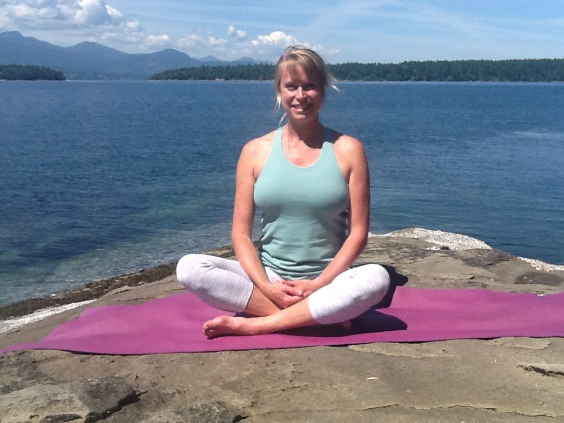

Fish Pose is a beautiful, soothing backbend pose, starting from reclining position.  It can be done with a bolster, or a folded blanket, as a calming restorative pose.  It is a pose that can help to refresh and renew your Mind-Heart-Body-Spirit interconnection.

Fish Pose is one of my favourite Yoga postures because of its many healing benefits.  It stimulates the thymus gland (located in the chest behind the upper breastbone) which is the centre of the immune system, so when the thymus gland is stimulated, then so is the immune system. Poses that open the chest, such as Fish Pose help to build and strengthen your immune system. This pose opens the throat as well. Breath deeply into the chest during Fish Pose to get the most benefit.

Fish Pose, when done in Restorative Yoga, can also calm the immune system, which particularly helps when the immune system is in overdrive during allergy season.

## Chakra Energy Centres Benefited:

**1)  Heart Chakra Opening**     - for loving, kindness  
     - for forgiveness  
     - and for compassion and letting go

**2) Throat Chakra Opening**    - for calm, clear communication   
    - for speaking your truth  
    - and for expressing yourself confidently

**Ayurvedic Doshic Balance:**  Kapha and Pitta stimulated and Vatta toned.

## Benefits:

\*  Fish Pose strengthens the lungs for fuller respiration   
\*  Brings fresh oxygenated blood to the thyroid and parathyroid glands   
\*  Stimulates the nervous system   
\*  Opens and strengthens the spine to strengthen back muscles  
\*  Corrects rounded shoulders by stretching the pectoral muscles   
\*  Is good for asthma and other respiratory problems

## Physiological Benefits:

**Circulatory:**  Increases circulation especially in neck and head  
**Nervous System:**  Tones spinal nerves and stimulates and tones brain  
**Endocrine:**  Stimulates thyroid, parathyroid, pineal, and pituitary glands

If you are pregnant or have a back or neck injury, you should refrain from doing Fish Pose

## To Go In And Out Of Fish Pose Safely:

**Step One**  
\* Begin reclining flat on your back in Shavasana.

**Step Two**  
\* Rock your hips from side to side and place your palms faced down under your hips. Point your toes, engaging all the muscles in your legs.  Press up slowly onto your forearms and elbows. Look towards your toes.

**Step Three**\* Arch your back and lower your head to your mat. Inhale as you open your chest. Hold Fish Pose for 5-10 seconds, breathing calmly, expanding the lungs.

**Step Four**  
\* Exhale, and raise your head up first to come out safely.  Look towards your toes.

**Step Five**  
\* Slowly lower yourself back down on your mat, rock your hips to release your hands.   
Place your hands face down beside you in Shavasana.

## Fish Pose With Two Modifications

1) If you have a sore, stiff back, neck or shoulders, instead of lowering your head to your mat, you can allow your head to hover above your mat.

2) For those who have wrist or hand injuries, or arthritis in the hands or wrists, you can place your hands on your hips, instead of under your hips.

**Restorative Fish Pose With A Bolster**

**Step One**  
\* Place a bolster or folded blanket lengthwise on your mat, and lie back on your bolster or blanket,  with your hips comfortably on your mat. Allow your shoulders to relax. Drop the shoulders. Relax your arms beside you, palms faced down. Allow you feet to drop to the side as you relax all the muscles in your legs.

**Step Two**  
\* Close your eyes and breath into the chest and heart opening. You can say to yourself, "Breathing in I calm my mind.  Breathing out I calm my heart".  You can repeat this mantra as you rest back calm and quiet with your breath. Resting back for 5-10 minutes.

**Step Three**  
\* To come out safely, raise your head up first.  Then, slowly press up to seated position. Remove the bolster or blanket and place it to the side.

---

## Your Yoga Teacher

**Cara Graci** received her 200hr Yoga Teacher Training Certificate at the Salt Spring Centre of Yoga in 2014. She was so inspired by the authentic, inspirational teachings and holistic lifestyle there, that she returned to live at the Yoga Centre for a six month Yoga Study and Service Immersion program. She now teaches "Restorative" and "Gentle Hatha Repair" Yoga classes at the Salt Spring Centre of Yoga, by donation.  Cara encourages her students to cultivate 'the art of being peace.'  Cara says, " If you know the art of being peace, then you have the foundation for your every action. In order to be in such a way that peace, understanding, and compassion are possible."
