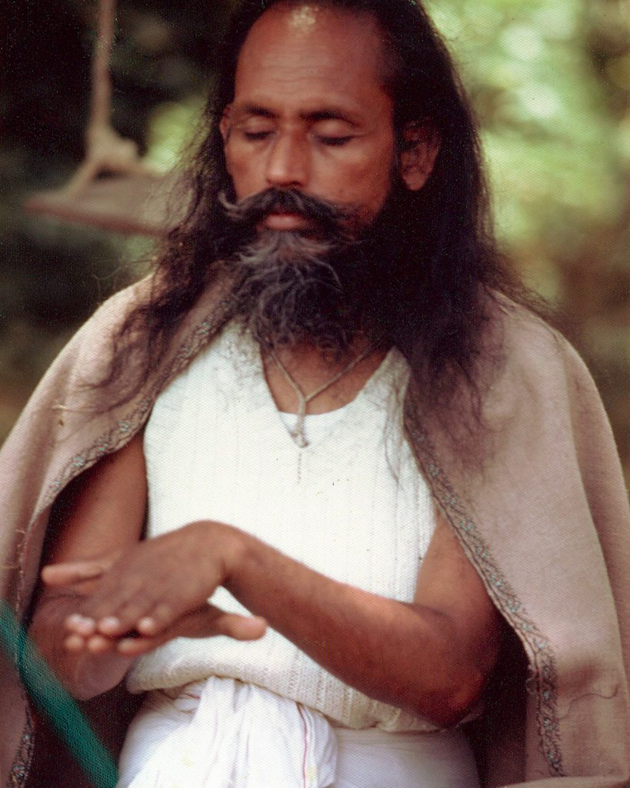

Who do you think you are? What are your ideas about who you are? You can probably think of many ways to answer that question, based on your age, gender,  education, profession , relationship status, religion, beliefs, etc. But who are you really?

What happens if someone says something to you that you hear as criticism? Chances are you  take it personally. We perceive criticism or slights as a personal affront. “How could they say that to me?” Who is this “me”?

We suffer from a case of mistaken identity. We identify with  our role and believe that’s who we are. Let’s say you’re an actor on the stage, and you get so caught up in the play that you forget that you’re an actor and come to believe that you are the character you’re  playing. That’s how most of us go through life.

How does this happen? Growing up, we get the idea that we’re good at some things and hopeless at others. We believe the labels we’re given: smart, slow,  gifted, strong, lazy, boring, brilliant, funny, hopeless, and on and on. We tend to identify with certain labels, but are any of them true? If those ideas of who you are are not true, then who are you?

The teachings of the Yoga Sutras  are very clear about this. Sutras 3 and 4 of Book 1 state: *When the thought waves in the mind are controlled or stilled, the seer is established in his own true nature. But in other states the seer appears to be the same as the thought waves in the mind*. The seer is the witness of the play of life, not an actor. The seer (the authentic Self) is not caught up in the drama. The fundamental problem is that we identify with the with the main actor (and we are always the main actor in our dramas), and believe it to be real.

In his essay, Mind is Our World, Babaji says, *What is that world in which all individuals live? There is a perceptible world, or true reality, over which a conceptual world or false reality, is superimposed. The perceptible world is no more than the aggregates of the five elements: earth, water, fire, air, and space. The conceptual world is not visible; it is only a colouring of desires, attachment, and egoism imposed upon the perceptible world.*

*Human life works in that conceptualized world with ego, attachment and desires. That is the reality of our life, and that is the cause of pain and suffering. We cannot perceive a life in the world beyond this.*

*Each conceptualized world is very real to the individual who creates it. This reality takes place due to ignorance, which means to identify the unreal as real. As soon as the ego creates its own world, attachment to that world strengthens its reality.*

That’s the trap we get caught in, but there is a way out.

*A person is in bondage by his own consciousness and he can be free by his own consciousness. It’s only a matter of turning the angle of the mind.*

Easier said than done, but with dedicated regular practice, it can be done. It requires that we be attentive to our actions, words and motives. In watching the mind Babaji says *we have to be alert as a thief.*

When asked questions about overcoming negative habits, developing faith, strengthening our will, staying true to our aim, Babaji’s response was often *Regular Sadhana,* later shortened to *RS.* Regular sadhana, regular (daily) meditation is the training ground for recognizing that we are not  the endless chatter of the mind.

It’s not a quick fix.  Sutra 14 of book 1 of the yoga sutras,  states that *persistent practice becomes firmly grounded when it has been practiced for a long, uninterrupted time with earnest devotion*. Babaji’s commentary on this sutra clarifies what is meant by a long time. *Yoga should be a part of life*, not dropping out because we don’t seem to be progressing.

When asked how to make practice deeper and more powerful, Babaji’s response was *Just learn it and do it.*

We create our own worlds We cause our own suffering and we can free ourselves from that self-created suffering.

*Life is not a burden. We make it a burden by not accepting life as it is.* Your body, your health, your current circumstances are as they are. If you think things ought to be different from how they are, you get depressed or angry, and then you get stuck. The stuckness is the problem. To allow life to flow, you have to begin with what’s happening right in this moment.

*Don’t think that you are carrying the whole world.*  
*Make it easy,*  
*Make it play,*  
*Make it a prayer.*

*Do your sadhana and be happy.*  
*Wish you happy*

---

**Contributed by Sharada**  
All quotes in italics from writings by Baba Hari Dass

---

**Sharada Filkow**, a student of classical ashtanga yoga since the early 70s, is one of the founding members of the Salt Spring Centre of Yoga, where she has lived for many years, serving as a karma yogi, teacher and mentor.
