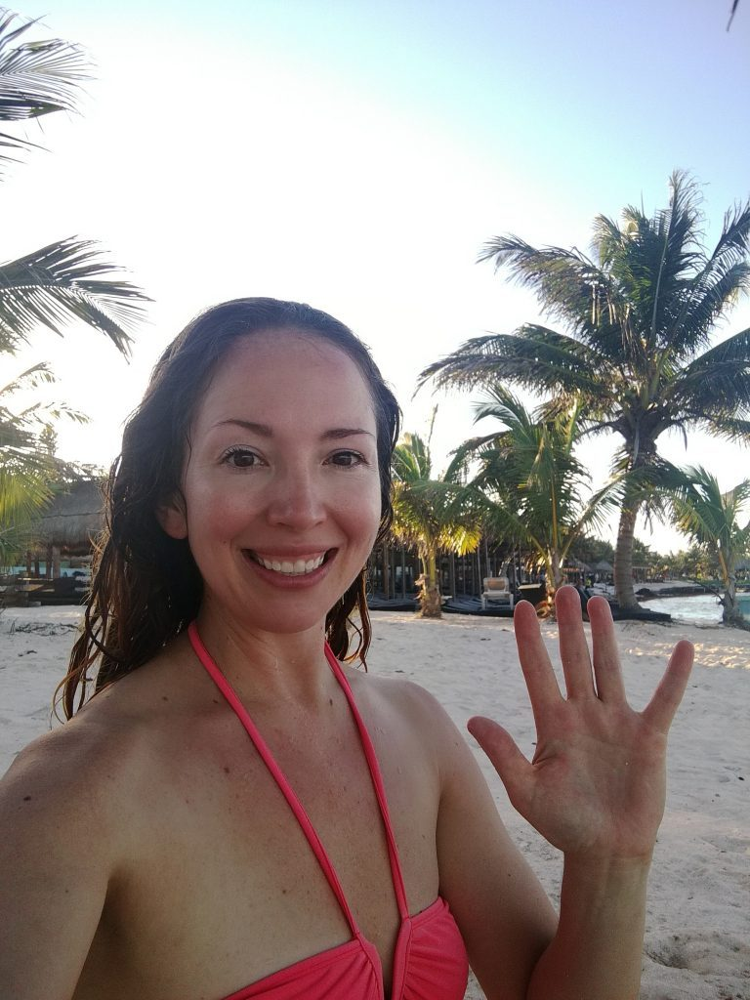
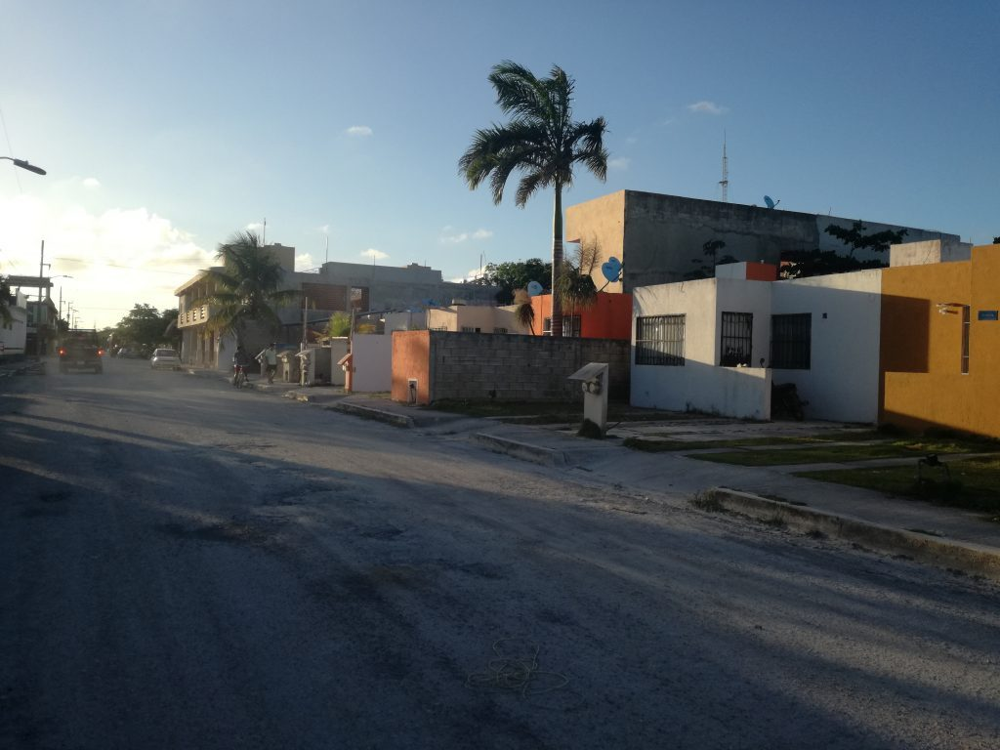
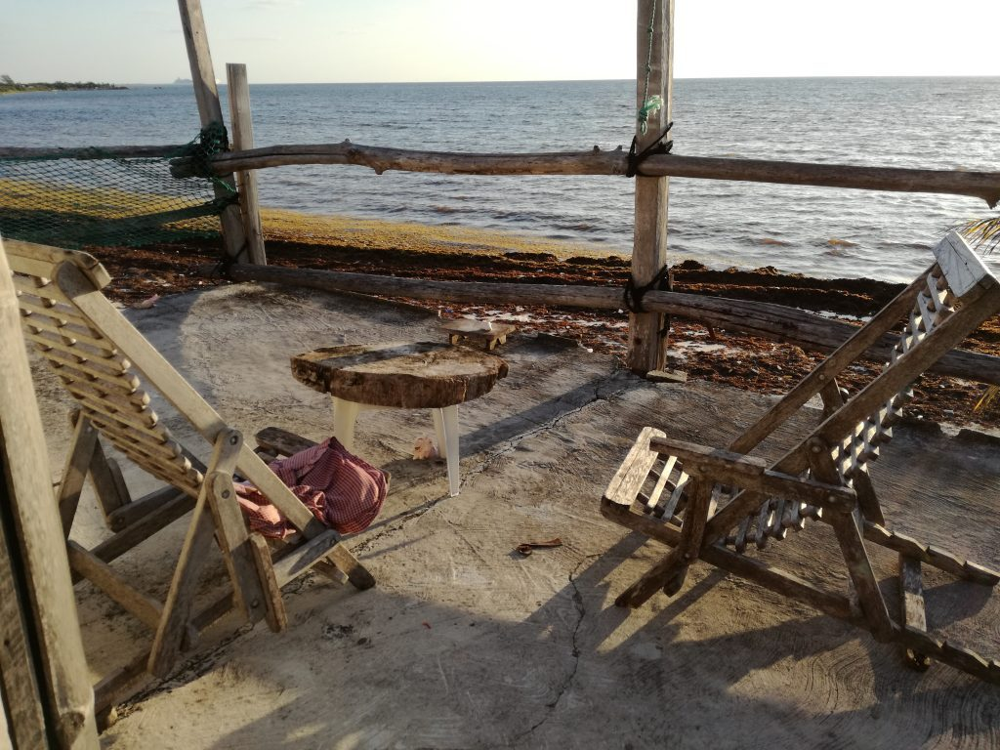
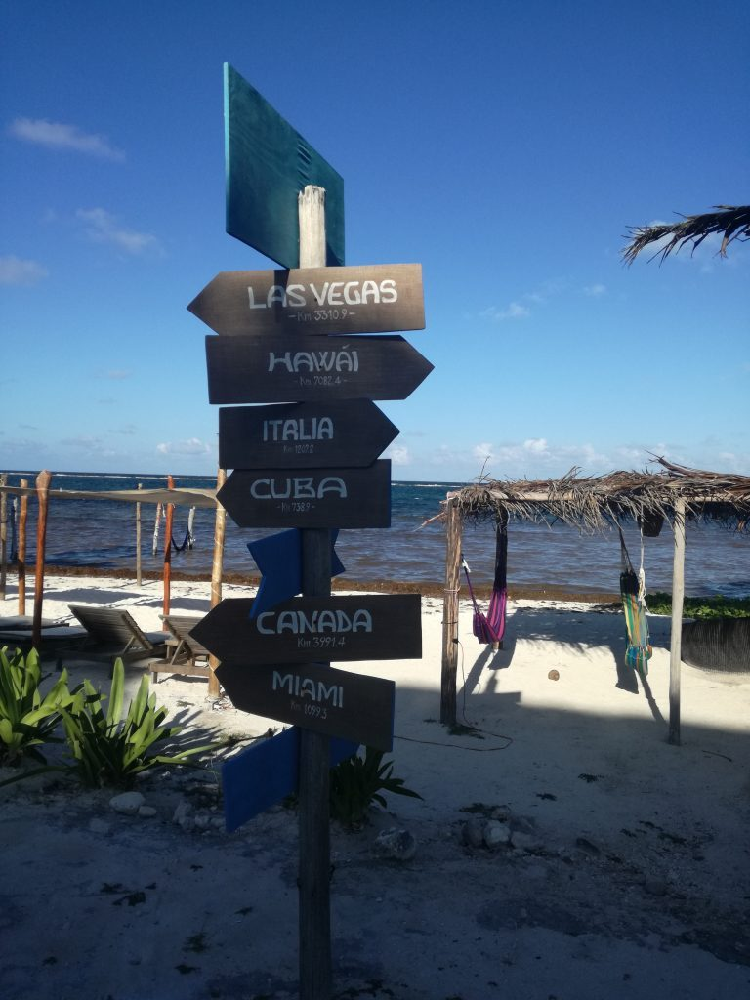
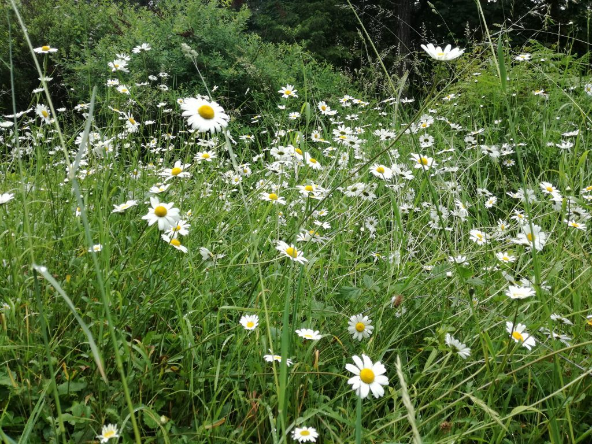
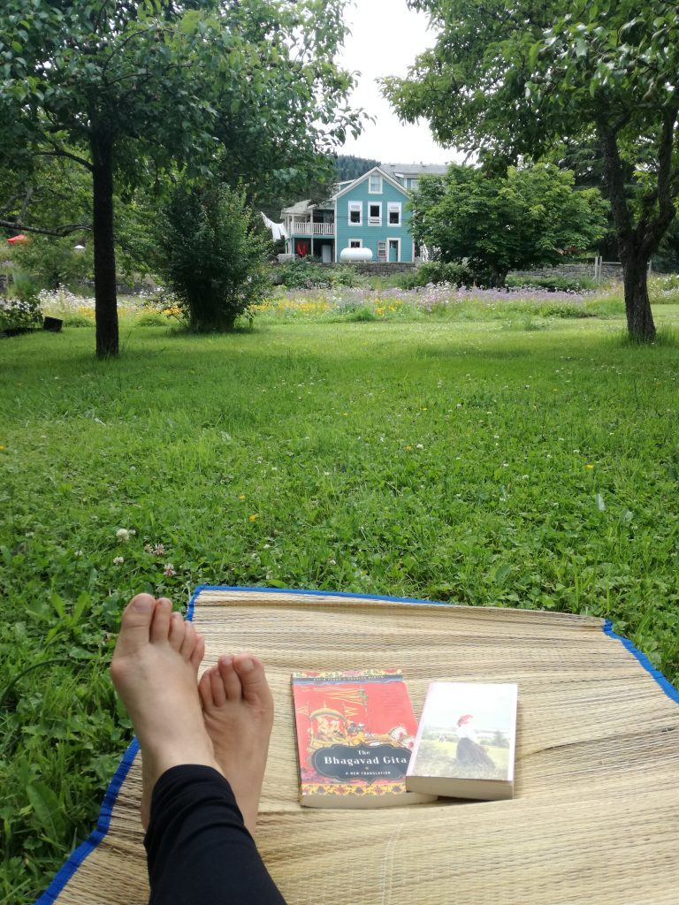
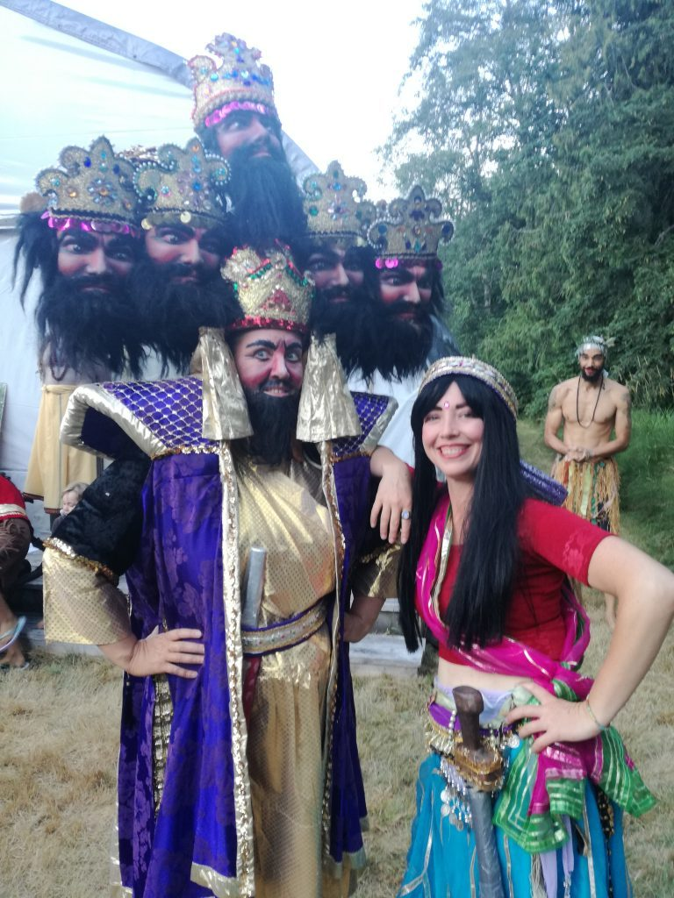
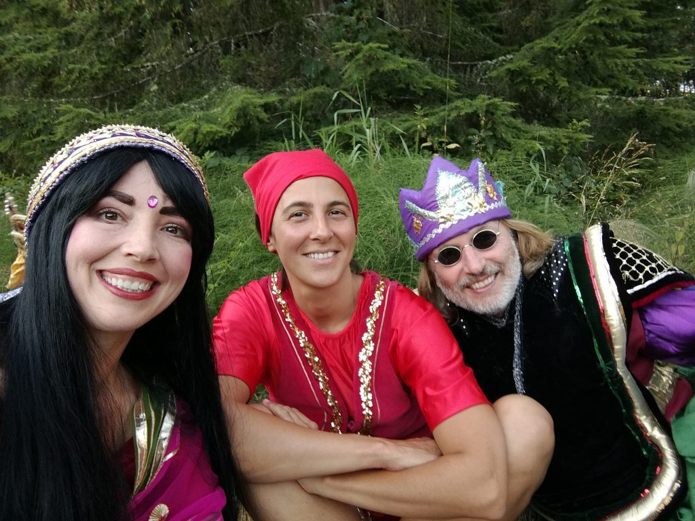
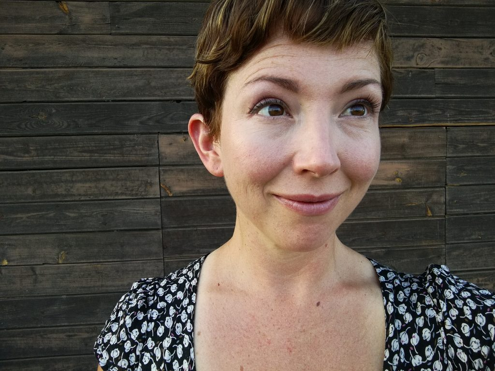

I can perfectly recall the feeling I had when I found the Salt Spring Centre online. It was as though someone had slapped a neon sign on the screen in front of me, blinking “Hey you - this is the place! You MUST come.” I was sitting at the kitchen table of our tiny little casita way down in the south of Mexico, close to the Belize border, feeling trapped. It was May of 2018 and I had been in Mexico with my then-partner since just before Christmas. The experience had been unforgettable, and I loved Mexico and the way its culture pulsed with life, but I wasn’t sure anymore if I loved my partner, and I knew I did not love the 38 degree humidity that was climbing daily.

- 

  in Mexico
- 

  Mexico
- 

  shack on the beach in Mexico
- 

  crossroads

I realized I had to leave the unhealthy situation I was in, but up until then I had been torn: should I continue south, solo, to Central America? Or north, back home to B.C.? My Spanish was mediocre at best, and I longed for a conversation that went deeper than whether or not the local tienda had any leche d’almendra (almond milk). I missed my family as well, and my Mom’s health had been deteriorating, so being closer to home made sense...however there was still a part of me that felt like coming home from my adventure in Mexico - from which I wasn’t sure I would return - was akin to failure.

I started googling anyway. I knew I didn’t want to live in Vancouver any longer; the city life and its frantic pace and culture of comparison were what I had left behind in the first place. What about the Sunshine Coast? I thought, Or maybe the Gulf Islands?  I knew wherever I went I wanted to be surrounded by community, because I had adored ours on Maui where my partner and I had met as fellow volunteers at an eco-retreat. I hadn’t realized how dearly I would miss this web of support when the two of us set off on our own. I googled Gibsons, Madeira Park, and other places, all the way up the Sunshine Coast. Nothing looked right, and I was getting disheartened.

Then, some beautiful letters in an old-fashioned script lit up my screen, atop an image of a charming old farmhouse, framed by cherry blossoms, and another of an Indian man with an infinitely kind face. The Salt Spring Centre of Yoga. I said it aloud to myself more than once. My heart beat faster. I scrolled farther down the page: Now accepting applications for the following positions: Programs Coordinator, Housekeeping Coordinator, and the Karma Yoga program. Something happened in that moment. I felt a pull like I never had before, from way down deep in my belly. Somehow, I just knew. I knew that I would be coming here, that this place was an important next step for me. I would be homeward bound soon - although I had never even been to Salt Spring before.

I dusted off my resume and got to work updating it, spending a whole afternoon and evening at a cafe at the end of our road, ignoring the sweat pooling under my butt as I tried to shift out of the hot sun, annoying the proprietor by making my one cafe frio last for hours. I had not yet told my partner about my intention to leave, nor that I had found the place where I wanted to go, so I was using the cafe’s wifi and keeping it quiet for the moment. I was afraid of his reaction when I told him I was applying and maybe leaving, and even more afraid of not getting the job, and having to stay after that and deal with the fallout. He was not a scary or violent person - on the contrary, he was so attached to me that I was struggling to hold onto my autonomy, and his insecurity and lack of trust had become a problem I was realizing I could not help him solve. When I finally got the resume and cover letter looking halfway decent, I addressed them to a person with the crazy-sounding name, “Yogeshwar”, and sent them off into the internet ether with all my fingers and toes crossed. I walked back the casita in the fading light.

Salt Spring

Three weeks later, my ferry pulled into Long Harbour, and I was picked up by an awesome guy with a long beard and a big smile who turned out to be Yogeshwar himself. I was a bit stupefied when we arrived at the Centre, so ridiculous did its beauty seem. And after months of hot, humid and kind of dirty, my whole being so glad to see this lush green paradise, nestled between mountains, full of cold lakes to swim in and trees that were way taller than I remembered, that I exhaled a breath, lowered my shoulders and finally let go the tension I hadn’t even realized I had been holding onto. Even though I had never been here, it felt like coming home.

What followed was a summer full of magic. I gave myself over to life at the Centre and embraced it all: learning the ropes as the new Housekeeping Coordinator from Crystal, morning pranayama practice with Kishori, singing along at kirtan with Adam, and being a part of a community that had no shortage of support, silliness, devotion, and those exact interesting and authentic conversations I had been yearning for when I could only talk about milk. I fell in love with everyone here, and was privileged to get to know each one of them on an individual level, as well as working together as a whole. Of course, as with anytime you get a group of people together for a length of time, there was also our share of personal fireworks that exploded from time to time and were then diffused. We were all learning how to live together, every day.

We hosted retreats, were privileged to hold space for the incredible YTT program, and finally it came time for the grand poobah of events - the Annual Community Yoga Retreat (ACYR) in August. Two hundred people from all over descended upon this usually quiet land and transformed it into a yoga carnival of awesomeness. But they were not just any people - this is where I truly learned the meaning of the word Satsang. Every person here was part of a family, and treated each other as such, whether they knew them yet or not. I had never witnessed anything like it. We were united through our love of this place, a shared history here and often with each other, and, for most people, through their enormous love for Babaji. Up until this point, his had been a face I saw around the Centre, whose teachings we practiced, and whose lovely quotes could be found on several chalkboards I walked past every day. I admired him and all he had accomplished here, and particularly how he seemed to inspire the people who were inspiring me, but I didn’t feel a personal connection to him. I didn’t actually feel allowed to have a personal connection with him. How could I, when he was way down in California, and by all accounts receiving end of life care? I didn’t feel I had any right to access this guru, and I had missed the window of opportunity to know him. And he would never know me - would never grant me a special Sanskrit name, as he had for so many others, which seemed to be a kind of secret Yoga handshake.

reading in the orchard

But then, at ACYR, people started to tell stories. Stories of Babaji the leader of work parties: who would run while others walked; who said even more with his actions than he did on his chalkboard. Stories of Babaji the prankster: mastermind of water fights and pie ambushes. Babaji: avid volleyball player and spectator. Babaji: lover of children and giver of candies. Stories from Sri Ram, the orphanage he founded in Haridwar. Stories from California. Stories from Salt Spring. I got to see how the faces of these storytellers lit up as they recounted their favourite memories, and  the smiles and laughter these elicited from everyone who listened. I got to see how deep the roots went here. And I started to feel like I might be allowed to be a part of it all.

The strength of the bonds of Satsang grew over the retreat, and culminated for me and my friends at our performance of the Ramayana. We had no idea what we were doing, but thankfully we were led by musical virtuoso Anand, who had traveled up from Mount Madonna to help with YTT, and by Piet, Salt Springer and former Centre Manager who had both known Babaji and been acting in the play since he was a child. We somehow squeezed in choir rehearsals and stage fight practices between our many ACYR shifts. We ran lines during meals in the pond dome, and in the evenings in the orchard. And with perhaps a sprinkling of divine grace, we were as ready as we’d ever be in about ten days’ time.

Ramayana 2018 - Emily as Ravana, me as Surpanaka

with Muriel and Bernie, Ramayana 2018

Everyone came together to help us get ready, and the crazy, excited backstage energy as we transformed into demons, monkeys, gods and goddesses was something I’ll never forget. Elders who had known Babaji since the early days tied dhotis, new KYs did makeup, and an incredibly talented lady named Priya from Mount Madonna single-handedly organized everyone’s costumes. And somehow, we pulled it off. It didn’t go perfectly - lines were flubbed and not every note was on-key - but that just made it better. We were so high on the energy from what we’d just done that afterward the whole cast of thirty squeezed into the community kitchen and ate popcorn and snacks and laughed together until the wee hours of the morning, when we all finally floated off to our beds. If we weren’t a family before that, we certainly were now.

short hair

By the end of last summer, I felt as though I had somehow always been here, and been a part of this place. That it had always been a part of me. I had now had my own transformative experiences on this land - the same land that had held retreats, year after year; that had hosted pie ambushes and water fights; that had held generations of laughter, tears, prayers and honest intentions; the same land that Babaji himself had walked over, barefoot, white robes trailing behind him. The land that held and listened to all those stories I loved. And because of these experiences, I felt the walls that seemed to be there, the walls I thought might be keeping me out...simply dissolve. As if they had never been there at all. And maybe they weren’t. Or maybe I had built them myself, and through the magic of this place, its beautiful people and generations of stories, I learned how to take them down and walk right into the heart of things.

Jai Babaji! Always
