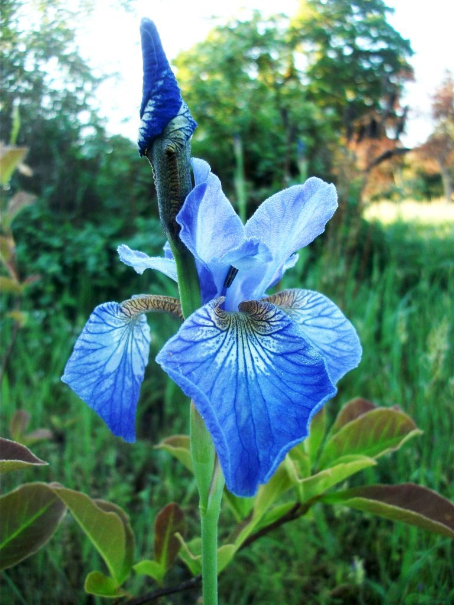
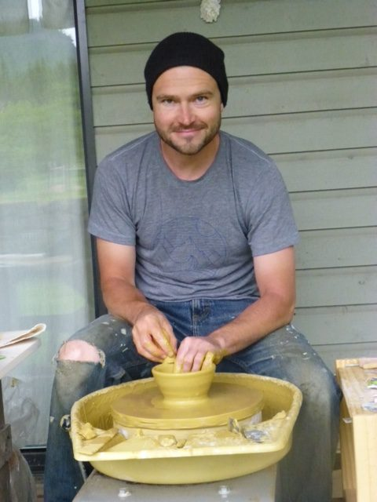
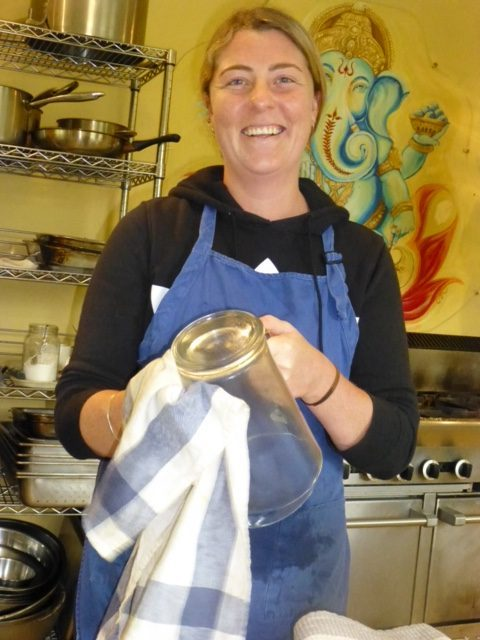
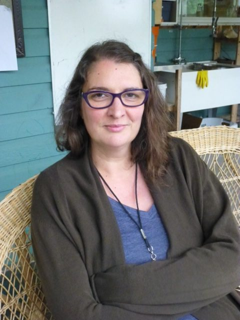
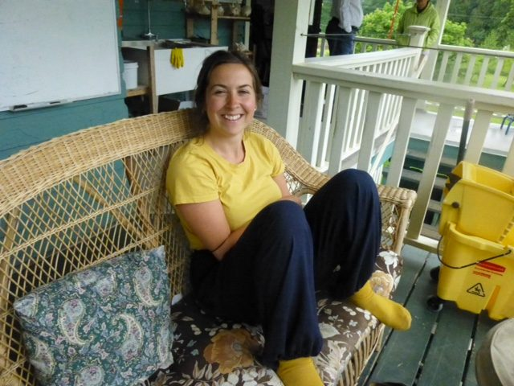
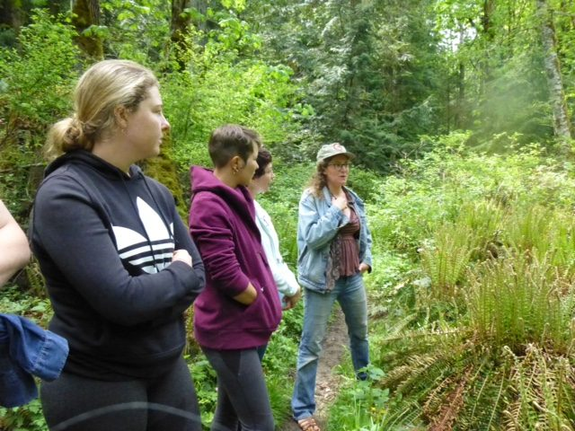
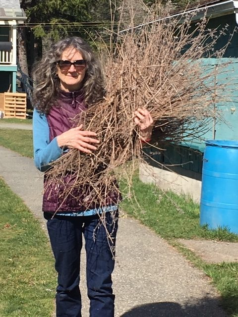

*Accept yourself, accept others and accept the world.*   
*You will see everything is full of love and love is God.*   
*~ Baba Hari Dass*

Dear friends,

Salt Spring Island is beautiful and green, the garden is growing, and the centre community is in its expansive mode. This month we welcome a new group of karma yogis into RKYP (Residential Karma Yoga Program).

- 

  Adam working at his new potter's wheel
- 

  Hannah in the office
- 

  Tessa
- 

  Janell
- 

  Flo

Plant identification walk with Lisa

The karma yoga program includes work and play, learning in many ways. Recently we went on a plant identification walk with Lisa, who was a farm yogi here a few years ago, and an exploration of the Dandaka Forest with Raghunath.

- 

  Santa on the roof with one of his elves? No, it's Suneel and Courtenay cleaning the skylights.
- 

  Rajani

In a recent class on the topic of Yoga and Living in the World, there was a discussion about the conditions and habits that make it hard to stick with a daily spiritual practice, as well as some practical steps we can take to get back on track. I thought it might be useful to share that with all of you, so here they are. You might be familiar with some of them.

**What gets in the way of doing regular sadhana (daily meditation)?**

- being busy - not having enough time
- the habit of postponing or procrastinating, making excuses
- family obligations, kids, having to work around other people’s schedules
- space limitations
- lack of privacy
- not getting enough sleep
- so many distractions
- lack of discipline
- waiting for perfect conditions

**What are some things you can do about it?**

- being in nature, which can reset and calm your nervous system
- supportive community/satsang
- decreasing barriers to practice, decreasing distraction
- just do it! (self-discipline)
- do some every day; a short daily practice is better than an occasional long practice.
- notice your suffering; suffering can prompt you to practice in order to find peace
- inspirational teachers
- regular routine, get enough sleep. Close down electronic devices early in the evening
- taking care of yourself

We all need these reminders periodically. I hope these prompts will be useful for you in your practice.

## Happening at the Centre

The Salt Spring Centre of Yoga’s [**200 hour Yoga Teacher Training**](https://saltspringcentre.com/yoga-teacher-training/), beginning July 3,  is a superb and enriching residential program, taught by a faculty of experienced teachers. There is still time to register. Find out more information [here](https://saltspringcentre.com/yoga-teacher-training/).

The following month begins with our 45th consecutive **[Annual Community Yoga Retreat](https://saltspringcentre.com/programs-retreats/annual-community-yoga-retreat/)** (ACYR). I hope you’ll be there!

The week before ACYR, the air at the centre will be filled with the sound of music. **Fiddleworks** is a training and practice camp for fiddle players and other musicians to play together. This group used to rent the centre years ago, and this summer they’re coming back. There will be music in the air.

As always, **ongoing classes and events** continue: Bhagavad Gita study on Tuesday evenings, kirtan on Wednesday evenings, Yoga Sutra study on Sunday afternoons from 2-3, and satsang on Sunday afternoons from 3:30-5:30. All are welcome to join.

## For your reading pleasure, and some inspiration

Courtenay Cullen, a resident at the centre, housekeeping coordinator and woman of many talents, tells the story of how she came to find the Salt Spring Centre of Yoga and and to understand the depth of connection to Babaji and this large, extended family and community. This is the beginning of an ongoing story which will continue in next month’s newsletter. I’m sure you’ll enjoy [**Summer Stories and Satsang**](https://saltspringcentre.com/summer-stories-and-satsang/).

Cara Graci, a Salt Spring Centre of Yoga YTT grad of a few years ago, teaches Gentle Hatha Repair and Restore & Renew classes at the centre every week. Her manner of teaching is gentle and supportive. In [**Matsyasana / Fish Pose**](https://saltspringcentre.com/fish-pose-matsyasana/), Cara leads you through this soothing backbend posture that, when done as a restorative pose, can help calm the immune system, particularly when it is in overdrive during allergy season.

Who are you? We have many identities according to the categories we use to define ourselves - our nationality, gender, profession, etc.. But who are we apart from those labels? In [**Mistaken Identity**](https://saltspringcentre.com/mistaken-identity/) we explore the deep question that lies at the core of spiritual practice: Who am I?

Love,  
Sharada

*Dream is real as long as you are asleep.*   
*Life is real as long as you are not awakened.*   
*~ Baba Hari Dass*
