The night before Babaji left his body was the first time I was ever an offerer during a yajna. It felt special, and important, because we all knew that it could be any time that he passed. My heart reached out of my chest toward his beloved, lifelong students who were present - Sharada, Kaplana, Bhavani - as they offered flowers into the sacred vessel, and their prayers to the sky. We sang kirtan to the guru. After a full summer here at the Centre, I finally had some idea what these songs meant, and was being shown by the devotion of these people around me.

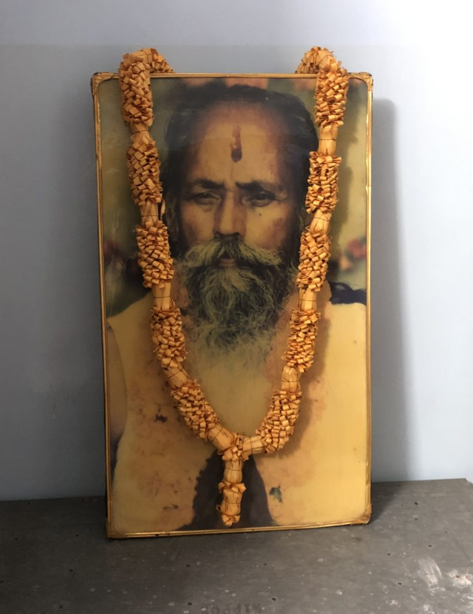

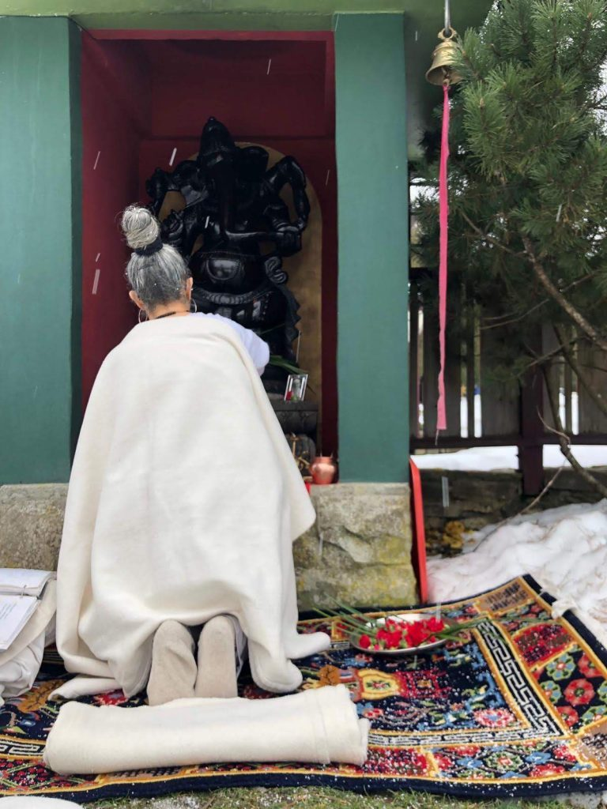

Babaji passed the next day, on September 25th, 2018. We were told that Tarpanam would commence the following morning, and for each day to come, until a final Shraddha ceremony on the 13th day. I had no idea what any of this meant. I had never participated in a Hindu death ceremony, nor been around death in another culture. In fact, I had never truly come near to death in my own culture, either, as I would come to learn.

The next morning, in the 7am darkness, we gathered in the Satsang Room, and Yog lead us all through the ceremony. Tarpanam, he described in his eloquent and approachable way, was a way of untying the earthly knots, of helping to free the beloved soul from their karmic bonds here, and to help set them free. And in some way, to me, it also sounded like telling them it was okay for them to go. Sanskrit chants and blessings were offered. We sang kirtan together, and many people cried, as a ray of the rising sun gleamed through the stained glass yantra and onto the floor near the altar.

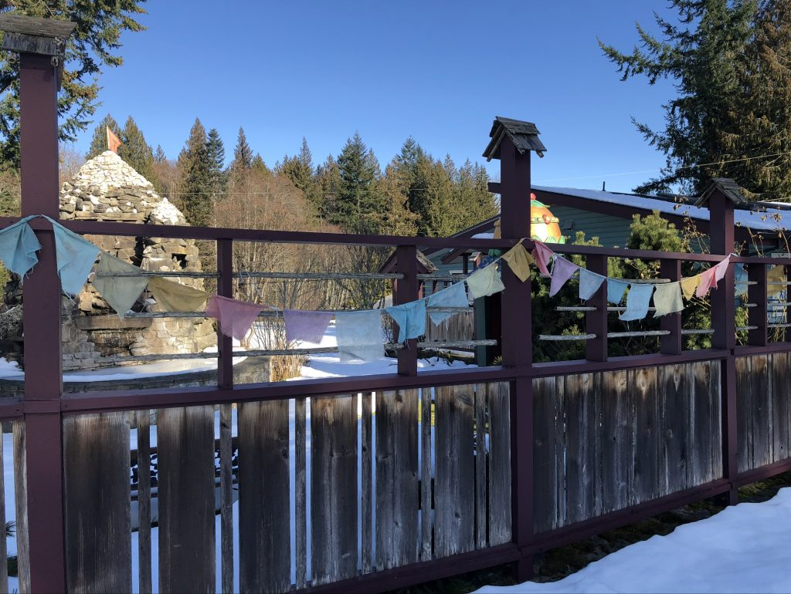

I did not attend all of the Tarpanam ceremonies in the days to come, but I went to most. Each time, different faces came to offer their prayers and to begin to say goodbye, in addition to many familiar ones. Some days it felt like it was just us in the room, going through some obscure, strange motions. Other days, however, I felt we were not alone; that we were surrounded by a presence, smiling and kind. And each day, as we chanted and sang to help loosen Babaji’s hold on this world, we were also gently loosening our hold on him. Song by song, day by day, for twelve days. It felt more human, more kind, to say goodbye in this gradual way, allowing each person the time and space to process the profundity of their loss.

The day of the Shraddha arrived, and none of us here on the land was sure what to expect. How many people would come? There was no way to know. The word had been sent out to the Satsang, and while many made the pilgrimage down to Mount Madonna for the huge offering being made simultaneously down there, we were holding it down on our little island for the Canadian contingent. We were as ready as we could be - parking team with reflective vests and walkie-talkies ready, and a housekeeping/prop moving/setting up/taking down/decorating team guided by Rajani’s skilful hand. The Satsang room filled with people, and every bolster and backjack we had held the body of somebody who loved Babaji. Somebody whose life had been forever changed by his presence on this earth. Someone who had felt the glow of his grace. I will never forget it. Then a line of mourners formed, and snaked around the room as we sang, and one by one we knelt before the altar and said our own personal goodbye. When my turn came, I bowed until my forehead touched the floor, and offered my humblest and most sincere thanks to this beautiful teacher I had never met, for reaching out and bringing me here, and for inviting me into this family that I didn’t know I needed.

After the offerings were completed, they were wrapped up lovingly in the cloth they sat upon, and the group made its way out to the magnificent maple tree that we all know as Babaji’s Tree. A hole was dug, and the offerings placed inside and covered with earth. Then, we ate a huge meal, people sat on the mound, on the deck, all over this place, smiling, laughing, crying, and recounting their favourite Babaji stories.

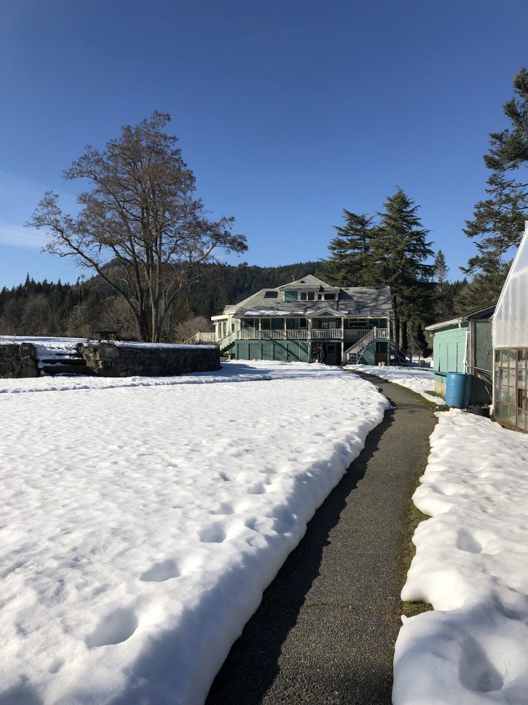

Suddenly, the end of the season was upon us. As September gave way to October and November, programs dwindled, and so did the members of our close-knit little community. One by one, my new friends - my family, it felt like - left the land to continue their journey elsewhere, either continuing on in their travels, or returning home to places like New Zealand and Massachusetts after a long time away. Some even stayed on Salt Spring, but moved off land, to different parts of the island. For winter, only five of us were left to hold down the fort. I realize now that this carried another, different sense of loss.

Winter was tough. After a sunshiny November that belied what was to come, we were hit with an onslaught of weather in December 2018. Rains came; grey clouds rolled in to stay. The winds picked up. It all swirled and boiled, and culminated in the biggest wind storm in living island memory, on Thursday December 20th. I had started a job at Salt Spring Books in town to help get through the lean winter months, and I was working there when it hit. All day, customers came in with wilder and wilder stories about trees falling, power outages, and even swerving to dodge falling branches while driving. “Don’t worry,” soothed Adina, the owner, “the power never goes out at the store. We’re on the same grid as the hospital.”

At 3pm, the power cut. Stepping outside, with the day already beginning to fade, all the darkened windows in town gave off an eerie, ghost town feel, as the wind whipped banners and flags, and telephone poles - once so solid - creaked and swayed in the hands of the invisible power. Our human illusion of control was shattered. Mother Earth was in charge, and she was very, very angry.

The aftermath saw over 5,000 trees down on this little island, and the biggest clean-up operation in BC Hydro’s’ history. Crews worked round-the-clock, many of them through Christmas Day, to restore power to thousands of homes without. Here at the Centre, the power was out for eight days. We had it easy, though, compared to many; powered by our backup generator, cooking on a gas stove, and being gratefully heated by the wood-burning stove. Many of us simply camped out in the Satsang Room around the fire for warmth. We banded together, and we made it through together, because of this. This was true here at the Centre, and across the whole island. Neighbours took in neighbours, when their power came back on first. People cooked for each other, dropped off much-needed water, and let friends come over just to shower. We took care of each other. And we were reminded (very firmly) that the holiday season is not actually about buying more things. It became, in retrospect, one of the most shining instances of Karma Yoga I have ever witnessed.

After the holidays passed and the power was restored, life cautiously resumed. We had made it through something, and perhaps come out stronger. If not stronger, at least with more appreciation for each other and things so often taken for granted, like a warm meal and running water. Islanders met each other (and still do, and will do, I imagine, for years to come) with cries of “Where were *you* during the storm?” Followed by comparisons of who was out of power for longer, and what the craziest thing they saw was. I imagine the stories, and the trees, and the wind, will only get bigger with time.

In March I was to realize a long time dream, and finally travel to India. The birthplace of yoga, of the beliefs I had come to hold most dear to my heart, and of course, of Babaji. I had always wanted to go, as I assume most aspiring yogis do, but wasn’t sure how to come at it. By all accounts it was an overwhelming place, and I felt like I needed a way in, something to help me get my feet under me when I arrived. After that, I reasoned, I'd be able to head off on my own, as I had during many previous travels. My way in came in the form of Chetna, one of my favourite people I had met so far at the Centre, whom I was privileged to get to know as she led her students through the transformation that is YTT during the summer. She was taking a small group on retreat to India, and I somehow convinced her that she needed an assistant, and that this assistant should be me. Thank goodness!

So, after life rather resumed in January, this was my focus. I would go to India, I would practice, I would visit holy sites, and I would bathe in the sacred water of the Ganga. To cap it all off, I would finally visit the fabled Sri Ram Ashram in Haridwar, and meet the children living there at the orphanage. I couldn’t wait, and I must admit much of my focus was on this future time, and not on the here and now.

I was brought crashing back into the present by a phone call on the evening of Thursday, January 17th that was to forever alter my life. I had gotten back to the Centre after a day at the bookstore, and was about to have tea by the fire with my good friend, Jo. I checked my messages first, however, and saw a one from my older sister, telling me to call her right away. And that she loved me. “Oh no,” I said, as a chill came over me, and I looked worryingly at Jo, “this can’t be good.”

My sister picked up on the first ring. Her voice was thick and strange, and it cracked through sobs as she managed to get out the words, “Mom...died today.” “No she didn’t,” I replied immediately, as though the speed of my denial could make it so. But yes, she had.

Suddenly and unexpectedly, my Mom was gone.

The time that followed was a blur of shock and denial and grief, interspersed by strange moments of absolute clarity. Where I would be staring at a thing, like the handle of my tea mug, noticing every line and crack of it, and then be overcome by the horrible realization that my Mom would never again drink a cup of tea. Or like the moment I stepped into the house I grew up in, and tried to tell myself that my Mom, who raised us here, would never step though the door again. Death and I had finally come face to face. And we were to be co-passengers on this journey, and what was to come.

Despite, or rather because, of the absolute awfulness of this time, I discovered the true power of community and kindness. Everyone here rallied around me, and was here for whatever I needed. Our island Satsang was like just a wider extension of this comforting web that was holding me. I had completely let go of everything, and it was really all that was supporting me. And Jo, who had been with me when I found out my Mom had died, was incredible, basically functioning for me for the first 24 hours before I could get back to my dad and my brother on the mainland. And in a strangely beautiful turn off events, Yog reached out, and offered to help hold a Shraddha for my Mom, on the 13th day, here on Salt Spring. I was deeply moved, and agreed very gratefully.

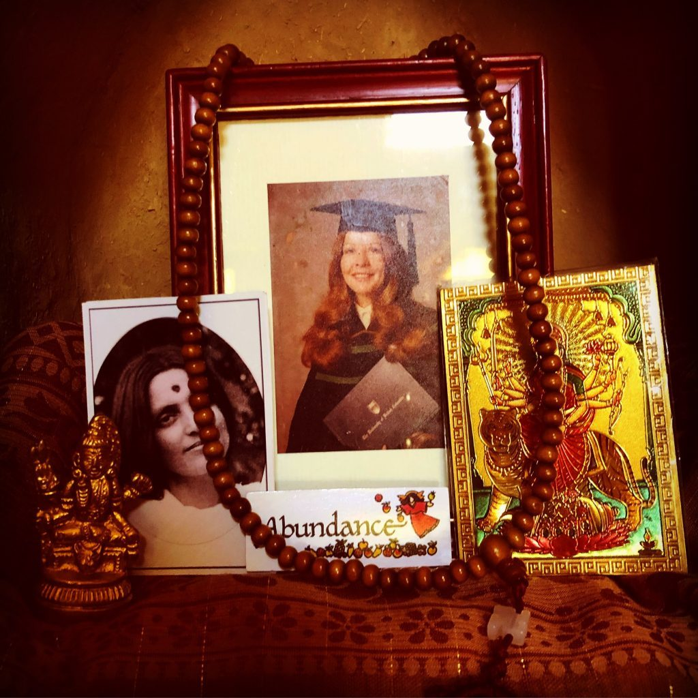

We met before dawn, and with a framed photo of my Mom as a young girl, some of her favourite food and sweets (sunflower seeds and oranges), and a whole bunch of puja equipages I was glad I didn't have to know about, we set up an altar at Beddis Beach, facing east, before the sun rose on the 13th day. We chanted, and prayed, and this time, it was my own mother’s earthly ties we were helping to untie. And as much as I wanted those bonds to stay tied - tied to the earth, tied to me - I knew that this was a selfish desire. That for my Mom, this was the best thing. She was finally free from a body that had started failing her long ago, and she could be among the myriad seabirds who had decided to join us for our ceremony, swooping and gliding over the ocean in the early morning light. Even the ocean herself responded to our calls, as an otherwise calm sea suddenly kicked up after our invocation of the elements, and pushed us and our ceremonial rug back as its tide pushed farther and farther up the sand toward us.  It felt right that the earth, our shared mother, should respond. When our offerings were complete, we wrapped them up, just as we had Babaji’s from his Shraddha four months before. But rather than bury them this time, I walked out to a flat, rocky point on the edge of this little island, said what felt like my last goodbye to my mother, and flung them into the arms of the sea.

I considered not going to India. That maybe it was too much, too soon. I sent Chetna a message about this, and in the most supportive way possible, she let me know that, while of course it was okay if I did not come, that India also happened to be an incredible place to grieve. I thought about it, and realized I would be in pain no matter where I was, so why not go on this pilgrimage with this teacher I loved.  And so I left the Centre on March 1st - a layer of snow still on the ground - and set out on a journey that had suddenly changed completely for me.

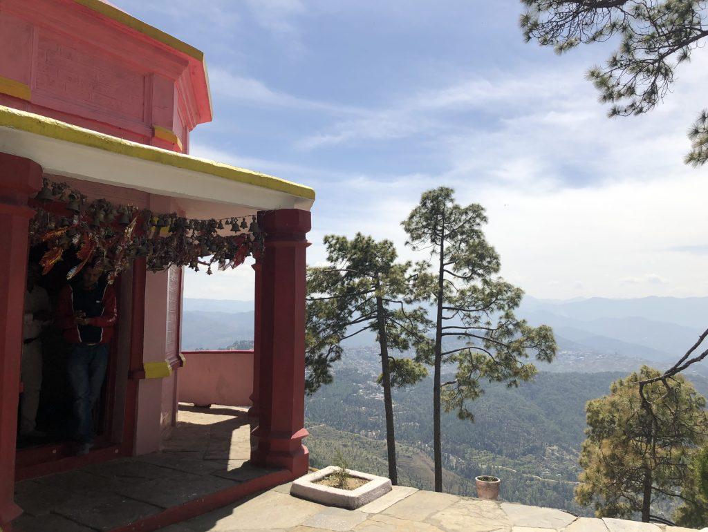

- 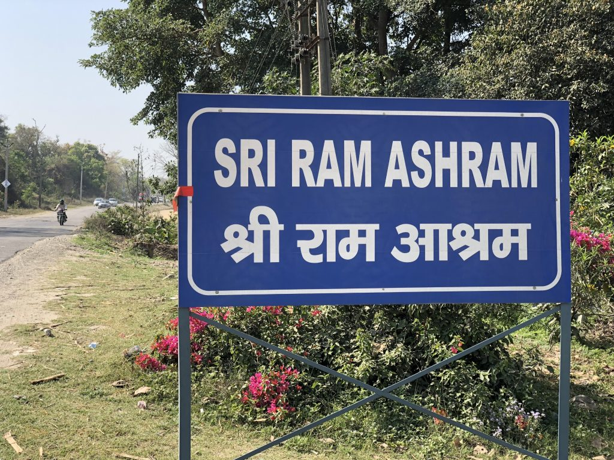
- 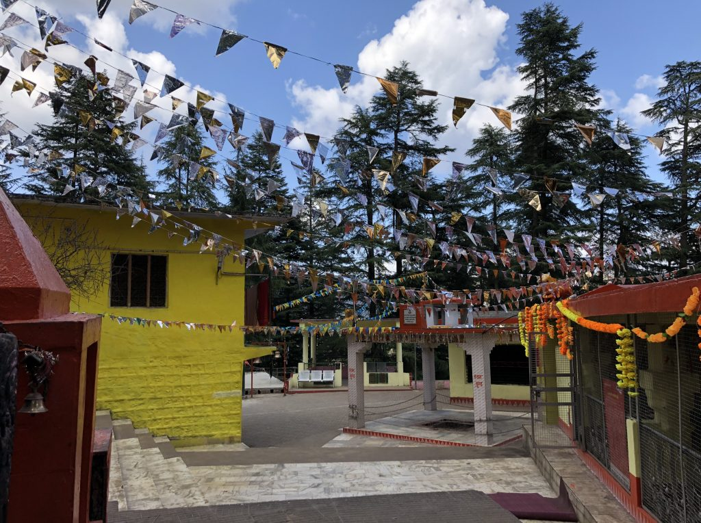
- 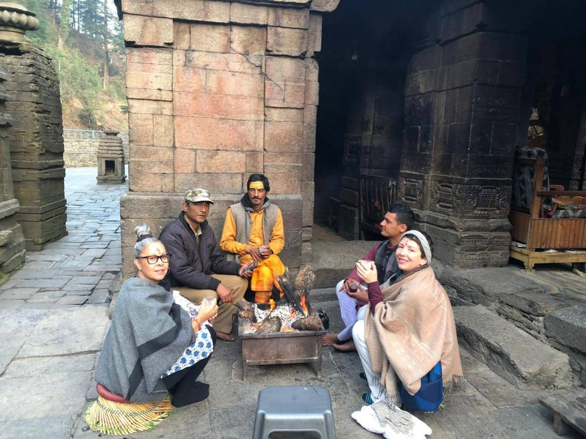
- 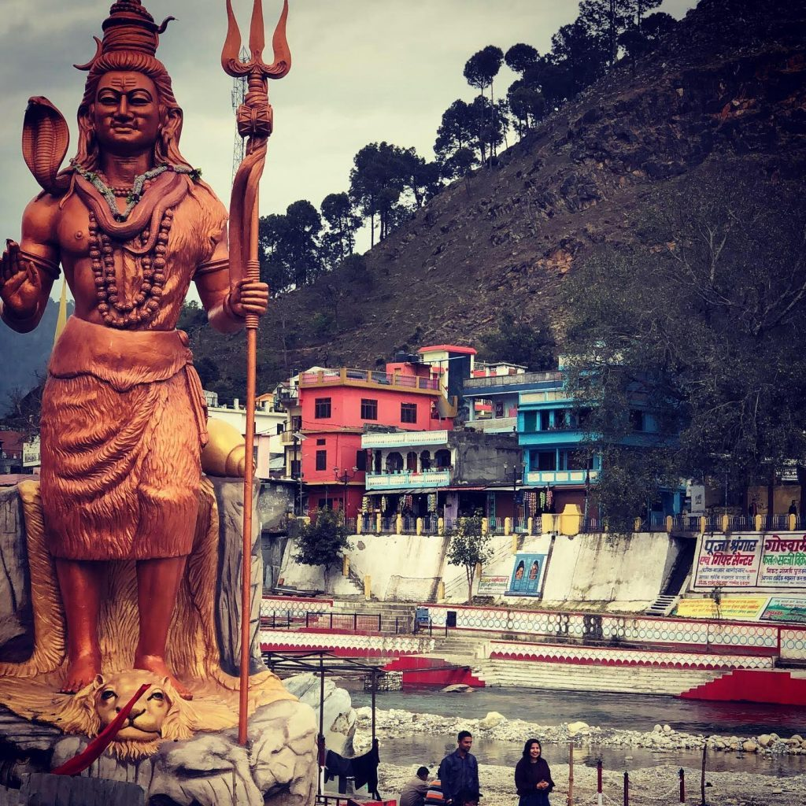

I learned very early in my trip that India was, in fact, precisely where I was meant to be at this time. To meet the beautiful souls of the eleven women who were on retreat with us. To meet, play, and sing with the children of Sri Ram Ashram. To encounter a kindred spirit and teacher in Anuradha, whom I was blessed to meet there. To swim many times in the Ganga. To bow to the temples. To drive through insanely winding mountain passes that did not seem big enough for even a single car (let alone two plus a donkey). And most of all, to be in the loving presence of Chetna, whose support and grace kept me buoyed and sane, and thankfully, laughing through it all.

- 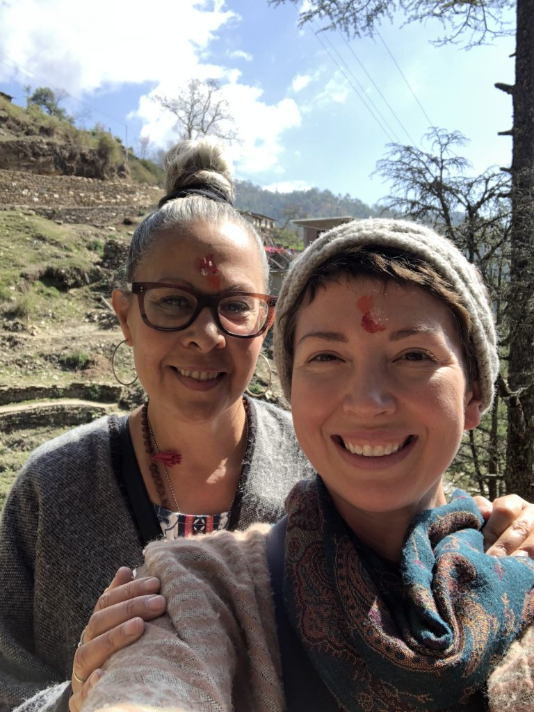
- 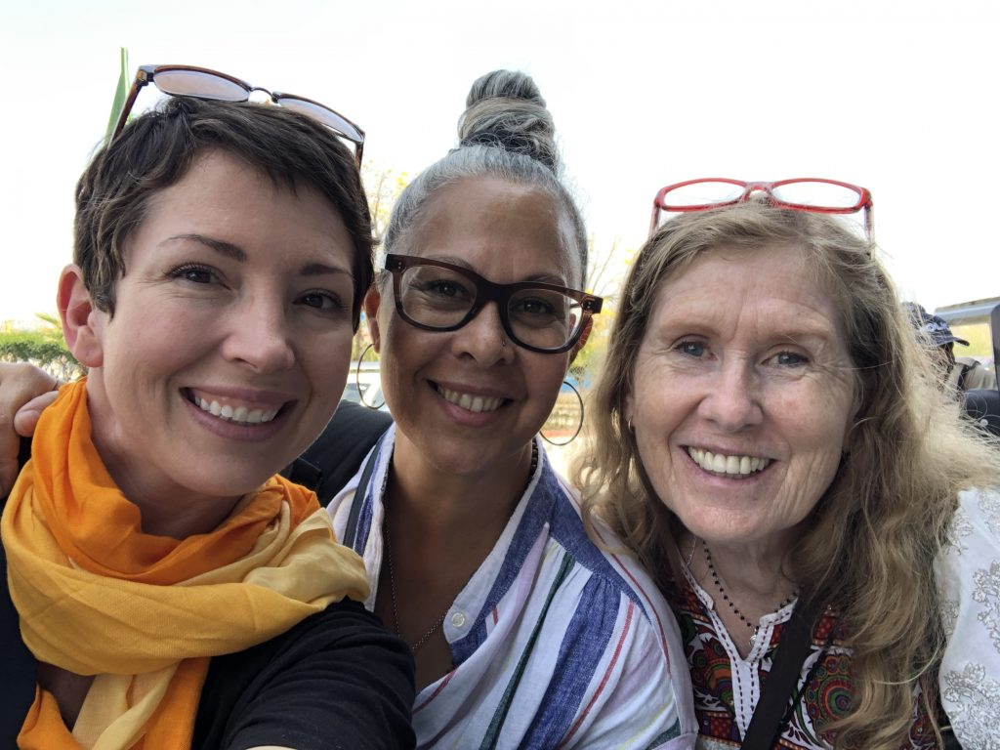

I am realizing as I write this, that India is its own story - though its importance to the whole is incalculable. This is one I hope also to share. But as I continue to unpack it and its lessons, I find myself gratefully back on Centre land, amid new friends and old, for another beautiful summer season. In one complete year here, much has changed. But not the feeling of home, and of being exactly where I am supposed to be, in the sacred beauty of the land, and in the warmth of this community I am so grateful to be a part of.

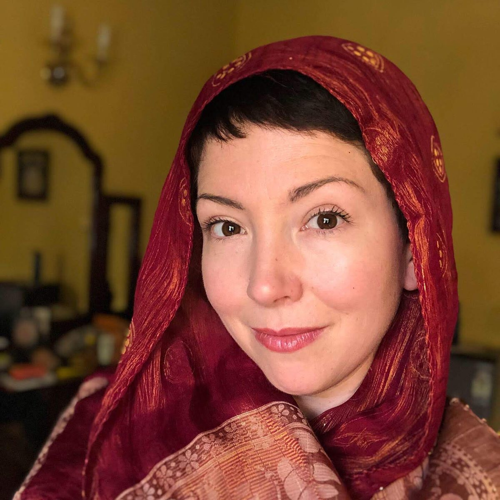

Contributed by Courtenay Cullen
