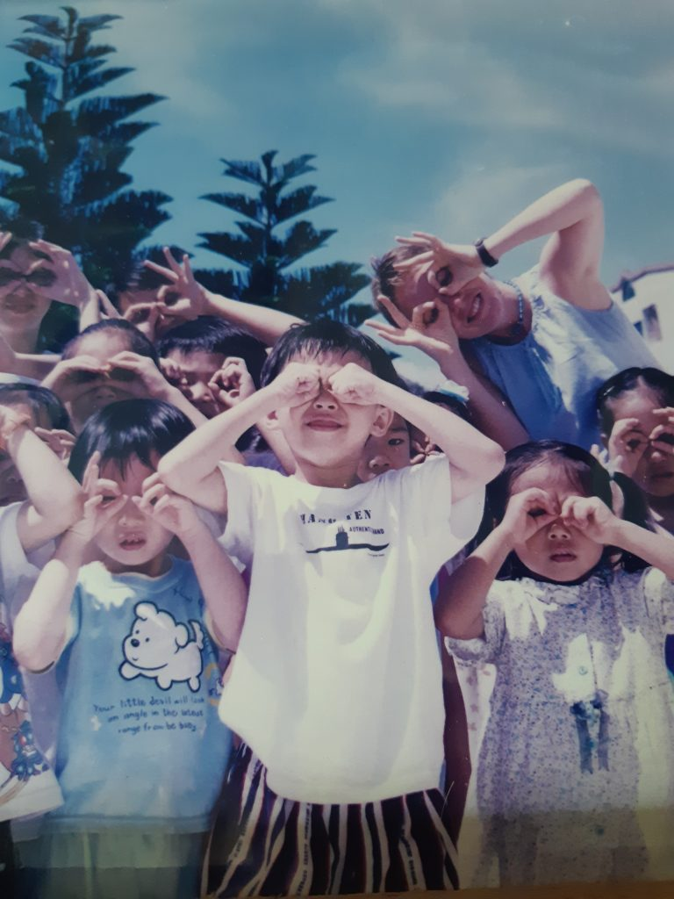

Who am I and how did I get here? These questions are always percolating with different answers arising in me all the time. My easy answer today is I am nothing and I am everything, and I got here by being here. Let’s see, there might be more to it than that.

Over fifteen years ago, I spent the weekend in dyads, asking one another other “Who are You?” I was to answer out loud, with no comment or reaction from my changing partners. What an exercise! I loved it! I thought I was coming up with some pretty clever answers. The answer that stuck with me was that I was a direct result of all the interactions I had with people in my life, how special I was to be part of everyone. Fifteen years later, during Yoga Teacher Training, I had a felt experience, not of the mind or intellect. I was energy. I was love. Formless and boundless. Boom! Who am I now? I feel and believe, I am here to connect with people, to share with people, to heal with people… to love, to listen. And I’m here with the planets, animals and nature. Going through the seasons together.

I wrote this shortly after YTT.

*Listen, stop…stop everything*  
*Stop your stories, stop protecting, stop defending, stop everything*  
*Stop hardening, stop running, stop everything*  
*Listen with your heart*  
*Listen with your whole body*  
*Listen with your soul*  
*We are here to listen to each other*  
*You are safe, I am with you…listen*

What brought me to YTT? There were so many seeds planted in me along the way. So many teachers and experiences. One of those seeds was planted 20 years ago during a colonic cleanse and fast retreat in Thailand. While there, I was introduced to Yoga to help my mind and body relax and let go. Let go, let go. The colon can be seen to represent where we hold our life stories. Fasting and cleansing was an amazing way to access and let go of who I thought I was. I felt free and in Love…with life. I remembered how Yoga helped me feel so good in my body. I thought that one day I would love to dive in deeper!

Kindergarten Class, Taiwan 2001

From 1997-2002, my husband Patrick and I lived and worked in Taiwan. I would say that this time in my life was very transformative. The onion layers started to peel away. When I looked into the Taiwanese peoples’ eyes, they had no stories of who I was, no preconceived notions of who I was. I thought who am I then? I can be anybody, so who do I want to be? I started seeing myself more clearly. I started working on my health and seeking help from Dr. Lu, my Chinese Medicine Doctor and Mentor. I started doing acupuncture, herbs, and tuina massage regularly.

 My last three years in Taiwan, I taught the same 3-5 yr olds, all day everyday. These children had a special way of seeing through me that allowed me to soften and let go. Teachers in Chinese culture are very well respected, and I slowly grew into what they saw in me. What an honor! “Teach to Learn”

After a year of doing acupuncture, herbs, and tuina massage, my world was expanding. I was part of something larger than myself! This was perfect fertile ground to begin my journey into Yoga. I was introduced to Ananda Marga Yoga (Path of Bliss) through my teacher, Bhakti Prana Didi. Didi was a nun who devoted her life to self-realization and selfless service to humanity. She taught me the many practices of Yoga, from meditation to kirtan, to asana practice and how to take care of oneself in daily life to reach Ananda Marga (Path of Bliss). I was very dedicated to my practice and later received my Sanskrit name of Gopa and my meditation mantra. Gopa, I was told means close friend to God. Wow, I thought, I am truly blessed, and another part of me thought, wow, I have some work to do!

At one point, I watched this young woman (me) share with my husband Patrick, that she wanted to study Chinese Medicine. He responded with such love and encouragement that I now had to take this woman (me) seriously. From this point on, I think Gopa took over and laid the ground work and path for my future. I put all the children’s hearts in my heart one by one before I left. I put all the seeds, special friendships and teachings in my being and I left Taiwan in 2002 on my own to begin my formal training into Chinese Medicine. I flew home (across the ocean, wink) to Moncton, New Brunswick to reconnect with my family and friends before driving across the country to begin my studies in Victoria, B.C.

It’s 2017, my precious Chinese Medicine practice was getting larger, deeper and more complex. My spiritual practice was getting larger, deeper and more complex. Ha! (same thing?) My children were then 5 and 8 yrs old. They were ready, I was ready, my husband knew; it’s time for YTT!

I wanted to understand my own relationship with my husband and kids on a deeper level. I wanted to unravel some old patterns of behavior that I was a part of that were not serving me or my family. I thought, it’s time to go deeper inside myself, to let go of some of my own pain and suffering. I wanted to become more intimate with myself. I wanted to go to summer camp! I wanted to have fun! I wanted to be free and silly! (thank you Stacy, my roommate) I am so grateful for the safe container that was so beautifully created for me at the Salt Spring Centre.

The generosity, love and Babaji’s teachings that were shared with me will live through me, beyond me, and forever. My Sadhana practice is all day every day. My formal Sadhana practice is my anchor. I feel so supported, and Satsang is what I needed. Thank you. I have ways to feel and breath through my own suffering and hold space for the suffering of others on a deeper level. I can be more of a witness. I have so much to be grateful for. Thank you to my husband, family, friends, teachers, patients, tcmers, colleagues, yogis, and yoginis. You are all my Satsang. The light is always there, I am safe, I am free, I belong, I am Bliss! Thank you for holding me. Thank you to my mom for planting the seed to never give up.

In Love and Light Gopa/Gigi
