*Be content with what you have; rejoice in the way things are. ~ Lao Tsu*

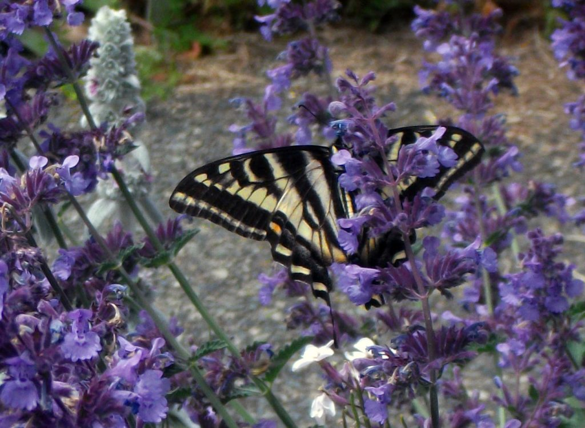

Dear friends,

Happy Canada Day on July 1st and happy Independence Day on July 4th to our American friends. It’s a celebratory time - and it can be a busy time. If you’re planning to travel on those weekends, be prepared to take your time and enjoy the journey. You might as well relax and enjoy it. As Babaji reminds us, it’s just a matter of switching the angle of the mind. If you’re travelling with children, bring lots of snacks and drinks, and get out of the car, preferably along a stretch of greenery, as much as you can. See how many fun games you can come up with that aren’t computer games. Take it easy.

*The world is not a burden; we make it a burden by our desires. When the desires are removed, the world is as light as a feather on an elephant’s back.* *~ Baba Hari Dass*

[**Yoga Teacher Training**](https://saltspringcentre.com/yoga-teacher-training/) begins in a couple of days. This residential program, rooted in the teachings and practices of classical Ashtanga Yoga and Hatha Yoga, is a rare opportunity to study and practice in a living yoga community, taught by an experienced faculty of teachers who live what they teach. The program has filled up well, but if you’re inspired last minute, there might still be a chance you could get in if you act quickly.

The Centre community is in its expanded summer mode, with another group of wonderful karma yogis. We welcome Brandon, Arron, Ananda, Charlotte (Lottie), Cara, Lynn, and Kai in the Residential Karma Yoga program, as well as volunteers Jos and Jodie, and Christina. Dimitri has just joined us as kitchen coordinator to work with Flo and Alex who have been doing a fabulous job feeding us delicious meals for the past couple of months, with lots of support from Angelo, Raven and new karma yogis and volunteers.

- 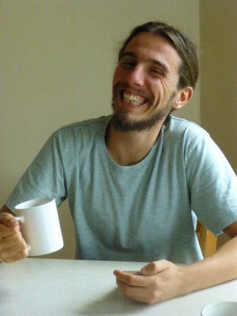

  Jos
- 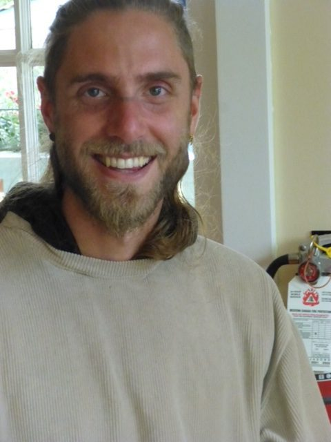

  Dimitri
- 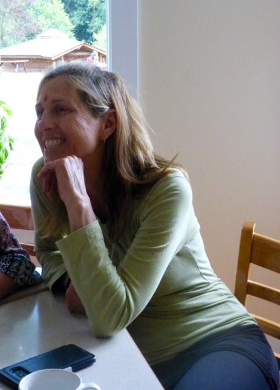

  Lynn
- 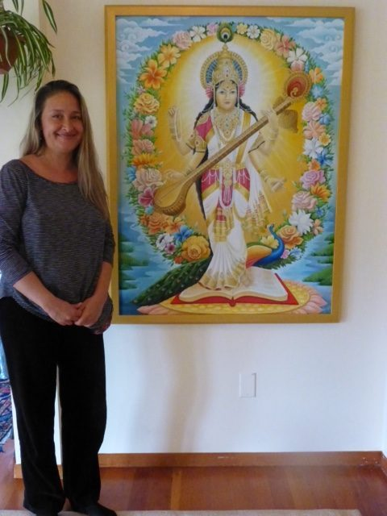

  Irina by the Saraswati painting she made
- 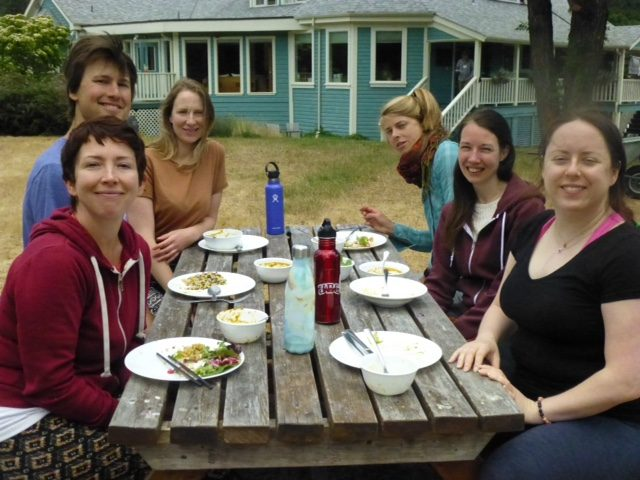

  Courtenay, Brandon, Rana, Dottie, Cara, Laurren
- 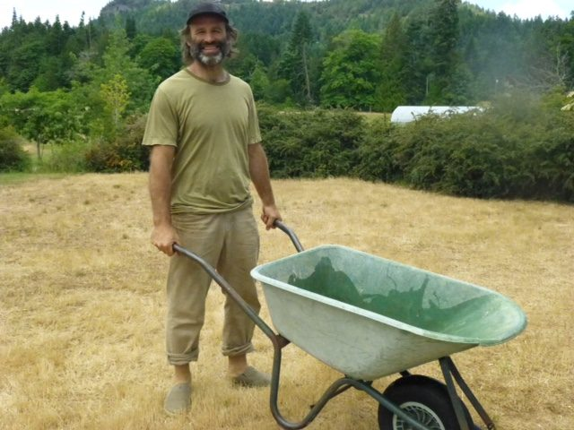

  Raven
- 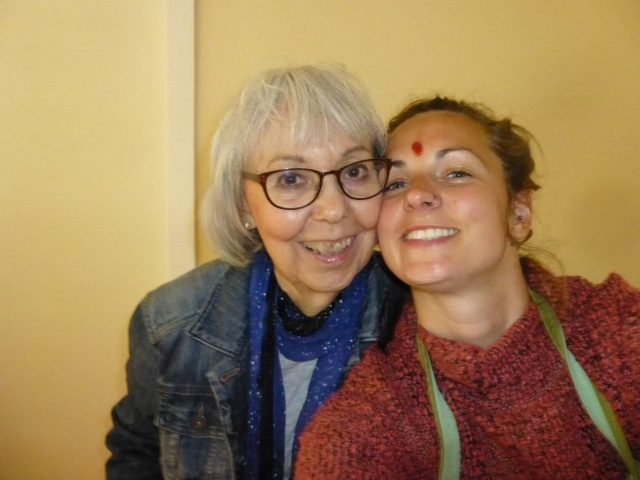

  Sharada & Jodie
- 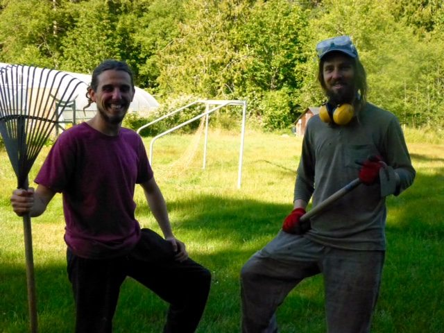

  Jos & Daniel
- 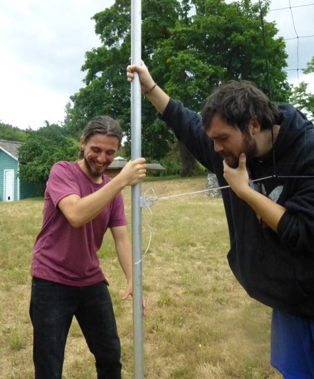

  Jos & Alex setting up the volleyball net

Thanks to Suneel and Daniel, the maintenance team is functioning smoothly, and getting lots done. One of several current projects is sanding and painting the front and back stairs. Adam is away for a while, but will jump back into landscaping, gardening and maintenance when he returns. The office team of Racquel, Janell, Tessa and Hannah have been keeping things running smoothly, supporting programs and rentals, and ACYR.

There is a lot of ongoing activity at the centre: daily asana classes, kirtan on Wednesday evenings, satsang on Sunday afternoons, Bhagavad Gita study group on Tuesday evenings, Yogasutra study class at 2:00 on Sunday afternoons before satsang, at 3:30, and monthly full moon yajnas. Here are some photos of a recent Sunday satsang.

- 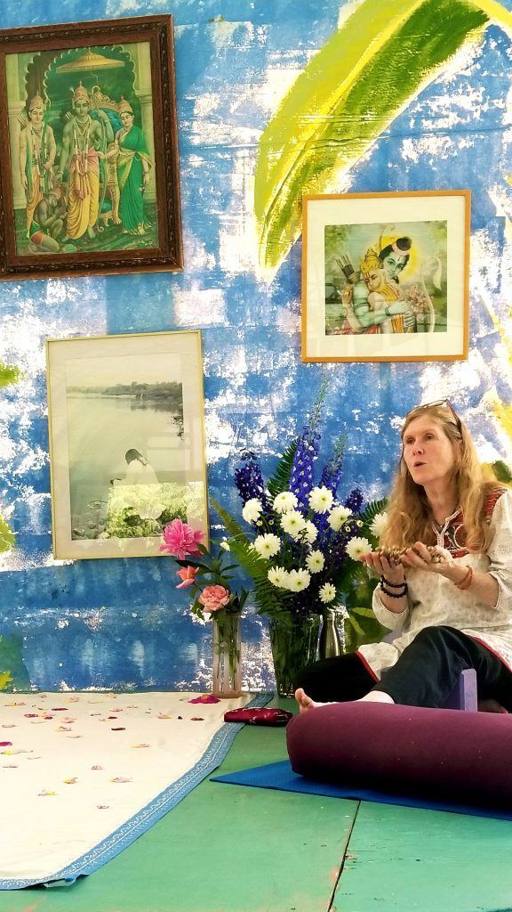

  Anuradha - satsang in the pond dome
- 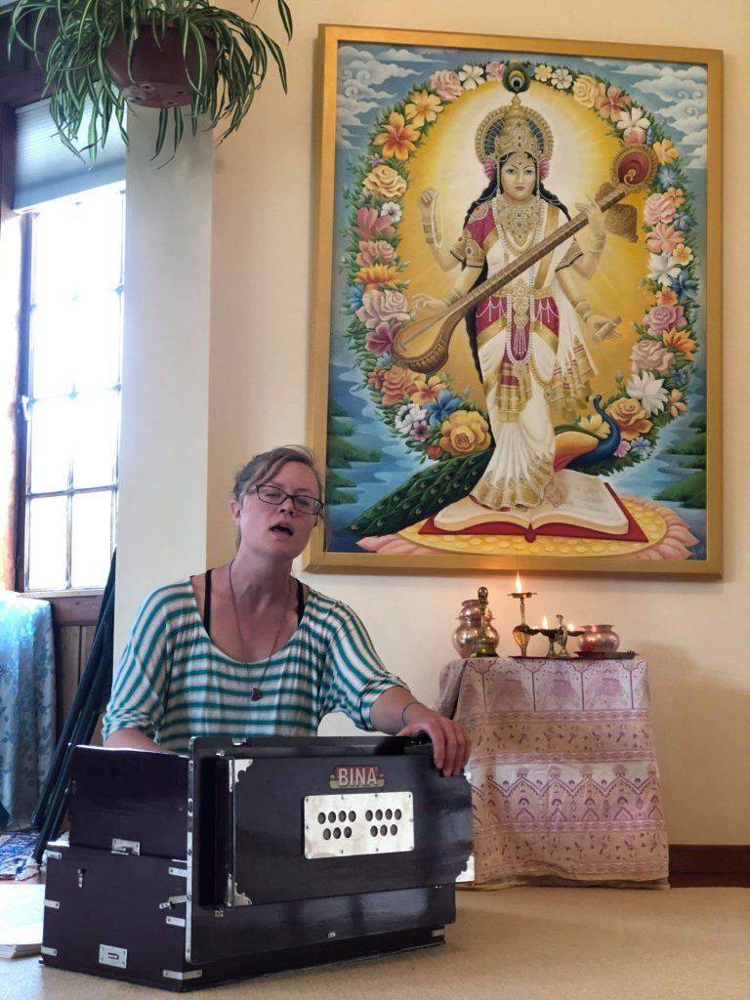

  Johanna Sanjeevani singing at satsang in front of Saraswati
- 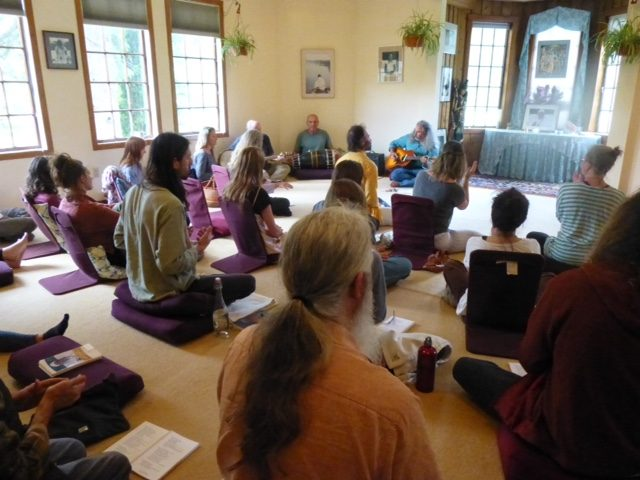

  satsang

The ACYR planning team has been working together to create another great retreat - our [45th annual consecutive community yoga retreat](https://saltspringcentre.com/programs-retreats/annual-community-yoga-retreat/) (ACYR)! Please join us. The theme for this year’s retreat is ***‘Honouring the teacher, finding the teacher within’***. There is something for everyone - morning shat karma, pranayama and meditation, asana classes, lots of kirtan, Latte Da, a great program for kids, evening programs, including Bhakti Night in Canada! - and more. If you haven’t registered, [do it now](https://saltspringcentre.com/programs-retreats/annual-community-yoga-retreat/pricing/). We look forward to seeing you!

Guru Purnima, on the full moon in July, is a special opportunity for us to honour Baba Hari Dass and all spiritual teachers. This celebration will take place on Tuesday, July 16 in the pond dome, beginning at 9:00 am. Observances will include 11 repetitions of the Hanuman Chalisa and a yajna with mantras, prayers and songs in honour of the guru.

Details about Guru Purnima are included in [**Guru Purnima - Honouring the Teacher**](https://saltspringcentre.com/guru-purnima-honouring-the-teacher/). This article also includes teachings from Babaji on the role of the teacher and the role of the student. *All answers are inside us and we have to realize them by ourselves. When one realizes that knowledge can be attained through one’s own sadhana, one’s own Self becomes the guru. Everything becomes clear step by step.*

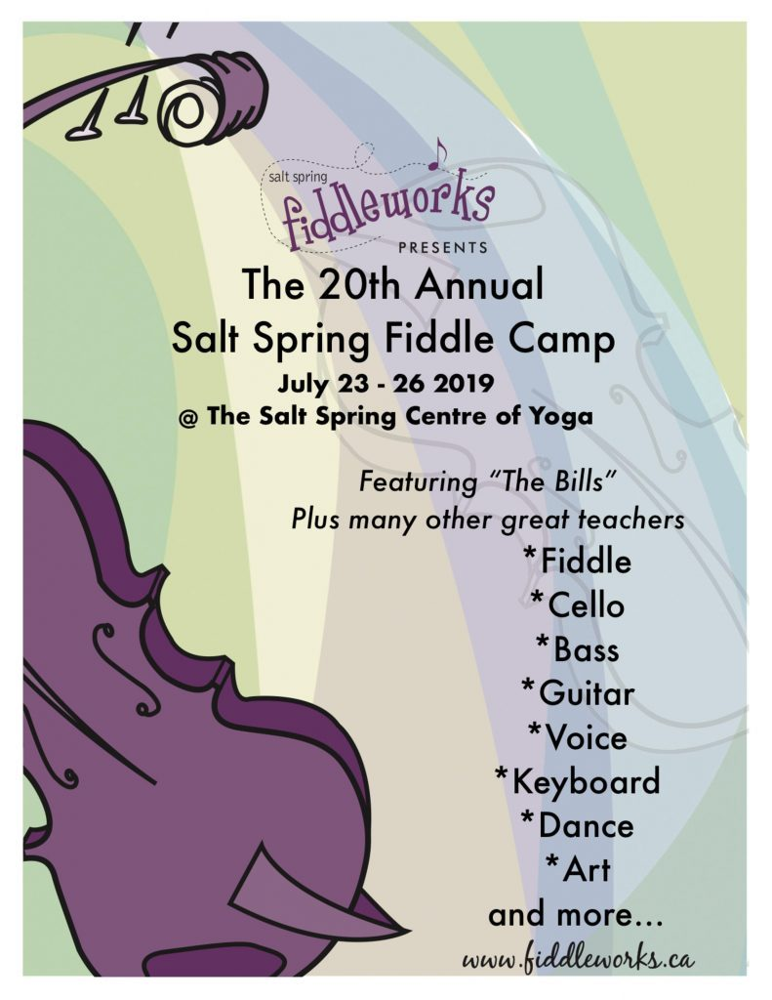

There will be music in the air during the Fiddle Camp rental July 25-28. Interested? Check it out.

Gopa/Gigi Vincentine, a YTT grad 2017 has contributed her story - [**My Journey Inward**](https://saltspringcentre.com/my-journey-inward/). Gopa is a doctor of Traditional Chinese Medicine in Victoria and a yogi who loves Babaji’s teachings and the satsang community. Years ago she began her journey of exploration, searching for answers to the question, “Who am I?” Here she shares her journey - and her gratitude.

As promised, Courtenay Cullen has shared her continuing story - [**A Winter of Loss, and a Spring of Finding**](https://saltspringcentre.com/a-winter-of-loss-and-a-spring-of-finding/) - a beautiful, moving story of loss and love, and the healing power of friendship and community.

*Don’t think that you are carrying the whole world. Make it easy. Make it play. Make it a prayer.* *~ Baba Hari Dass*

Love,  
Sharada
