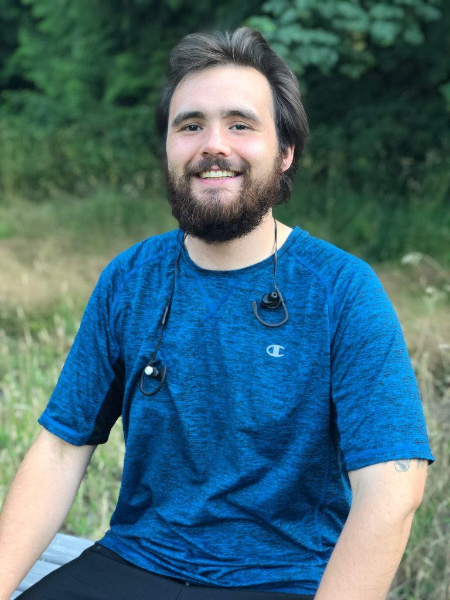

### Interview with Alex Smith by Courtenay Cullen

I’m sitting with Alex in the Nature Conservancy, in the fading golden light of a summer’s evening, at his favourite bench. He spends many quiet evenings at this place, and we all know he can often be found here after dinner, in quiet contemplation. I tell him it would be nice for the readers of our newsletter and members of the wider satsang to get to know the invaluable members of our residential community - the folks who have boots on the ground and are keeping the Centre’s busy summer programs running smoothly. Alex is certainly one of these people - having been hired as a Lead Cook, but being without a Kitchen Coordinator in place for nearly three months, ended up taking on a lot of the duties of this position himself, including ordering supplies from several suppliers on and off the island, as well as working many extra hours to keep us all fed, before reinforcements arrived mid-June in the form of new Karma Yogis.  

I ask Alex what has changed for him since starting his time here at the Centre. He says that it hasn’t been perfect, and of course there have been ups and downs. Then he looks at me directly in the eye, and says “But, I can honestly say I care about myself for the first time I can ever remember.” And he describes being helped along the way to this miraculous transformation by a couple of events that sounds like miracles themselves. And he was not always a person who believed in things like miracles. 

Prior to coming to the Centre, and as recently as December 2018, Alex describes himself as a very different person than the smiling, friendly man who sits relaxed beside me today. He says back then he was very angry, bigoted, and tended to get in a lot of fights. When asked what changed, he replies matter-of-factly, “I got smacked by God and told to smarten up.” 

Enter miracle number one. 

“It was a couple of days before Christmas,” Alex recounts, “I was partying with some friends, and my friend who owns the house said he was going to have a gay friend come up, and he asked me not to start anything or cause any problems.” He explains that he was well known for taking issue with people’s sexuality. “I was sitting there fuming,” he says, and notes that the gay man kept his distance, having also been warned about Alex. A tense situation. Then, suddenly something in the room shifted. “And this girl, off to the side, I actually don’t know what she was talking about, but she said ‘God doesn’t work miracles anymore.’

And at the same time, this man and I got up, and hugged each other, and *I had no more hate*. It was gone!”  He snaps his fingers, and makes a sound like a bomb exploding. “So, yeah, the foundations of my life all started shifting at the same time.”

Alex then speaks of the time that came after, following this strange moment of healing, “I’d always felt this calling, for years and years and years...but I would always just get too worried.’ But it seems this time, he was ready to hear it, and act on it. “It was definitely a spiritual calling. It was like - I needed to find somebody to teach me.” And so he started to search for volunteer programs to apply for, at different ashrams and spiritual centres across Canada. The Salt Spring Centre of Yoga was the first and only program to respond to him, essentially making up his mind for him, and what his next move would be. “I needed to give up the hate first, and that went away,” he says, and now he was ready for the teaching. 

He arrived at the Centre on April 17, 2019. During his time here, he has become known as somebody who is always willing to offer his time to help others out. In his time off from his work making everyone nutritious food, he can often be found working for free on other residents’ cars, a much appreciated ability in a place where there is not too much pocket money to spare for most people. My own little moment of this was recently when I got on my bike (actually a Centre bike), ready to head out to the cabins, and found the wheels would not turn. I couldn’t figure out why. Alex somehow saw this from the deck outside the program kitchen, and called over to me, “Everything ok??” I let him know what was happening (or not happening), and indicated I would walk for now, as I was in a hurry. By the time I came back to the house, he had already checked, located the problem and fixed the bike. You might call this Karma Yoga in action. 

Miracle number two happened right here on Salt Spring. Alex describes a moment not too long ago, when he was sitting on a stool at TJ Beans, a coffee shop in the heart of Ganges. He was nursing a sore back that had been plaguing him for the previous week, so acute it was forcing him to hunch over when he walked. Suddenly, the words of the people surrounding him in the busy cafe began to knit together - one phrase from a person on his left, followed by another from a person to his right, and so on - to form a narrative, or perhaps more fittingly, a message.

What Alex heard was this: 

“Everything is fine,

Trust the process,

Lean back…

We have you…”

On hearing this, Alex says he could very clearly envision himself on his stool, leaning back, and letting himself fall backward. In his mind’s eye he saw hands reaching out to hold him, and catch him. Encouraging him to let go. And so he did. He leaned his stool back, and, to his surprise, he fell crashing down to the floor. "But the best part was", a funny smile on his face, "which really weirded me out, was that nobody looked...in the whole crowded coffee shop.” He says, “I sprang up really fast, all embarrassed, [thinking] ‘this is what happens for trusting the process, I’m never listening to the voices in my head again.” He found a different chair, making a point of selecting one this time that had a back rest. And the same thing started happening again, he says. “Lean back, lean back…” and when his back hit the rest on the back of this second chair, he says “I realized, “my back doesn’t hurt anymore.” 

 “I feel like I’m enough. I feel content. It goes away sometimes when I’m not thinking about it, but it’s still there. That I attribute solely to this place, the teachings of it.” When I ask, Alex describes three teachings that have particularly resonated for him since being here. The first is a quote from Thich Nhat Hanh’s The Miracle of Mindfulness, called “Washing the Dishes to Wash the Dishes,” which somebody wrote out and hung up near different dishwashing areas at the retreat. It tells us that if we wash the dishes only focused on the cup of tea that comes afterward, we are not giving our full attention to the moment at hand, and we are therefore not truly alive during this moment. We have given away the gift of our true presence. I nod knowingly when he tells me this, as this particular teaching has stayed with me since my own teacher training in 2015, when I was first given this book of simple truths. The second, he says is Babaji’s description of Selfless Service, a copy of which he is thankful lives on the fridge in the Program Kitchen. In this one, which many of us may be familiar with us, Babaji discusses the nature of Karma Yoga, or selfless service. The third is a copy of a personal treatise called “Walking Without Fear,” which someone has stapled to the Karma Yogi bulletin board near the cubbies in the basement of the main house. He doesn’t know who the author is, but he has read it over and over, and internalized its message. I tell him I know who its author is, as we were lucky enough to hear her read it at last year’s ACYR Open Mic night at Latte Da. It is by the lovely soul we know as Pratibha Queen, and I tell Alex he will have the pleasure of meeting its author very soon, when she comes up to visit from Mount Madonna, and to share her deep knowledge of Ayurveda. He smiles, and shakes his head as though perhaps this is another small miracle. And maybe it is. 

“Wow, I care about me. That’s neat!” And “My parents are the best people I have ever met.” 

“Slow down! Slow down! Slow down!” “I’m learning here that it's fine, to just chill. It’s neat because now I can see what I’m doing, and I am holding onto my energy a bit more. I still put everything into whatever I’m doing, but without the perfectionism.” 

---

#### *Contributed by Courtenay Cullen*
