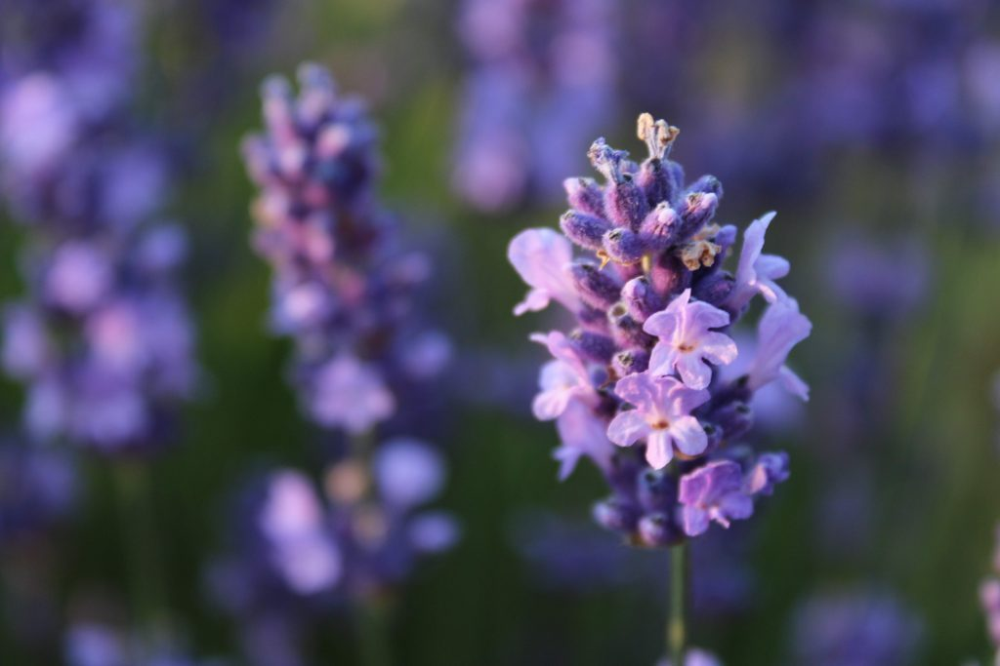

*Everyone is God speaking. Why not be polite and listen to him?**~ Hafiz*

Dear friends,

ACYR is happening now!

[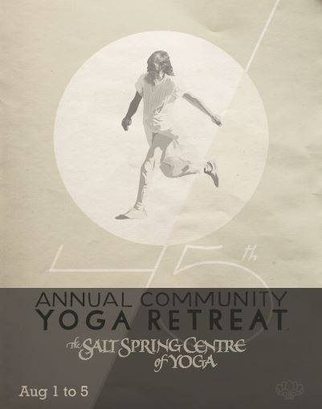](images/112efaa0_ACYR-Poster-2019.jpg)

Today is the first day of our [45th consecutive Annual Community Yoga Retreat](https://saltspringcentre.com/programs-retreats/annual-community-yoga-retreat/)! The theme of this year’s retreat is Celebrating the Teacher, Finding the Teacher within. We look forward to seeing many of you here over this long weekend. We’re expecting a lot of people, and more children than ever before. Some of their parents used to come to this summer retreat with their parents, and now they’re here with their children. Class offerings, kirtan, fun, connection - hope to see you here!

# Life at the Centre

Life is in full bloom. As always, there are many wonderful karma yogis & volunteers. Here are some photos of ongoing community life at the centre. Some of these folks will be leaving later in the month, and a new group will arrive for our Residential Karma Yoga Program. We are grateful to all of them for all that they bring.

- 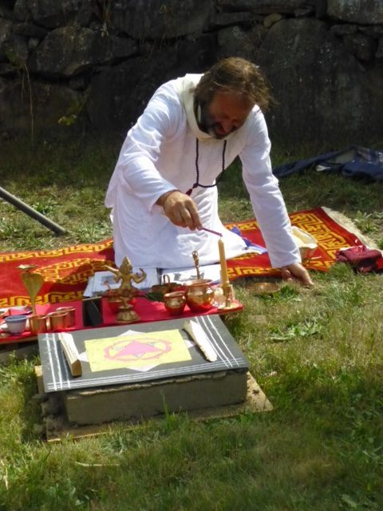

  Raven - puja in the garden
- 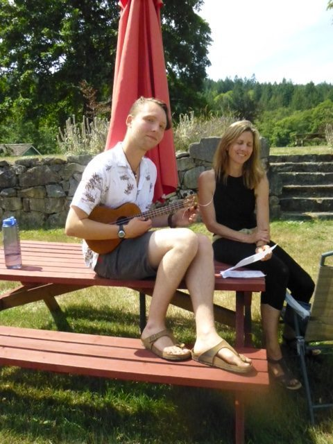

  Kai and Lynn
- 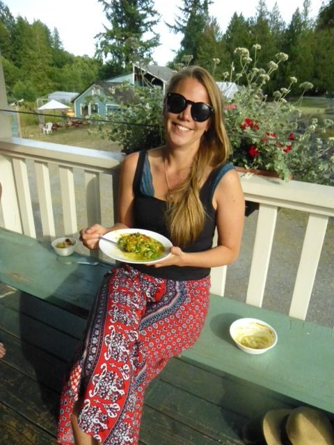
- 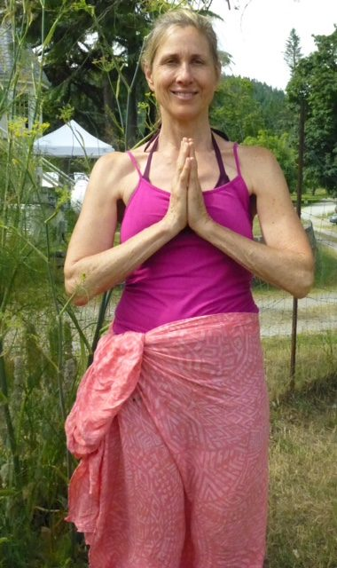

  Lynn
- 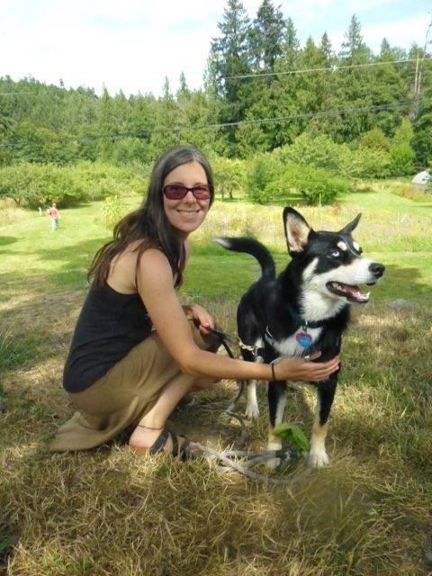

  Amy and Asha
- 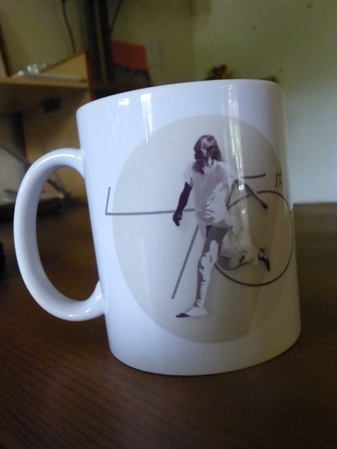

  new mug for ACYR
- 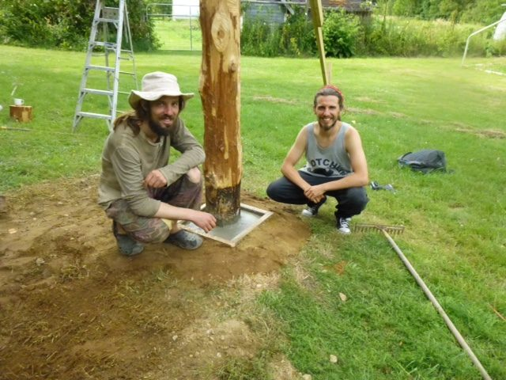

  Daniel and Jos - finishing touches on the clothesline pole
- 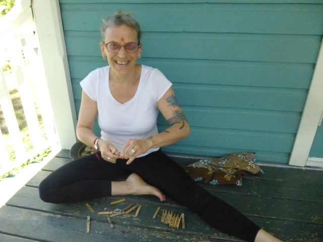

  Arron repairing clothespins that had come apart
- 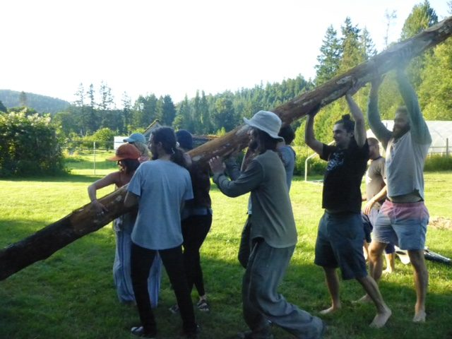

  pole raising (for Sharada's clothesline)
- 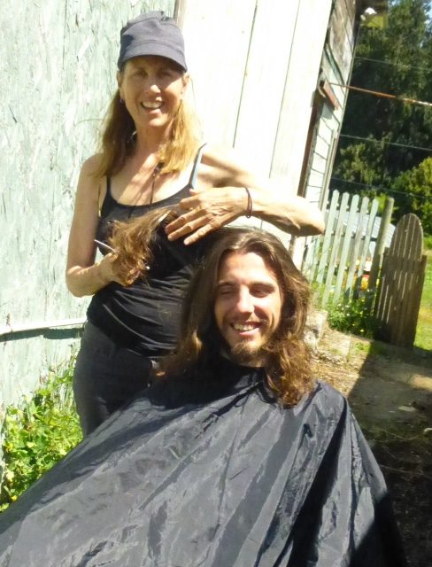

  Lynn trimming Jos' hair
- 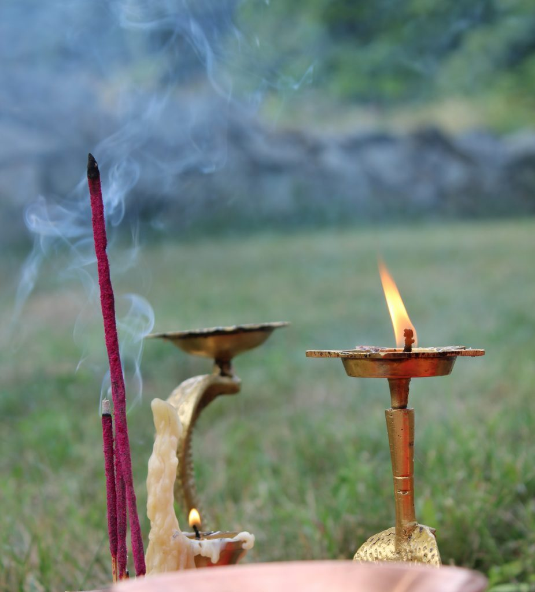

  candle and incense

Every morning begins with arati at one of the temples for those who choose to begin their days with ritual and prayer. Ongoing study and practice continues: kirtan on Wednesday evening, yoga sutra study with Yogeshwar on Sunday afternoon, followed by satsang, and of course daily asana classes. Work, study, practice and play weave around each other.

Later this month the second session of YTT will begin, culminating in a talent show for YTT students and karma yogis, followed by the graduation ceremony of 21 new yoga teachers the following morning.

# Coming up in the fall

There are several inspiring programs coming up this fall. On the weekend of September 6 - 8, Chetna Tracy Boyd will be teaching **Yoga for Cancer**, a workshop for yoga teachers.  On September 27 - 29, Alan Shankar Martin and Tanya Garland will offer a **Jnana Yoga Retreat, Awakening through Understanding**. In late fall, November 22 - 29, the Centre is introducing a **Going Deeper Meditation Retreat**. This program offers a small group experience devoted to a deeper level of meditation practice. **Yoga Getaways** and **Personal Retreats** provide other popular ways to take part in life at the Centre. You can find more details about all our programs under the heading **[Programs and Retreats](https://saltspringcentre.com/programs-retreats/)** on the Centre’s website.

# Some reading for you

Courtenay Cullen is becoming a regular contributor to this newsletter. This month her focus is on life in the Centre’s residential community. She recently interviewed Alex Smith, a  lead cooks in the Centre’s kitchen. Alex has gone through a big transformation in the past few months, which you can read about in [**Making Space for Miracles**](https://saltspringcentre.com/making-space-for-miracles/).

Why do we get stuck in our judgements? We want what we like, and we definitely don’t want what we don’t like, but life continues to provide all kinds of experiences, both joyful and painful. How can we live in peace with whatever life brings? [**Stand in the World Bravely**](https://saltspringcentre.com/stand-in-the-world-bravely/) explores how we can shift our view.

*You are in bondage by your own consciousness and you can be free by your own consciousness. It’s only a matter of turning the angle of the mind.  ~ Baba Hari Dass*

Love,  
Sharada
