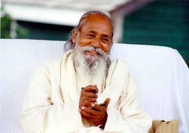

*This is life. It includes pleasure, pain, good, bad, happiness, depression. There can’t be day without night. So don’t expect that you or anyone will always be happy. Stand in the world bravely and face good and bad equally. Life is for that.*

It takes effort and practice to accept all the faces of life. We have strong opinions; we like some things and don’t like - maybe even hate - other things.  We like the things that feel good, but even the good stuff isn’t great if you have too much of it. You eat a delicious meal - wonderful! It was so good that you may decide to have more - and then dessert. Then you have indigestion. 

*In our everyday life we identify things as good or bad. If something doesn’t support our ego the mind labels it as bad, and if it does support our ego the mind says it is good. Our ego, depending on our likes and dislikes colours every object, thought or idea and gives judgement accordingly.*

Sadhana (spiritual practice)is a process of dismantling the stories we have about ourselves and the world. There will always be stuff we don’t like; life is like that. The problem is that we tend to dwell on what we don’t like, and talk about it. All this stuff I don’t like is happening to ME, and I want you to know how upset I am about it! I may do that by blaming you, or maybe I’ll blame myself and tell myself I’m hopeless. The result is anger or depression.

If we can step back from our thoughts and opinions our view expands and we can see life differently, without the colouring of the ego.

 “ A human being is part of a whole, called by us the Universe, a part limited in time and space. We experience ourselves, our thoughts and feelings, as something separated from the rest, a kind of optical delusion of consciousness. This delusion is a kind of prison for us, restricting us to our personal desires and to affection  for a few persons nearest to us. Our task must be to free ourselves from this prison by widening our circle of compassion to embrace all living creatures and the whole of nature in its beauty.” ~ Albert Einstein.

*You are in bondage by your own consciousness and you can be free by your own consciousness. It’s only a matter of turning the angle of the mind.*

What can you do to  let go of the grip of your own tightly held opinions? Watch your thoughts.  Notice what happens when things don’t go your way. Of course you want things to turn out in a way you like; we all do that. But life doesn’t always turn out the way we want. Life is never going to give us only the “good stuff”. 

Pema Chodron says, “The truth you  believe and cling to makes you unavailable to hear anything new.”

The Dalai Lama adds,  “Nothing in the world can bother you as much as your own mind. Others seem to be bothering you, but it is not others; it is your own mind.”

Shifting from a negative to a positive outlook requires a willingness to examine other possibilities. What if what you think isn’t actually true? Holding onto what you want and avoiding what you don’t want creates a vise around your heart. To loosen that grip the cultivation of an attitude of neutrality, or equanimity, is recommended.

*Neither hanker after the objects that give experience of pleasure, nor shun those objects that cause pain. Allow them to be as a matter of course; then one can achieve equanimity.*

A Zen master advised a person who was mired in unhappiness to repeat the following mantra: “Thank you for everything. I have no complaints whatsoever.” If you can say this and mean it, it can change your life. Gratitude is always a choice. 

---

*Contributed by Sharada*

*All quotes in italics are from writings by Baba Hari Dass.*

---

**Sharada Filkow,** a student of classical ashtanga yoga since the early 70s, is one of the founding members of the Salt Spring Centre of Yoga, where she has lived for many years, serving as a karma yogi, teacher and mentor.
