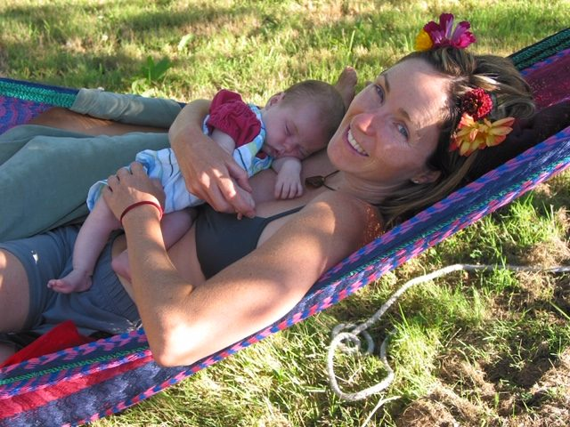
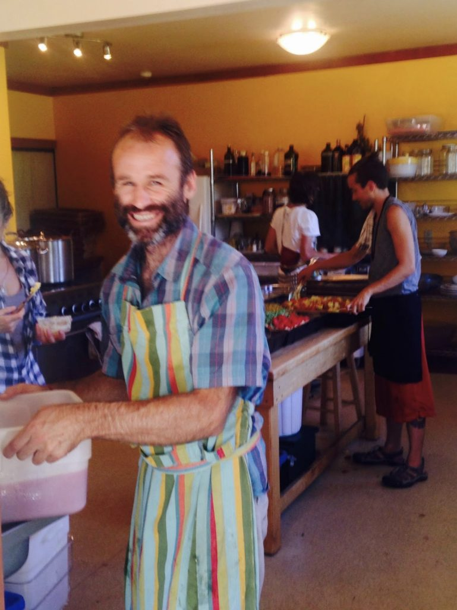
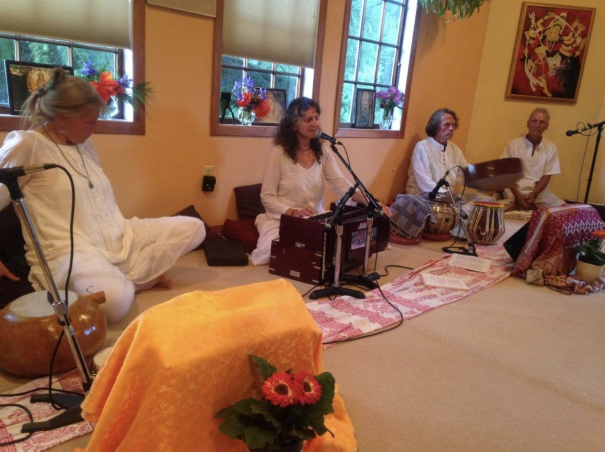
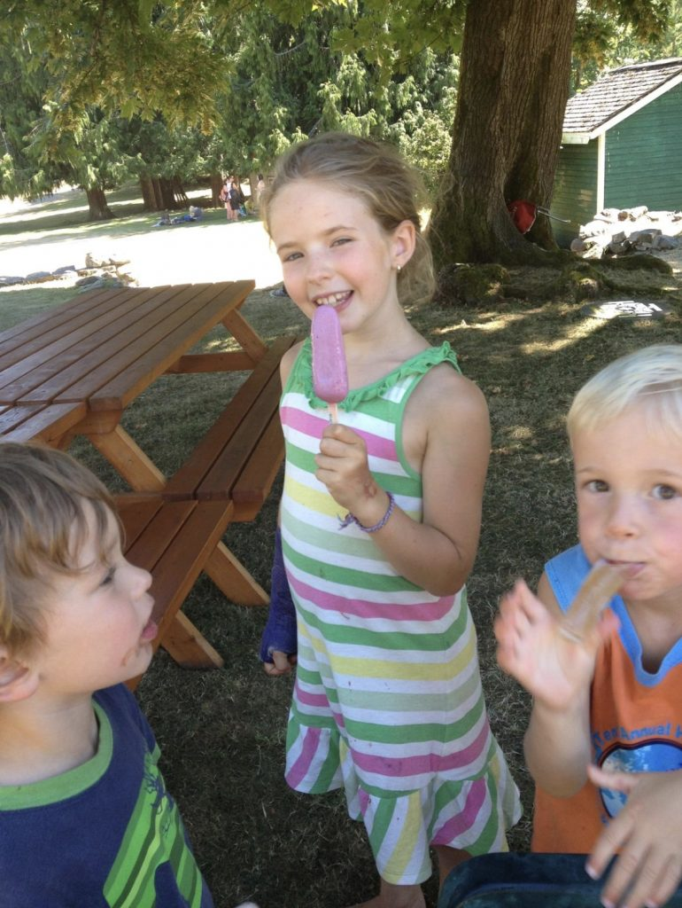

Carolyn and baby Sierra, 2004

Over 23 years ago I discovered the centre. During those years of being a visiting student on the land Babaji was the pivotal focus of all activities and learning. Many of us would follow him around while he instructed and/or built the beautiful rock walls and temples. Babies, children and adults would gather around him on the mound. Candies would fly through the air into the hands of waiting children or be laid gently into the hands of children who weren’t ready to catch them. The energy surrounding Babaji was so fascinating to me. I sensed a seriousness to his demeanour, but then the laughter, smiling, sharing and teaching always became the takeaway from any time in his presence. I worked hard on my practices, I struggled with many of the teachings, and I always felt like I had to work harder on my commitment to his teachings and to his motto :

*“Work honestly, meditate every day, meet people without fear, and play!”*

Now as I navigate life into my early 50’s I feel deep gratitude, love and commitment to Babaji’s teachings, to the centre, and to the elders who created this incredible, peaceful place of learning.

Now when I arrive at the centre, the offerings that provide me with the deepest sense of groundedness and meditation is morning temple offerings with Raven and Kirtan offerings of any kind. The singing is what opens my heart and allows me to become aware of whatever it is that I’m feeling or struggling with.

Raven

kirtan

My dear friends at the centre have created an opportunity for the satsang community to contribute, so I now visit 3-4 times per year and help out with whatever needs doing. I hope to continue being able to touch in and practice the path of peace on the land.

My practice is to love and accept myself, and my “vehicle” for this practice is selfless service.

Sierra

My daughter Sierra has been attending the community retreats since she was born in 2004. I got pregnant during my Yoga Teacher Training the previous year. Sierra loves the centre and the community that she has grown up with. It is only once a year but at the age of 15 years old she is still very excited to attend the retreat and help run Latte Da café. When Sierra was 8 or 9 it was a great blessing to us that Sid, one of the founders of the centre, asked Sierra to help him prepare the bagels. While I was in the morning classes she would get out of her tent and walk to Latte Da and order her breakfast. One morning Sid gifted her a t-shirt and offered her a job! She has said that she plans to visit and help run the retreat at the centre for the rest of her life.

I could continue writing about my cherished memories, lessons, epiphanies, excuses and potential distractions that might take me away from going to the centre, but I will end my little story with a wonderful quote from Babaji:

*“If you work on yoga, yoga will work on you.”*

Om  
Carolyn McBain
