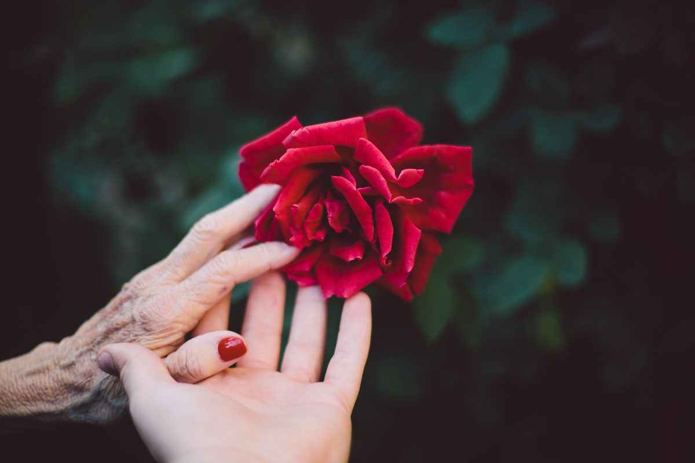
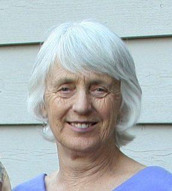

One early morning in the not too distant future, you’ll stumble into the bathroom and catch a glance of someone in the mirror who looks somewhat like yourself, but older. Even OLD! And on second glance, you’ll realize it’s your reflection - what a surprise! Or perhaps you’ll be walking downtown, past the huge plate glass windows that grace the front of all the boutiques and see an old person walking along there before realizing: It’s My Reflection! 
Ye Gods! You might find yourself thinking, “How did I get so old?” For me, the moment happened quite a few years ago when I decided to join ‘the older ladies’ after Yoga Sutra class with Babaji at MMC. They regularly gathered after class to eat their breakfast together, and share reflections on the sutras, stories from their lives and so forth. As I walked into the Far East Dining Room to join them, my mind said “I think I’ll join the older ladies for breakfast,” and then my mind reminded me of the implication - “This must mean I’m ready to ready to become one of the ‘older ladies’!”

# Organ Recital

One of the first things in any conversation of elders is the organ recital. As Babaji reminded us in the Ramayana, “You never know which part of the body is going to give out next.” And give out they do! If it’s not the digestion, it’s the knee. If it’s not the lower back, it’s the itchy skin or the persistent cough. And as we relay these to each other, of course, out come the suggestions: “Have you tried this?” “I heard such-and-such worked for so-and-so.” 
And this may take some time, depending on the number of people and the time of the year and the conditions that arise.
And yes, the body does begin to weaken as the years go by. And this aging body can be more demanding; it needs more sleep, more time to tie our shoes, a new pair of glasses, perhaps a hearing aid, or it requires surgery for hip or knee or back, or more vitamin and herbal supplements. Perhaps we learn to depend on others for things we used to do for ourselves – like wash the car or clean the bathtub.
But many of us subscribe to the theory that ‘there are really only two alternatives: older or dead.’ And most of us, since we still have a choice, will choose older - even as the organs give out and need to be replaced.

# Feeding Ourselves

One summer years ago, Shankar Alan Martin was scheduled to give a talk at SSCY; it was titled something like “How to Change Your Eating Habits while Growing Older.” I wasn’t able to attend his talk because of a prior commitment, so I stopped him earlier in the day to let him know I wouldn’t be able to make it. He was kind enough to give me his six-word summary: “Increase the Quality, Decrease the Quantity.”
These six words are actually enough to address many of the changes in eating habits that are needed as we age. The body’s metabolism slows down during this vata stage of life. We’re also likely to be less active; thus fewer calories are needed, so decreasing the quantity makes sense. Michael Pollan also says it succinctly: “Eat food, mostly plants, not too much!”
At the same time, we also need to boost the quality – eating fresh, organic food in season,  cooking with loving attention, and eating mindfully. Organic and fresh will guarantee the highest quality nutrients; cooking for ourselves and others is a delicious way to share the bounty; and eating mindfully (following a prayer or a moment of silence) will support a strong digestive fire. 

# Giving up Stuff

There are two aspects of Giving up Stuff: the actual material stuff (which we needed while raising children or pursuing our career but now no longer need, yet are still attached to) and then there is the giving up of out-moded *vrittis* (thoughts, feelings, memories, dreams and reflections) that no longer serve us. 
During our years raising children and working in the world, we needed to maintain more of an external focus. We needed a plethora of material objects to sustain our families: children’s books and toys, for example, and implements of our trade or profession. These can all go now; they are no longer needed. But parting, as Shakespeare tells us, is such sweet sorrow, and many of us struggle to divest ourselves of these items. It can take strength of will to pass along the household items that we’re no longer using or to toss our professional papers into the Recycle Bin, and yet . . . why not? We’re likely to feel lighter and less burdened when we can let go of these ties to the past.
Releasing them, however, brings its own sense of loss: loss of connection to our role as parent, to our youthful appearance and/or abilities, to our sense of ourselves as a member of the workforce. All of these must go, and become simply memories, fond remembrances of an earlier part of our lives.

# And then there’s the Death Part

Aging means that we are edging closer to death with each passing day. The good part: we’re still alive! The other part: we’re going to die! There is a part of the mind (for me at least) that doesn’t quite believe it; other people die, not me! Having never experienced my own death before, it seems a little unbelievable that I could die. And life goes on? Yup! Seems that way. So many in our community have left us, including of course beloved Babaji, and still Life Goes On - with all its many joys and sorrows. 
Having to integrate all these thoughts and feelings is definitely a work in progress - and progress we do, whether we want to or not! One thing that’s helpful is talking about it with loved ones. Even preparing a Will, and an Advanced Directive form, and a Five Wishes form, helps us think and feel our way through the Death Part. I’m preparing a notebook for my daughters, complete with passwords and poems, bank and credit information, as well as a myriad of other details that may be helpful to them as they look after ‘my affairs.’ Attending to these details before our passing helps keep the whole process in perspective. 

# What’s so Glamorous about Aging?

Recently, I came across some notes (note: this is one advantage of keeping things!) from a never-written article, dated 1981. It was entitled “What’s so Glamorous about Aging?” These five lines sum up the other side of the aging picture:
“Developing positive qualities of mind.
Shining the love-light that is God.
Helping your friends.
Learning to relax.
Giving up your senseless notions about it all.”
That’s where I choose to dwell these days, reminding myself that this life is simply one of many, of little consequence in the grand scheme of things . . . and yet, ours to shape as best we can, using the vehicle of an aging body to further this extraordinarily precious journey as a human being, endowed with consciousness, with light, and love, and the ability to share all that with one another! 
-Pratibha Queen

---

**Pratibha Queen** is an Ashtanga Yoga instructor and Ayurvedic practitioner who lives in Santa Cruz. She is a member of DSS who attends Salt Spring Centre of Yoga retreats on a regular basis.
\*\*\*
*Top photo by [Jake Thacker](https://unsplash.com/@jaketthacker?utm_source=unsplash&utm_medium=referral&utm_content=creditCopyText) on [Unsplash](https://unsplash.com/s/photos/old-hands?utm_source=unsplash&utm_medium=referral&utm_content=creditCopyText)*
