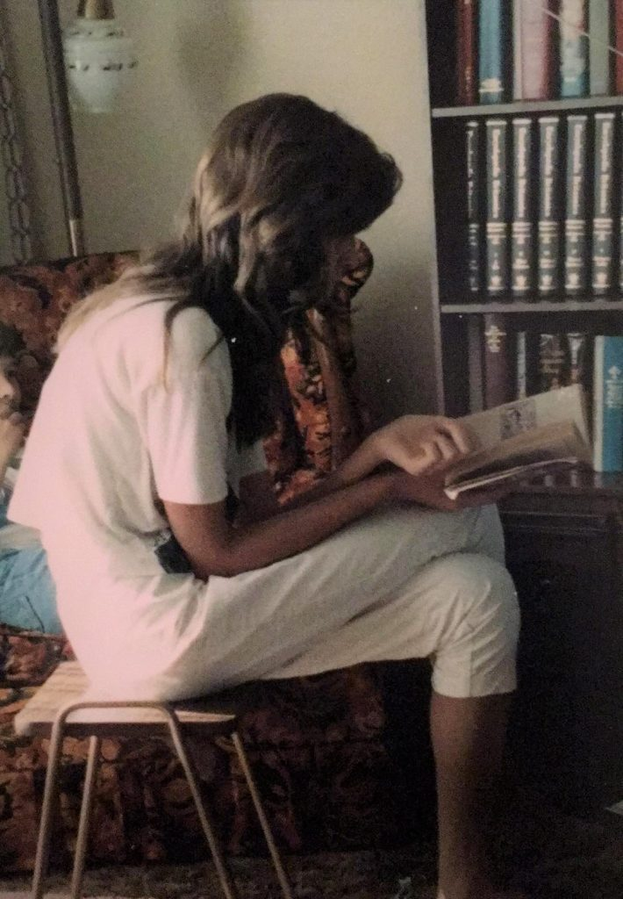
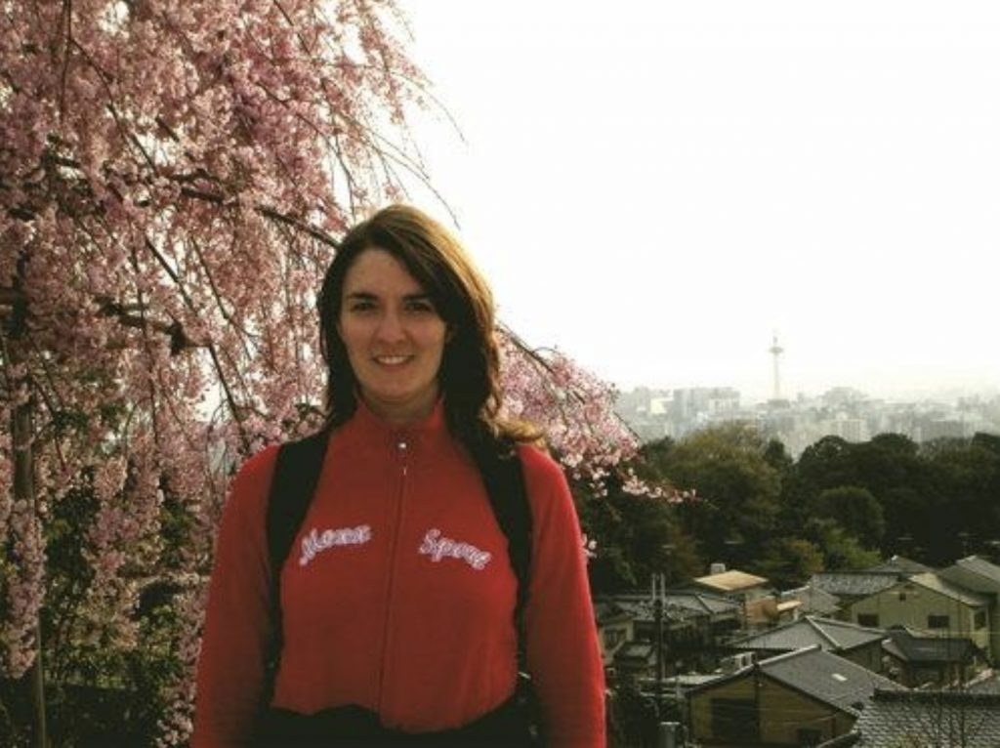
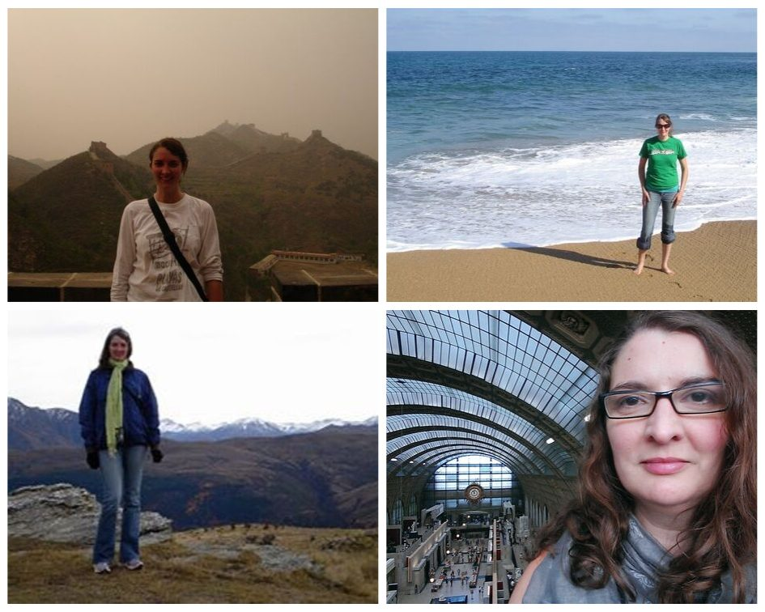
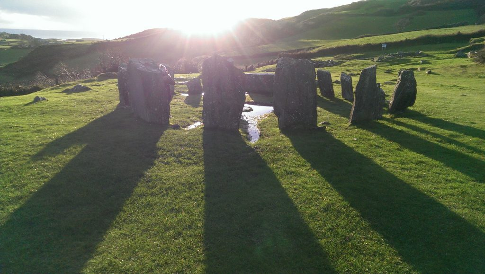
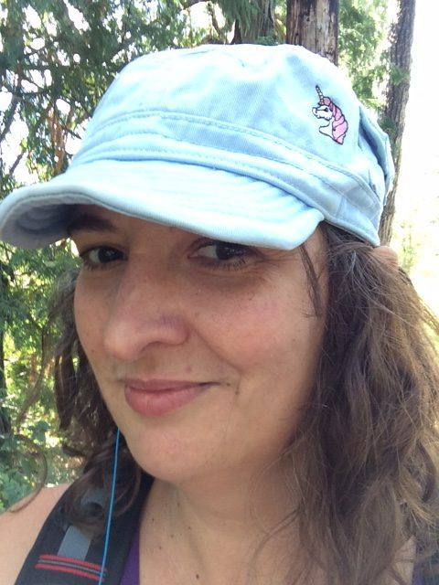

Before I lost sight of my true self

I haven’t always been a seeker. In fact, “runner” would have been a more accurate description. I started running as early as I can remember.

When I was young, there wasn’t really any place I could run to, so I ran within.

As a kid, I was a daydreamer. A hibernator. A compulsive reader. A hider. It’s how dealt with a world that seemed too unfriendly, overwhelming, and confusing. While I’m a natural introvert, I took solitude to the next level.

When I couldn’t deal with unhealthy family dynamics, I would burrow in my bedroom – napping, reading, playing music – blocking out the world outside my bedroom door.

When I felt like I wasn’t accepted for who I was, I lost myself in stories, movies, or fantasies of a different, better life.

When I was unable to buy-in to the strict Christian upbringing I was raised with, I stuck my spiritual head in the sand and avoided the very consideration of my soul.

I buried, avoided, and dodged with the best of them.

Hiding in the pages of a book

When I got older, graduated high school, and had the freedom to leave it all behind – I did.

I moved away from the stifling small town where I grew up and started over. It was my first experience in *truly* running away.

It was miraculous – at least, temporarily.

I was re-energized, newly motivated, and felt free to re-invent myself and leave my old, sad self behind. I made new friends, learned to challenge the beliefs I was raised with, I sought help for some of my nagging mental health challenges, and I learned to connect with my body, mind, and spirit in a new way through the physical practice of yoga.

And still, I avoided the deeper questions posed by my soul. The unhappiness and avoidance crept back in.

But I always remembered how great it felt to start over.

Following college, I rarely stopping running. I changed jobs, I moved cities, I changed apartments, and I ended relationships. Once I saved enough money and got tired of running in place, I realized my dream of escaping to far-flung, exotic places.

First I fled to Japan.

It was exhilarating. I was fascinated with an entirely new culture, learned to challenge many of my old belief systems, and processed some of the old wounds, and discovered a taste of inner peace though the (intermittent) practice of meditation.

Shortly after my arrival in Japan

But the peace didn’t last. Old patterns and habits emerged and new challenges popped up. I crashed in rather spectacular fashion and returned home after only 6 months, suffering a profound period of depression and anxiety - believing that it was my destiny, my brain chemistry, my weakness of character that would forever curse me to be unhappy and unhealthy.

But once again, I couldn’t forget about the excitement of starting fresh in a new place – surrounded by new and interesting people – and losing myself in the beauty and history of new parts of the world.

Next I ran off to Australia… then New Zealand… then Europe. All interspersed with shorter trips to scratch that travel “itch”.

[Clockwise from top left] China, Australia, France and New Zealand

Despite learning more about myself with every immersion in a new country/city/neighbourhood; learning to heal my body with various natural treatments; delving deeper into yoga through a profoundly-supportive 200-hour and 300-hour yoga teacher training – the desire to run away never left.

After burning out in my career, I vowed to make a change that would give me the time and space to delve to those deeper parts of myself that I had been running from for so many years. It took the form of another move – to Ireland – but this time it didn’t feel as much like running away, as much as it felt like I was running towards myself.

I made my physical, mental, and spiritual health my priority. I took the time to get to know the “me” underneath all of the beliefs I held about myself. I started to view this inner work as a way to strip away unhealthy social conditioning and uncover the true nature of my essential being, instead of viewing myself as someone who was broken and needed “fixing’.  I was able to connect with something beyond my limited understanding of myself and to consider what my soul needed – not only what my body and mind needed.

Magical stone circle in Ireland

When financial and family circumstances led me to leave Ireland before I had planned, I realized that I still needed time, space, and a supportive community to continue my new trajectory of growth.

In a serendipitous turn of events, I discovered a posting for an Administrative Assistant role at the Salt Spring Centre of Yoga shortly after my return to Canada. The job description felt like it was written for me – a perfect match to my professional skills – and I was beyond grateful that I was selected to come to the Centre for the 2019 season.

Despite never having set foot on Salt Spring Island or never having lived full-time in an intentional community before, I felt that the opportunity was too perfect to pass up. I packed my bags and set off for the Centre.

Life at the Centre has allowed me to run toward myself in the most incredible way.

Beyond the beautiful energy of the land, the deliciously-healthy food, and the chance to continue my yoga asana practice, I’ve been blessed to be in a place that allows its community members the space to grow and challenge themselves.

Being surrounded by people who are living examples of love and devotion is inspiring and heart-opening. Connecting with people who are passionate about conscious living and growth makes me feel like I’ve found my “people”. Being giving the opportunity to learn and the time to practice feels like a gift – an opportunity I hadn’t known existed before. Being allowed to challenge and explore my spiritual hang-ups without judgement is allowing me to find the practices and beliefs that resonate with my soul.

Life at the Centre also challenges me to continue growing. When my ego lets me believe that I’ve got it all figured out, it confronts me with a fresh challenge. When my go-to asana practice is unavailable to me due to injury, it provides me with the opportunity to discover new practices. When living, working and socializing with the same people month in and month out, it offers plenty of opportunities to have my shadow side reflected back at me.

I don’t pretend to have it all figured out. Sometimes, I don’t know what to believe, I’m not really sure where I’m headed, and I feel as lost as I’ve ever felt. However, I know that I have glimpsed the path of my authentic path and I know that I will always find my way back to myself.

I’m not sure I’ll ever stop running. As long as I’m running towards myself, seeking deeper connection to my true nature, and sharing that connection with those I meet on my travels, I’m happy to keep running.

I’m so grateful I ran here.

Janell Stuka
