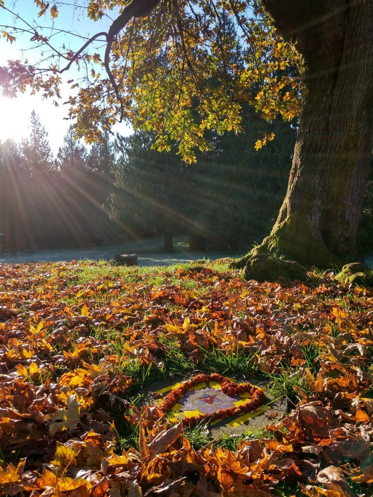
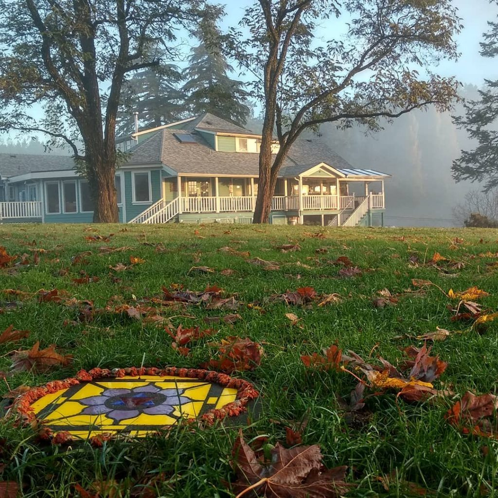
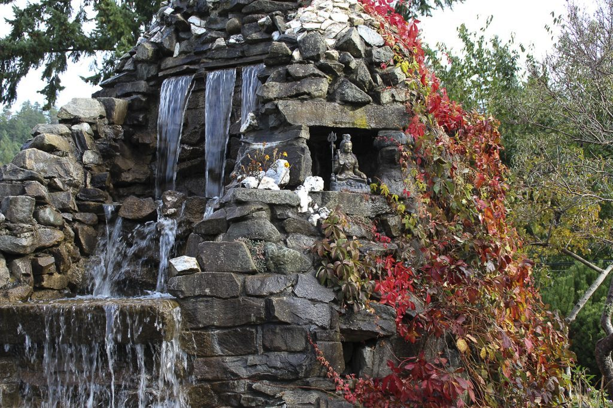
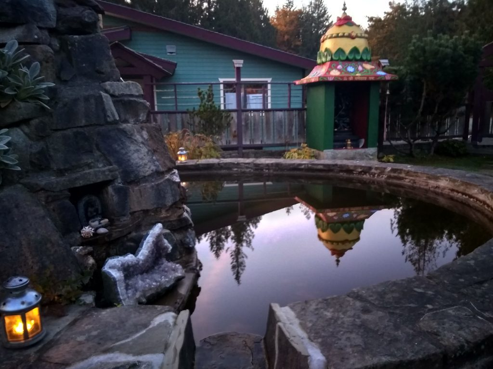
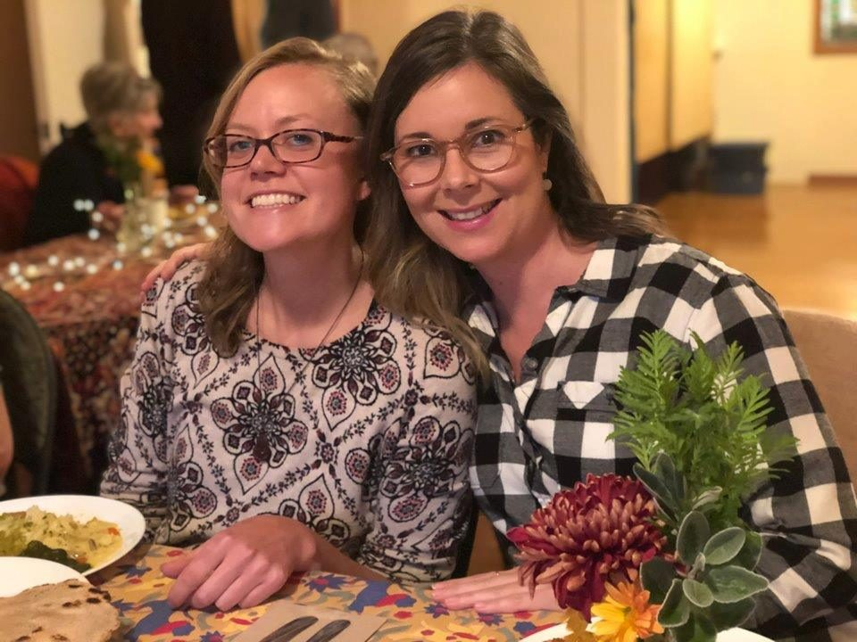
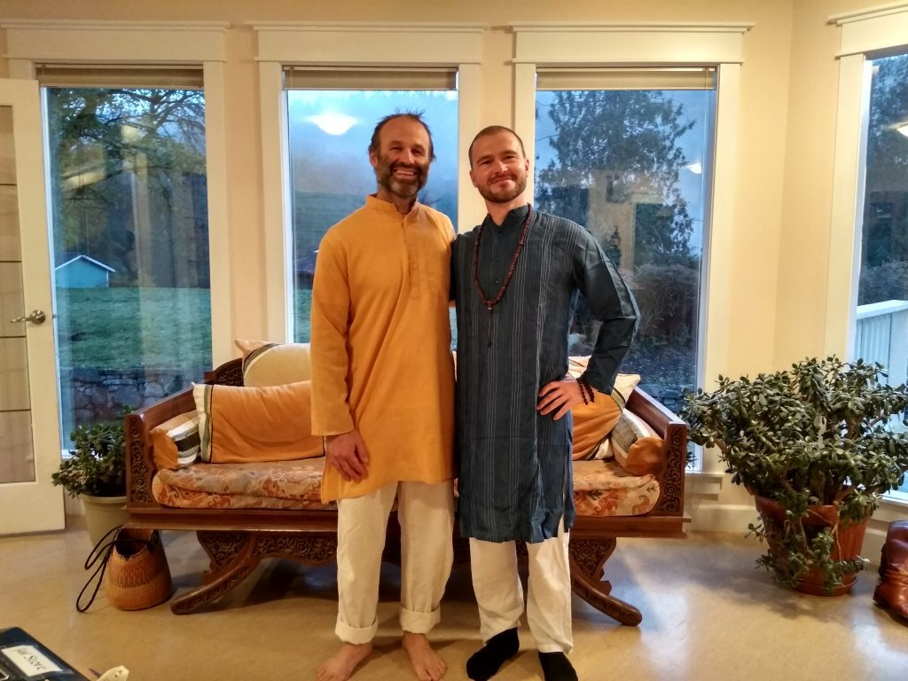

*Even after all this time, the sun never says to the earth, “You owe me.” Look what happens with a love like that. It lights the whole sky.*

Dear friends,

We are in full autumn mode; the days are a mix of sun, wind, rain, fog and mist. The days are getting shorter and the nights longer, and in a couple of days we will be switching back (falling back, moving clocks back one hour) to standard time. Fall is a season of change. The last of the apples and pears have been harvested and transformed into sauce and chutney, and we are still feasting on  greens and squashes from the garden. The many conifer trees that grow here stay green all winter, but the deciduous trees are wearing their red and gold fall finery.

The last of this season’s Residential Karma Yoga Program has ended, and we have have said goodbye (for now) to Tanya, Lynn, Johnny, Nancy, Glendon, Cathy, and Hannah. We are so grateful to all of them, and definitely hope to see them again. We will have a vibrant community staying on through the winter months. Some will be away for part of that time and return in late winter or early spring; everyone who is here forms the hub of an ongoing winter community. There are many conversations underway about ideas for supporting the centre during the winter months.

- 
- 
- 

In addition to ongoing pranayama and meditation, yoga theory classes, including Bhavagad Gita and Yoga Sutra studies, we’ve had a lot of play time and fun this past month. We had a cozy Thanksgiving celebration, with delicious dishes prepared by everyone in the community. So much food! So much gratitude!

We also held a community talent night. Thank you, Cathy, for initiating this and making sure it happened. The offerings ranged from jokes to music, from spoken word to a hilarious skit called ‘Krishna’s Taxi’, based very loosely on the Bhagavad Gita.

A couple of weeks ago we hosted a wonderful evening of Classical Indian Music with Steve Oda on sarod and Niel Golden on tablas. Raven joined them onstage to play tambura. The satsang room was packed with a very appreciative audience. Some people who attended the concert signed up to come to the Indian meal that was served before the concert. The whole evening - dinner and concert - was excellent!

- 

  Johanna and Adrienne
- 

  Raven and Adam
- 

  Steve Oda

Toward the end of this month there was  a silent Zen retreat at the centre. All the karma yogis, whatever their work area, chose  to remain in silence as well when they were in the house - so unifying and peaceful!

On the 27th of October we celebrated Diwali at satsang, beginning with arati and filled with kirtan to Ram, Sita and Hanuman. Diwali is a celebration of light, marking the return of Ram and Sita to Ayodhya at the end of their exile in the story of the Ramayana. Rama represents the Self, the God-principle in everyone, while Sita is the embodied soul, or human consciousness. Hanuman, devoted servant to Rama, is the epitome of faith and devotion, who, along with his army of monkeys, helps Rama defeat Ravana, king of the demons who represents the deluded ego. The people in the city of Ayodhya placed thousands of candles along the path to welcome them back.

We will soon be welcoming Chetna, Yogeshwar and Ramanand back from their celebration of Diwali and visit to Sri Ram Ashram in India.

## Coming up in November

The [Yoga Getaway](https://saltspringcentre.com/programs-retreats/yoga-getaways/) on November 15-17 is fully booked; if you were hoping to come but haven’t registered, it’s still worth calling the office, just in case there’s a cancellation.

The [Going Deeper](https://saltspringcentre.com/meditation-retreat/) retreat on Friday November 22-26 is filling up, but I think there’s still some space. It will be a silent, devotional retreat. You can find the details [here](https://saltspringcentre.com/meditation-retreat/).

## To read

This month’s autobiographical story, “[The more we accept living with nature](https://saltspringcentre.com/the-more-we-accept-living-with-nature/)” comes from Bill Amaresh Wilson, a longtime devotee of Babaji’s. His story is unusual (different from many that have been published) and fascinating. Although I’ve known Amaresh for years, there’s a lot in this story that I had never heard before. I hope you enjoy it.

[The Inner Battle](https://saltspringcentre.com/the-inner-battle/) takes its inspiration from Babaji’s teachings on the Bhagavad Gita. The setting of the Bhagavad Gita is a battlefield. Whether or not Kurukshetra was the site of a real historical  battle, the inner battle within each of us goes on. Our work is to face and overcome the negativity that lives in our own minds, and move toward peace.

*Regular sadhana means keeping awareness of your aim and continuously trying to achieve it.  ~ Baba Hari Dass*

Love,  
Sharada
