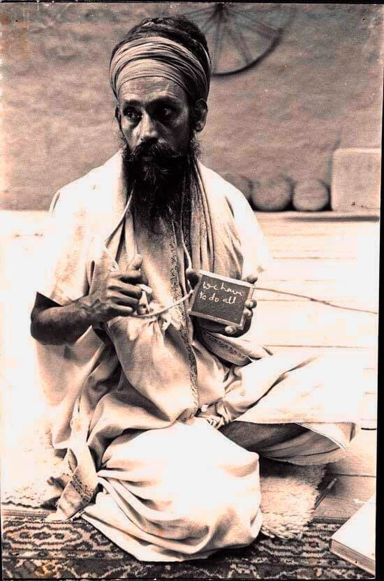

As we make our way through this strange adventure called life, hoping things will turn out well for us, we don’t really know what will happen. We want all the things we think will make us happy and sometimes that works for a while. The problem is we get other things too - all those things we don’t like. The game is rigged; we never get only the good stuff.  When we don’t like what’s happening, we complain -this isn’t what I signed up for, and it must be someone’s fault! It’s what we often do, yet this response is an abdication of responsibility. It’s our job to respond to what life hands us.

In chapter 6 of the Bhagavad Gita it is said: *Let one lift oneself by one’ own self alone, and let one not lower oneself.”* In other words, it’s up to us.

The Bhagavad Gita begins with a battle. When Arjuna (representing the individual seeker) asks his charioteer to take him into the middle of the battlefield so he can see the two armies about to go to war, he sees relatives and friends on both sides, and he has a breakdown. He slumps down in his chariot and says, “I will not fight.” At this moment his charioteer reveals his true identity as Krishna (God, the universal Self), and urges Arjune to fight. After all, Arjuna is a warrior, and it is his duty to act.  The rest of the Gita contains Krishna’s teachings to Arujna, his self-doubting pupil. In each chapter of the Gita, Krishna presents Arjuna (and us) with a particular yogic path.

What is your inner battle? Often we think it is other people. Dealing with other people - facing and resolving difficulties - is certainly part of it, yet that’s only the surface level. Digging a little deeper, we can see our own part in the battle. What is it in me that’s preventing resolution and reconciliation? Why do I react the way I do to this person, to this situation? What action might break the vise that I’m caught in that’s keeping me locked in this pattern of negative thinking, whether it shows up as sadness, depression, frustration, irritation,or  impatience?

We have our inborn tendencies and habits, and naturally we believe our ideas are right. But what if that’s only one way of seeing things? What if it’s not the truth? When I’m stuck in my unhelpful patterns, my tendency is not to lash out, but to smile and be nice, to avoid discomfort. Fighting, for me, requires stepping out of my comfort zone. It doesn’t mean going to war with someone else, but fighting my inner enemies, even if those enemies are my relatives and friends (that is my familiar, comfortable responses.) Slumping down in the chariot is avoidance of what needs to be done.

You might have a different response; maybe you come out fighting. But if you’re fighting an external enemy (that is, a person you disagree with), it will perpetuate the separation you already feel. . Stepping out of your comfort zone might require you to be quiet and pay attention to how you feel. Is your heart pounding? Are you remembering to breathe? You need to still your body and your mind so you can identify the action that’s required. Whatever you’re facing, that’s where the battle lies. To fight your inner battle requires diligence and self-discipline. Babaji’s advice: *Face, fight, and finish.*

*Your mind is the creator of everything. You create heaven and you create hell. Both are in the mind. Yoga sadhana deals with the mind. If the mind is controlled, then everything else is easy to control.*

*You are in bondage by your own consciousness and you can be free by your own consciousness. It’s only a matter of turning the angle of the mind.*

When Babaji instructs us to face, fight, and finish what is he telling us? What do we need to face? We need to face our own minds and direct them to the search for inner peace. There are many methods in what Babaji has called the “bag of tricks” of yoga practices. The key is to do them. Face, fight, finish means don’t give up, don’t quit.

The Dalai Lama says, “Be compassionate,  work for peace in your heart and in the world. Never give up. No matter what is happening, no matter what is going on around you, never give up.”

*The world is not a burden; we make it a burden by our desires. When the desires are removed, the world is as light as a feather on an elephant’s back.*

Contributed by Sharada  
All quotes in italics are from writings by Baba Hari Dass

---

**Sharada Filkow,** a student of classical ashtanga yoga since the early 70s, is one of the founding members of the Salt Spring Centre of Yoga, where she has lived for many years, serving as a karma yogi, teacher and mentor.
