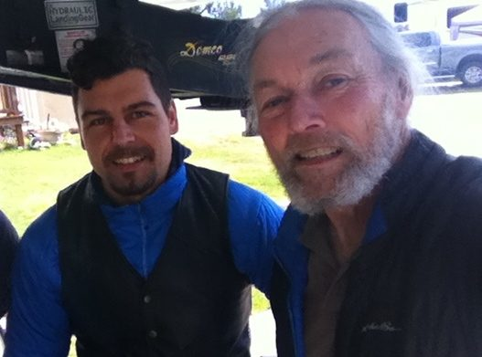
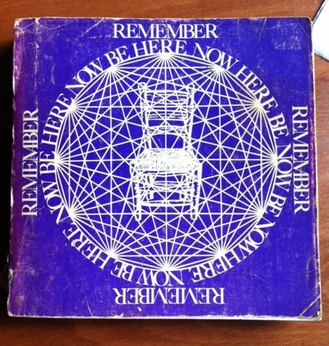
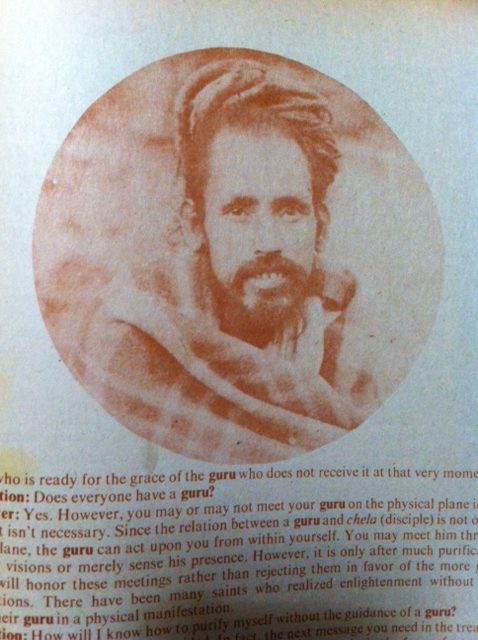
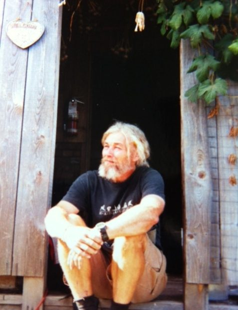
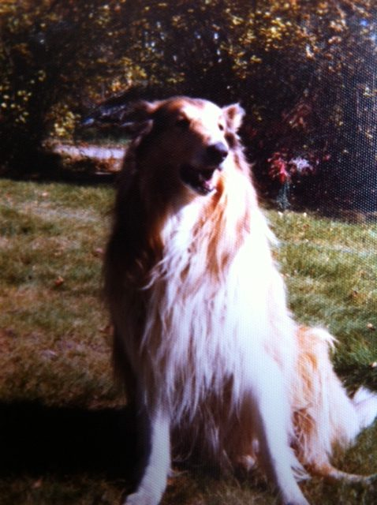
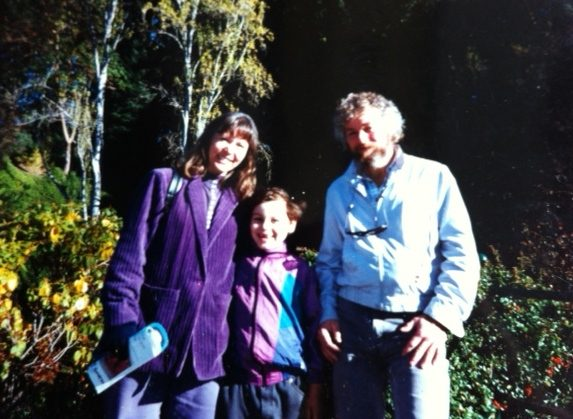
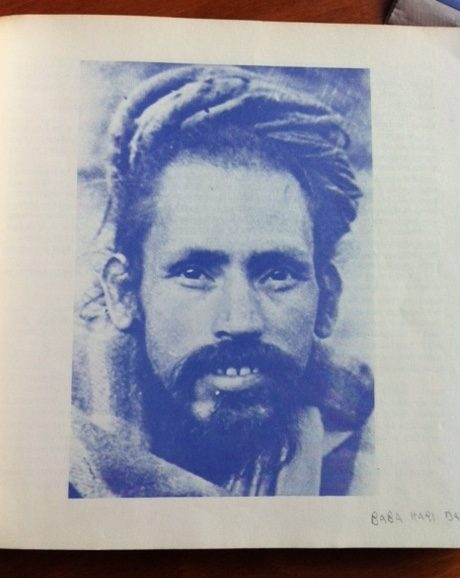
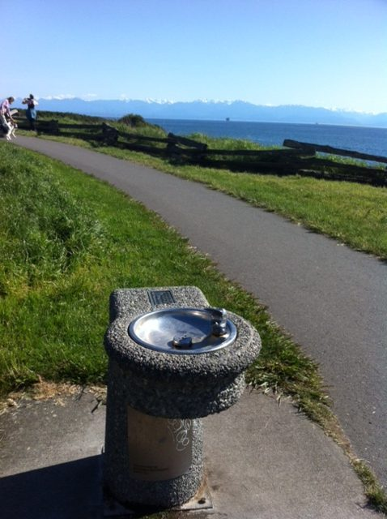
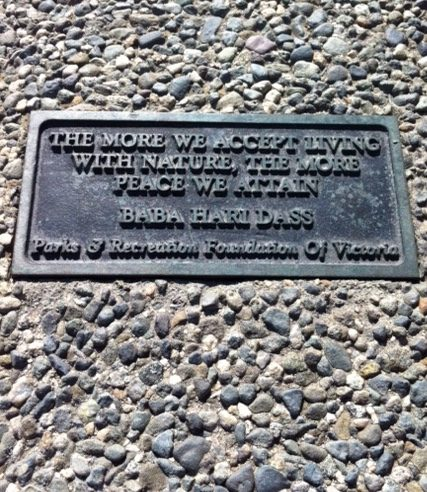

Amaresh and his son, Mike

***“The more we accept living with nature, the more peace we attain."***

My favorite Babaji saying and how it all began:

One of my first memories was lying in my crib watching the tops of the trees blowing in the wind.  When you just 'see' and your mind doesn't have the conditioning to label what you see, it is all a wonder.  Later on, I grew up with an affinity for nature and free rein. (It would probably be considered child neglect now!) I spent time exploring the forest we lived beside. There were no children my age around, just an older brother at school.

I had to know how mechanical things worked; if it had a nut, bolt or screw, it got taken apart.  There was a lot of pressure to put it back together before my father found out and yelled at me: 'Did you take that damn thing apart? It doesn't work anymore!'

With a little help from my mother and my brother's school books, I learned the three R's early.  By the time I started school I'd browsed most of the set of Junior Britannica encyclopedias we had. I was considered one of those smart kids - never having to study, skipping grades, always getting 100%, but lacking in social skills. I was a misfit. I dreaded recess- twice daily I'd get pushed around and dragged about on the schoolyard.  My parents put me in minor hockey squirts but that quickly turned out to be punishing. I sat on the bench and rarely got to play. My ice time went to my physically brilliant teammates, one of whom was Bobby Orr.  In those days, left-handedness was okay for sports but considered an ailment for writing. I was forced to write with my right hand for a while which did something to my brain, and I ended up with a stuttering problem.

My dad was a dentist downtown. From running errands to the store, the store clerks knew me well and I had charging privileges. The lumber, hardware and drug stores were very accommodating to my interests in chemistry, microscopy, and building things, and seldom called my parents for approval.  By the time I was 14, I had quite a microscope slide collection, I had built a boat, a pool table, a digitally lit scoreboard, had renovated the basement, and wired the cottage for hydro.  A very small investment for the education and experience I received as a child taking things apart.

Junior high and early high school was  just one long awkward moment; I was very shy and  self-conscious. Though I'd cured my stuttering problem, I was still very quiet.

When you need it, the universe provides it, and the 60's counterculture was just what I needed to break out of my shell.  A time for mind expansion, crazy women, revolution and the big city - Toronto! Yorkville, Trinity Square, Rochdale College, Baldwin St, the U of T campus. Finding God within myself and in all things returned me to where I had been as a child in nature- sitting by a pond for hours, so peaceful, so content.

I quit high school and moved to Toronto. I was on my own and needed something to live on. My early chemistry exposure and a sympathetic uncle helped me get a job operating the lens coating department for an optical company. When the optical job became repetitive - well really it was my ego because the boss didn't like the new pink colours I had developed - I took night courses in computer programming and got a job at U of T through my first love, Judy. It was a fun place to work; if you had initiative you could take on anything. I imagine that's what it's like to work for Google or Facebook now.

The late 60's and early 70's saw an explosion of yoga in Toronto. Like many others I had a copy of Ram Dass' Be Here Now. Of course Babaji was in the book but I wasn't to know that until many years later; his portrait was not identified, and his name was a little different - Hari Dass Baba.  (He wasn't to come to Toronto until years later). Yogi Bhajan lectured next door at Convocation Hall and had an ashram around the corner on Palmerston. And Yonge street downtown was alive with the chants and kirtan of the Hari Krishnas. It was a wild time for yoga in Toronto - people were hosting yogis they'd met in India in their homes.  I went to one particular 'yogic initiation' with a friend.  The visiting yogi used his siddhis to elevate me. Not good: soon after, bad luck befell me - that friend went on to steal away my sweetheart.

I took it hard and moved back home. No job but I did find my next love whom I was to marry - Leslie.  A friend and I applied for and for and got a large OFY grant for a revival of community and native arts.  It was a grand project with 15 employees, and Leslie was one of them.

We got married at her grandparents’ hunt camp where we were living a hippy lifestyle. I hand dug a well, had a wind turbine on the roof, a fair sized garden going, shot and ate game, grew pot at the edge of the farmer’s field behind us, typical 'homesteading' stuff for the times.

Back then it was common to get married in order to get student loans. We both got student loans and another loan  to buy a 17.5 ft. travel trailer. We lived in that for the next 3 years while we went to Georgian College. Despite the size of the trailer we'd have weekend guests come - and our rescued coon hound took up a lot of space too. We lived on frozen smelts that we caught, discounted second-rate veggies, and the odd care package from home. Typical poor students.

In those days, yoga hadn't spread up to Barrie from Toronto. It was still considered anti-Christian and was more or less banned by institutions, including the Y.  But there was a Rudolf Steiner study group to attend regularly for the next 3 years, and some of his theosophy was strongly rooted in yoga. Gradually our income rose. We got bursaries and rejuvenated the college newspaper that had folded. I became the editor, Leslie did the layout, and we sold advertising, giving ourselves generous commissions. To get the print content going I had to write anonymous letters to the editor for a while! Practical self-inquiry.

I graduated in water resources engineering and headed out west in search of work with the next mega project that was supposed to happen. On the way I stopped in Kenora and was immediately hired by Confederation College as a building trades instructor for a Manpower Retraining program in Fort Hope, a fly-in community. It was a long flight in a little Cessna; I had virtually no baggage, only a rescued collie.

There were no tools, no books, just 12 students of varying skills, interest and fluency. Worse, not long after we landed, Birch, our dog, had attacked and bit the Chief. Not a good start. Fast forward 9 months: We got the old saw mill going and sawed enough wood to frame a 3 bedroom house, finishing it with scrounged materials. The community was impressed with our resourcefulness and I very proud of my 6 remaining students.

By then Leslie and I had parted ways; she went to the high Arctic to teach arts and start an Inuit family.  I took on another training program, this time in Whitedog, not far from Kenora. It was a rough reserve; I was living in a tent with Birch chained up outside. He survived the dog attacks, and I the odd bullet that whizzed by. I had befriended the band manager, Allan who had wheels and could get me out on the weekends. One night we were sitting on the curb outside a bar downtown and two attractive women walked by. Allan and I ended up marrying them - one was Theresa whom many of you are familiar with as a karma yogi in the kitchen.

We bought a little house in Kenora which was to become our matrimonial home. It got very extensively renovated into a 4-level split. Theresa did all the finishing work and helped me with everything else. It worked out well.

When I came back from my last teaching contract in Fort Severn, I broke my tibula and fibula out walking the dog and was in a cast for the next 9 months (I hadn't had dairy or veggies for 3 months). But I'd also gotten a taste of the arctic from Ft. Severn, and wanted more. I began to look for work up north and got a call from the government of the Northwest Territories in Yellowknife, asking me to come up. I thought it was for an interview. They neglected to tell me I had the job; it turns out that what I thought was a casual conversation over the phone was a telephone interview. Theresa came up a few months later and we settled into a cozy house across from the fire hall. There were a lot of house fires there, typically from coming home drunk and hungry from the bar, putting something on the stove and passing out with a cigarette. I'm a light sleeper and the fire siren would wake me up a couple of times a week.  I couldn't beat them so I joined them. I was usually the first responding volunteer for the next 5 years. That was my first real commitment to karma yoga and definitely not my last.

My job with the government, as a mechanical technologist, was my first experience with large bureaucracies and their incredible waste, incompetence, and bullying down the ladder. Fortunately I could work out in the field as much as I wanted rather than just pass paper around at HQ. I became president of our 1200 member local in Yellowknife, but after presenting a paper at a union assembly in Whitehorse on how undemocratic the union structure was, I became persona non grata.

We had a cozy cabin out on Prosperous Lake (aptly named) about a half hour snowmobile ride from our back door in town. I would go out by snowmobile to start a fire and warm up the cabin for Theresa to drive out to. It took hours to heat it up so I built a super-insulated lean-to onto the garage. It got toasty warm in 10 minutes with the cheap tin airtight stove glowing red hot. My meditation practice returned in that warm cave and rekindled other spiritual practices. Our only child Michael (Santosh) was conceived at the cabin. That was a real turning point because neither of us had considered having children even though Theresa was the government of the NWT's daycare consultant. We moved up the street to a bigger house. It had bedrock in the basement that Mike would play on for hours pretending to be a miner. I took paternity leave so I didn't have to duty-travel and be away. But I still couldn't stomach changing a diaper - Theresa would have to come home to do that!

Every night at 4 am I'd hear an explosion under the house - we were right over one of Giant mine's drifts that they were actively mining. (Drifts are underground workings of mineralization that, in Yellowknife, are sometimes directly below your house. They blast at 4 am when the mine is clear of workers.) The development of the Dia Met mine made matters worse for us. Our cabin was at the doorstep to the ice road to the mine and there would be tractor trailers hauling all night.

I had a realization in my warm cave that my lifestyle needed radical change or I'd be dead. I took early retirement, changed my diet, exercised more and started a regular yoga practice. It worked - I'm still here!

When Mike was school age, we realized the school system wasn't good for our son, and Yellowknife had changed for the worse with the new wealth from diamonds. Theresa continued working and I set out across the country in our camperized step-van to find a new home. Eventually the search was narrowed down to James Bay in Victoria where we bought a 1940's house on Boyd St. Theresa still lives there.

The Victoria Y offered a great Iyengar yoga venue. Most of the classes were free and I took full advantage - sometimes twice a day. I was getting a fairly advanced practice going between that and an early morning Pattabhi Jois clandestine group. Shirley French offered an Iyengar yoga retreat at SSC; I'd never been there, so I went. Of course I had discovered a gem! One day I was sitting in the dining room quietly by myself, and Celeste (Aradhana), who was teaching at the retreat, asked me if I was on mauna (silence). I didn't even know what that meant, didn't know about Babaji, and listened intently to the whole story; the words went right to my heart! That summer I signed up for the community yoga retreat and I can still experience the moment of meeting Babaji for the first time on the stairs of the main house.

We started coming to the family retreats, sometimes with our retired guide dog too. Dogs at SSC were kind of discouraged back then but it was pretty obvious Babaji loved them (and the kids too of course). Mike was starting to outgrow the children's program but was too young to fit in with the teens. One year the boys set up a raised track on planks and sawhorses to bike on. Mike had a bad wipeout, and Dayadhar worked for hours cleaning his wounds. No scars!

I worked on a number of building projects: Marty and Willow's little cabin transformed with a big addition (now the Sage House), the greenhouses were built, Dan Jason’s garlic storage shed (now a garden tool shed), the composting toilets and showers in the campground, and the water system. One day I was suspended head-first into the septic tank to pull out a pump, with two trusted friends holding my legs. Unbeknownst to us Babaji had arrived on the land and was doing his walk around with the entourage. He spotted us and inquired what was happening then wrote on his chalkboard, “That's karma yoga!”

The world pulled me away with the passing of my parents and brother. Within one three-week period, my dad, dog and brother all passed. There is a little anonymous monument for them, a water fountain down on the Dallas walkway in Victoria. It has my favorite Babaji inscription on it.

I looked after maintaining the centre one winter when many folks went to India. No arati but there was an early morning ritual of lighting the lanterns and singing a bit of the Chalisa; I never knew I had the bhakti yogi in me, but found out, thanks to Raven.

There was an Amma group in Victoria and I started going to their satsangs when I was in Victoria (I was going back and forth to SSC then). Amma was doing a 4 or 5 day retreat in San Ramon, California so I went, planning on being back home in a week. When the retreat was over I hitched a ride to MMC and ended up staying through the fall and helped  Ram Sharan build the gate house. At Christmas, so many people left MMC that I ended up being the breakfast cook! Then it was on to India with Babaji - my first time there, and Babaji's last. A week had turned into five months away.

It's been amazing to write this, I'd never realized how much grace and abundance I've been bestowed with. I am truly grateful.

Namaste  
Amaresh
