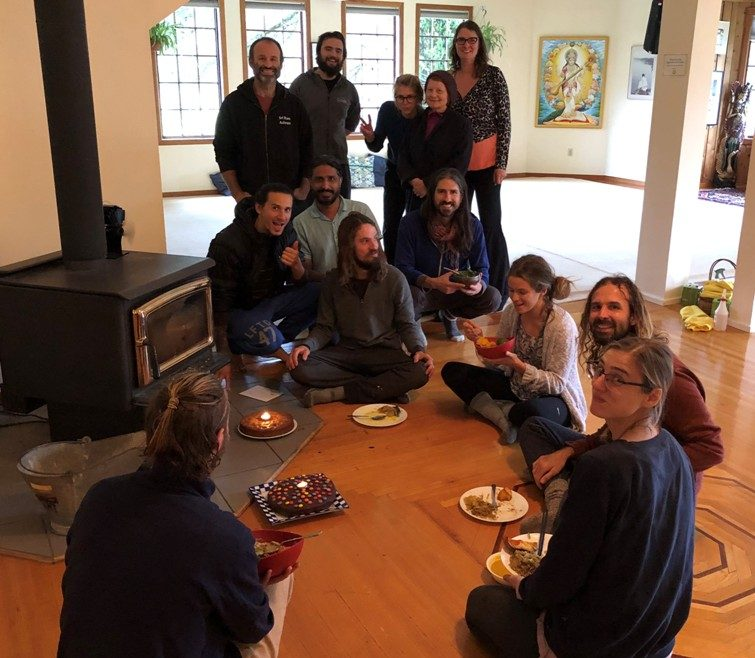
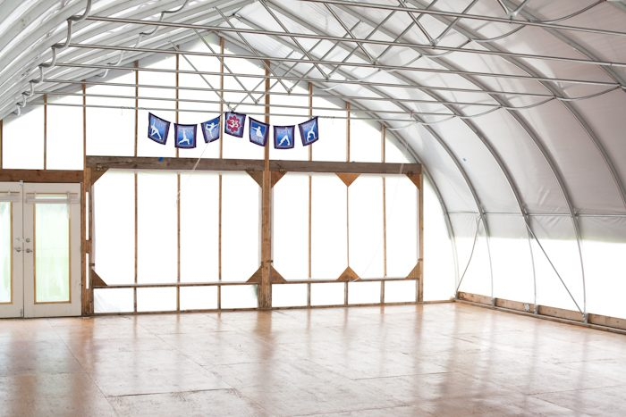
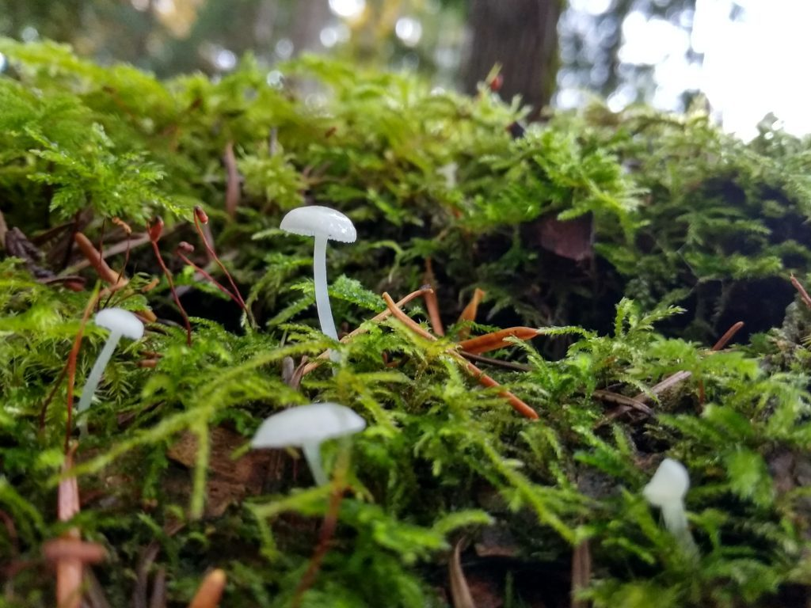
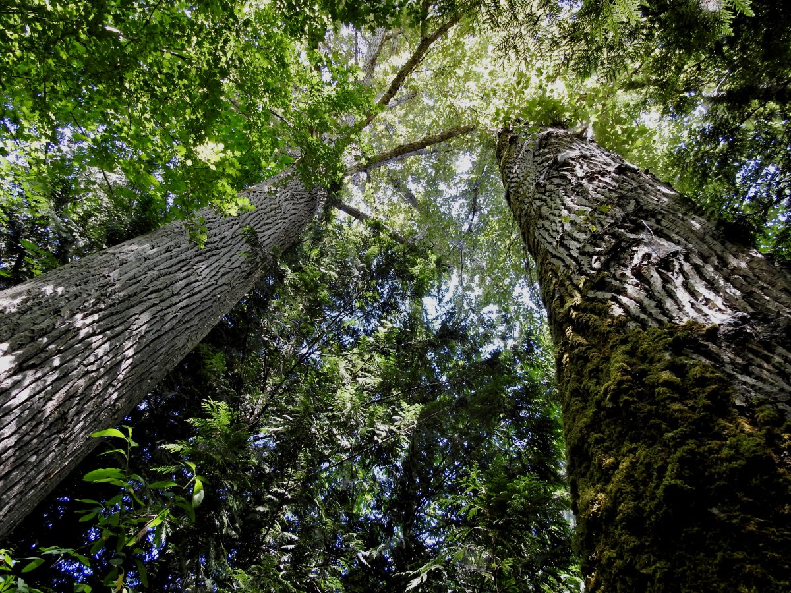
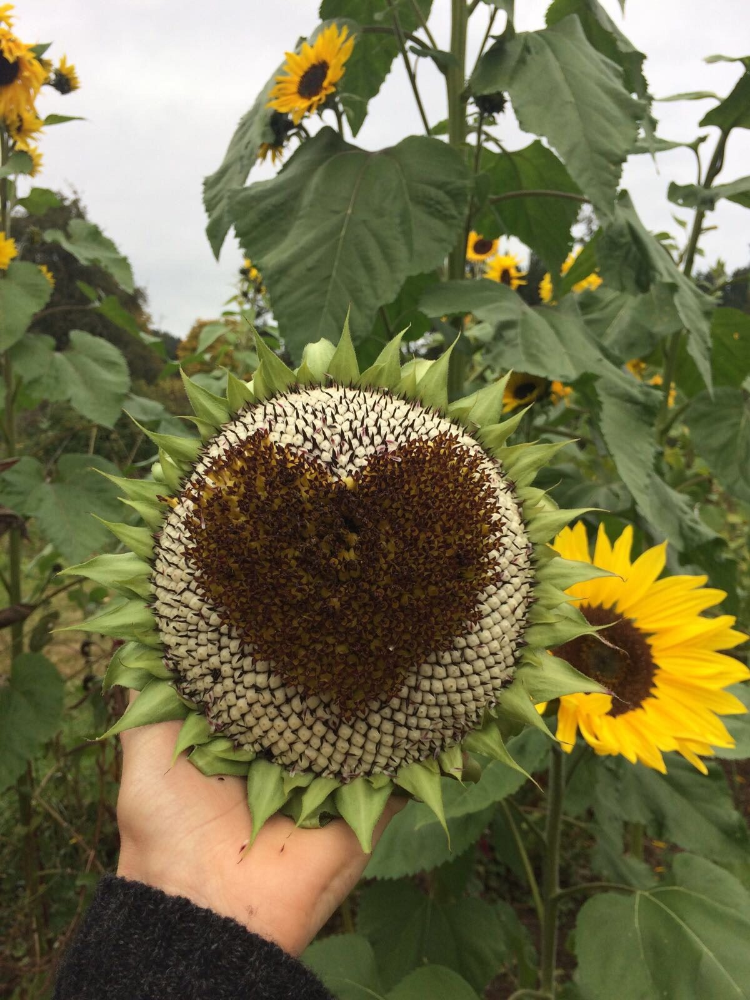

# gather me now

gather me now  
friends  
may we break bread  
with our palms  
scattering sacred crumbs like  
snow across the landscape  
of our shared hearts  
beat  
may we gather  
in sacred unity  
under sacred Babaji  
share our meal  
& spread  
across the landscape of our collective  
hunger  
may we gather now  
& be fed  
under the swinging maple tree  
spreading deeply  
our shared seeds that  
flow beneath our souls  
soil  
into our shared horizon  
gather me now  
with our palms open  
up toward the sky  
may we gather  
now  
breaking bread  
in song  
together  
as crumbs fly  
like snow  
across the landscape  
of our shared  
hearts  
in prayer.

*by Angelo*

~~~~~~~~~~~~~~~~~~~~~~~~~~~~~

# The Pond Dome

1440 square feet of plywood,  
badly in need of refinishing.    
How many feet,   
how many bums   
          does it take to wear off   
          a coat of varnish?    
How much sound   
          has been captured   
          by those white plastic walls?

Today it is raining  
I am inside a drum.    
A celestial drummer   
          beats out a tattoo,  
          on that plastic wall,   
          waxing and waning,   
          now a cacophony,   
          now a gentle tapping,   
          pushing my hearing into overload—   
          nervous system jangling.

I push a broom,   
          its swish merges   
          with the noise of the rain.    
I am absorbed in my task.    
          Looking up,   
I am surprised;   
          someone has entered the dome.

Soon more bodies   
          will fill that space   
          of plywood floor and   
          plastic wall   
          that divides   
          outside from inside.

We will raise our voices   
          in song,   
          in praise,   
seeking   
          to merge   
          our outside with our inside.

At the center of the song   
          is a small oasis   
          of silence   
manifested   
          as a man   
          who never sings   
          but is the song.

*by Suneel*

~~~~~~~~~~~~~~~~~~~~~~~~~~~~~

# A Walk in the Forest

The Forest is falling into stillness.  
Layers and layers of depths and lights exposed  
in the changing colours of each Autumn day.

The morning spider's web garnishes the meadow,   
dwellers of cold countless pearls of dew.

The stream, still shy and slithery,  
gathers reflections of bony branches and no-more-alive sisters leaves.

The moss is fragrant, fluffy, radiant.  
Absorbing the season,  
awakening to its nature and essence.

Mushrooms are popping in an eternal ephemeral celebration,  
asserting their existence in mysterious messages.

The Forest is alive  
returning to its roots  
collecting the memories of the Spring and the light of the Summer  
ready to depart  
to a journey inside.

*by Selva,*  
*Salt Spring Centre of Yoga, October 2019*

~~~~~~~~~~~~~~~~~~~~~~~~~~~~~

# Tree Song

Whisper to me my leaves  
Tickle my fingers with your kiss  
Send my seeds on the breeze  
Bathe me in your mist

Delicate droplets so fair  
Like little water maidens  
Watching you rest there  
Softly the day begins

Wish me the sunshine  
To catch your sparkling eyes  
Weeping tears so fine  
Soothe me in the sunrise

Caress me with feathered wings  
Bless me in the pink dawn  
Bring me where your heart sings  
Sing me your love song

So sweet the notes they play  
As they dance upon my limbs  
A beautiful melody anoints the day  
A harmonic spell-binding spins

Awake my sisters, awake my daughters  
Awake my brothers, awake my sons  
Let us pray to the waters  
Give blessings for the blessed ones

 Breathe with me now  
Let this great wind move me  
As much as these lungs allow  
Like rivers pouring into the sea

Hold my hands here  
Feel the rhythm of my heartbeat  
Within this earthly lair  
Your touch feels so sweet

So precious is this  
My legs your hearth  
I give you my promise  
Heaven’s here on earth

*by Brandon*

~~~~~~~~~~~~~~~~~~~~~~~~~~~~~

# Love

I love. 

*by Haley Theresa*

~~~~~~~~~~~~~~~~~~~~~~~~~~~~~

# Cedar Breath

oh cedar tree  
thank you for calling me   
to hear your message   
messages moving through me   
like lightning striking   
now is the time  
I am not blind   
I see you showing me   
so obviously  
my heart dripping sadness  
i must let go   
waves flipping me around  
i gasp for air again and again   
panic, concern, worry   
no more simplicity   
be daring   
and let go   
be daring   
i ask you cedar   
help my heart   
i breath in a cedar breath  
that cleanses my entire being   
let go   
again   
wandering , wondering mind   
like a lost choice   
be like a butterfly  
gracefully like the wings guide   
simply let your grace guide   
let the heart guide   
bringing you back   
to that cedar  
asking   
thanking   
for that cedar breath   
the breath of love   
reminding me   
i have been guided home

*by Sabrina*

~~~~~~~~~~~~~~~~~~~~~~~~~~~~~
