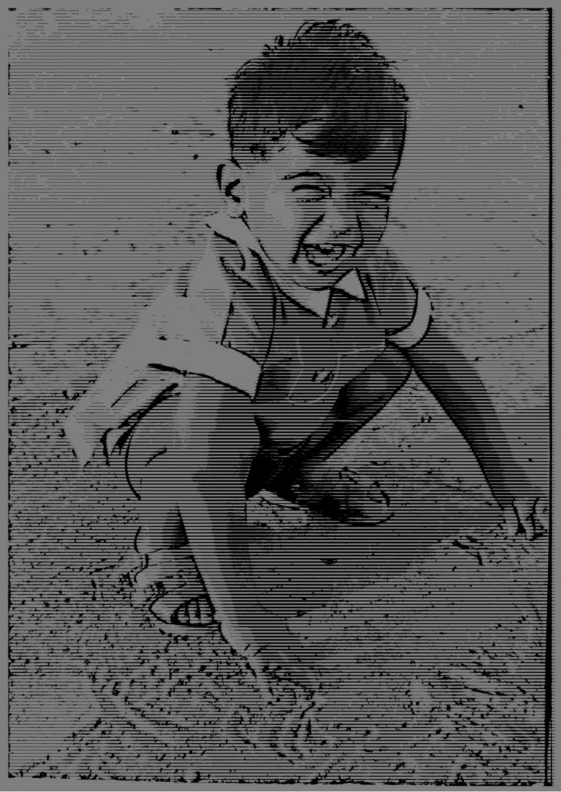
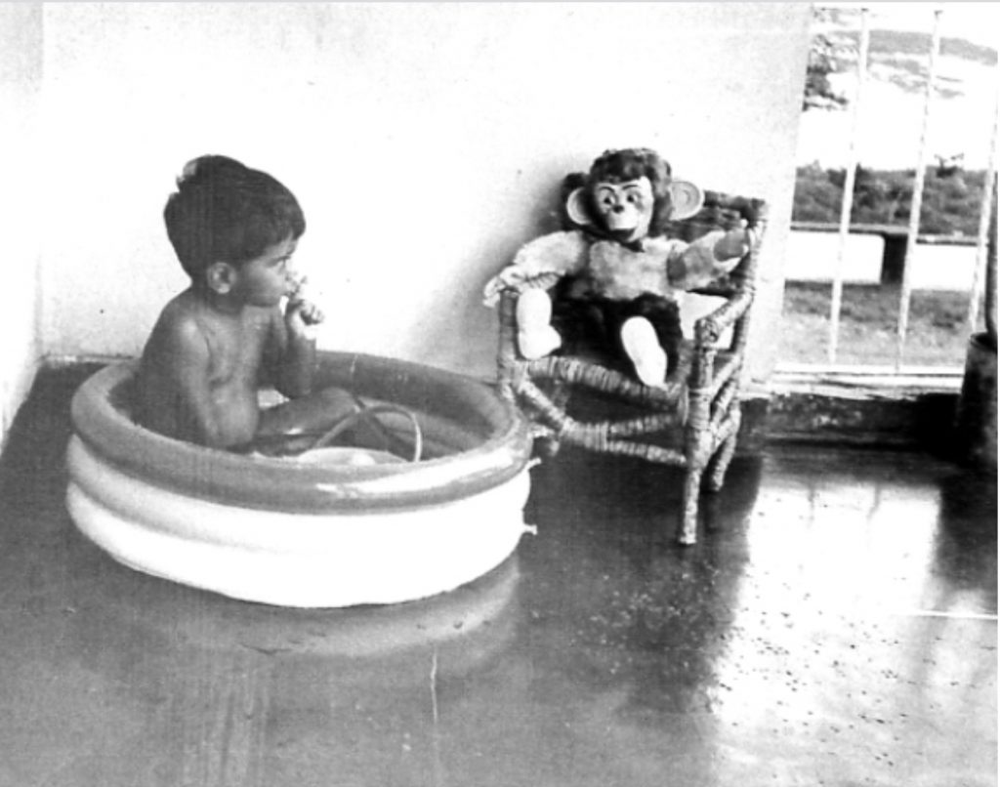
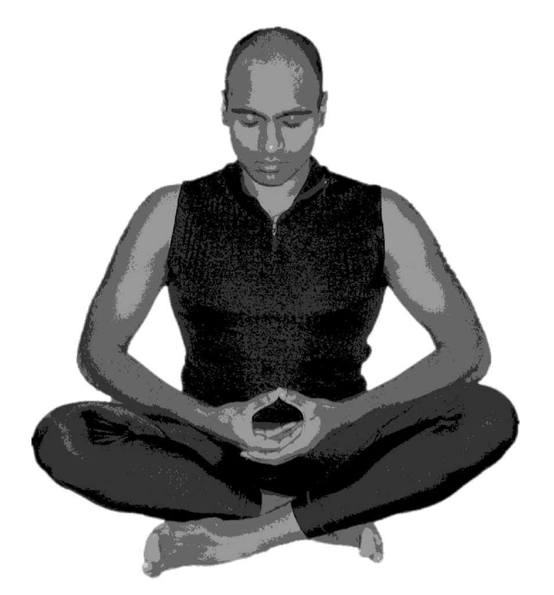
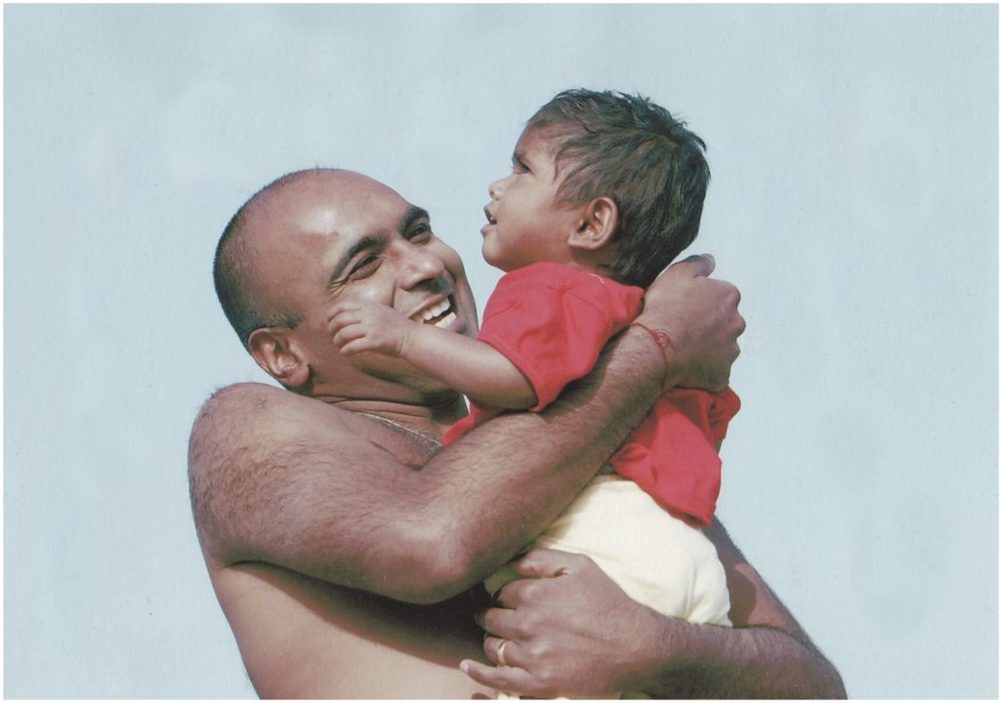
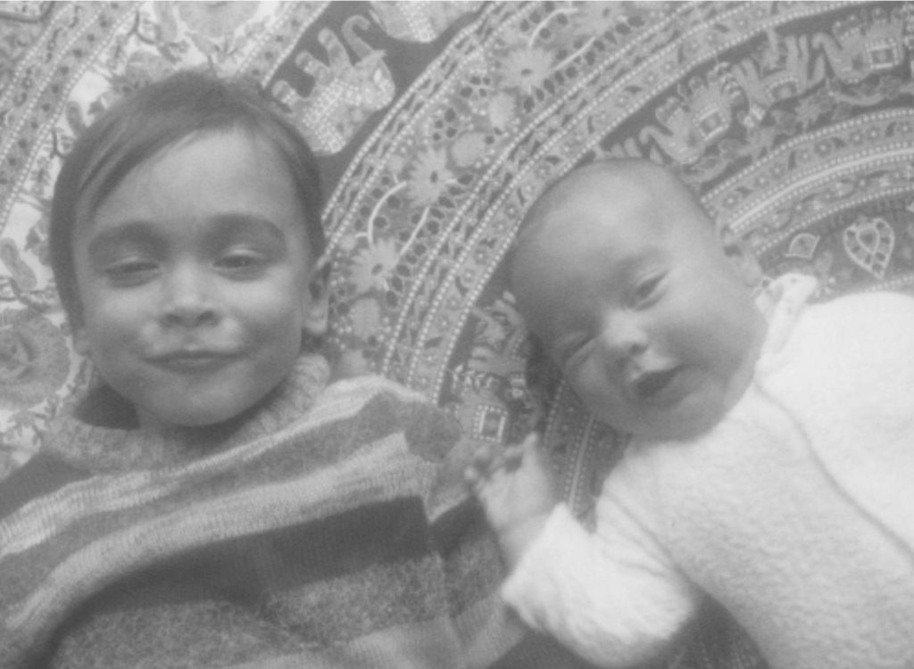
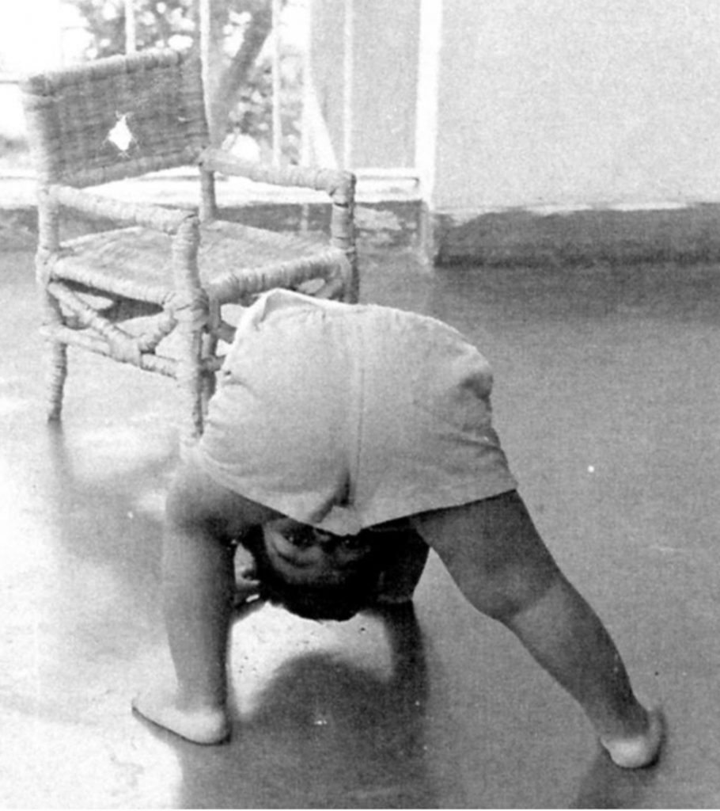
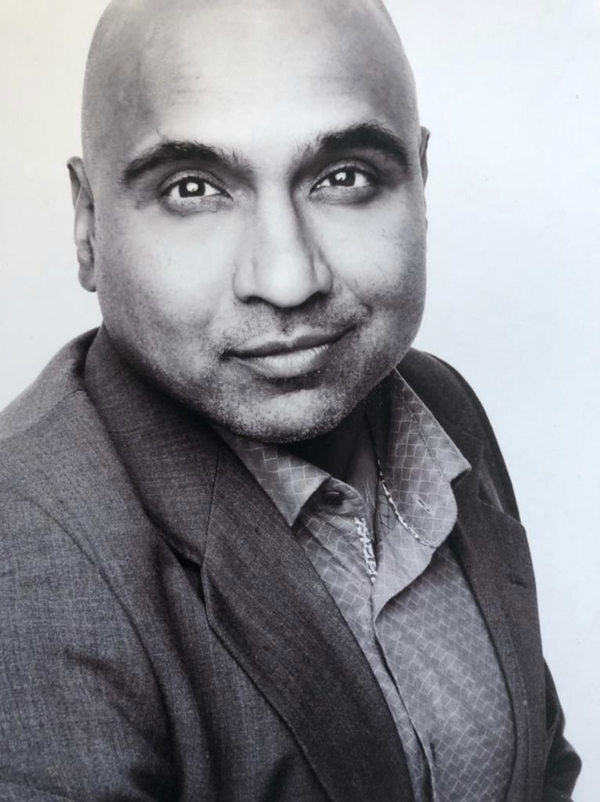

## **Prologue - Becoming Aware of the  Play, the Pavement, and the Playground**

This story begins in the early seventies in Port Credit, Ontario. A little brown boy, maybe seven or eight,  sitting alone in the grass at the edge of a field in his schoolyard. He observes his fellow students play on the pavement beside primary school. He is puzzled about how boys and girls play separately, how the girls get upset when the boys dominate foursquare - the ball game of choice - with brute force and how the boys who dominate the other boys get really upset at everyone when they lose to anyone, girl or boy. He notices how students in each higher grade can’t really interact because each grade is assigned to a section of pavement and nobody dares test the rules. He is not sure if they would interact even if the rules did not exist. For some reason, the little boy gets along with nearly everyone and for the most part, he is welcomed in any of the factions in his grade. He suspects that it is because he doesn’t attempt to dominate the space,  nor see any value in it beyond having fun in games.

The field where the boy sits is an expansive sea of green with no visible lines separating grades. However, for the most part, the children stick to the pavement close to the school building.  They seem unaware that the pavement and the background of the school create a stage, and the students are apparently unaware performers of a grand, moving and very dramatic play; conflicts, rivalries, affinities ebb and flow. All the words and actions seem charged with an energy that is is puzzling. The boy is mystified that all in all the laughter and screaming and play, nobody seems to notice that they are in the middle of a continuous miracle. The boy looks up  - the clouds slowly drift and morph in the sky and the wind traces undulating waves through the grass. The music is visual and also accented by the sound of a breeze above the din of the children playing. Closing his eyes, these thoughts and these images come and go, come and go until the sound of the bell is heard and all the students, including the little brown boy, line up at the doors of the school according to grade. Like little soldiers, everyone stands as straight as possible. They know the most orderly line is the first to be let into the school by the attending teacher. This is a signal to the other students that this group of students was recognized as having exhibited the right behaviour and consequently was the most deserving for re-entry into the school.  
  
Maybe all that was just a sense of alienation felt by a kid who was one of two children of colour in the entire school. His dad was also a teacher at the same school, and the boy felt more at home in solitude than with hustle and bustle of the playground. Maybe the edge of that field was a safe harbour from a family life that was not altogether peaceful. Maybe not.

However, it was in those moments that I - that little brown boy-  made up my mind to understand these strange circumstances and beings that were my fellow travelers on this journey. As an immigrant to Canada,  I wanted to discover what it meant to feel like them because clearly, other than the colour of my skin, I looked like them. I was human just like them; however, I did not understand them or myself at all. I sensed I was driven by the same impulses to belong and be recognized as a member of the school community,  and yet I could fathom neither the appeal of life on the pavement nor the attention and energy that everyone seemed to need to put into belonging and knowing their place. Yet I knew there must be others like me who experienced the world in the way I did. Maybe they were there on the pavement or somewhere on the playground, and I just could not see them for what they were. Maybe I was the one who was blind to what it meant to be human, and they who seemed so engaged had the clarity.

In the early days, while I loved learning at school and participating in as many extracurricular activities as I could, nature and books were my primary teachers. My temples were found in the ravines and bands of forest behind the houses in my suburban neighborhood and in the public library that was so far away that I needed a bicycle to get there. Such beauty and surprises were everywhere if one followed the call.  In the library there were minds, many no longer belonging to living bodies, who had taken the time to record their perceptions in stories. These books were like messages in a bottle set adrift in time, and I felt fortunate to discover each one that came my way. There were endless facts about the world to be discovered and learned, and I was free to let my mind wander and discover according to my instincts and curiosity. To me, reading, learning, and raising monarch butterfly caterpillars or observing how wind moves differently through different species of trees seemed much more interesting than winning games and finding admiration from other children or getting gold stars for achievement at school. There was no contest. School was great, but being free to discover and learn in accord with my own disposition and follow my own program of inquiry was simply addictive. I could not get enough of it.

## Entering the field of play

There remained this nagging impulse to realize what it means to be truly human. I could not fathom my fellow students nor much of the behaviour of the adults around me. To not only observe life but also to be in life - that would be really something. This impulse, along with my insatiable curiosity, would eventually draw me across time through deserts, savannas, barren steppe, lush jungles, active conflict zones, several university degrees, yoga ashrams, corporate and high government offices, many intimate relationships and friendships, and eventually into marriage and fatherhood. So I became a traveler through time and space, and in doing so took on roles that each unique territory required - that of a technology geek, artist, writer, musician (sort of), yoga practitioner and teacher, businessman, academic, researcher, lover, friend, father, and husband. I would come to know of the rich, famous, and somewhat powerful and of the vulnerable and dispossessed. From attending the odd Beverly Hills gala to teaching yoga to children in Oppenheimer Park in the downtown east side of Vancouver or monitoring refugee movements in humanitarian crisis where the genocidal tendencies of my species expressed itself,  I deepened, learned, observed, and in doing so, my story was written as it unfolded.

On this journey I have experienced great privilege - and stumbled, skinned my knees, fallen from grace, been humbled, and resurrected myself from the ashes more times than I can relate.

I  lived life with a certain voracity that even drew the concern of my mother. She had observed that I seemed to be living three lives at one time and urged me to slow down. Somewhere in the mid-1990’s after a series of emotional traumas even while, or maybe as part of, cultivating a meditation practice,  my heart broke and I fell out of love with humanity and to some degree life itself. All that remained of my love of the mystery was the call to the silence of deep, wild, uninhabited places and the traces of human beauty and tragedy that I recognized in music and art. Being part of the play on the playground pavement had become unbearable and I did not know how to find my way home to my true self.

## Finding my way home

A random attendance of Portfolio Day at the Emily Carr College of Art and Design resulted in an offer of admission.  Art school was a rebirth of sorts where I gave myself permission to loosen that which had driven me or perhaps pulled me so hard through life. I had always made art as artifacts that I fancied would record the metaphor of a life lived that only I could truly decode.  I laid down the mantle of ultra-focused Social Entrepreneur and opened to rediscovering myself by returning to my cultural traditions and re-awakening to my childhood curiosity about the nature of life. Slowly, without any guidance, I began the journey to deepen back into the Way.

First I traveled to India. I arranged an Independent Research and Learning course that enabled me to study stone sculpture in my ancestral Tamil Nadu. There I bought a Royal Enfield motorcycle (still my most favorite motorcycle of all time) and traveled around the south of India, sketching, experiencing temples, connecting with artists and meeting Vedic and Tantric Scholars as part of my inquiry. I sold my motorcycle to an ashram near Bangalore and flew north with the proceeds, to study music and yoga at an ashram located between the jungle and the Ganges just north of Rishikesh. There I spent time with sadhus and one Baba, in particular,  I learned of death, presence in time, and that despite the intensity of my life experience, how little I actually understood of my own true nature or of the world.

## Meeting Babaji

While I entered Emily Carr as a painter and sketch artist, in my foundation year at Emily Carr, I began exploring sculpture as well as media, installation and performance art. Many of the works centered on the theme of rebirth and transformation and often included a ritual element. Maya Suess was a fellow student in my foundation class and we collaborated on a couple of works.  After one particular piece that we presented to our class, she took me aside and said that there was a place I needed to go. Maya had grown up at the Salt Spring Centre and she helped me navigate to the family retreat the summer after our first academic year was completed. Sharada with her contagious enthusiasm and forceful grace quickly had me involved volunteering with the kids’ camp. Here I found children, many who, I sensed, shared a similar awareness to that little boy who sat in the grass on the edge of the schoolyard. So I brought my love of art, nature, and yoga and combined these into my offering to the children.

it was a bit strange for me at first. I was an immigrant from Toronto where I had been part of a large community of fellow South African Indians who met monthly for Satsang and Kirtan. These gatherings felt more like a good excuse to socialize than a spiritual practice. It was both of course. However, our community was only composed of South African Indians and nobody ever spoke of meditation or yogic practice.

Now here I was at this yoga centre on Salt Spring Island, and there all these MOSTLY white westerners were sitting around with obvious reverence this for a kind-looking Indian guru. I observed Babaji and his devotees very carefully for several days. They also moved around with clear joy in their footsteps, and with smiles as they did dishes and broke rocks. They also meditated, sang kirtan, discussed the Bhagavad Gita. I was a puzzled monkey. I had heard of cults and how easily westerners followed charismatic and unprincipled gurus. I definitely did not want to participate in that story. Yet there was something here that resonated deeply and called to me.

Then it dawned on me: During my recent time in India I had been fortunate to spend a short period in the presence of His Holiness the Dalai Lama (HHDL). I observed that like HHDL, the sadhu in Rishikesh and Babaji had a similar quality of being. They seemed to be petals of the same flower - different and the same. HHDL, when answering a question, responded: “I am a monk, I am a Buddhist, I am both a religious  and political leader.” He was that - he was no more and no less. To be more would be ego, to be less would be ego; either would be of shadow. HHDL was light, joyful and did not take himself too seriously, and yet at the same time, was clearly serious and focussed. There was no pretentiousness is his being. He did not call people to become Buddhist - indeed he encouraged them to find wisdom in their traditions. He simply was present in time and space and authentic to his reality.   
  
In Babaji, I recognized this same clarity of presence. While the attendees and devotees at the family retreat treated him with reverence,  he remained a simple monk - no more and no less. Even this reverence was the story of the devotees and he neither drew devotees to him or pushed seekers away. The devotees or seekers came to him due to their own mental dispositions and needs. He alone never wavered. Then I noted seeds of unwavering joy and clarity in some of the people around him. He was a gardener and this space of the Centre was a garden that would allow certain seeds to germinate, grow, and prosper. Yes, there were both shadow and light playing here, and this provided the nourishment of something that I recognized from those days in the school fields as a child and in the moments of clarity on my journey through time. Here, now, was someone who had a child-like essence but was clearly an accomplished, wise adult. Indeed here was the entire community where the seeds that were nascent in me could be nurtured.

That night as I lay in my tent I had a dream of Babaji. In the dream, I was at my house which was very similar to the main house. There was a great unruly party going on, even water balloons being lobbed at the house, making a mess. The activity was beyond my control and I was a little embarrassed at the state of chaos in my “home”. Babaji looked at me in the dream and “said” “This is your mind and you can stay here or you can learn to find joy and clarity with discipline. It is your choice.”

It was at this moment I knew my teacher had found me and I had found him. It had been a long journey. I was home.

On that same visit, I went for a hike with Crystal Sheehan,  the only person that I knew from Salt Spring. Crystal was a painter who was in my drawing class at Emily Carr. Crystal comes back into the story a few years later as my wife and mother of my children.

 Each summer during my time at art school, I returned to the Centre where there existed a clear kindness and devotion to dharma yogic practice. I looked forward to experiencing Anuradha’s steadiness as the Centre manager and whose voice in Kirtan would take me to another world. Sharada’s steady and loving disposition warmed my heart. In the presence of the children, I fell in love with humanity again. Washing dishes, helping out in the kids’ program, working on the rock crew while studying yoga and the Gita brought deep and satisfying joy.  There is a common awareness of being - a love and devotion - that drew me and keeps me connected to the Salt Spring Centre.

As time moved on and  I became ready to graduate from Emily Carr, I realized that I was losing interest in the world and becoming more ready to focus on my yogic practice in earnest. I made arrangements with Babaji to go along to India in the coming year with the intention of entering the monastic path. The December before I was to leave and meet up with him at Sri Ram Ashram, I got this sense that there was still something unfinished, so I wrote to Babaji at Mount Madonna and let him know what I was sensing, and told him that I would be finishing the academic year so I could graduate from Emily Carr.

## Sri Ram Ashram and Arpita

Crystal Sheehan, whom I mentioned earlier as a side note, now becomes very important in this story. She and I met that January after I wrote to Babaji. We talked, and shortly thereafter became engaged, and after a year, got married. After my graduation from Emily Carr, for our honeymoon, we decided to travel about India. We realized that we both had precious, unrealized plans to visit the Sri Ram Ashram (Crystal went to the Centre School for a year with Maya Seuss when they were both young and Crystal had wanted to visit Sri Ram Ashram for many years). I let Babaji know that we intended to visit Sri Ram Ashram while he was there and he promptly directed Crystal and me to bring two bags of candy. I agreed, thinking that we could travel about India and then drop in - UNTIL I find out that there were  TWO VERY LARGE, VERY HEAVY BAGS of CANDY. What the heck! Well, only one thing to do - change our plans and go to Sri Ram first. Which we did, and quickly decided that we would spend our entire time in India at the ashram. Crystal helped with the babies, and fit right in. I helped out with the older boys, and with my emergency medical experience, I found that I was able to contribute to the operation of the ashram’s medical clinic.

During our stay, Arpita, a toddler at the time,  was brought to the ashram. Arpita arrived very hungry, with two broken arms, and unable to walk unsupported. Once she was nursed back to health, she began to attempt to walk, and I became her favorite living walker. Bent over I hooked my hands under armpits and for the next six weeks followed her EVERYWHERE she decided to go. This allowed Aprita to slowly strengthen her leg and back muscles so she could walk independently.

Needless to say, Arpita and the other children at the Ashram won our hearts and gifted us with so much more than we could possibly bring to them.

I have never felt so whole as in those moments at Sri Ram Ashram. The quality of those moments has been like a silver thread that reveals itself in the everydayness of daily life. Of course, there are the memories of Babaji in his protective sunglasses and bicycle helmet as all hell breaks loose amidst laughter and balls of candy wrappers flying the air in a massive candy wrapper fight! Warrior monk, scholar, stonemason, purveyor of candy, and a crack shot with a candy wrapper - a better guru for me there never was. With his example of joy to follow, it was a simple matter of experiencing that joy and love and learning to cultivate it within me in the everydayness of life.

At a certain point Rashmi who runs Sri Ram took Crystal and me aside and asked us if, as a couple, we wanted to stay at Sri Ram to raise babies and be part of the permanent community. We realized that this would be a very good and meaningful life for both of us, and if we followed this path we would likely not have children of our own. However, it was clear to us that we had student debt to pay off, which we couldn’t do while living at Sri Ram. I had also received a full scholarship to do my Masters In Fine Arts back in Canada. I returned to Mount Madonna at Babaji’s suggestion to study some particular esoteric practices related to art in which I was interested.

Crystal and I believed we would return to Sri Ram; however life intervened and while I was completing my MFA, we were blessed with the birth of our first son.  Babaji provided him with his second name so Kiran Paresh Pillay came to be.

Eventually, we moved back to Salt Spring Island where  Crystal grew up and we had our second child. Again Babaji provided us with a second name and Kailen Arvind Pillay came to be.

## The yogi fails miserably at householder life and is grateful for it.

So all is perfect in paradise, yes?

Nope.

Householder life proved difficult for this yogi so I asked Babaji for his guidance in a very public manner during Satsang at a family retreat. I explained to Babaji and the community that I was losing my balance and equanimity. Prior to marriage and children when I lived in Vancouver, I would rise early and practice 3-4 hours a day of sadhana - meditation, and asana,  then teach 10 or more classes of asana each week while fasting weekly for 36 hours, monthly for 72. I had thought that with this level of discipline and focus, marriage and family life would be a breeze.

Babji went straight to the heart of the matter. He wrote, “Do you blame her?” It was so direct, and I was taken aback. I lied. I said, “no”. He was not fazed by my lie, and continued writing on his board, something like, “For you, hours of meditation and practice are easy. Now you must bring your discipline as a yogi to your householder life. You have chosen the hardest path possible for a yogi”

This was the truth, and the shadow would have been hidden if I had continued on the monastic path. On the householder path, things started to fall apart when I could no longer follow the practices that kept me balanced, focused and clear. As equanimity started to fade, I became edgy, irritable and quick-tempered. I was shocked by the transformation.  So I did blame Crystal for my “regression” - yet it was I who chose this path.

I was not able to pull out of the nosedive, and eventually, after many years of struggle,  Crystal and I separated.

 Babaji was clear that people come together because certain samskaras (mental conditions) compel them to do so. There is something that calls to be illuminated or learned that cannot be done without the other. However when that thing is learned, often people stay together because of attachment, and that can become a misery for both. Both are ready to move on, but because of attachment people stay together. Crystal understood this and called it when we were done with our work together as a couple. I was too attached to do so, which caused me some considerable misery at first. However, a couple of weeks after separation my heart began to lighten and I realized that moving apart with equanimity and with respect would be the practice. Crystal and I decided to keep our rings on for a year with complete knowledge that we would not be returning to marriage; however, we would focus on the well-being of our boys and the health and well-being of each other. After a year we organized a disengagement ceremony where we removed our wedding rings and began the next phase of our lifelong friendship on the path.

We are now in a solid co-parenting relationship and both much happier.  Kiran and Kailen have a firm foundation that is built on love and respect. In no way am I implying that my heart did not hurt, that I did not suffer or that the process was easy. I am asserting that the teaching was correct and that because of this wisdom and guidance from Babaji, everything has unfolded in accord with grace, love and respect.  The self-knowledge that I sought my entire life that would likely not have been uncovered on the monastic path was uncovered on the householder path through much effort and suffering. Life on the pavement in the schoolyard can be difficult. To be in life but not of it. To be witness and revel in joy, and yet not crave joy or be repulsed by pain. To be at the edge of the field, aware of the suffering and the joy, and be in love with it all.

Life as Art. Art as Life. The boundary is not black and white - it is shades of grey.

## Epilogue

About 10 years ago my mum - aka *Prem* -  the wise one who noted I was tempting fate as a young man - was living in Ontario, and talking to me about how much she missed her grandkids. So I invited her to move to Salt Spring. She did and has happily blossomed as a writer with an active social life in the community. So much so that most people who meet me assume that mum invited me to Salt Spring. Mum loves coming to Satsang and feels very blessed that there are so many wonderful people connected to the Centre who resonate with truth to yogic life.

Mum and dad divorced late in life and dad - aka *kṛṣṇá* - took to traveling the world. Whether it was driving the Australian Outback or trekking across Nepal, he has been enjoying retirement. Now, dad has finally settled down during the last few years and lives in my old art studio on our property in the south end of Salt Spring Island.

Over these years I have come to realize that while there are many personalities and dramas at the Centre, there is one consistent thread - every devotee here is truly bonded to the tradition and honours Babaji as a teacher. Many know more about the Gita, yogic practice, Sanskrit, and traditional ceremonies than I ever will. These fellow travelers on the journey are earnest in their discipline and their devotion to the path. I sense a depth of commitment to a way of being that feels familiar and aligns well with my own nature and for this, I am forever grateful to Babaji for nurturing this love and this community.

