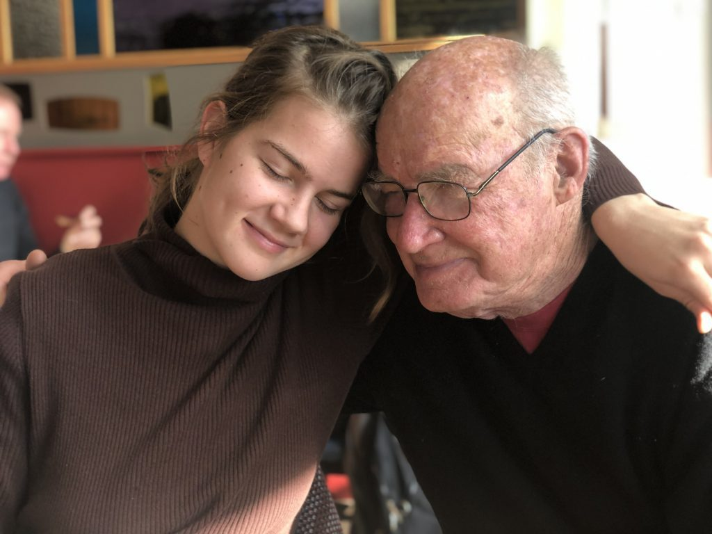

## *For love and compassion, how much time do you need? ~ Baba Hari Dass*

Dear friends,

This month marks the official beginning of winter - the month of Christmas, Chanukah, and other winter celebrations. It’s also the time, at least in this part of the world, of shorter days and longer nights - a perfect time of year to turn inward, even in the midst of holiday busyness. Our work is to stay balanced so we can enjoy all the offerings of the season.

November was a very full month, with weekend programs and community gatherings. The month began with a number of resident karma yogis going on a camping trip. Fortunately the weather was perfect. Those who didn’t join the campers went out for brunch, a rare treat.

- 

  Alex and Daniel - waiting for the ferry
- 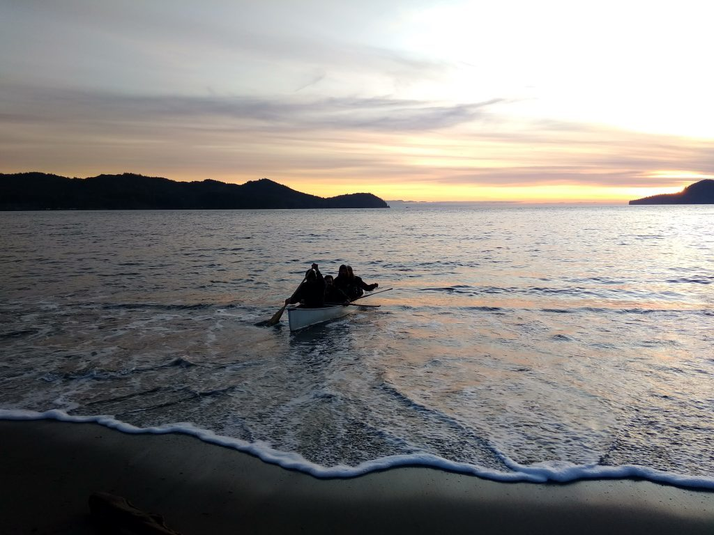

  canoe paddle
- 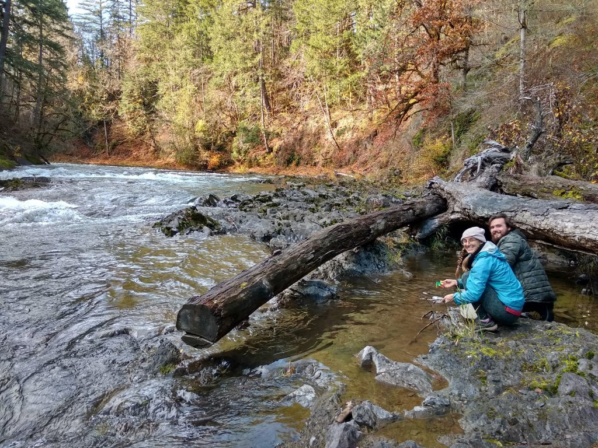

  Selva and Alex

Wednesday work parties continue each month, with recent projects focussed on the garden. Last month featured apples and pears, and now it’s carrot harvest time. Lots and lots of carrots have been - and are continuing to be - harvested. Who knew harvesting carrots could be so much fun! Carrots are showing up in meals in many forms, a favourite so far being carrot cake.

- 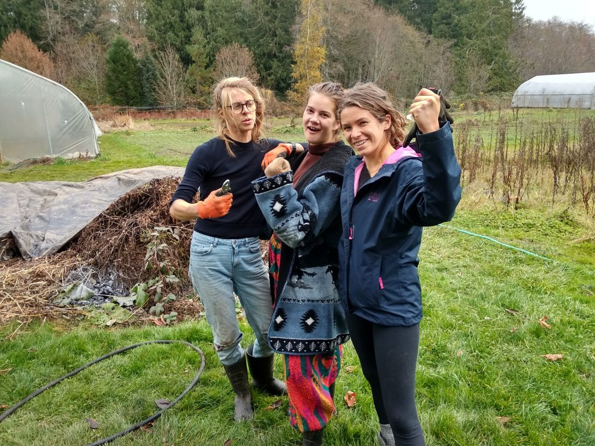

  Lotte, Haley, Sabrina
- 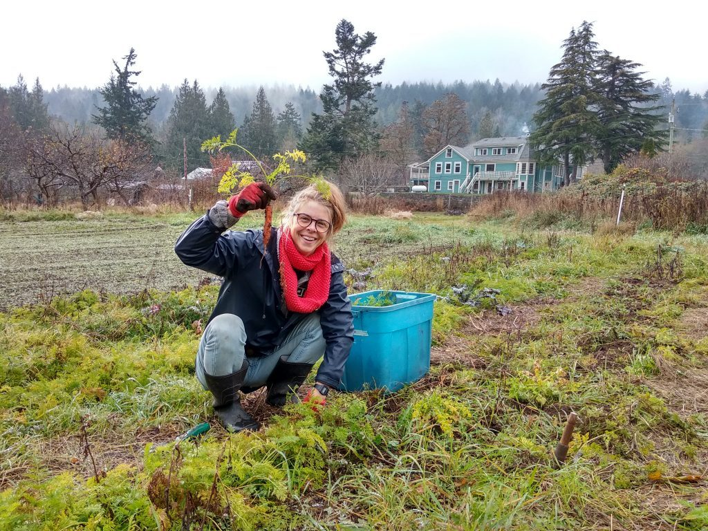

  Lotte
- 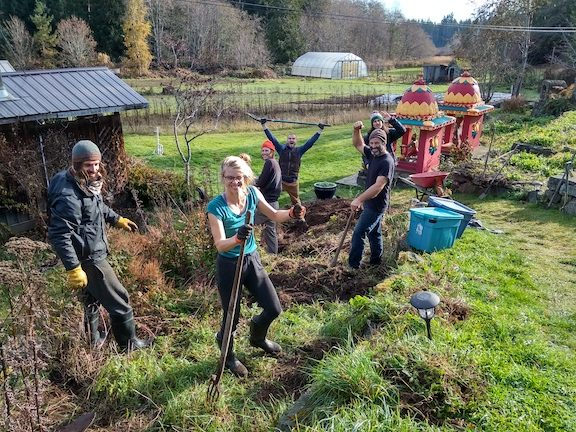

  Daniel, Lotte, Dimitri, Adam, Raven, Alex

We also invite you to take a little tour through the land in this crispy, frosty season.

- 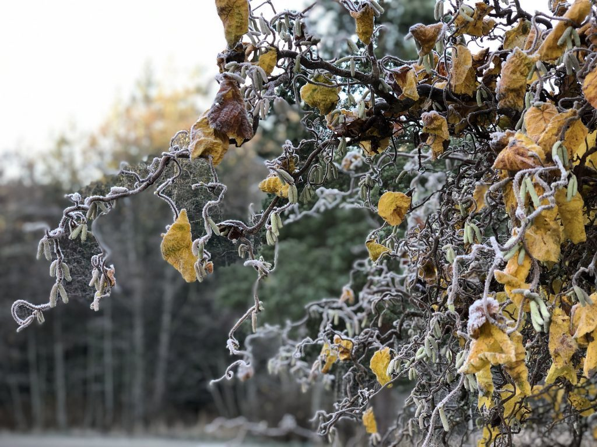
- 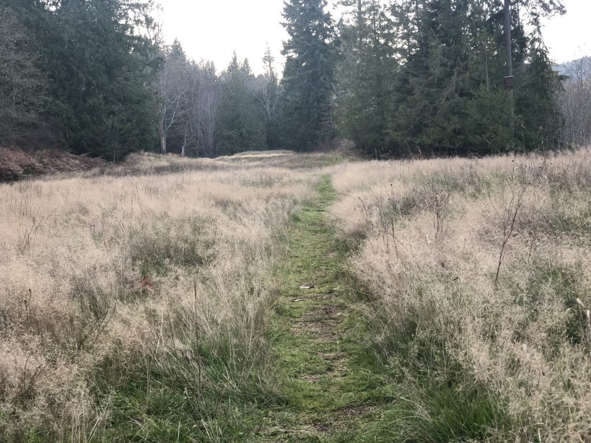
- 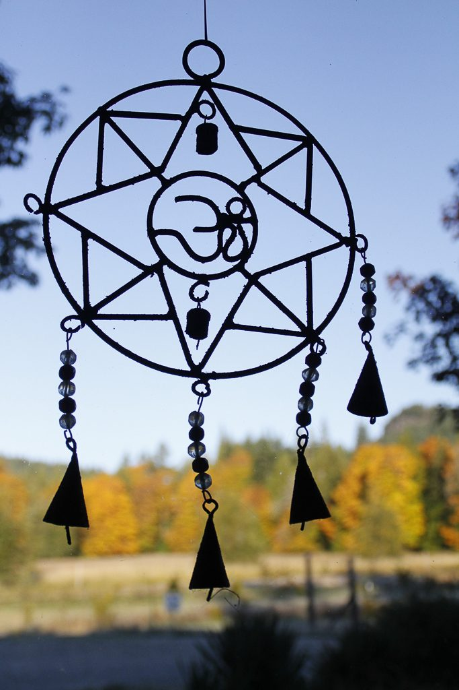
- 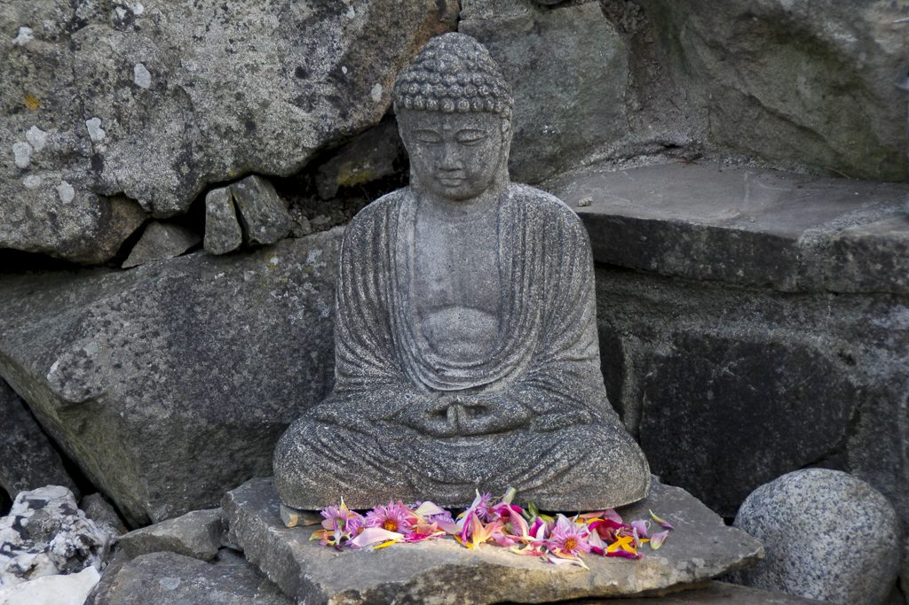
- 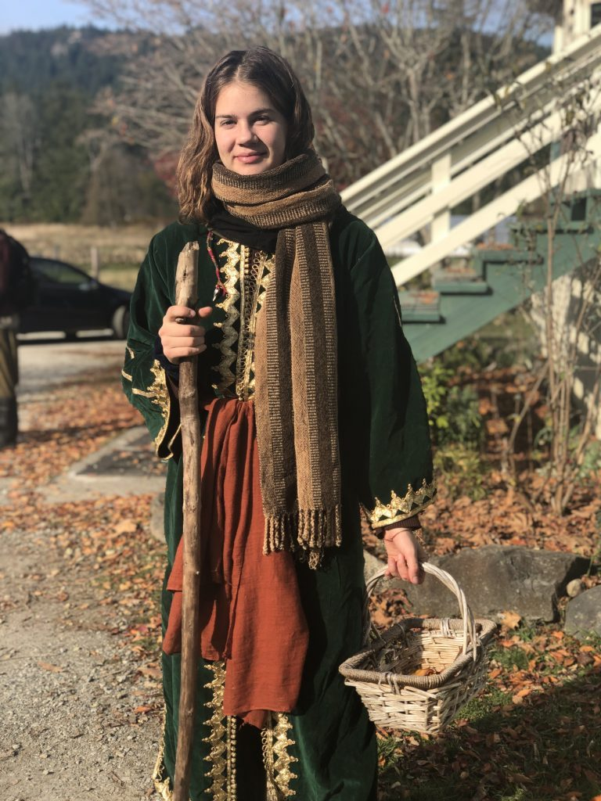

The following weekends were filled with programs, ending with the Going Deeper retreat.  This retreat, designed by Baba Hari Dass, has been offered for many years at Mount Madonna Center, our sister centre in California, and this year we offered it here at the Salt Spring Centre of Yoga for the first time.  This special retreat was led by three excellent teachers: Yogeshwar, Chetna and Jyoti. All the karma yogis at the centre were invited to join the retreat, and they continued to practice mindful silence when they stepped out to help prepare a meal, wash dishes or do housekeeping tasks. The program house was darkened with window coverings to create a cave-like atmosphere. It was an inward journey of silence and peace.

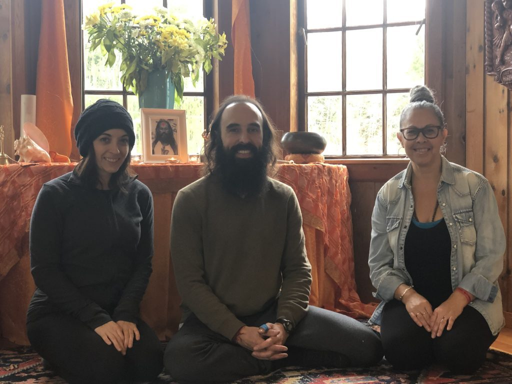

*Jyoti, Yogeshwar, Chetna - Going Deeper Retreat teachers*

To wrap up November, the centre’s winter community developed a one-day workshop called Creative Expression Jam, spearheaded by Moss, offering workshops led by our talented team, ending with a talent jam - lots of fun!

December begins with the Salt Spring Centre School’s annual Celebration of Light (aka Advent). Usha, the founder of the school (at Babsaji’s prompting), began this celebration in the earliest years of the school, and she still leads the community of children, parents, grandparents and everyone else who joins us, in a celebration of light and song. “Be a living light; take a little bit and pass it on, higher and higher and higher. Light and song, higher and higher - lift up your voice in song!” Every child walks through the spiral of cedar boughs and stars, one at a time, to light a candle set in an apple, and places it on one of the trays set in the spiral. Throughout, Usha leads everyone in songs of light from various traditions.  Please join us if you can: Monday, December 2 at 6:00 pm.

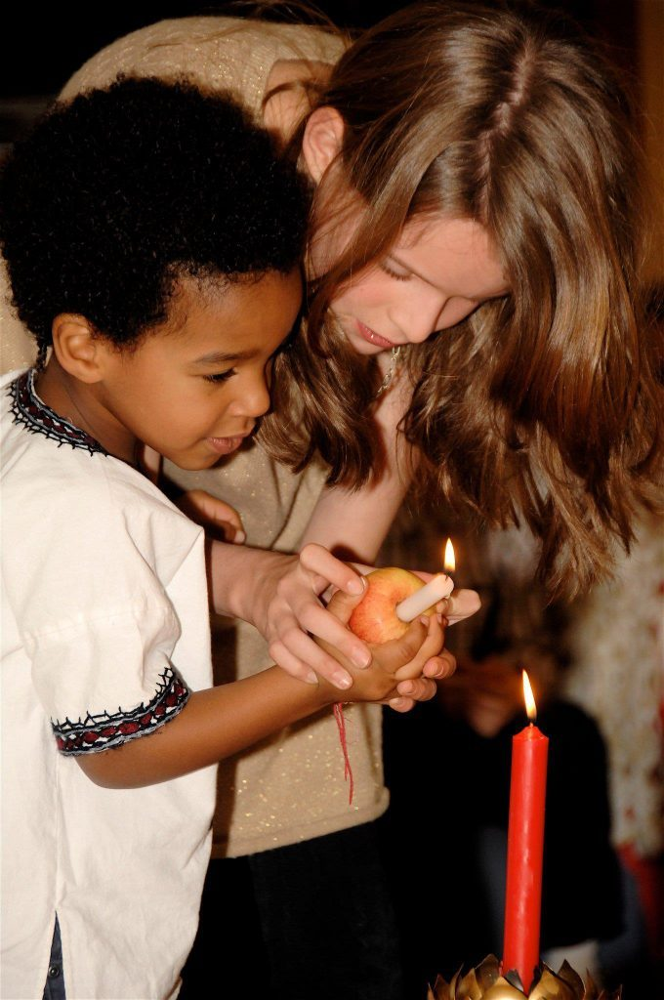

*Celebration of Light*

The following weekend the Centre School hosts another annual event at the centre. Winterfest is a family event, with lots of craft options for kids (rolled bees’ wax candles, table centrepieces, gingerbread people decorating, etc.). Adults and kids can also buy lunch and sweet treats. This joyful celebration is coming up on Saturday, December 7, from 10 am to 2 pm.

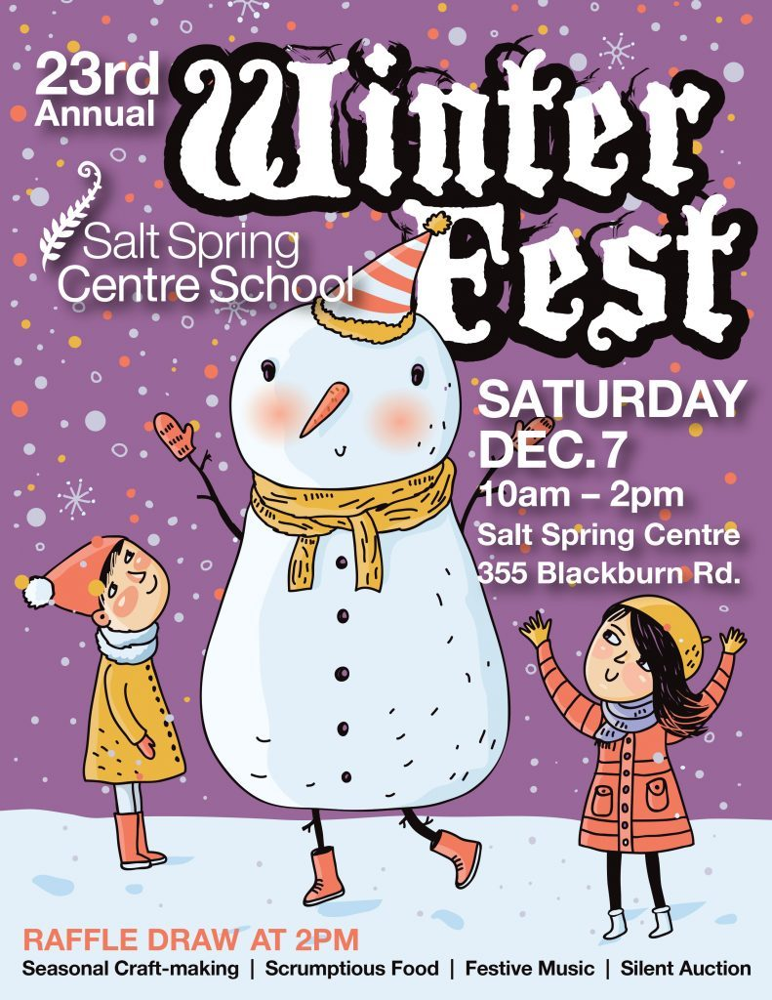

‘Tis the season of craft fairs on Salt Spring. At one time, the centre hosted a Christmas Craft Fair here, but it hasn’t happened for several years; this year it’s being revived! We invite you to come ‘Om for the Holidays’ on Saturday and Sunday, December 14 and 15. You can explore and shop for treasures amongst the wonderful variety of crafts, have lunch, and sing Christmas Carols around the piano in a warm and cosy environment.

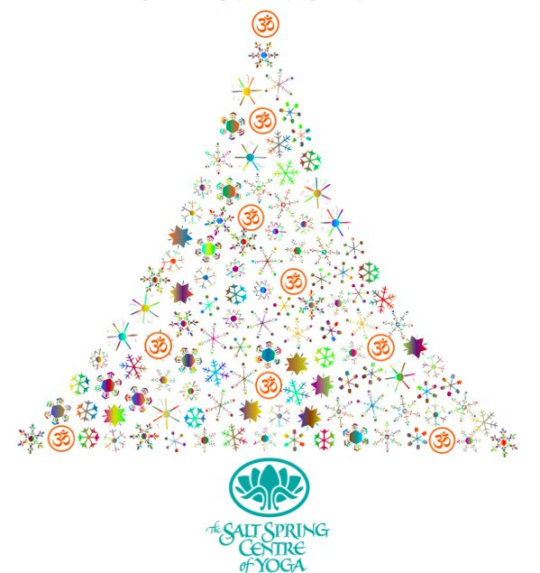

*Join us at 'Om for the Holidays'*

While the centre’s community is smaller during part of the winter when some people go home to celebrate the holidays with their families, programs and other events will continue through the winter. Our very popular [Yoga Getaways](https://saltspringcentre.com/programs-retreats/yoga-getaways/) are now being offered in January, February and March. Another program to look forward to is the [Ayurveda and Yoga Retreat](https://saltspringcentre.com/programs-retreats/ayurveda-and-yoga-retreat/), taught by Natasha Jyoti Samson, on the weekend of January 31-February 2. As always, satsang will continue, every Sunday as will Wednesday kirtan. All our [programs and classes](https://saltspringcentre.com/calendar/) are listed on our website.

## To read:

This month’s personal story, [Life as Art and Art as Life](https://saltspringcentre.com/life-as-art-and-art-as-life/), comes from Pravin Pillay, who has been connected to Babaji and the Salt Spring Centre for many years. His very busy life has kept him occupied in many endeavours over the years, which you can read about in this fascinating story. I’m sure you will enjoy Pravin’s deep musings, and perhaps learn a lot about him that you didn’t know.

One of the ongoing activities at the centre over the past few months has been the weekly writers’ group led by Angelo. Poetry is in the air! Here are a few selections that our resident writers have agreed to share in this newsletter. I hope you will [enjoy these offerings](https://saltspringcentre.com/centre-poetry/) by Angelo, Suneel, Selva, Brandon, Sabrina and Haley, some of our Centre Poets.

May you be filled with loving kindness,  
May you be well,  
May you be peaceful and at ease,  
May you be happy.

Love,  
Sharada
