[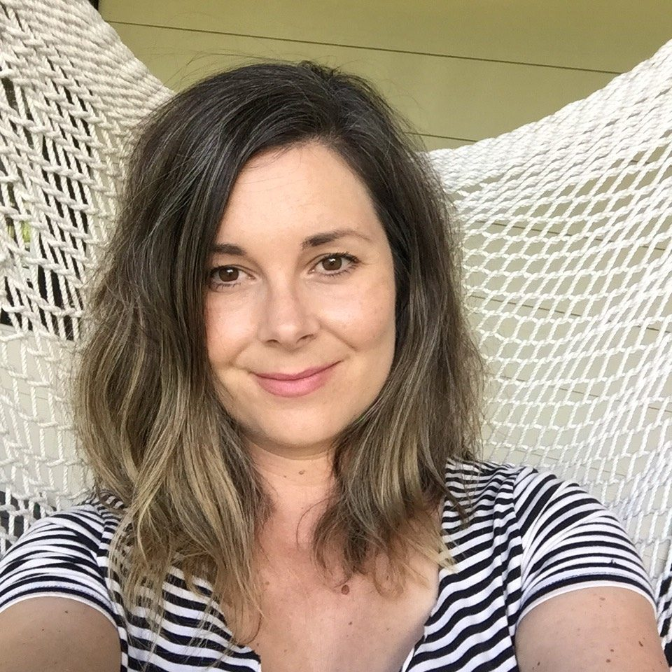](images/13b3833e_Adrienne-head-shot-rotated.jpeg)

My story begins here, in the present. I am a new member of the Dharma Sara Satsang Society and honoured that Sharada has offered me this opportunity to share my story. I’m excited to publicly declare my commitment to you and this community in our shared love for Babaji. I’m in that place in my journey where I say “yes, more Kirtan!” instead of “what, more Kirtan?” :) I’ve become a regular member of the Victoria Satsang, started to share Kirtan with my ukulele and have stopped drinking alcohol and caffeine. My yoga story weaves in and out of many other stories, not least of which is my relationship with my beloved twin sister Amy, whom many of you also know and love. Amy has been a fixture at the SaltSpring Centre of Yoga (the Centre) since she moved to the island in 2013. What many people don't know is that my yoga story and relationship with the Centre started several years earlier.

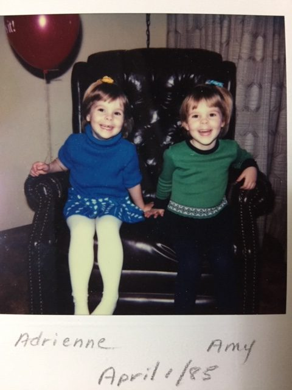

Adrienne & Amy, 1985

I started a physical yoga practice in 2003 while completing my last year at the University of Victoria. One day on campus I ran into a friend from high school who had just returned from India. We chatted for a few moments and parted ways. He then called after me and said, “Hey Adrienne, do you do yoga?” I hesitated for a moment and then said “Yes, kind of.”  He then handed me a small book called “The Perfection of Yoga” he had received from a roadside Sadhu preaching the true meaning of yoga to any westerner who would listen. He had promised to pass the book along, and so I was introduced to Krishna, the powers of meditation and Bhakti yoga. I flipped through the book and found it dense and hard to understand.  It was not really written for westerners with no context for the teachings. All I was able to absorb was that the purpose of physical practice is to prepare the body for meditation, and the purpose of meditation is to reunite with Lord Krishna. This part resonated with me. I liked the idea of personally experiencing God and could see the connection between a physical practice and a physical experience. As a dancer, singer and musician I innately understood the power and potential of our bodies as a means to mystical and transcendent experiences. I would regularly get lost performing Chopin on the piano or in the flow of a well choreographed dance. I was captivated by the idea that our bodies could be used somehow to help unlock the mysteries of the universe, to discovering Truth. In addition to practicing dance, music, and our studies at school, Amy and I were always seeking Truth. Dissatisfied with the information I was receiving from the adults in my life and the dogma I was learning at church, I once told her that I thought we should start our own religion. Drawn to all things esoteric and mystical we spent hours wandering around the local (and only) metaphysical bookstore in our hometown of Campbell River where we found books on dream analysis, Tarot, magic and the healing powers of crystals. Pondering questions like, “When does the soul enter the body?  If as identical twins we were once one cell, does that mean that we were also once one soul?” This new book I had received on yoga aligned with a deep knowing that I felt but did not yet understand: that we are more than our physical selves and that you can only know God through direct experience. My spiritual development was still just an idea, a shadow knocking gently at the door of knowledge. It would be a few more years before it knocked the door down.

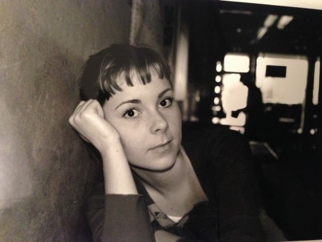

Adrienne @ university 2005ish

My spiritual journey began in earnest after a series of anxiety attacks in 2005. I was living in Vancouver, busy working hard and playing hard like all the GenX’ers had taught us to do. But I was in pain. And I realize now it was a spiritual pain. It took an extreme event like an anxiety attack to get my attention; for me to hear and follow the voice of my soul. “This is not you.”  That’s all it said, and I knew the meaning. I knew that I was not my anxiety, that it was a symptom, a message delivered from spirit through the language of my body in a way I could understand. I then began a journey to learn the language of my soul. This journey began with healing my anxiety through acupuncture, massage, dietary changes, pilates, yoga, counselling, and somatic body work. I started to listen.

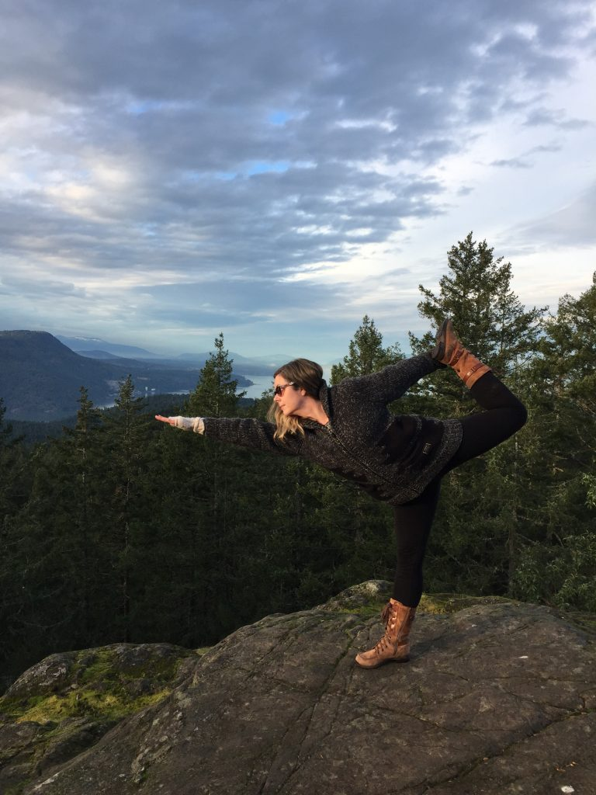

Asana on a rock

In January 2006, I set out on a 3-month solo backpacking trip through South America. I needed to experience real freedom, learn to trust myself and face my fear of being alone. The trip was transformative in more ways than one. I had a spontaneous spiritual experience at the top of Machu Picchu. It was in the main courtyard after a long hike that morning to reach the ancient city before the train arrived with all the other tourists who had not hiked the Inca Trail. The trail itself was an experience. I ran for the whole third day, not far behind the porters who were very surprised to see this young gringa arrive at camp while they were still setting up. The day before I had touched a quartz cliff face where human sacrifices used to be performed and was shocked with energy and started to cry uncontrollably. Thankfully my guide was there to catch me and hold me up. “This happens to some people,” is all he said.  When I sat in the courtyard at the top of Machu Picchu I thought, well maybe I should try some meditation - you know, see what happens. I hadn’t done it before, but I thought this might be a good place to start. Almost instantly I was engulfed in a pure white light and my eyes fluttered violently. I’m not sure how long I sat there; it felt like 5 minutes, but it could have been an hour. I was later told by a psychic that the ancients had taught me something during that day that I would later remember. I think I’m finally starting to remember. I’m slowly waking from the dream.

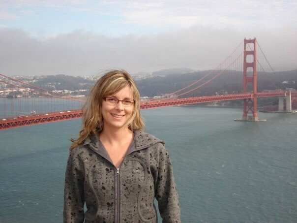

Adrienne in SF 2008

When I returned home I found a reluctant spiritual teacher in my roomate, joined a mastermind discussion group, a women’s circle and started to read voraciously and study Reiki. By 2008 I had become a certified Reiki Practitioner, completed my Life Coaching training, Indian Head Massage training, become a vegetarian and got a tattoo. This was it. I was now consciously walking the path, and there was no turning back. I would then begin what would become a strong connection to California. I attended a very expensive, experiential leadership program by the Co-Active Training Institute (CTI) at a retreat centre just outside of San Francisco. The program consisted of four retreats over 6 months, but my relationship with California was just beginning. The summer of 2009 I attended Burning Man, came home to Vancouver, quit my job, declared bankruptcy and headed back down to SF for a few months. I then moved in with Amy in Victoria while waiting to get into graduate school at the California Institute of Integral Studies (CIIS) in Somatic Psychotherapy. I enrolled for the 2010 Fall semester and moved to San Francisco.

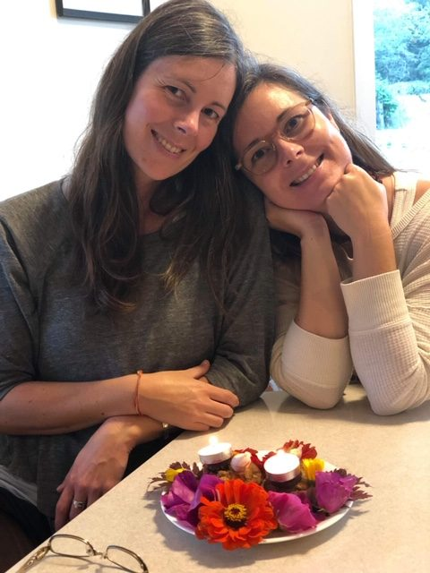

Amy & Adrienne birthday September 2019

I met Babaji by divine accident 9 years ago. At the end of August, before the semester started at CIIS, the Somatic program hosted a weekend retreat at the Mount Madonna Center (MMC).  There, in the shoe room, I met Babaji. We were alone, looking for our shoes. I thought, wait, is this the Guru they were talking about? Chalkboard, check. Yep, this is him. What should I say?  Should I ask him a question? What could I ask that wouldn’t sound childish or ignorant? And in an instant the answer was, “nothing.” There was nothing I could ask, nothing I could say. So I faced him, caught his eyes in mine, smiled and gently nodded a silent hello. He returned my smile, paused for a moment, and went on his way. Years later when Amy started to attend the Centre she explained that there was a sister centre in California called Mount Madonna. “Oh, I’ve been there,” I said, “and I met the Guru.”  Amy did not believe me at first. I think “No you didn’t,” were her exact words. “Yes I did! He doesn’t talk and carries a chalkboard!” Amy and I were still a bit competitive with each other at that time, as most siblings are. She had her own journey and I had mine. It’s been such a blessing that over the years our journeys have led us both to find Babaji’s teachings, the Centre, and back to each other.

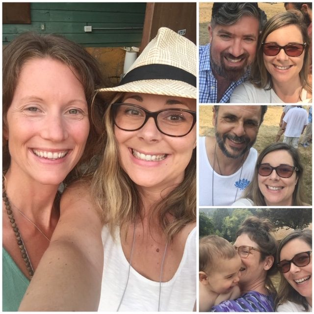

ACYR 2017

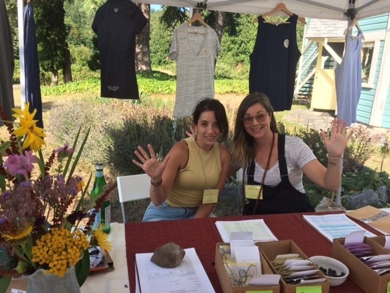

ACYR Jyoti & Adrienne 2019

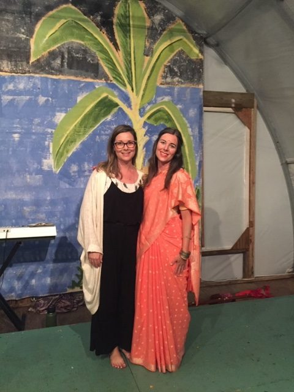

Adrienne & Amy as Sita 2018

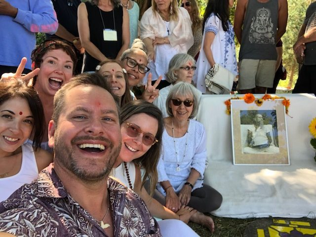

ACYR closing circle 2019

I started to attend the Annual Community Yoga Retreat (ACYR) in 2014 when Amy was helping to organize it. I started by helping Amy with her duties, and for several years that was my role. I then registered as a Karma Yogi and found myself fully embraced by my Satsang brothers and sisters. Over time I found my own place and identity at the Centre. I started out as “Amy’s sister” and am now known by my name. I no longer feel like an outsider. In a few weeks I will be returning to MMC for their annual New Year’s Eve celebrations - without Amy!  I am sad she is not able to come with me as I love and cherish our time together, especially time we can spend together in devotion, but in writing this I realize that I am completing an important cycle that I started for myself many years ago. I am returning to the scene of the crime, where in one moment, my life was up-levelled. This was the reason I was in San Francisco; I never completed Grad School, I met Babaji.

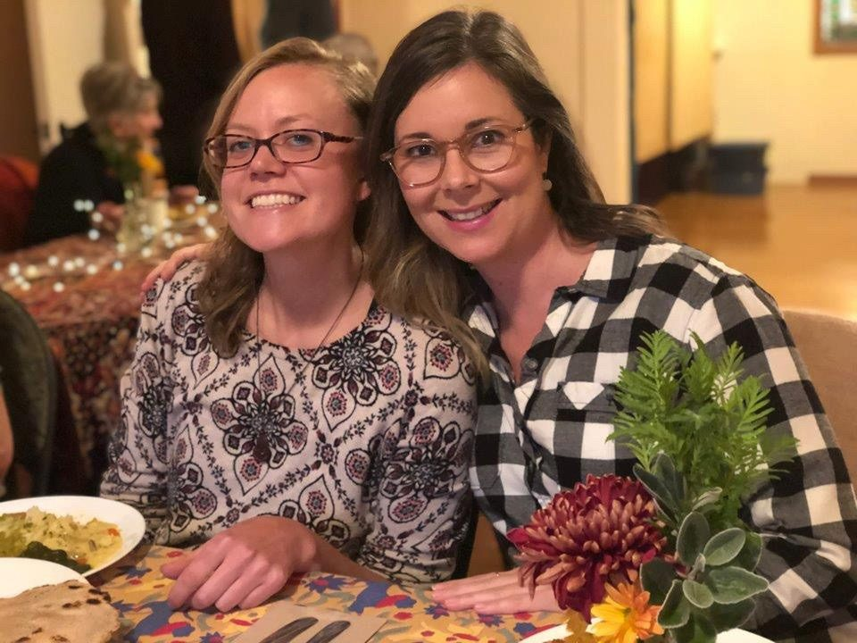

Johanna & Adrienne, Oct. 2019

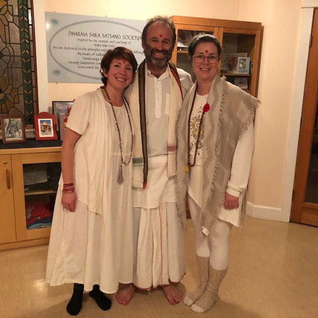

Courtenay, Raven, Adrienne - Yajna Nov. 2019

I was initially confused by my sudden move to Victoria two years ago, but I now understand that Victoria is also an important place in my story. So much has effortlessly shifted for me since moving here. I can easily visit the Centre for a Yajna or Satsang on the weekends. I have a sober community here that includes Dance Temple and our yoga Satsang family. I feel loved, supported and at home at last. I’m looking forward to sharing the years to come together.

If you love Babaji then the Centre is your home. Entrance requires only an open heart. Lokah Samastah Sukhino Bavantu.

With blessings, love, and gratitude,

Adrienne
