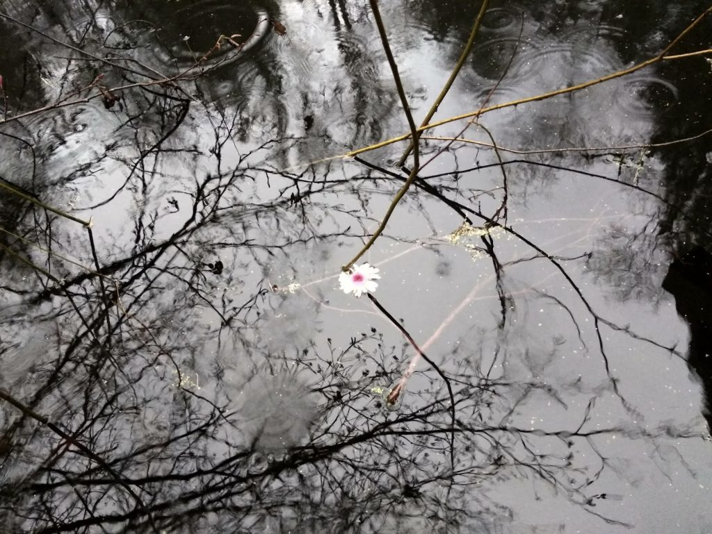

## *“And love says, ‘I will take care of you,’ to everything that is near.”  ~ Hafiz*

Dear friends,

May this new year, this new decade, bring peace to your heart. Whatever is going on in your life, my wish for you is that you will remember the goodness in your own heart. As Ram Dass, who recently passed away, said, “We’re all just walking each other home.’

In the past month we’ve celebrated the light within us at the school’s Celebration of Light (aka Advent), Solstice, Christmas, Chanukah, and the gradual lengthening of the days. We also had a cozy, warm craft fair - Om for the Holidays. Here are some photos from that event.

- 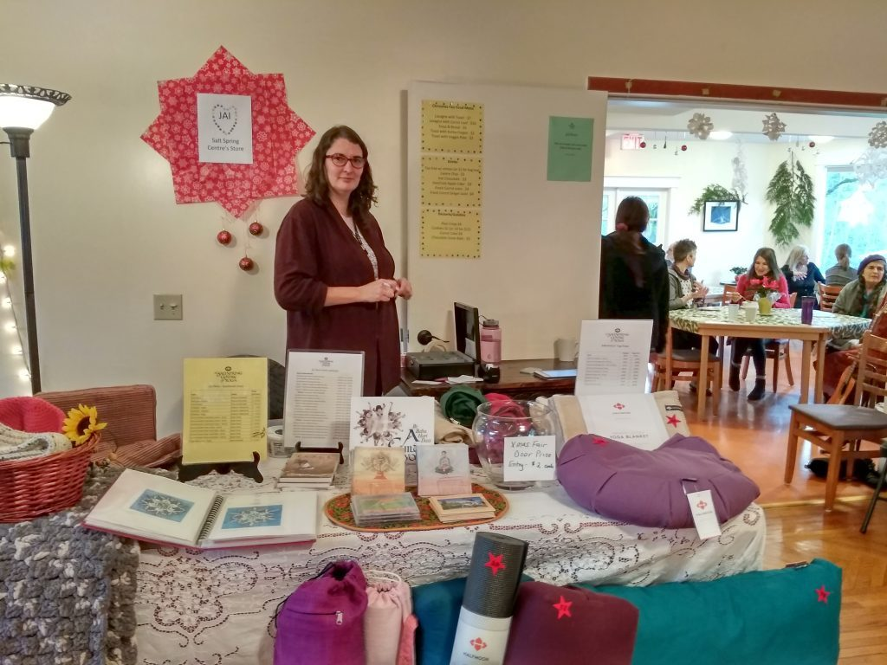

  Janell at the Jai store table
- 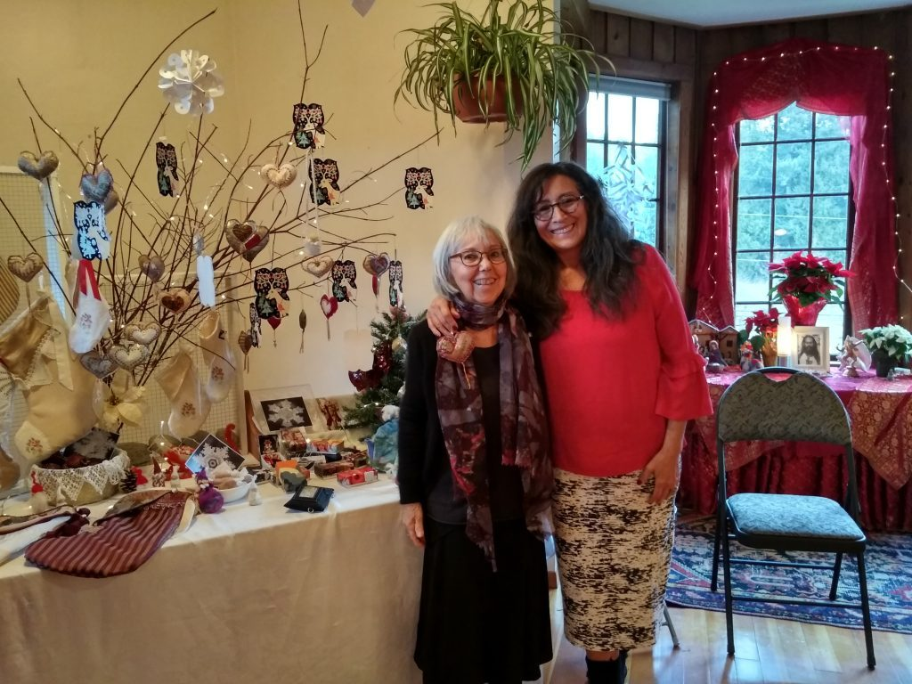

  Sharada & Satya in front of Satya's table

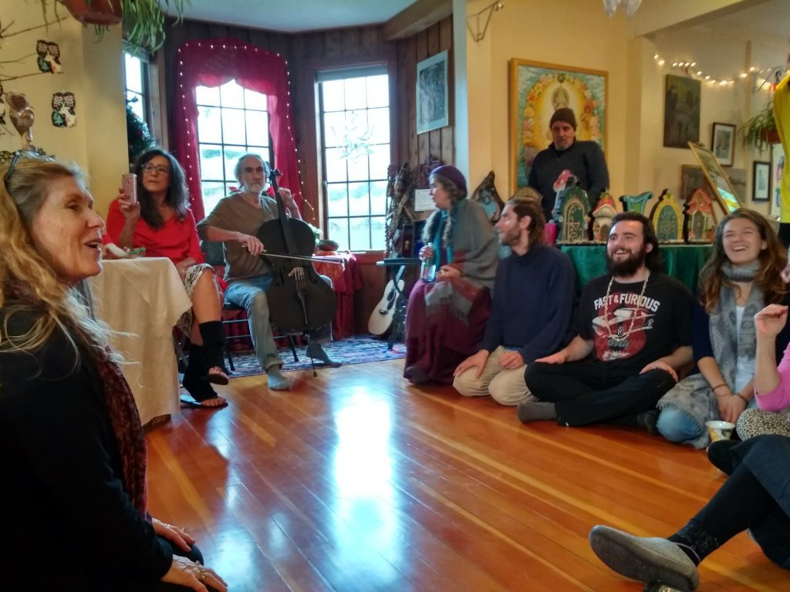

*Singing together at OM for the Holidays craft fair - Anuradha, Satya, Purna on cello, Kim, Dimitri, (Sanatan behind), Alex, Sabrina*

We held a ‘farewell for now dinner’ for Courtenay, and we look forward to her return sometime in the next few months. Meanwhile, we miss her smile and her sparkle.

- 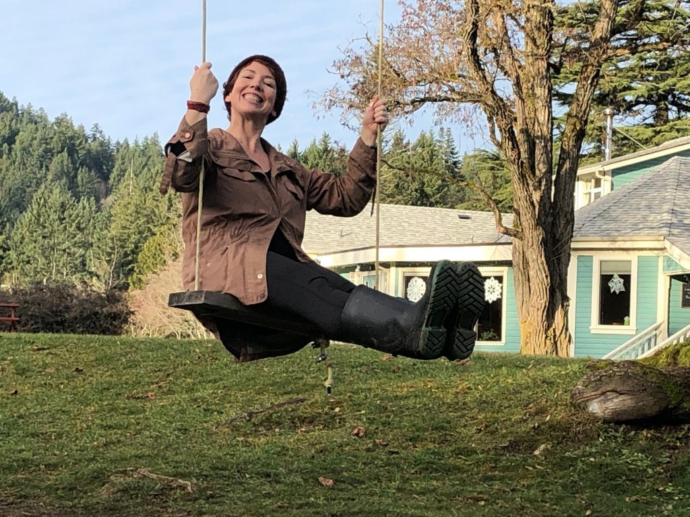

Several Centre karma yogis went home to celebrate the holidays with their families, but most will return this month. Here’s a peek at what we’ve been up to.

- 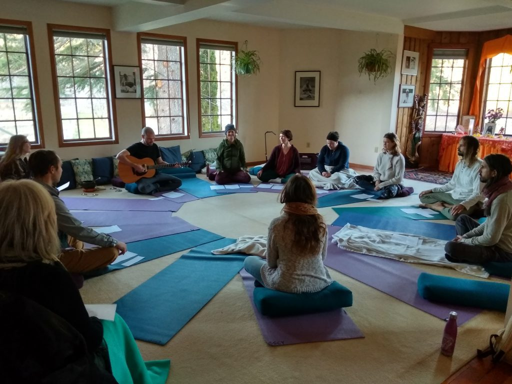

  Creative Expression workshop led by Adam
- 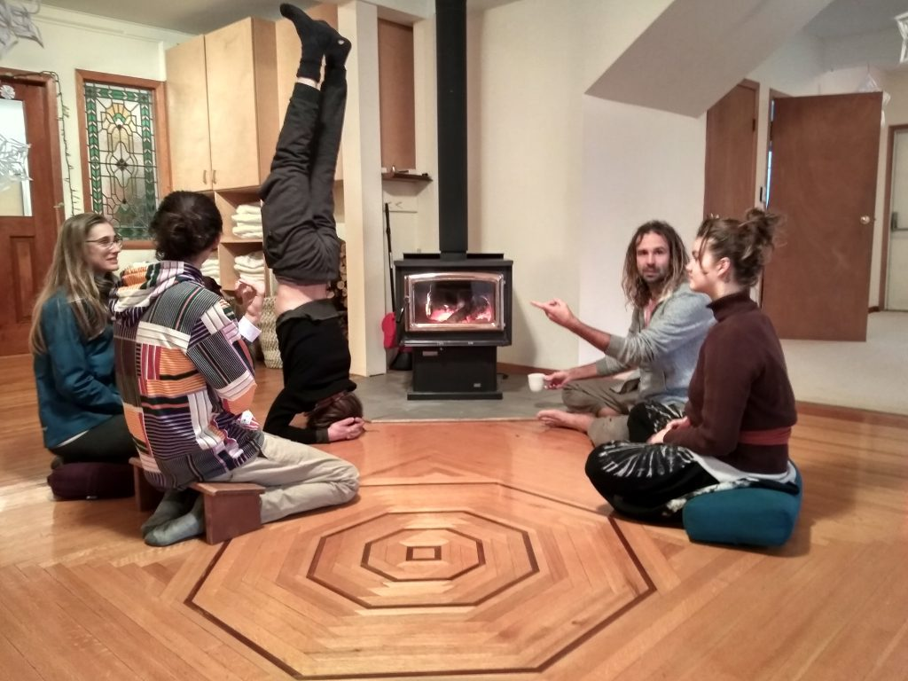

  Sitting (mostly) around the fire: Alex, Selva, Daniel (headstand), Moss, Haley
- 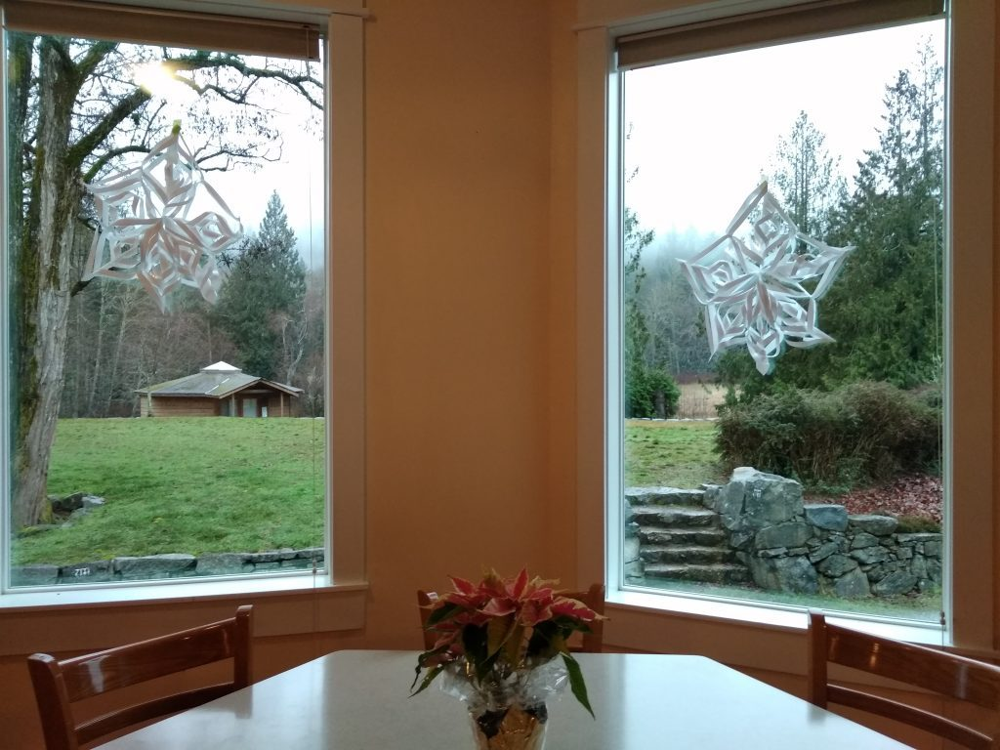
- 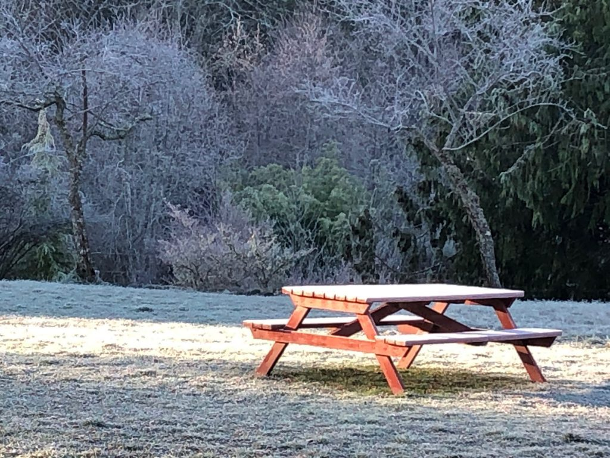
- 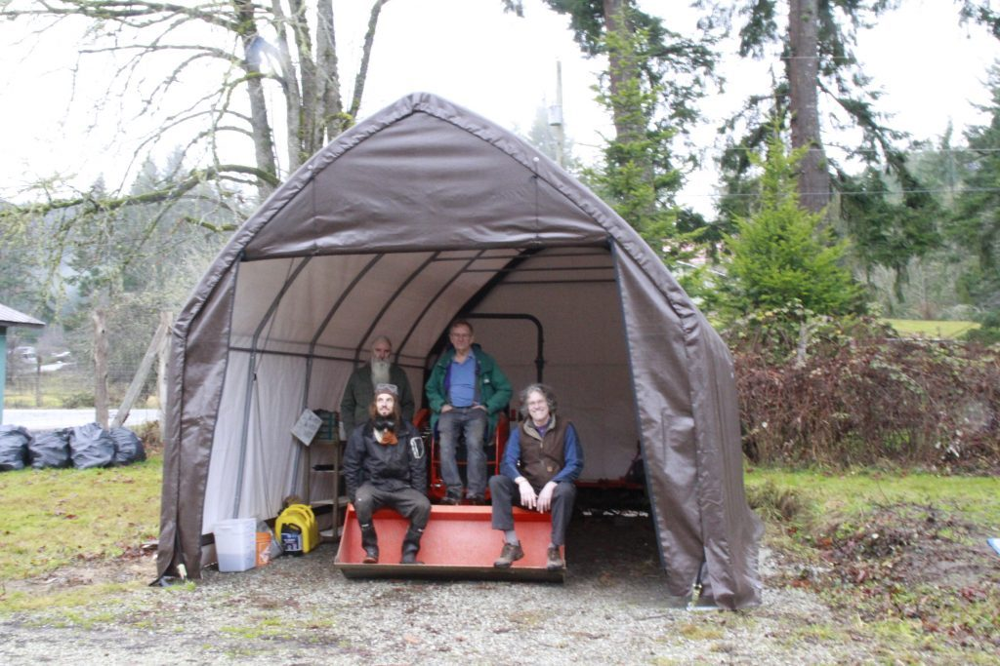

  The tractor shed team:   
  Suneel, SN, Daniel, Ompk
- 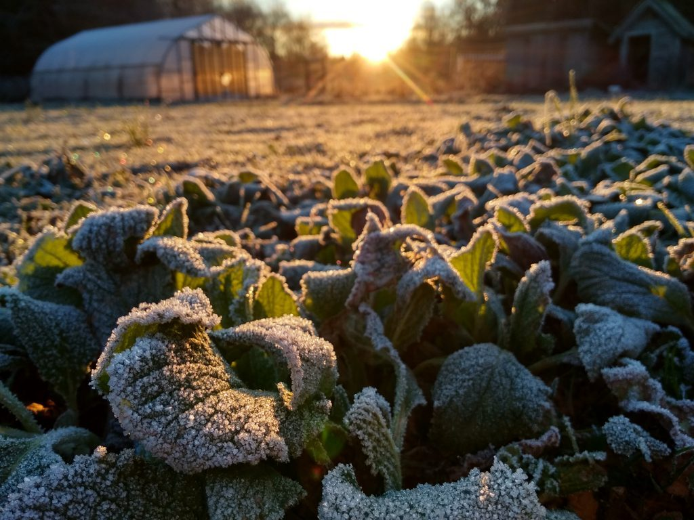
- 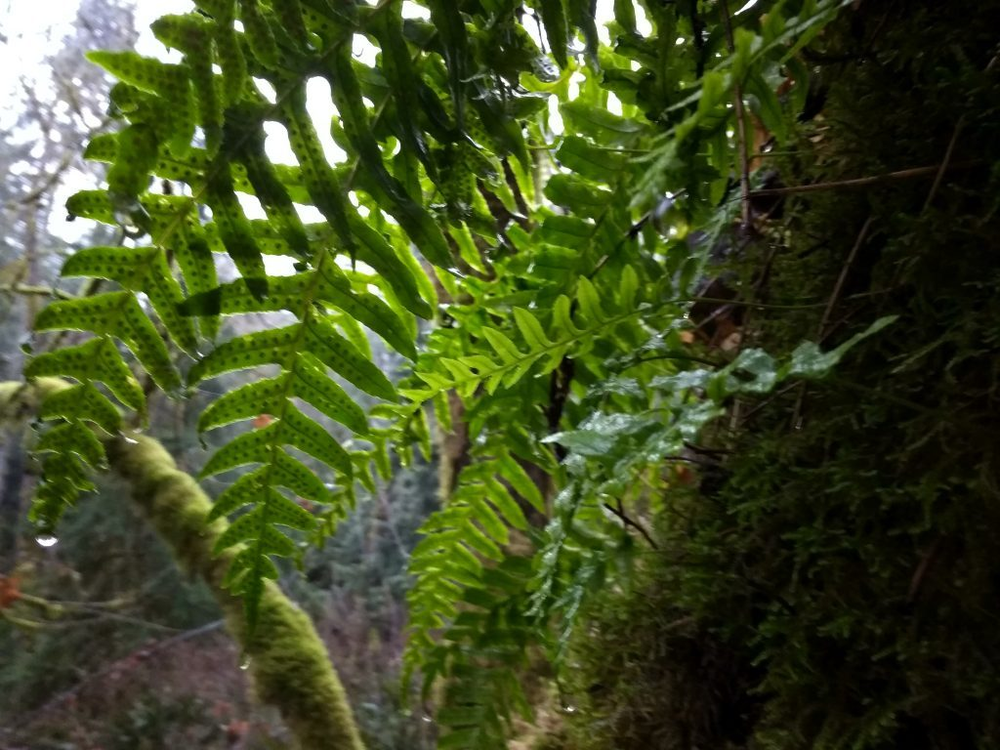
- 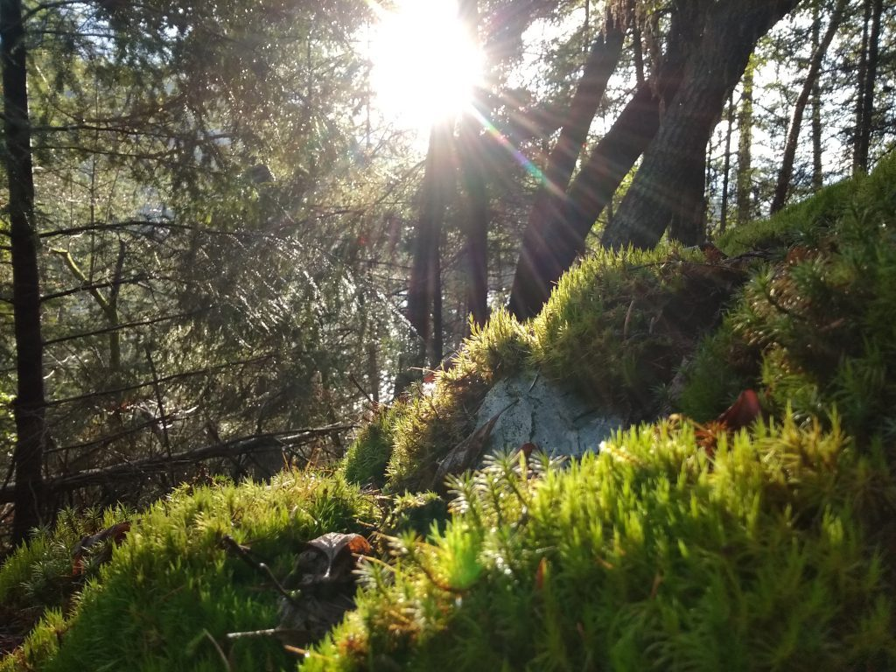

While our big sister centre, [Mount Madonna Center](https://www.mountmadonna.org/), brought in the new year with chanting and meditation, followed after midnight with music and dancing, here at the Centre New Year’s Eve was celebrated in our traditional, quiet way, with kirtan and meditation, organized as always by Rajani and Sanatan. It was a peaceful, meditative entry into the new year.

Programs are continuing throughout the winter, with [Yoga Getaways](https://saltspringcentre.com/programs-retreats/yoga-getaways/) in January, February and March. Jyoti will be leading a [Yoga and Ayurveda workshop](https://saltspringcentre.com/programs-retreats/ayurveda-and-yoga-retreat/) here at the end of this month, January 31-February 2, which is sure to be informative and inspiring. Other groups will also be offering their programs at the Centre this winter.

Satsang and kirtan continue throughout the year, and Yogasutra study will resume this week after a brief hiatus over the holidays.

## The Night of Shiva - Om Namah Shivaya

“Salutations unto Thee, thou All-pervading and great Lord. Thou art Liberation itself, and the revealed scripture is Thy embodied form.  I worship Thee, the unborn, attribute-less and unconditioned One. Thou are without any desire. Intelligence itself is Thy nature and the sky Thy garment.” Tulsidas: Ramayana, *Shivashtaka* (Meditation on Shiva.)

Shivaratri is coming up in February. We invite all satsangis and friends to share the night of Shiva with us.  Shivaratri is the fourteenth day of the lunar fortnight, when the moon is waning; this is the night of Auspicious Darkness or Night of Shiva. This year Shivaratri falls on the night of the 22nd of February, going through the evening until the new moon day of the 23rd. [Read more here](https://saltspringcentre.com/shiva-ratri-feb-2020/).

## There are many other festivals that will be celebrated at the Centre throughout the year.

March brings us Choti Holi (Little Holi) and Holi, early spring festivals that fall on the full moon. Holi is celebrated in India by playing pranks, water fights and throwing coloured powders. We’ll see how far we go here at the Centre. Stay tuned.

In April we will celebrate Hanuman Jayanti (Hanuman’s birthday), with morning arati at the Hanuman temple, followed by a parade around the land with a small Hanuman on a litter. After that there will be chanting of 11 rounds of the Hanuman Chalissa and a mantra yajna in the satsang room, followed by a community meal.

The next big celebration will be Guru Punima on July 4, with details to come closer to the date.

All other ritual celebrations are [listed in the calendar](https://saltspringcentre.com/calendar/) on the Centre’s website. Ongoing yoga classes are also listed there.

## To read...

This month’s community story is from Adrienne Cousins. She says that when she first started coming to the Centre, people knew her as Amy’s twin sister, but she has since found her own place in this community, both at the Centre and as a major part of the Victoria satsang. In her story, she says she met Babaji “by divine accident” in the shoe room at Mount Madonna Center. Read “[More Kirtan!](https://saltspringcentre.com/more-kirtan/)” to find out more of Adrienne’s story.

As we move into a new year and a new decade, it is helpful to review our lives and consider how we want to move forward. It’s so easy for us to become mired in the day-to-day routines of our lives, forgetting the sacredness of life. I invite you to read “[Reconnecting with the sacredness of life](https://saltspringcentre.com/reconnecting-with-the-sacredness-of-life/)”.

## *“Love and hate are two opposites. If one is capable of removing hate within, then love will emanate without.” ~ Baba Hari Dass*

Love,  
Sharada
