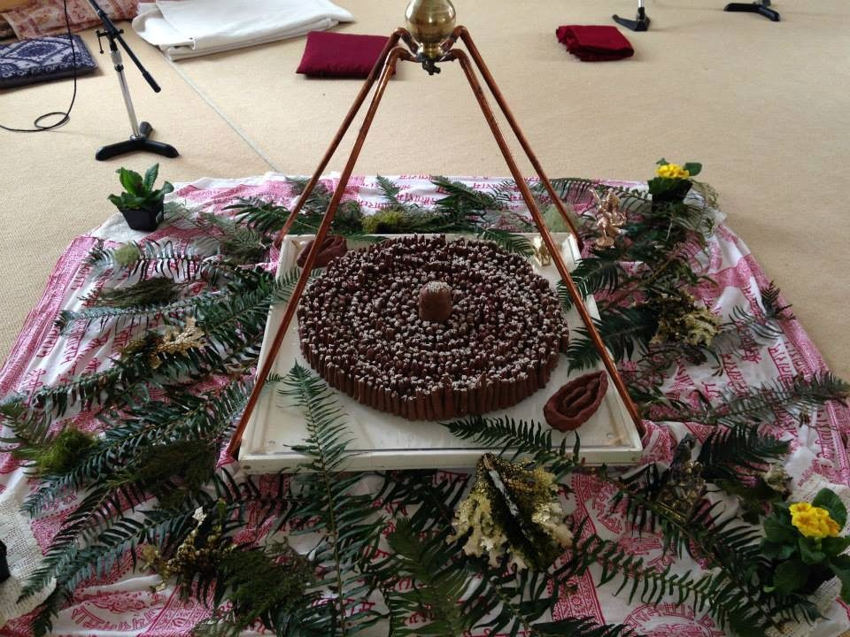

*1008 lingams and 2 yonis*

## *Om Namah Shivaya* “To Shiva, I bow.”

Salutations unto Thee, thou All-pervading and great Lord. Thou art Liberation itself, and the revealed scripture is Thy embodied form.  I worship Thee, the unborn, attribute-less and unconditioned One. Thou are without any desire. Intelligence itself is Thy nature and the sky Thy garment.”

Tulsidas: Ramayana, *Shivashtaka* (Meditation on Shiva.)

## **Shivaratri, Night of Shiva**

We would like to invite all satsangis and friends to share the night of Shiva with us.  Shivaratri is the fourteenth day of the lunar fortnight, when the moon is waning; this is the night of Auspicious Darkness or night of Shiva. Shiva’s name means “the Auspicious One.” This year Shivaratri falls on the night of the 22nd of February, going through the evening until the new moon day of the 23rd. This particular night is considered the night of Consecration, of Dedication and of Illumination.

Our celebration begins with the making of 1008 Shiva Lingams on the morning of the 22nd. The Shiva Lingam (“mark or sign”) represents the formless aspect of Shiva, unmanifest nature, as well as procreative power. Placed in a circular pattern while repeating certain mantras, the mandala that is created also represents the integration of masculine (Lingam)and feminine (Yoni, representing manifest nature). This is symbolic of the entire creation and a form of the universe itself.  Shiva has many names: *Shankara* giver of peace, *Shambho* granter of welfare and the beneficent abode of joy, *Hara* remover of pain and ignorance and *Mahadeva* Great God.

Through fasting, chanting ritual and prayer throughout the night, we purify the mind and offer our ignorance to that aspect of “God who takes away,” the Remover or Destroyer. Removing our separateness, our mistaken identity, and identifying with the true Self— this is the aim of offering to the Auspicious One within on Shiva’s night.

Please contact Rajani at 250.537.9537 or [rajanirock@me.com](mailto:rajanirock@me.com) if you are interested in participating in making the Shiva Lingams or offering in the midnight *Shiva Puja* or in the *Maha Shivaratri Puja* on Sunday morning. Rules for offering will be explained and names will be drawn among those who sign up. All are welcome to come together on this auspicious night of celebration and worship. Our Satsang is strengthened and made joyful by practicing together — in appreciation of the teachings, our beloved teacher and each other.
