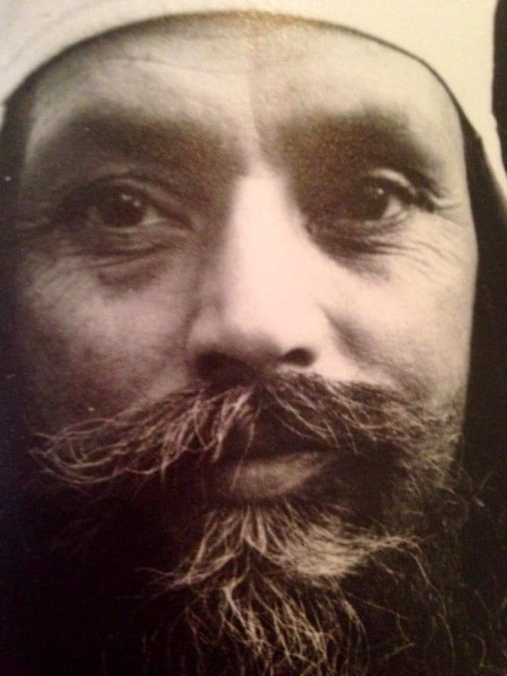

## Changing the Angle of the Mind

Do you find yourself getting annoyed, irritated, or downright angry when things don’t go well (meaning not the way you want them to go)?  It seems like a big deal to you, although it might not seem that way to people around you. Why is that?

Up close, our problems loom large, and may be all that we can see. When you’re in the middle of some predicament - say, a disagreement with someone - it’s easy to get stuck, unable to see a peaceful resolution. At that moment, you may not even want a peaceful resolution; maybe you just want to be right. But what if you could step back, way back, and see it from a distance?

When you’re watching a movie about someone who is facing challenges (and who isn’t?), you have some perspective. Even if you can relate to the character in the movie, it’s not your life. When facing challenges in your own life, it seems much more serious; it’s real to you. When a character in a movie falls on their face, you may even find it amusing;  it’s not personal. But if you’re the one falling flat on your face, it doesn’t seem funny at all.

What do you usually do when confronted with something you don’t like, whether it’s criticism from your boss,  hearing someone talk about political views you completely disagree with, or even that you’ve caught the flu? Something you don’t like: it could be anything.

Do you get angry and defend your position? Do you argue? What about your response when you get the flu? Do you blame the person who came to work, coughing and spreading germs? Maybe anger isn’t your default mode; maybe you feel depressed or weak, convinced that there’s nothing you can do, that you’re helpless in the face of your problems, that nothing you do or say will ever change the situation.

Some problems can be overwhelming - catastrophic global events for example. These situations require a response, and we have a responsibility to do something.  The difficulty is that we make it into “my problem.” Our ownership is the problem. There is suffering, but seen from our usual vantage point, it’s “my suffering”, which reinforces and strengthens the suffering.

*The secret is not to own the pain.*

If you don’t own the pain - that is, you don’t identify with it - the pain is still there, but there’s some distance between you and the pain. You don’t deny it, you try to understand it, and you take action as needed, but you don’t add an extra layer of suffering. If you can take the position of the witness, you can see what’s happening and see the ensuing pain, but without it defeating you.

You’re free to play your part completely, but without getting trapped by your emotions. This doesn’t mean you shouldn’t do anything. If you’re ill, you do what you can to get well. If someone is threatening you, you need to protect yourself or get out of the way.

There are many practices to help us pay attention to our habitual patterns. Simple doesn’t necessarily  mean easy, but with regular practice, new habits can develop. There are many tricks; here are a few.

See what works for you.

**Watch out for the habit of complaining:** Notice when you find yourself complaining, even about the weather. Changing that simple habit can transform your life. Thich Nath Hahn recommends asking: What’s not wrong? When you hear yourself complaining, turn it around and focus on what you’re grateful for.

**Remember to breathe:** Notice what’s happening in your body. Is your heart racing, do you feel tightness in your chest, are you forgetting to breathe? When you notice, stop, and focus on your breath. Breathe deeply and slowly, and pause between breaths. This simple practice can bring you  back to the present moment.

**Switching things around:** When you feel a negative emotion, deliberately choose to focus on its opposite quality. If you’re angry, focus on compassion, first for yourself, and then for others - and for life itself.

These simple practices can give you the time you need to break the cycle of negativity, and allow your nervous system to relax.

*One can be free from the demons of fear, anger and pain by living in the world unattached, desireless. It is difficult, but living in the world with desires is not easy either. If both are difficult, then we may as well try to unwind ourselves from the trap rather than wind it more tightly.*

*The world is not a burden; we make it a burden by our desires. When the desires are removed, the world is as  light as a feather on an elephant’s back.*

Contributed by Sharada  
Text in italics is from writings by Baba Hari Dass

---

**Sharada Filkow,** a student of classical ashtanga yoga since the early 70s, is one of the founding members of the Salt Spring Centre of Yoga, where she has lived for many years, serving as a karma yogi, teacher and mentor.
