**by Clare Cullen**

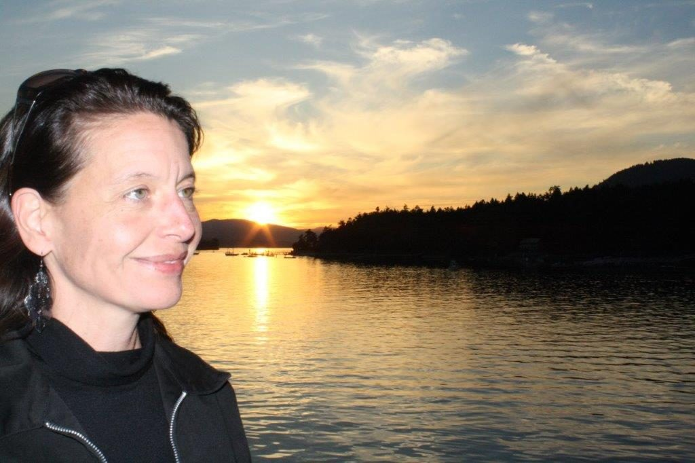

## Meeting Community Where You Are

I came to the Salt Spring Centre of Yoga almost by accident – and yet nothing really happens by accident, does it? I was seeking community, a fresh start and a purpose – and while I would not have articulated it at the time, a spiritual path. I found all of these during the 6 years I lived on Salt Spring Island with my family when I had an almost-daily connection with the Centre. When we moved back to Vancouver in 2012, this connection only deepened, despite the distance, to the point that today I feel more connected to the Centre, the teachings and the lovely community of people - the satsang - than ever before.

My husband, Michael, and our two children, Zoe and Aaron, and I moved from Vancouver to Salt Spring in 2006. In the city, our more-than-full-time careers were flourishing, I was on a number of non-profit boards and our kids were engaged in all sorts of activities after school and daycare – and our lives had never been so busy, stressed and over-scheduled! We needed a change.

I had lived in cities all my life, growing up in Toronto and then Vancouver, and always yearned for a rural life – ideally on a farm full of animals. Michael longed to have a big vegetable garden and, secretly, a pick-up truck. We both wanted a smaller community where our children would feel supported and we could all enjoy a slower pace of life. Once we decided Salt Spring was the place for us, things moved quickly; I lined up a part-time job at the credit union and Michael would telecommute for his writing work. We bought a house on Stewart Road - a little rough around the edges but with lovely trees and a view of the ocean. Propane-powered pick-up truck? Check. Chickens? New puppy? Check, check. We found a childcare spot for 3-year-old Aaron and just needed the right school for our 7-year-old, Zoe.

On one of our visits to the island to house-hunt, we were drawn into the charming Fables Cottage, a children’s bookshop run by Erin Porter, who also happened to be the principal at the equally charming Salt Spring Centre School. I don’t even think we checked out the school in person, so vivid was Erin’s description of the small class sizes, the philosophy of non-violence, peace and compassion, the setting….we were convinced this would be a wonderful place for our daughter. We moved to the island on Labour Day weekend and were living out of boxes when she started her first day: Zoe was welcomed and embraced into this new school community, as were we.

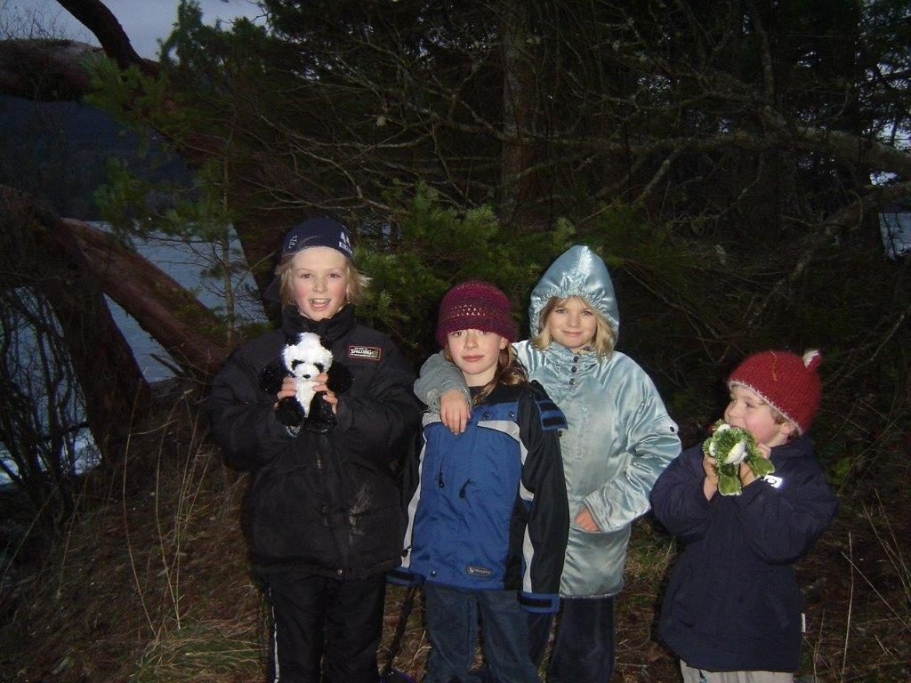

*Centre School friends*

I loved the Centre School from my first moments there and felt an incredible connection to other families and staff, the connection that comes from shared values, of feeling like we were doing something a little different for our children and willing to trust. We were finding our community.

After a year, Zoe was joined at the SSCS by Aaron when he started Kindergarten; they spent 4 and 5 years at the school, a grounding experience that they continue to treasure to this day now that they are 20 and 17 years old respectively.

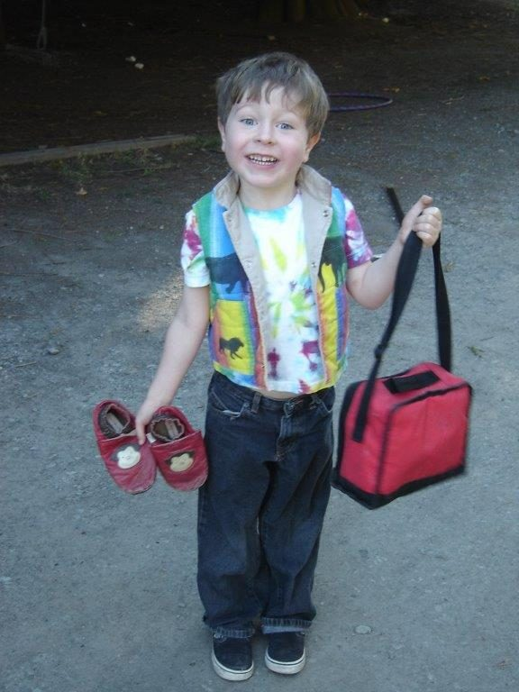

*Aaron's First day of Kindergarten, 2007*

Now, you may at this point be wondering whether I am writing this for the School’s newsletter or the Centre’s.

Well, I am slightly sheepish to admit that not only did I not dive into “yoga” classes at the Centre like any self-respecting transplanted Vancouverite woman in her 30’s might have, I dodged any real connection with the Centre for most of that first year, beyond helping set up school plays and cleaning up after Winterfest.

As much as I loved the atmosphere and people I was starting to get to know at the Centre, I was a self-proclaimed agnostic and felt that I wouldn’t fit in to a spiritual community. I didn’t want to intrude on the sincere and dedicated practitioners, nor did I want to lay any claim on this spiritual place. I like to think I was already practicing an advanced form of non-attachment.

I did not fully recognize the difference between “religion” and a spiritual practice. For years I had avoided anything to do with what I thought was formal religion, primarily because I saw dogmatic belief systems as the root of many world and local conflicts - I simply did not want to participate.

I also had another reason to avoid religion: I didn’t believe in God…although not for want of trying.

Growing up in Toronto, my family followed Christian traditions but to say we were observant would be a stretch - we attended Church occasionally at Christmas and Easter, and when my grandmother was visiting from out of town. My parents did not want to impose a religion on us and were determined we should make up our minds, which I appreciated; unfortunately we were not exposed to any other religions so we did not know what some alternatives might be.

In my tween years, my Dad started attending the Presbyterian Church close to our home and I would go with him - in no small way because I discovered they had a “Youth Group” and we got to leave the church service about 15 minutes after it started, then hang out in our basement “club room” playing games and planning the next outing to the roller-rink (this was the late 70’s after all).  Church to me was all about socializing and community-building, and I loved it. To be fair, I also loved the traditions and rituals – I took part in Advent celebrations, leading candle-lit processions, handing out communion wine, even doing some readings to the congregation as the “youth rep … but I found that I just didn’t really BELIEVE any of it and I felt like a fraud.

I stopped going to Church when I was about 14, when other teenage interests (aka: boys and parties) took over and Sunday morning was for sleeping in. As I got into my late teens and early twenties, I became more cynical about the world and blamed religion for serious problems both in larger geopolitical realms as well as closer to home: building walls, causing harm and fueling disconnection between people who weren’t “like us”. I accepted my non-belief as a personal strength and stayed as far away from the church as I could get.

\*\*\*

We all have small moments in our lives that change us. One of those for me was Sharada telling me one day at the Centre that she could see I embody yogic qualities, even without practicing asana or pranayama, let alone regular sadhana. I can’t recall the exact date of this conversation but I took it as a huge compliment: it has stayed with me and supported me over many years. I was surprised to find myself caring deeply for the Centre and what it stood for from very early on. When after-school activities and events were held in the main satsang room, I would be the last person there late at night cleaning up with Kalyani’s voice in my head of how to sweep the lobby properly and, more importantly, how to clean the toilets. I wanted everything to be spic and span for the Centre community member who would no doubt be arriving early the next morning. I was doing KY (karma yoga) without knowing it.

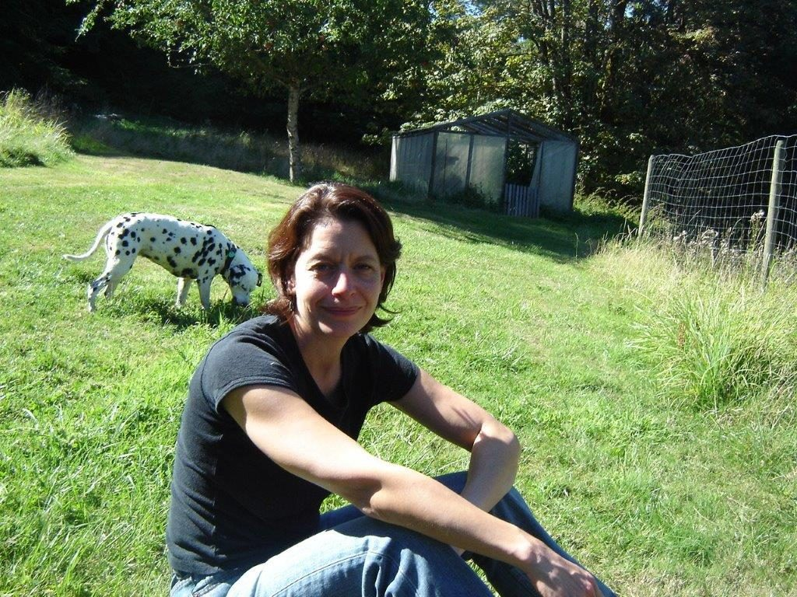

*Clare, August 2007*

In Vancouver in the late 90’s, I attended a handful of yoga/asana classes but, just like formal religion, I avoided the spandex / Lululemon crowd emphatically. Instead I chose the low-budget community centre option: there I met the most amazing teacher – an older man, at least in his 60’s, of small stature, wearing large baggy shorts, and with a shock of white hair, who led us earnestly though Iyengar yoga instruction over 12 weeks. The classes were at the Jericho Hill Centre, a former “school for the deaf” with a cold, institutional feel, but we had a large room with a wall of windows facing towards the ocean, and an experienced, gentle guide who introduced us to asanas that were intentional, devoid of pretense and quite complex. I didn’t recognize it at the time but he was showing us a path to explore yoga more deeply, if we were ready.  I wish I could remember his name and send him gratitude.

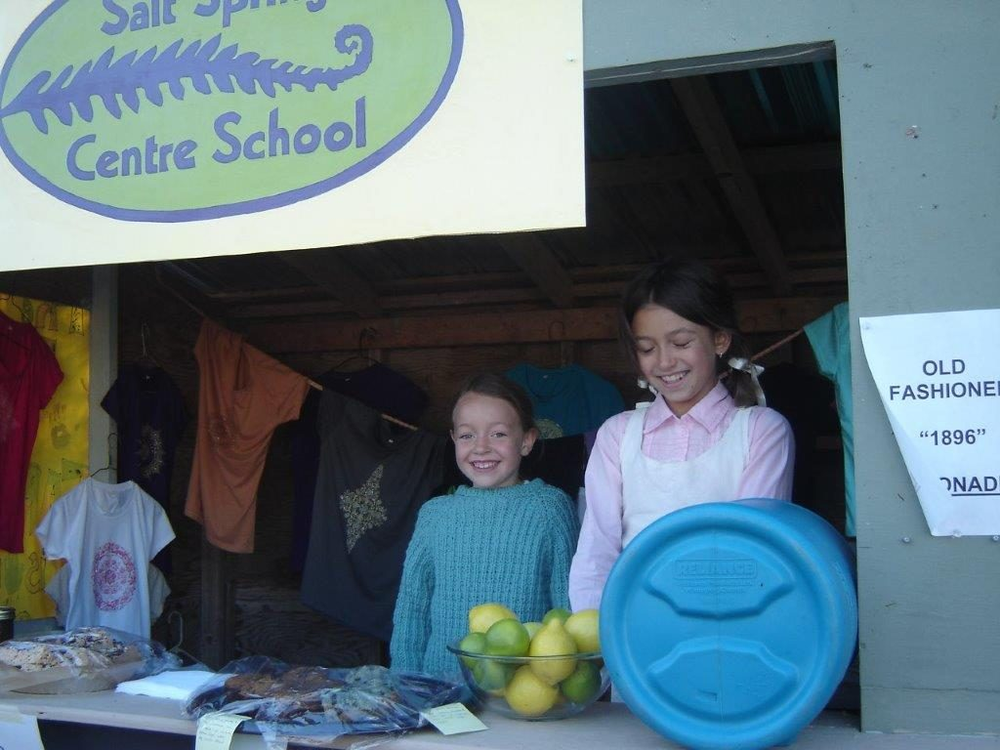

*Zoe at SSCS fair booth Sept 2006*

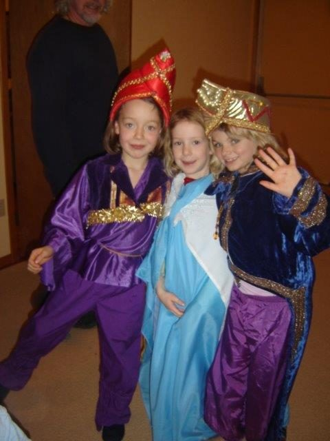

*Xmas pageant, December 2006*

One of my great gratitudes of being at the Centre School was meeting my now-best-friend, Willow Lampard. Our girls, Shael and Zoe, were in the same class together and they became fast-friends. Willow and her family were an integral part of the Centre community and lived on site in what is now Sage House. She and I spent a lot of time together, at first because our kids were friends, and then because we were.

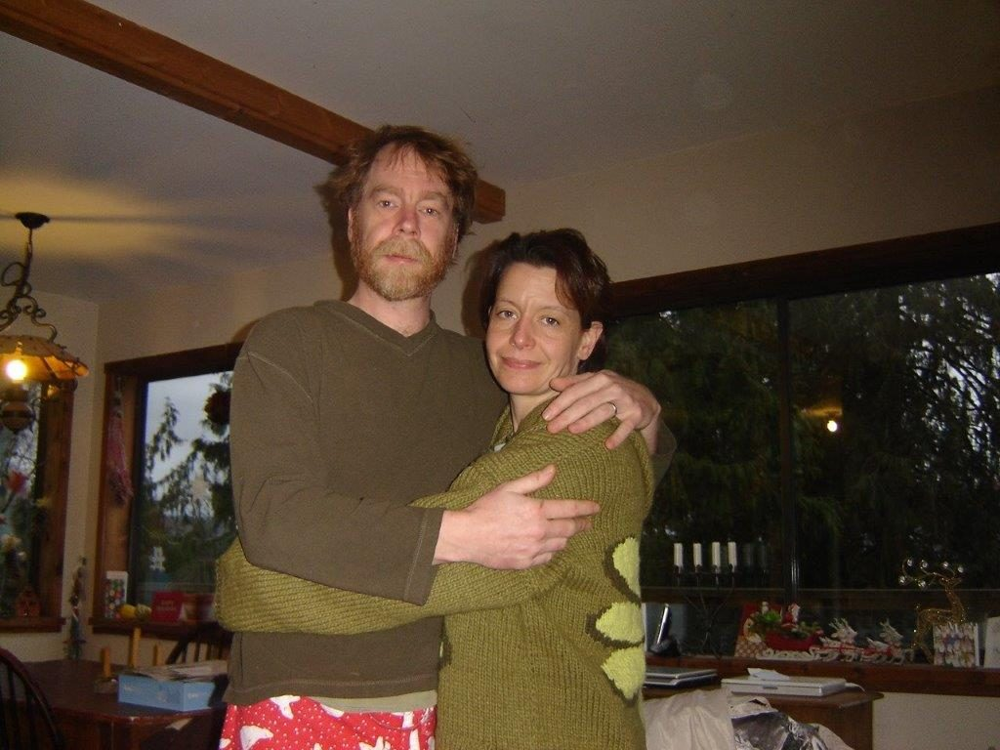

*Michael and Clare Xmas morning, 2007*

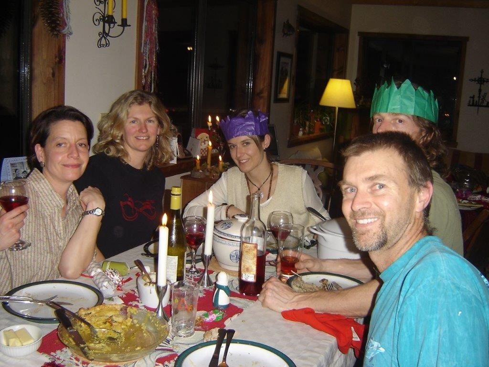

*Grown up table, Xmas 2007*

It was through Willow that I really developed a connection to the Centre. She invited me to dinners, Christmas gatherings, and winter saunas. I got to know the KY’s and the staff who were around in the down-season, when the pace was slower and there was more time to chat. I have fond memories of sitting around the wood stove in the satsang room, eating dinner sitting in back-jacks, sharing stories and laughter.

I joined the board of the Centre School (formally known as the Ganges Educational Society) which introduced me to the inner workings of the Dharma Sara Satsang Society (informally known at the DS) and how the Centre itself was managed, by a very committed group of people. I got to know Divakar, Lakshmi, Janaki, Shankar, Kishori and Kalpana, among many others. At first it was like a diplomatic post, where the School was liaising with the Centre but the core values were always clearly shared.

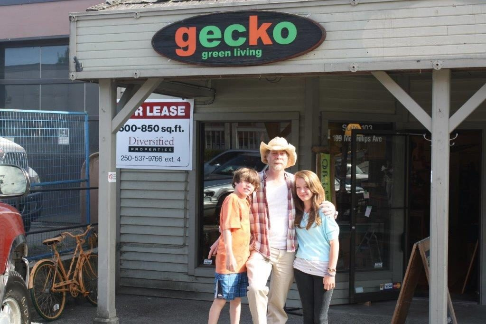

*In front of Gecko Green Living*

In 2008, my husband and I decided we wanted to share our values and passion for environmental issues and solutions so opened a retail store in Ganges selling eco-friendly products. He had wrapped up his Vancouver contracts and was ready for a more local-based income; my job was part-time so we felt I would be able to support a new venture. We opened Gecko Green Living in September 2008 - right when world markets were crashing - and it was a local success. We had a great response from customers, won a Chamber of Commerce prize and moved to a bigger location within two years. We supported environmental causes and activities, including creek clean-ups, and are proud to have started the SSI Earth Day Festival. Gecko connected us to the Salt Spring community in a new and meaningful way.

During this time, I was working at the credit union and, I think it is fair to say, struggled with my role there. When I was laid off in early 2010, I worried about finances as well as my ego and yet, I recall a visceral sense of weight being lifted off my shoulders: I was relieved, and I promised myself after that never to take a job that did not fully align with my values.

When a position opened in the office at the Centre, I applied and was accepted into the fold. I worked as the admin coordinator, which meant answering the phone, responding to email, and booking people into programs. Highlights of that time were registering everyone for the ACYR and meeting all the KY’s (including Shyam and Melinda, valued members of the satsang). I will always remember booking a personal retreat for a business man from Jamaica in the latter days of November: his wife planned it for him as a “surprise” and he had no idea what he was getting into, coming to the BC coast in late November – the rain, the dark, the cold. I recall he was the only guest in the whole place, and a yoga retreat was completely new to him, yet he was so happy to be there. He did every class available, helped the KY’s with cleaning and meals, wore slippers and sweats (as opposed to the 3-piece suits he was used to). He even extended his stay and when he returned home, it was as a changed person. Witnessing his transformation changed us all.

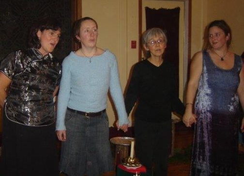

SSCS Teachers at Advent, 2006. Janet, Kate, Sharada, and Erin

I moved from the Centre office to the Centre School where I worked as their admin manager for about 18 months. Between the Centre and the school, these were the best jobs I have ever had; I loved my work, loved the people around me and I was living my values. I felt a strong connection to the land and knew I was privileged to be there every day.

And yet…in my lived experience, my most rewarding jobs have also been the lowest paying. In 2012, Gecko had a regular customer base but was barely breaking even. For better or for worse, reality started to sink in. Michael and I realized we would need to make a change for the best interest of our family.

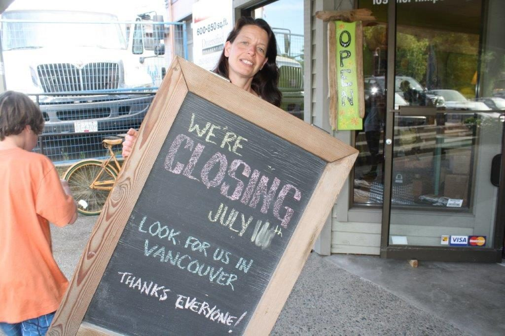

*Closing day*

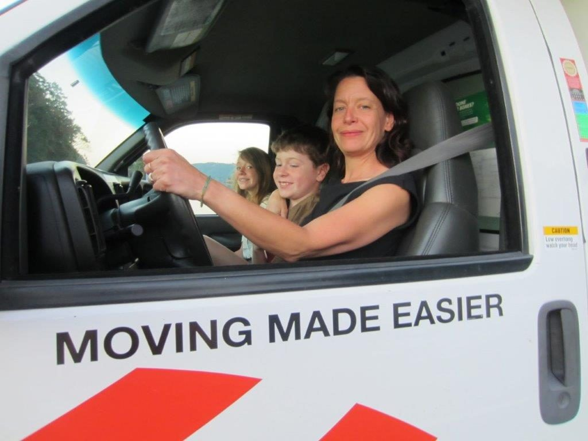

*Moving day, 2012*

We made the very difficult decision to move back to Vancouver where we had more job prospects and our kids could get a broader experience of the world. Zoe and Aaron were puddles of tears when we told them that we would be leaving Salt Spring, tears we have shared with them over the intervening years. It is not easy to leave your home – and Salt Spring was/ is still home to us.

I have been at ACYR every year since we moved, doing KY in Latte Da and in the kitchen, which to me is the best part of retreat. I went to asana and pranayama classes, and in between KY shifts, walks on the land and side-trips to Cusheon Lake. And, still, I struggled with my role at the Centre…what is my place here, where can I contribute, what do I believe and does that matter to anyone but me? I have great gratitude to Sharada, Usha and Raven, who have spoken with me over the years about the value of community and holding space for peace, about “Jedi” strengths, unseen forces beyond our control that connect us all and offer a deeper understanding of the world, about compassion and caring, non-violence and simply being our authentic selves, which at times seems the greatest challenge. Babaji and the Centre community meet people “where they are at” and as I have journeyed closer towards Babaji’s teachings, I have been met with love, kindness and openness each step of the way.

My life in Vancouver now is pretty awesome. I run the UBC Farm which provides me a combination of rural and urban life, reminding me very much of the SSCY in that it attracts passionate young people wanting to explore and embody a different path, a path of caring for the land as well as each other, of building community and of being the best person we can each be in this life. It is complex, particularly as we grapple with climate change and global social crises. The path is not always clear and being seen as a mentor for young people is a bit daunting. I channel learnings from the Centre on a daily basis: compassion, truthfulness, non-violence, and peace above all.

\*\*\*

2019 was a tumultuous year for me. Most significantly, in April my Mum passed away from metastatic breast cancer. My Dad and I were there by her side in the hospice in Toronto. Her passing was peaceful, the days leading up to it a roller coaster of sleepless nights, ineffective pain meds and hallucinations, along with laughter, good memories and friends circling close. She passed on a cool, rainy afternoon. It was Good Friday. On Easter Sunday, my Dad and I went to Church together. The community was there – many of the same faces, even some from my youth group – welcoming and embracing us, as though we’d never been away.

This fall, I joined the Vancouver satsang after several years of wanting to but feeling like I wouldn’t “belong”. To my joy, there were familiar faces and our shared connection to the Centre meant new faces quickly became friends. I was welcomed and embraced – the community was there.

One regret in my life is that I never met Babaji, even though he would have been at the Centre in the years I was there. I don’t think I would have been ready to meet him. Now I am.

I look forward to learning how I can continue to serve the Centre, the vison and direction laid out by Babaji, and the community.

Shanti, shanti, shanti.
