*Oh my God, you are the embodiment of love, compassion, and truth. Bless me with spiritual energy, strength, power, and courage to enable me to walk steadily on my spiritual path, going through hills and dales, rivers and deserts. In the scorching heat of summer and freezing cold of winter, may I remain walking steadily and speedily. ~ Baba Hari Dass (from ‘Vinaya Chalisa’)*

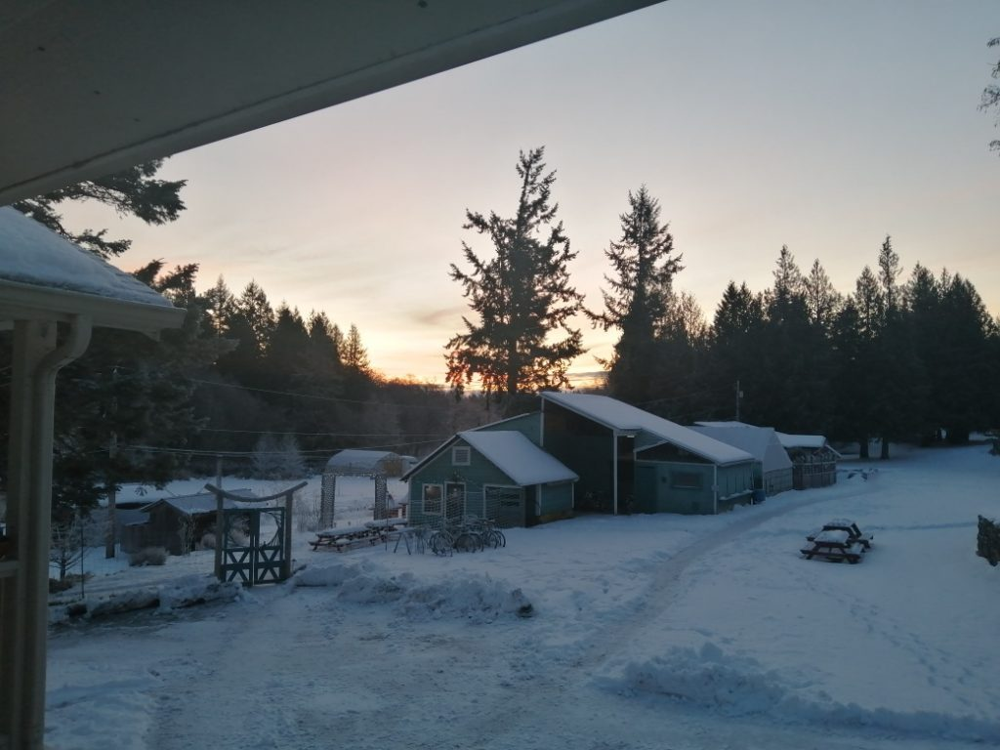

Dear friends,

Mid- January brought us snow and freezing temperatures. Looking out the window during satang I could see snow blowing horizontally. By the end of satsang, it was a full-blown blizzard. Fortunately, everyone managed to get home safely. Now the snow has melted and we’re back to our usual rainy west coast winter weather (for now). Here are some January snow photos.

- 
- 

*Icicles on the sauna, Adam stoking the sauna fires*

*Alex H. shovelling snow*

## Welcome Kris and Mathew

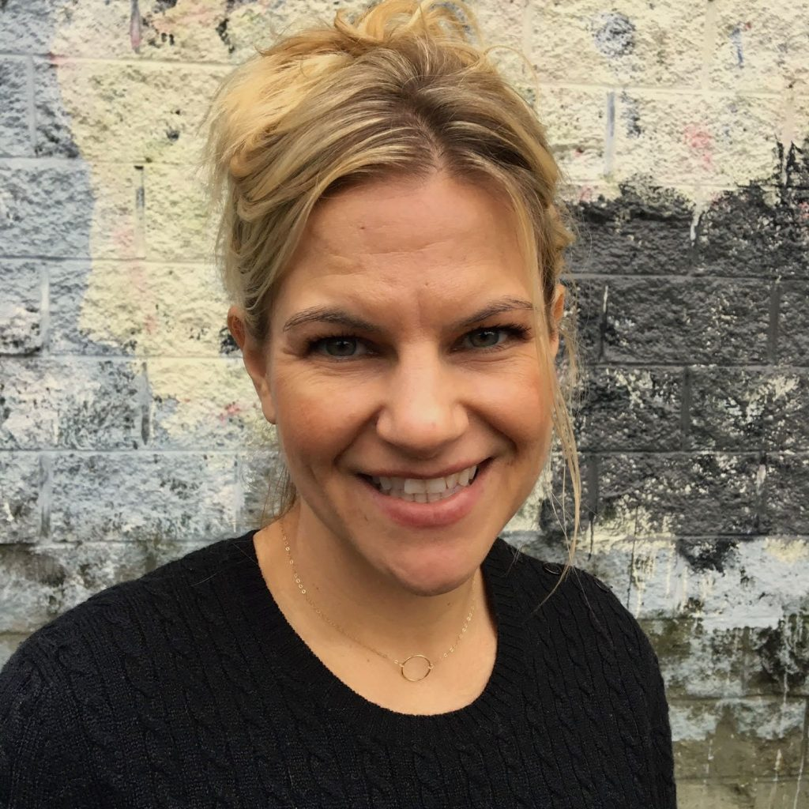

*Welcome, Kris!*

We are delighted to welcome Kris Cox and Mathew Bentley back to the Centre. Both of them will be working in the office. Kris is stepping into the role of Centre Manager, and Mathew will be the programs coordinator.  Both Kris and Mathew have lived at the Centre before: Kris as Programs Manager in 2013 & 14, and Mathew as a karma yogi in the Karma Yoga Program (then called YSSI). A couple of years ago, I invited Kris to share her story, which I’m happy to [share with you here](https://saltspringcentre.com/kris-coxs-centre-story/). It will give you some insight to Kris’ life, and also an introduction to Mathew.

We will be happy to Welcome Raven back to the Centre in time for Shiva Ratri. Another returnee is Dan Nacaratto who was our Farm Coordinator in 2018, and who is coming back to take on that role again.

## Come be a part of it

Change is ongoing (and inevitable) here and everywhere. Fortunately we continue to attract amazing people to support the aims of the centre: Dharma Sara Satsang Society, inspired by the example and teachings of Baba Hari Dass, is dedicated to the principles and practices of Classical Ashtanga Yoga. By means of Sadhana (spiritual practice), Karma Yoga (selfless service), and Satsang (supportive community), we aspire to create an environment for the attainment of peace.

We are currently accepting applications and conducting interviews for [various positions](https://saltspringcentre.com/community/current-opportunities/). There are a number of ways to be part of  the Centre community: in a particular role in the office, kitchen, farm, or housekeeping, and also as a participant in our Residential Karma Yoga Program. The RKYP is offered in three sessions: April 14 - June 21; June 23 - August 30; September 8 - November 17. Applications are now being reviewed and interviews arranged. Read more about the [karma yoga program here](https://saltspringcentre.com/community/). Then click '[Current Opportunities](https://saltspringcentre.com/community/current-opportunities/)' and open '[10-week Residential karma Yoga Program](https://saltspringcentre.com/karma-yoga-program/)' to read more and to apply.

Here are some photos of life at the Centre this season. Here’s what life looks like here on a daily basis. Come be a part of it.

- 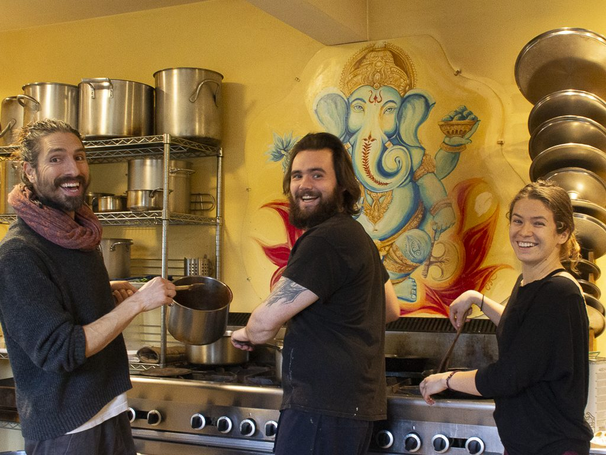

  Angelo, Alex S., Sabrina
- 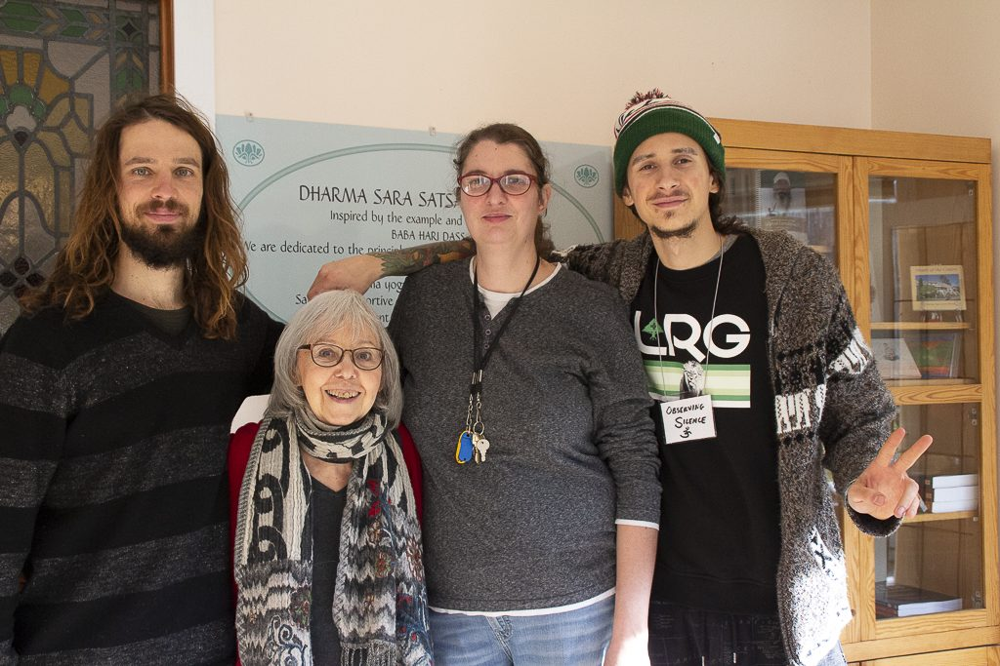

  Daniel, Sharada, Janell, Alex H.
- 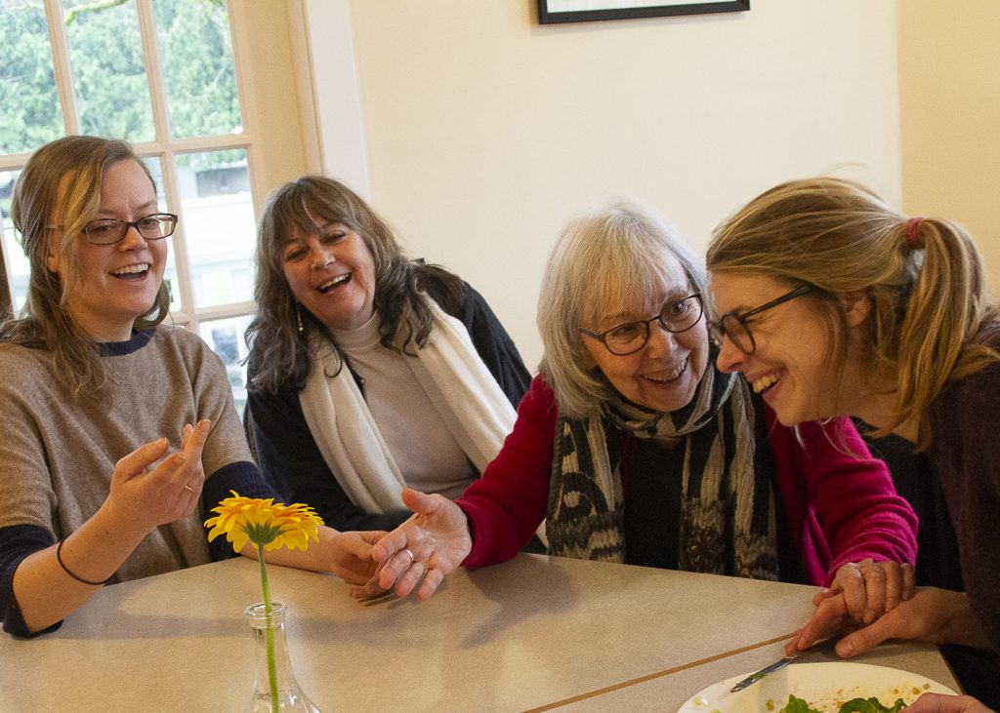

  Johanna (Sanjeevani), Lakshmi,   
  Sharada, Lotte
- 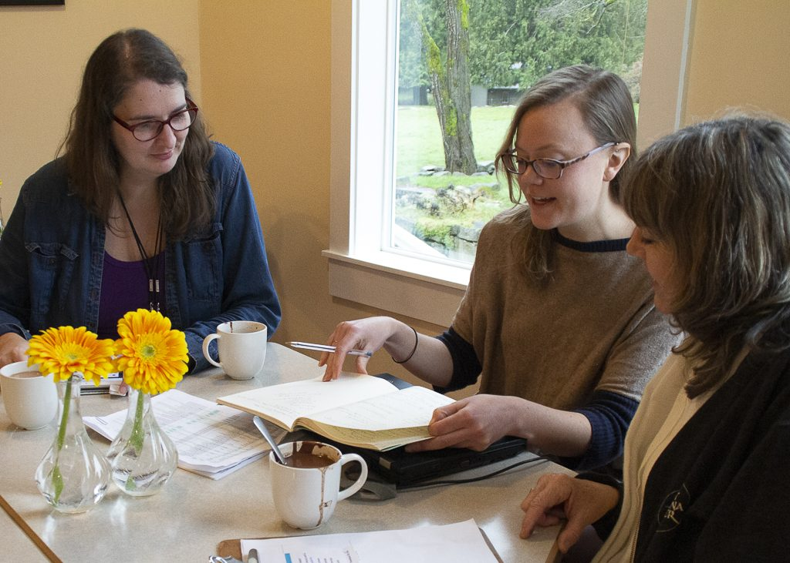

  Janell, Sanjeevani, Lakshmi
- 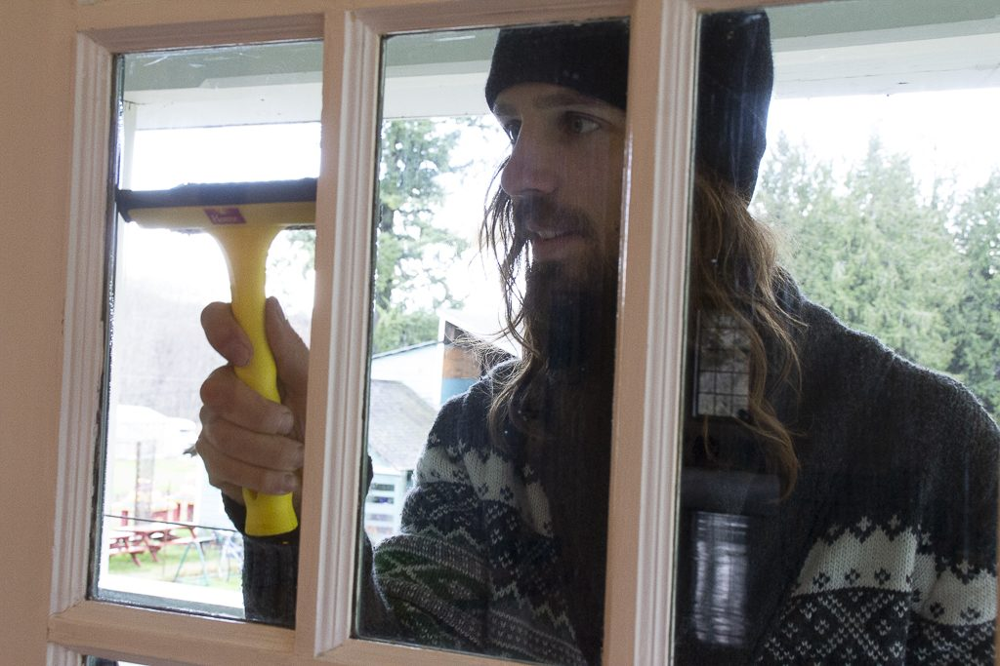

  Daniel washing windows
- 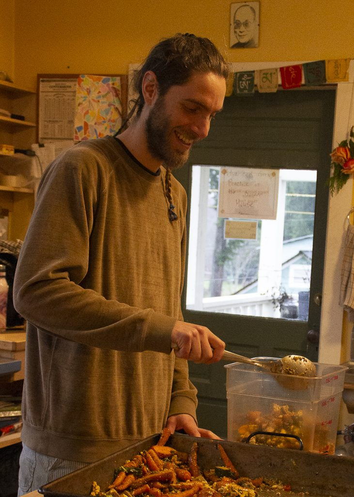

  Dimitri in the kitchen
- 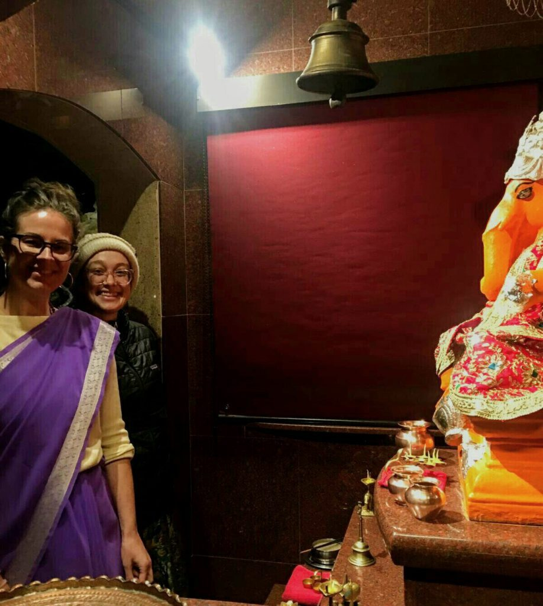

  Christine doing Ganesh Arati during MMC New Year Retreat; with Kirti
- 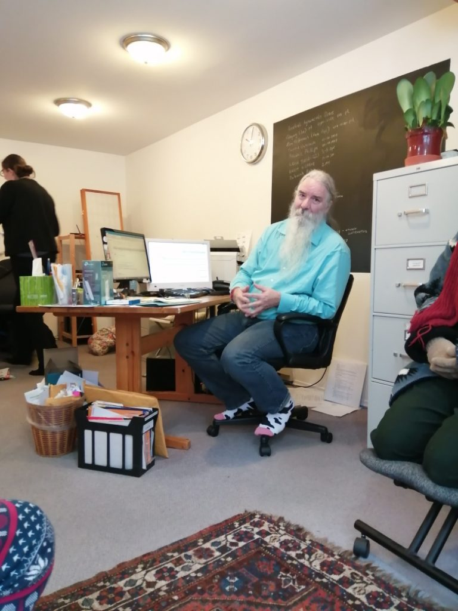

  Suneel in the office
- 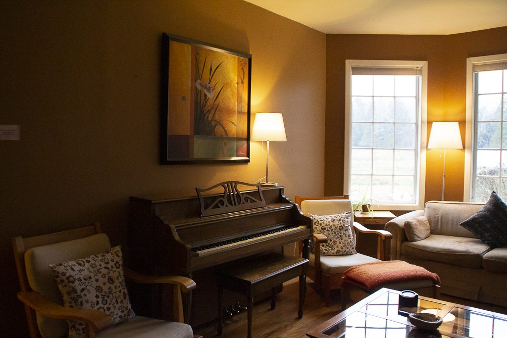

  The library, a cosy place to hang out

The [Yoga and Ayurveda program](https://saltspringcentre.com/programs-retreats/ayurveda-and-yoga-retreat/) taught by Natasha Jyoti Samson is ending on the 2nd of this month. There is so much valuable information in this program, and Jyoti shares it with passion. I expect we will be offering it again for those who couldn’t come this time. You will learn more about Ayurveda, understand your dosha (your Ayurvedic constitution), and the tools you can use to create balance in your life.

[Winter Yoga Getaways](https://saltspringcentre.com/programs-retreats/yoga-getaways/) with off-season discounts: January’s Yoga Getaway was uplifting as all these retreats are. Guests enjoyed the cosy setting by the wood stove, walks in the woods on misty days, classes taught by gifted teachers, and, as always, delicious meals. Yoga Getaways continue, the next one being on February 28 - March 1. The March Yoga Getaway is on March 20-22.

## Shiva Ratri

**Shiva Ratri date correction:** Please note: The date given in the last newsletter was incorrect. Shiva Ratri, the [Night of Shiva](https://saltspringcentre.com/shiva-ratri-feb-2020/) will be held on **February 22 through to the morning of February 23rd**. A couple of years ago, Yogeshwar wrote about the symbolism of Shiva Ratri, some of which you can read here:

> *Śhiva-Rātri is a time to acknowledge and honour all that Śhiva evokes, especially practices of austerity and surrender. The observance falls just before the new moon of the lunar month of Phālguna, which falls in February and March of the Gregorian calendar.*
>
> *Śhiva invites us to face destruction and be transformed by it. And so, participants in the big night resolve to stay awake the entire night, some fast for 24 hours or more, and they give themselves over to constant remembrance of the divine through continuous kīrtan and devotional ritual. The result is a window in time in which the habits of the mind and body are consciously disrupted, and the usual veil that conditioning and habits lay upon existence can perhaps be parted to reveal a more expansive reality. Think of the flow of the night as creating a spiritual adventure, and like all adventures it includes a whole range of delights and challenges, but in the end it rewards us with new views and insights on ourselves and the world.*
>
> *At the Centre the observances begin on the morning before the big night (Saturday, February 22) when a special ritual takes place in which 1008 clay liṅgams, which serve as the symbolic form of Śhiva, are created as a focal point for that night’s rituals. Each liṅgam is created with silent repetition of a mantra that invokes the presence of Śhiva into it, and the result is a deeply meditative practice. In the afternoon, the Satsang Room is decorated and prepared, and then the festivities pick back up that evening with rituals in honor of Gaṇeśh, Hanumān, the Guru, and Śhiva. Kīrtan to Śhiva, interspersed with two rituals to Śhiva at midnight and 5 am take up most of the rest of the night. The observances finish with placing the liṅgams and offerings from the night’s rituals into the pond, with a few hardy bhaktas taking the plunge into the icy waters to do so! After that, breakfast is served.*
>
> *Śhiva-Rātri certainly attracts some hard-core devotees. However, you need not stay for the entire night, and unless you’re offering in one of the rituals, fasting is also optional.*

## Upcoming Rituals

In other news of rituals, this month’s full moon yajna is on Saturday, February 8 at 7:00 pm. If you’d like to plan ahead, here’s a heads-up of Chhoti Holi (Little Holi) coming up on March 8. Following a full moon yajna on that date, there will be a bonfire. Participants will be invited to burn small strips of cloth representing all that is stagnant from the winter, thereby clearing the way for the coming spring.

If you’d like to receive information about all the upcoming ritual celebrations throughout the year, you can [subscribe to the Pujari Post](http://eepurl.com/gh1_I5) here.

## To read:

This month’s community  story, [Meeting Community Where You Are](https://saltspringcentre.com/meeting-community-where-you-are/), is by Clare Cullen, who has had a strong connection to both the Salt Spring Centre of Yoga and the Salt Spring Centre School, having worked in both offices in the years she and her family lived on Salt Spring. They live in Vancouver now, but still consider Salt Spring home. When they arrived on the island, it wasn’t long before Clare was drawn to the community and eventually to the teachings. She liked the people to begin with, but was a bit wary of possible religious overtones - until she came to understand the difference between religion and spirituality. Clare is a karma yogi at heart, from long before she knew there was such a term. Now living in Vancouver, she has become involved with the Vancouver satsang. If you don’t know her well, this is a great introduction, and maybe you’ll meet her next summer at ACYR. Come to Latte Da and she may serve you chai.

When life seems too serious and stressful, we can easily get caught in negative thinking, and sometimes it’s hard to imagine switching gears. You probably know this from personal experience; we’ve all been there. Sometimes we know we’re stuck in a negative mindset and forget there’s a way out, and sometimes we’re stuck because we don’t want to give up our misery; we just want to be right! If we could step outside and look from a distance, we might actually see some humour in our predicament,  although up close we generally don’t see it that way. Here are some reflections on our stuckness and a few simple ways from yoga’s bag of tricks to switch things around. [Changing the Angle of the Mind](https://saltspringcentre.com/changing-the-angle-of-the-mind/) might help.

*The best thing is to stop thinking and make the mind calm. Then you can see the reality. ~ Baba Hari Dass.*

Love,  
Sharada
