## by A.D. Trimble

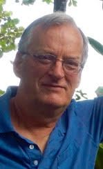

A.D. Trimble

My parents first introduced me to yoga. They were both raised in conservative, United Church middle class Toronto but in an act of sheer defiance at the time, my father one day announced that the family was moving from Moore Park to ... Agincourt. Wherever that was. Somewhere not in Toronto. And in short order, we were living in an old red brick farmhouse with hay fields for neighbours. My mother accepted the rural setting with her usual grace but both my parents felt that a religious upbringing was still important. The pull of the United Church seemed to have waned and after trying a few months at the Unitarian Church in Toronto, we ended up at the Society of Friends also known as the Quaker church on Lowther Avenue in Toronto. After a few years of Sunday School, as I entered my teens, I was introduced to the Sunday Meeting of Friends - the grown-up Sunday School - and my first experience of meditation. For the Quaker, there is a belief that god is within all of us, and when we are silent, God can communicate with us. So I sat. For one hour. One long hour. Without talking or moving (much). Waiting for God to come. At 15 years old.

That didn’t last long. I still remember one day telling my parents that I would no longer be going to meeting. I think I said I had homework to do. But by 16 years old, I stopped going to the church. Forever I thought. It didn’t turn out that way.

My next stop in life was the University of Guelph. In grade 13 when I was trying to figure out what I wanted to do after high school, my sister introduced me to a friend of hers who was studying landscape architecture. He raved about the course and especially the elective courses which included skiing!!! That sold me. I didn’t even know what landscape architecture was, but I knew I loved skiing. I applied, and against heavy odds, I got in.

Ths class of B.L.A. ‘74 turned out to be a very special group of 15 people. We were encouraged to be creative, and we were. Also very close - working long hours in a common studio, many all nighters. But also playing and travelling together when time allowed. The “father” of the class, and spiritual mentor was Larry. He already had a couple of degrees and several years of work experience, unlike many of us right out of high school. One day in 3rd year, Larry announced that anyone who wanted to experience LSD was invited to his farmhouse for an upcoming weekend. Larry provided the food, the bedding, incense, music and books for everyone. He emphasized that this was a spiritual awakening. And to come with the right attitude. We did and it was. One of the books Larry passed around was “Be Here Now” by Ram Dass. I think I read the whole book that weekend. And bought my own copy the next week. In the back of the book was a tear out coupon to receive information about more upcoming events sponsored by the Lama Foundation, in New Mexico. I mailed that off and waited.

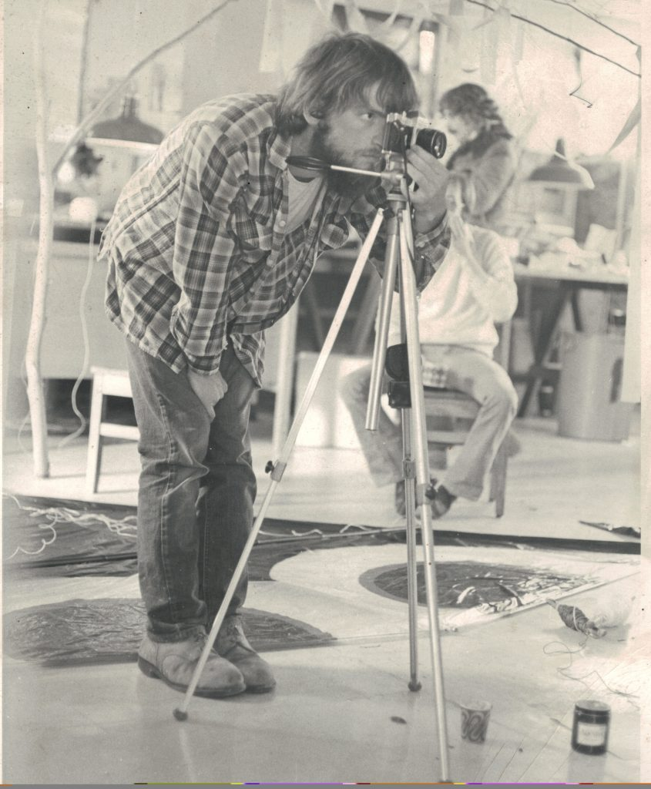

*In the lab at the Landscape Architecture building*

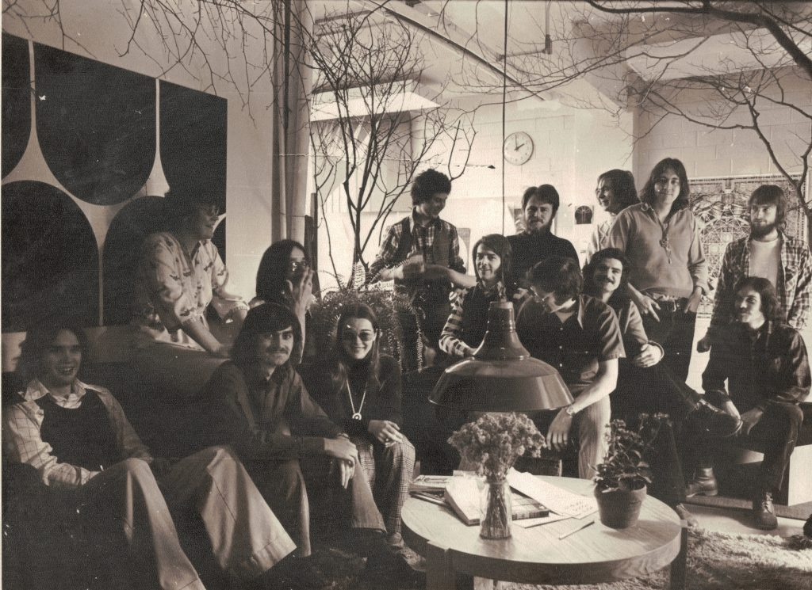

*B.L.A.74 A.D. far right, back row*

The landscape architecture building at U. Of G. had been an old seed storage building for the agricultural college. At the back of the building, the odd classroom was rented to off campus classes and clubs. In one rental class the room was filled with people lying on the floor, in the oddest positions. A long haired man sat at the front, apparently coaching the people into these contortions. After sticking my head in the door a couple of times and getting a positive greeting, I talked a friend into joining the group and we experienced our first yoga classes. And the teacher taught more than just asanas. A bit of philosophy, a few chants and mantras.

I started to hang out after hours with the teacher and a few of his students. Until I found out that he raised rabbits as a part of his income. I didn’t know much about yoga but this didn’t sound compatible with what he was teaching about ahimsa. And my university yoga days came to an end.

I didn’t care what I did after university. My real interest at this point was finding out more about yoga. I started attending all the “spiritual” events in Toronto, and teachers, and organizations. But nothing grabbed me. Nothing seemed really genuine to me.

In early 1975 I got a flyer in the mail listing upcoming events for the year, sponsored by Lama Foundation. And Ram Dass was having a retreat. This was my chance to see the teacher who had offered me my first spiritual glimpse. I sent in the retreat application right away.

About 2 weeks later, I got a nice reply saying that the retreat was full, but I would be put on the waiting list, at around number 275. Totally dejected, I knew that retreat would never happen for me. The flyer was still on the kitchen table and I looked sorrowfully over it. And for the first time, noticed that there was another retreat following the Ram Dass retreat, this one led by Baba Hari Dass. I remembered the name from Be Here Now. He was one of the teachers that Ram Dass had mentioned from the ashram in India. And I got excited again. Why go to the student when I could go to the teacher? I sent in the new application.

The Lama Foundation retreat lasted for 10 days. Everything was new to me, exciting, mystifying, overwhelming. The highlights were meeting so many great people, like Janandan and Sita, Jaya, and Ratna, all of whom have been good friends since then. And meeting Babaji. Not with fireworks, or spiritual bliss, but with a feeling, a very deep feeling, a beyond words feeling, that this was how I was going to spend the rest of my life. Doing what? I didn’t know. But this was it. Babaji. Yoga. Whatever this involved. The rest was all details.

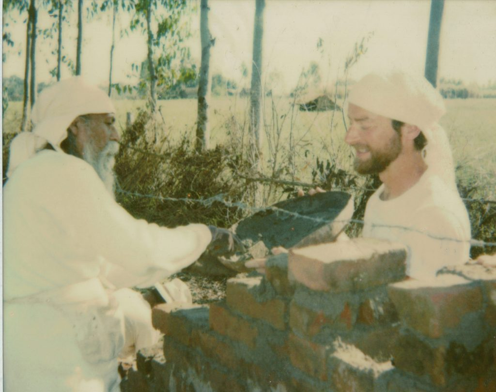

*Wall building at S.R.A. 1988*

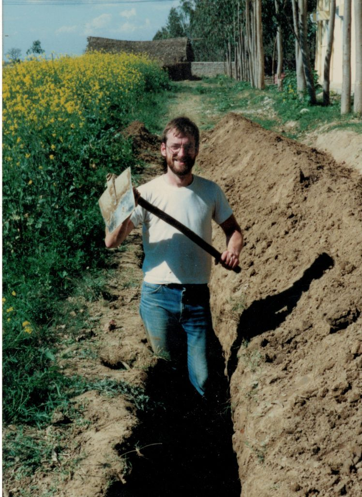

*Never happier than digging at S.R.A.1988*

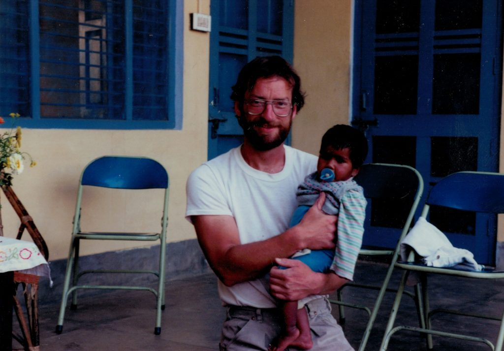

*Sri Ram Ashram with one of the young'uns*

- 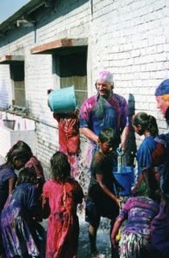

  *Holi time in India. Note the kid with the blue bucket.*
- 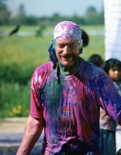

  *Holi time at Sri Ram Ashram*

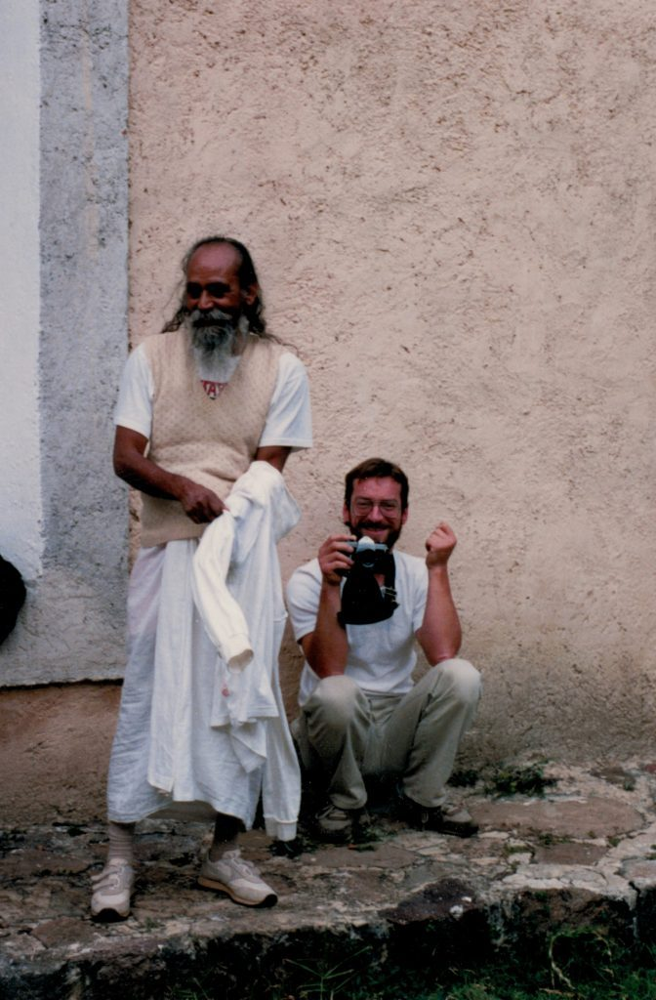

*Taking pictures at Sri Ram Ashram 1988*

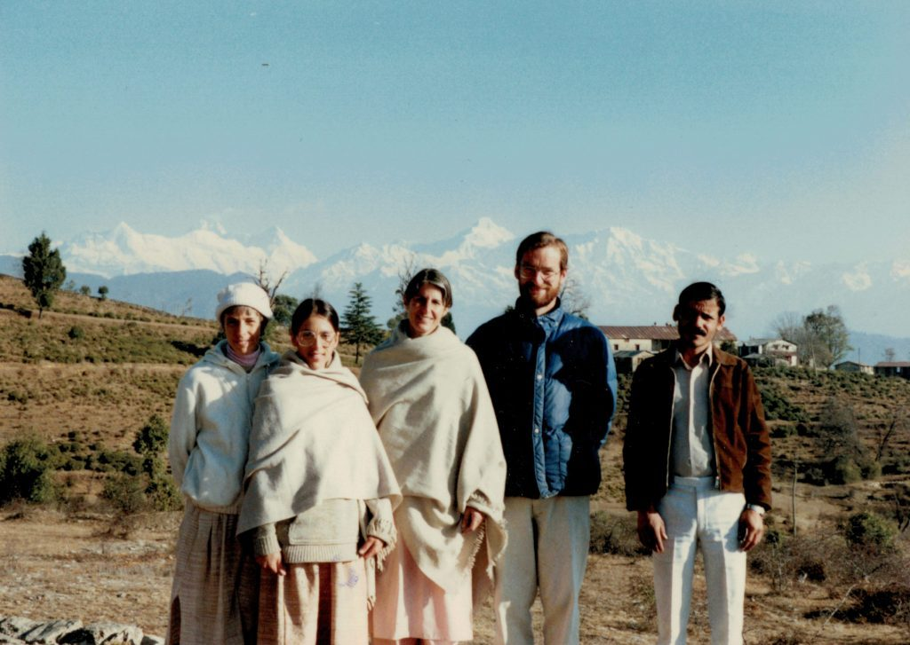

*The Kumoan trip with Karuna, Bhavani, Jaya and the taxi driver*

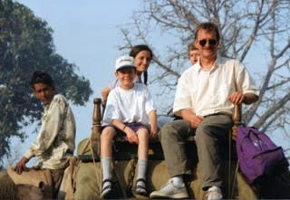

*With the family riding like rajas in India*

I got back from the Lama Foundation and a few days later tacked up a business card sign in the Fifth Kingdom bookstore in Toronto. It read. “Anyone interested in practising yoga as taught by Baba Hari Dass, please contact.. . and my phone number.”

A day later I got a call from someone who told me he had been at a retreat in B.C. with Babaji, and wanted to get together. We agreed to meet at the place I was staying and I gave him directions to the farmhouse I was renting from my father. Upon his arrival, he looked around and exclaimed “I thought this sounded familiar. My brother used to rent this place years ago.” A remarkable co-incidence considering the remoteness.

Bishwambhar Dass, Sundar Dass who was also at the B.C. retreat, my future wife Shyama, and I, invited Babaji to Toronto the following year for what was the first of the 35 Ashtanga Yoga Fellowship retreats. Several times for public darshans, we rented a familiar space in Toronto, the Quaker meeting house. Sitting beside Babaji, reading his chalkboard to the crowd, I finally experienced the stillness that the Quaker meeting seeks. And that God does communicate with you, when there is silence.

Jai Babaji!

- 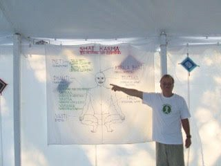

  *Does everyone know what time it is?*
- 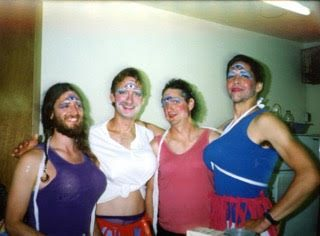

  *The Yogettes at an A.Y.F retreat*
- 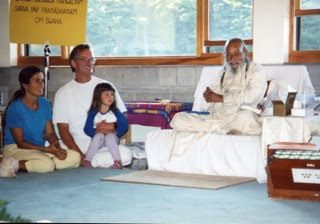

  *With Lakshmi and Mira at an A.Y.F. retreat*
