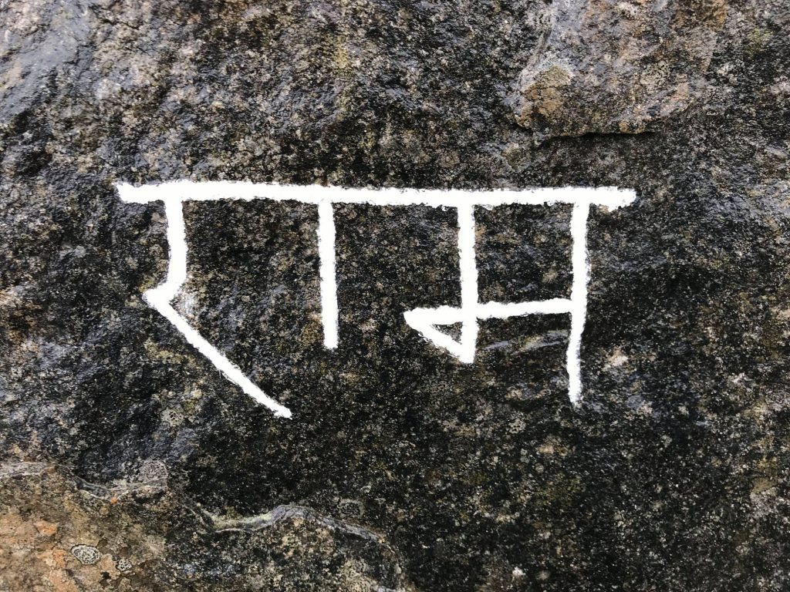

## *The aim of life is to attain peace and happiness. It is hidden in every living being. ~ Baba Hari Dass*

Dear friends,

This month marks the official beginning of spring. The light is returning and the days are getting longer. The trees are budding, and snowdrops and daffodils are in bloom.

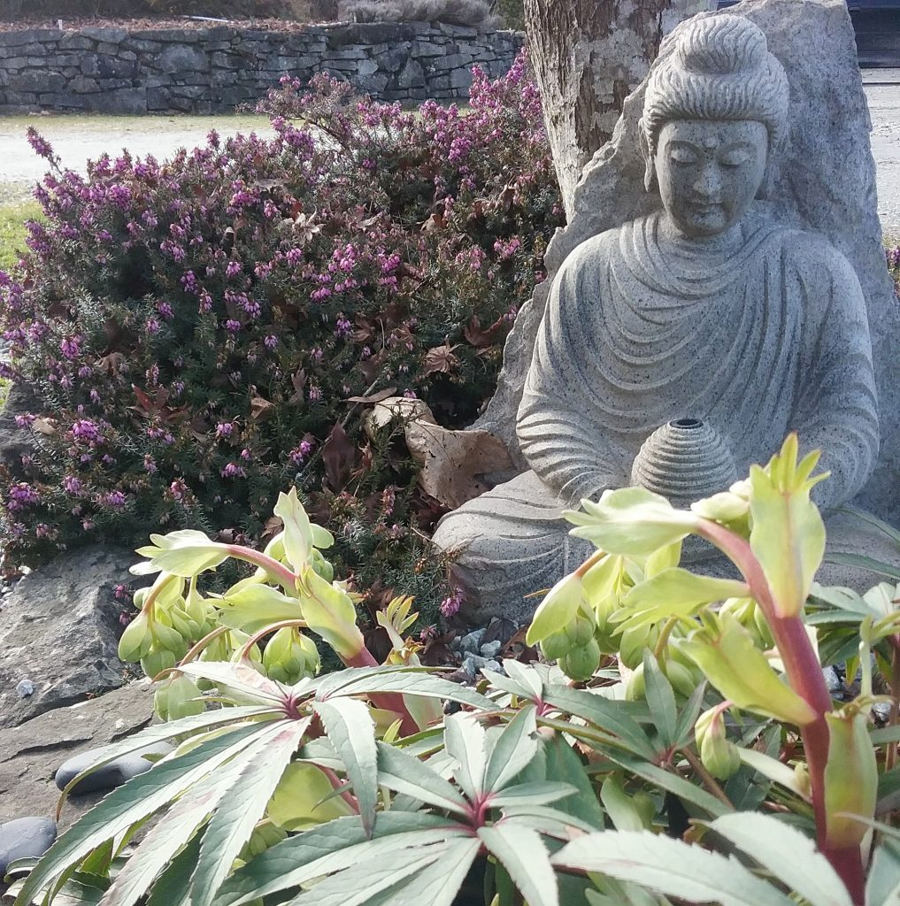

- 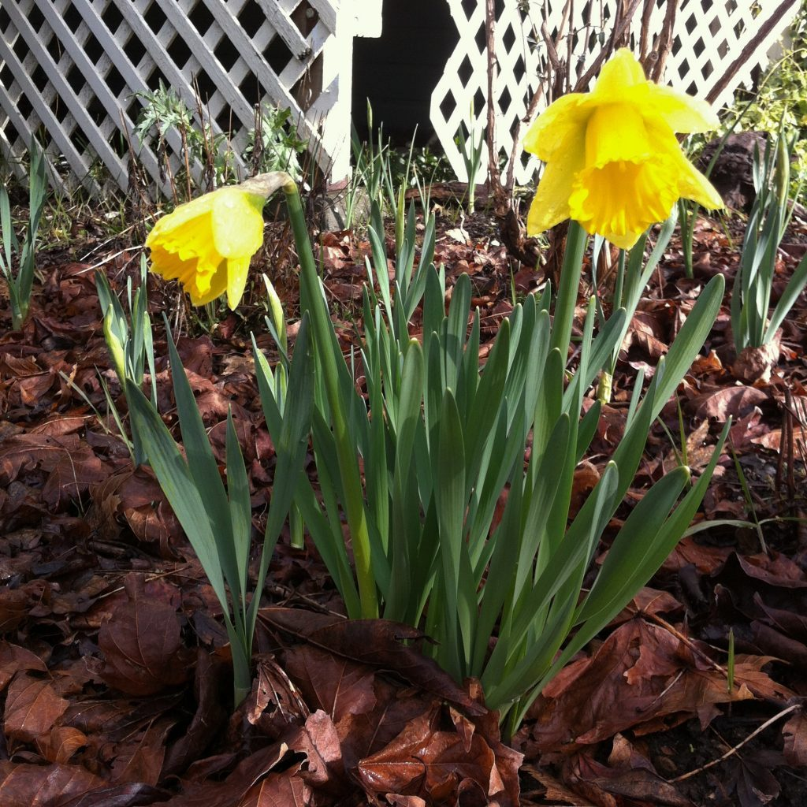
- 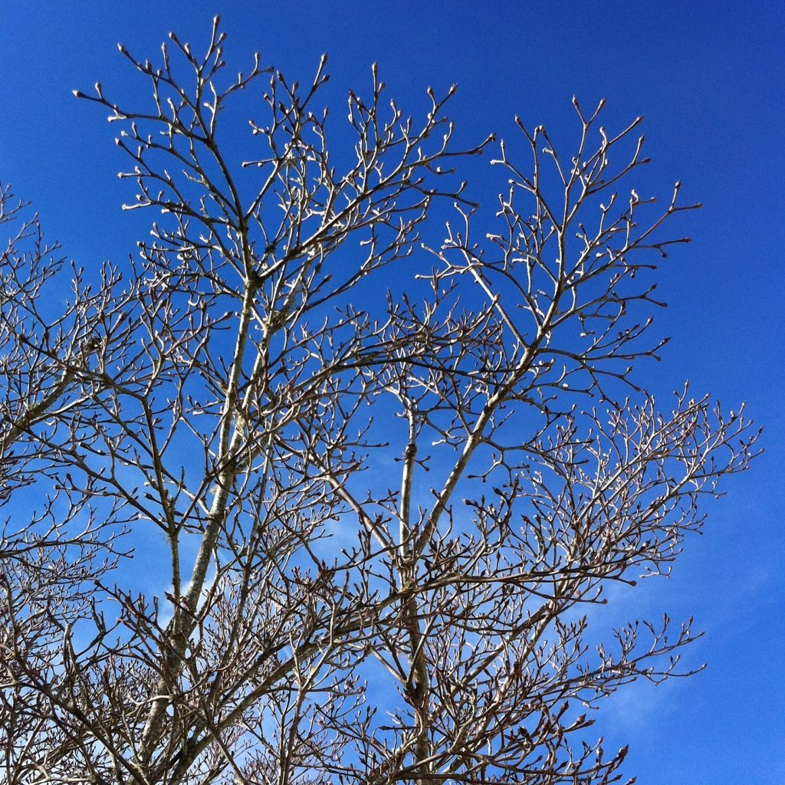

Spring has brought some wonderful people back to the Centre. Dan Nacarrato, farm coordinator in 2018, has returned to head up the farm team again. Welcome back, Dan! We are so happy you’re here. Also on the farm team is Lotte Gondolf, who’s been part of our community since last season. Dan has already begun his monthly farm update.

## Re-emergence

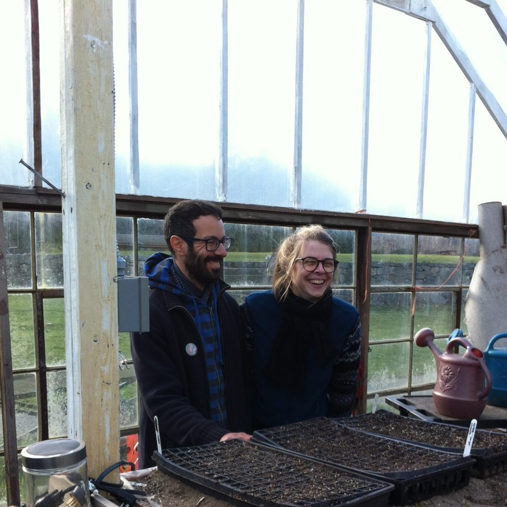

*Dan and Lotte*

> Here at the yoga centre, we are welcoming the extra few minutes of light that accompany each passing day, with a few intrepid souls even staying up all night to greet the sunrise for Shivaratri. The farm has also started to reawaken from its winter slumber, and will be led by two returning Karma Yogis—Lotte Gondolf, who has been bringing her joy and enthusiasm to the land since last June, and myself, both of us eager to bring renewed abundance and biodiversity to the garden this season.
>
> Although the season got off to an inauspicious start when a short circuit shut down our heating source in the greenhouse the first day that I turned it on, the maintenance team came to the rescue and rewired the greenhouse within two days, allowing us to get a head start on seeding some of the hardier early-season crops indoors such as leeks, peas, spinach, lettuce, kale, and herbs. And thanks to the recent stretch of sunny weather, several pea shoots, kale seedlings and wispy leeks are already emerging. Some other summer favourites such as tomatoes, peppers, eggplants, carrots, celery, as well as flowers will also be popping up in the greenhouse not long after this newsletter hits your inbox.
>
> Meanwhile, in addition to finalizing the 2020 field plan, Lotte and I have also been harvesting some overwintering lettuce, watercress and Asian greens, as well as cleaning carrots and parsnips that were harvested last fall and stored in a makeshift root cellar for the past few months to add to the menu for our community and for the February yoga getaway. Here’s to another fruitful season on the farm.
>
>  In gratitude,  
>  Daniel Naccarato

## Comings and Goings

We were excited to see Raven walk in the door during a community meeting recently, having returned from his winter sojourn, arriving in time to take part in Shiva Ratri. It’s also great to see Cathy who has come back to help for much of this month. When she left in early fall, she and Lotte had just planted some flower bulbs, which are  now blooming. The first of the new additions to our community has joined us. Welcome Christine Wood, the Centre’s new housekeeping coordinator.

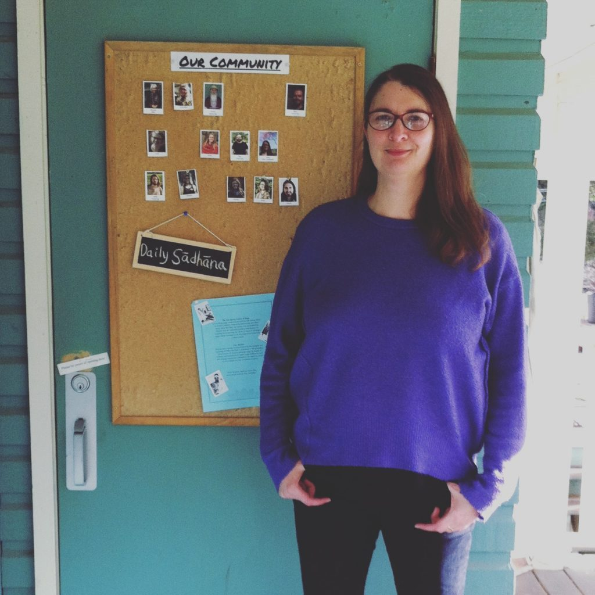

*Thank you, Janell!*

Unfortunately (for us), Janell Sutka, the centre’s amazing office assistant (she prefers that title, although her role has encompassed much more than the title implies), is leaving to go back to school to study massage therapy in Alberta. We will miss her a lot. Thank you for everything, Janell!

~~~~~~~~~~~~~~~~~

## Our sweet satsang sister, Sudha

On February 3, our sweet satsang sister, Sudha Soleil Makortoff, passed away in her sleep. Her courage over the past 20 years, as she faced life with advanced Parkinson’s disease, was inspiring. Her devotion to Babaji never wavered in all that time. We hold her husband, Phil, and her son, Mischa, in our hearts. Sudha found great joy in her little grandson, Dalton, who this summer will be old enough to come to ACYR with Mischa and  take part in the kids program. In Sudha’s honour, we are reposting [the story of her life](https://saltspringcentre.com/our-centre-community-sudha-soleil/) that she shared in the newsletter in 2014.

The family would like to hear from those who knew Sudha. Stories, memories, and pictures are appreciated. Please communicate with the family at [mpmakortoff@gmail.com](mailto:mpmakortoff@gmail.com)

~~~~~~~~~~~~~~~~~

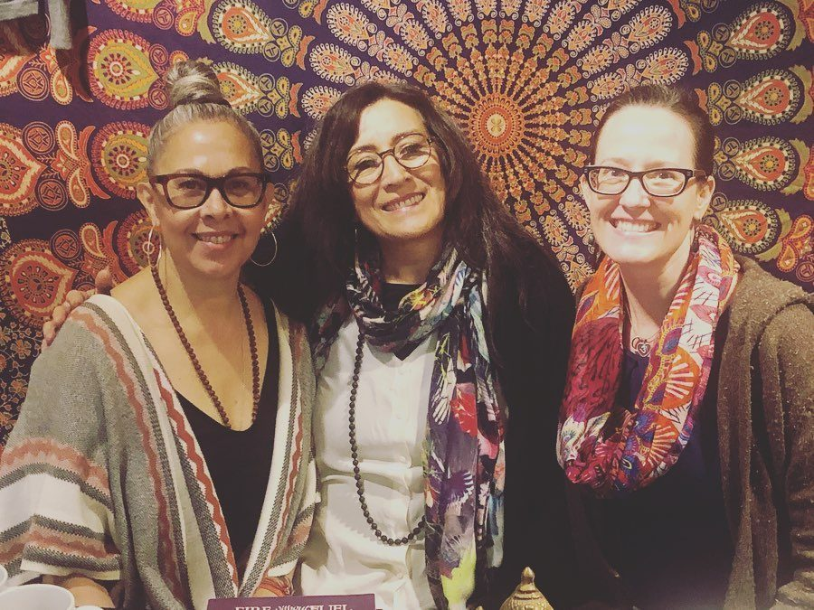

*Victoria Yoga Conference - Chetna, Satya, Gita*

Every year the Centre takes part in the Victoria Yoga Conference. Chetna and her band of merry helpers shared information about the Centre and auctioned off a Yoga Getaway. Lots of people stopped by to chat.

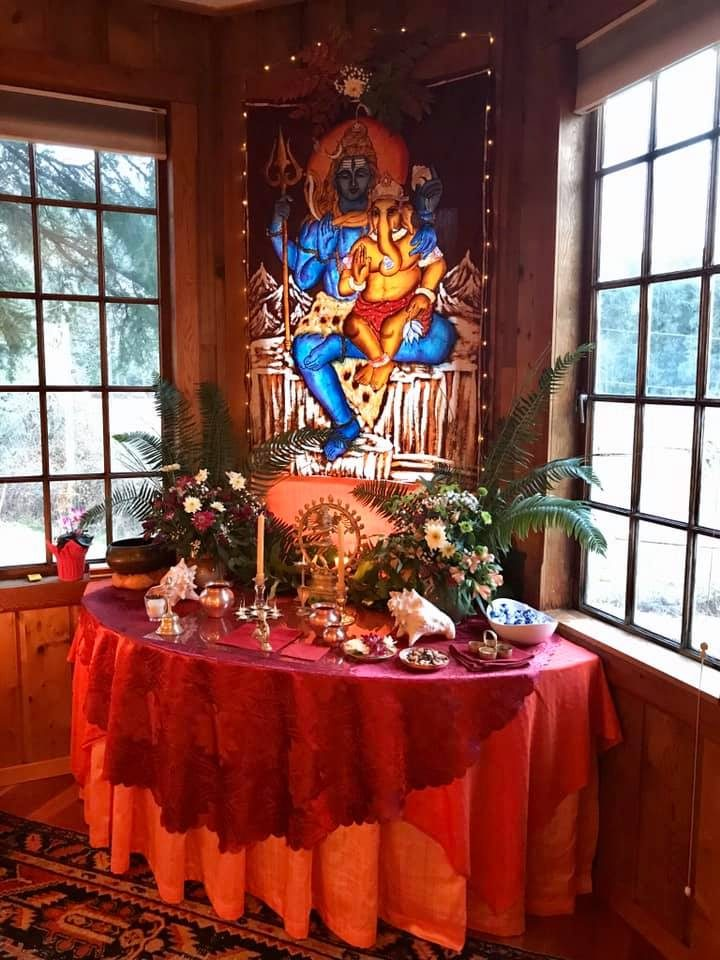

A couple of weeks later, we celebrated Shiva Ratri at the Centre. Because this year, Shiva Ratri fell on a Saturday, many people were able to come for the evening - and some for the whole night - of prayers,  chanting, and pujas. In the morning, the offerings were immersed in the pond - this year without having to break through the ice.

- 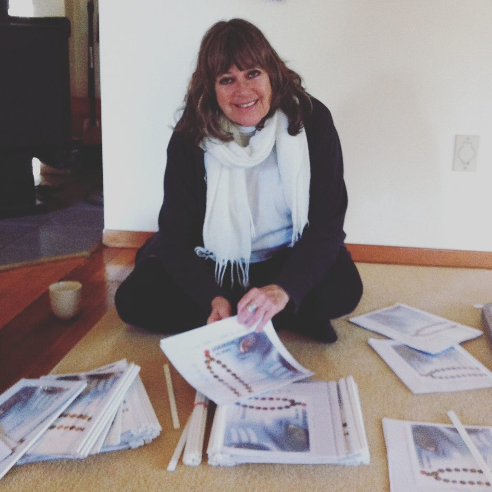

  Shiva Ratri prep - Lakshmi
- 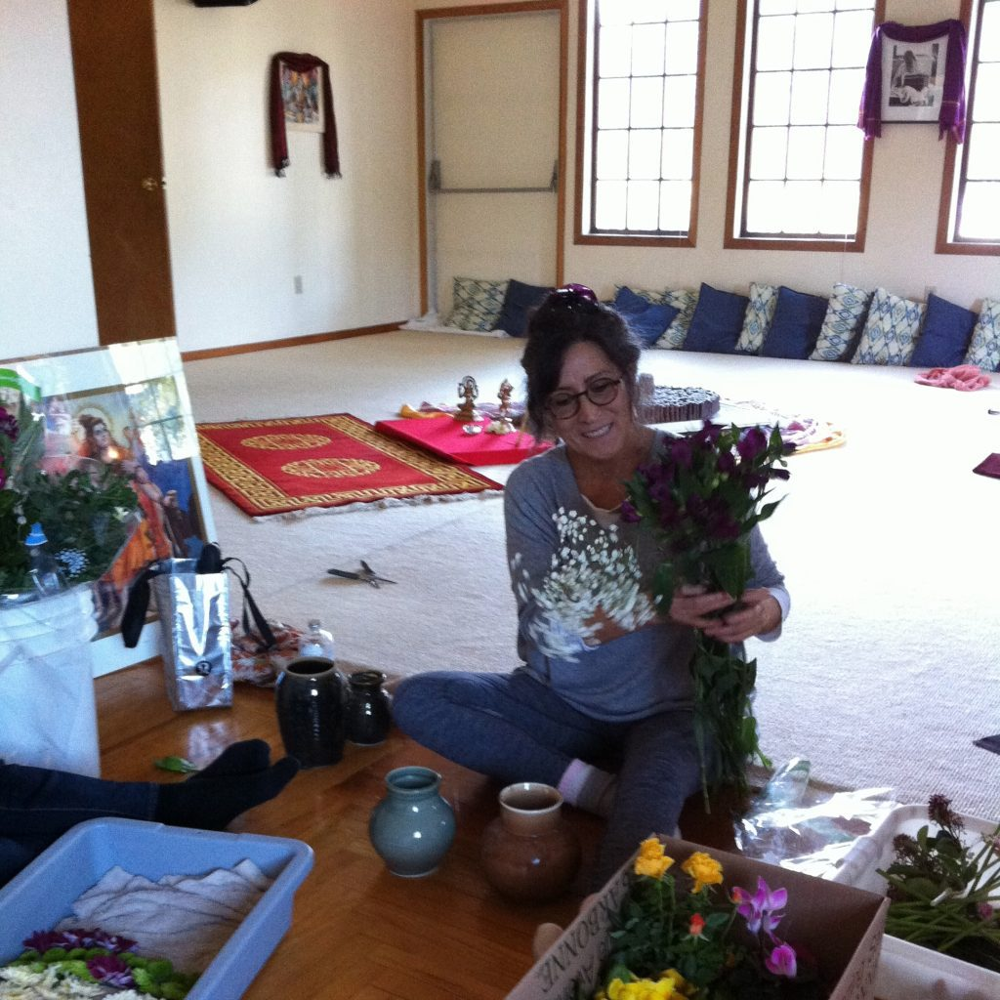

  Shiva Ratri prep - Satya

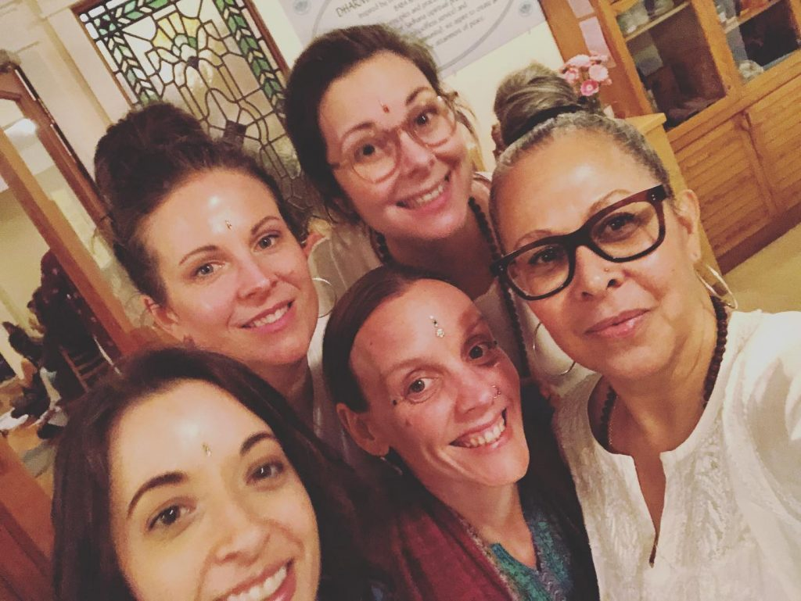

top row: Christine, Adrienne. bottom row: Jyoti, Crystal, Chetna.

- 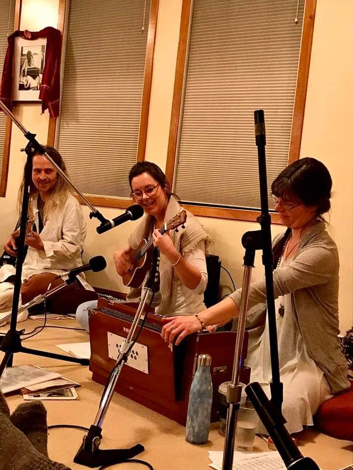

  Sky, Adrienne, Amy
- 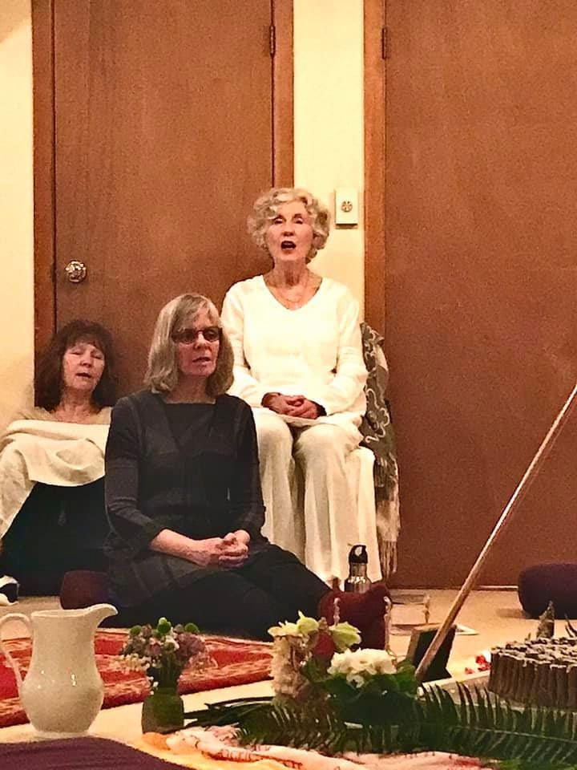

  Theresa, Paramita, Chandra
- 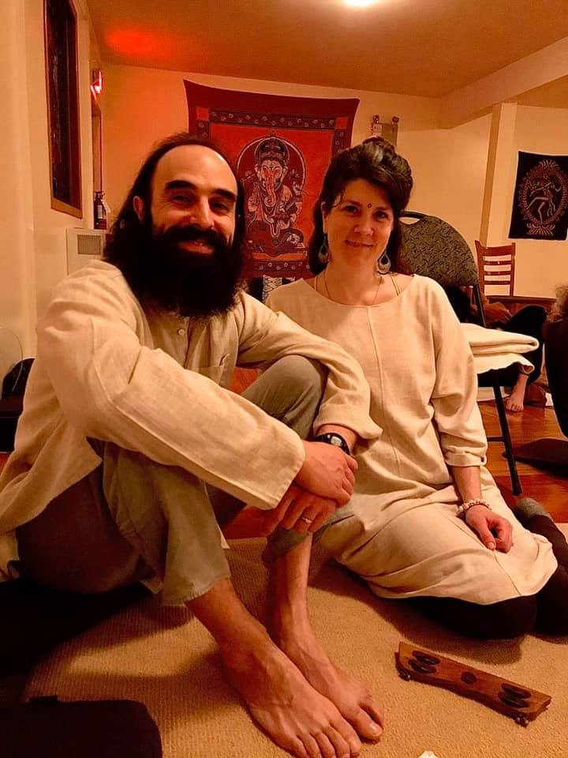

  Yogeshwar and Rebecca
- 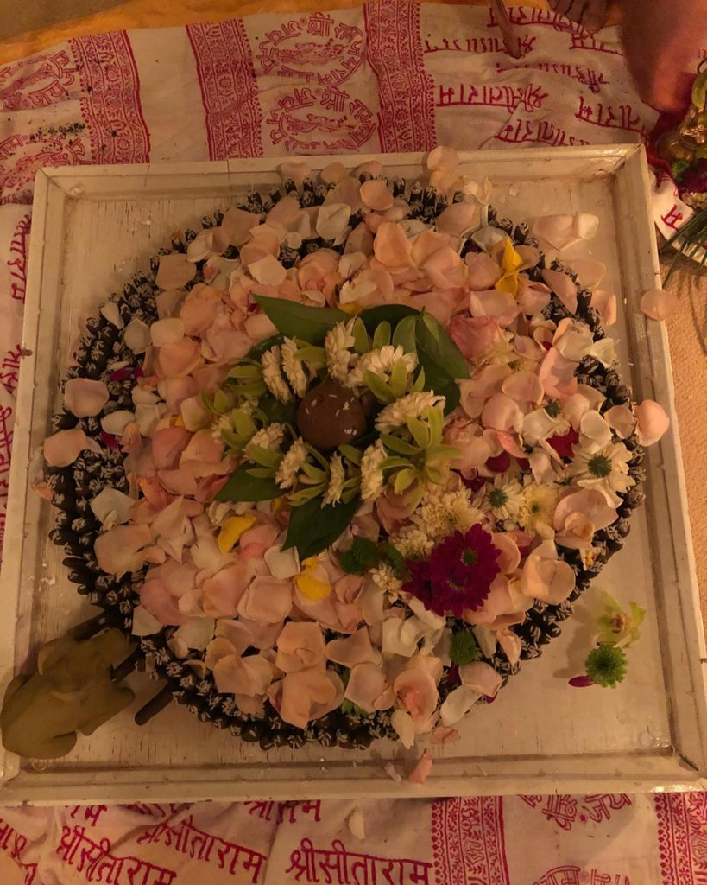

  The offering
- 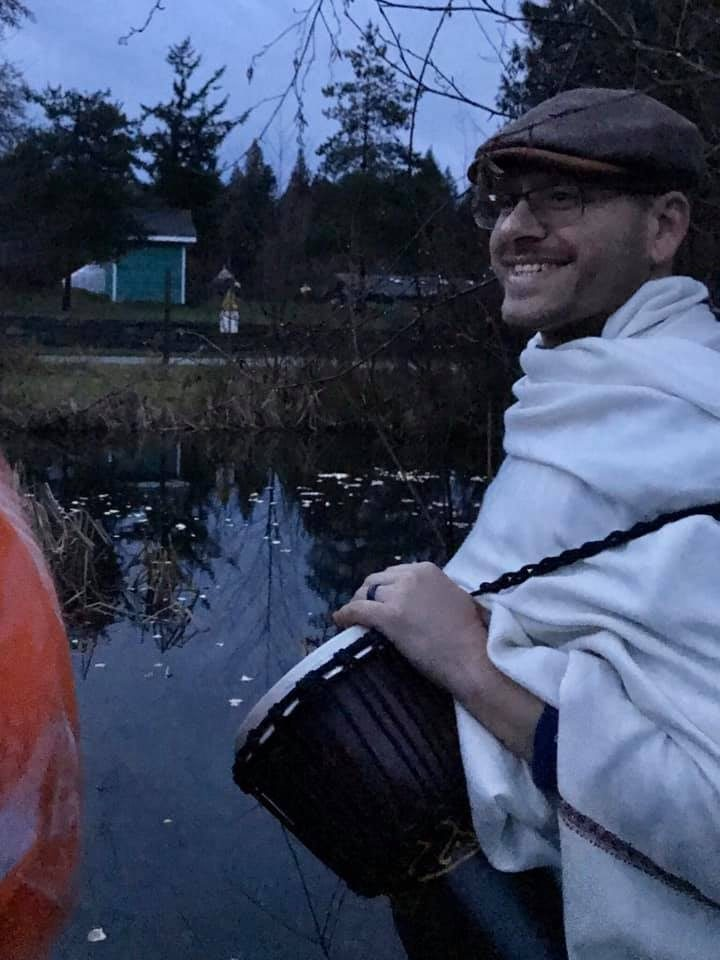

  Shyam
- 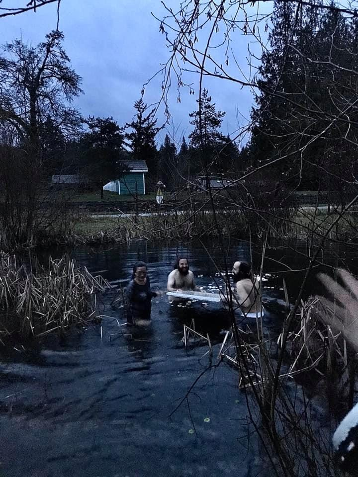

  Offerings going into the pond   
  - Satya, Jesse, Yogeshwar

## Live and work with us

We are in the midst of interviews for various roles at the Centre, particularly for [positions in the kitchen](https://saltspringcentre.com/community/current-opportunities/). We’re also conducting interviews for the [Residential Karma Yoga Program](https://saltspringcentre.com/karma-yoga-program/). If you or someone you know is interested in a kitchen position or in the Karma Yoga program, please direct them to our website.

## At the Centre...

There is one more [Yoga Getaway](https://saltspringcentre.com/programs-retreats/yoga-getaways/) this month at the reduced shoulder season rate (link), so if you’ve been wanting to get away for a restful and inspiring weekend, check it out. Yoga Getaways continue throughout the year, one each month.

Other ongoing activities include Yoga Sutra study on Sundays at 2:00,  Bhagavad Gita (resuming soon - check the [website calendar](https://saltspringcentre.com/calendar/)), monthly full-moon yajnas, and Sunday satsang at 3:30. If you live in Victoria or Vancouver, you can attend satsang there.

#### Victoria Satsang

**New location:** Fierce Studio Martial Arts & Yoga - #5-770 Bay St, Victoria  
**Upcoming dates:** Feb 9, March 8, April 5, May 10  
**Time:** Sundays from 3-5pm  
For more information please contact [Kathryn Kusyszyn](mailto:yogakat8@yahoo.ca)

#### Vancouver Satsang

**Sundays from 6:30-8:30 pm**  
For information please contact [vancouversatsang@saltspringcentre.com](mailto:vancouversatsang@saltspringcentre.com)

On Sunday, March 8, there will be a celebration of Chhoti Holi (Little Holi). This will involve a bonfire after our usual full moon yajna. Participants will be invited to burn small strips of cloth representing all that is stagnant from the winter, thereby clearing the way for the coming spring. If you would like to stay updated on spiritual rituals and celebrations at the Centre, you can [sign up for the Pujari Post here](http://eepurl.com/gh1_I5).

## Mount Madonna Re-Union

Our sister centre, Mount Madonna Center (spelled ‘center’ in the US) is hosting a Re-Union retreat next October. Here’s the information so you can take note of it in your calendar now.

> You are invited to [Mount Madonna Center's](https://www.mountmadonna.org/) Second Annual Re-Union Retreat! Join us for an all-ages event bringing together family and friends, students and alumni, and past retreat and program guests to celebrate the rich teachings and beautiful example of the yogic life that Babaji lived. Throughout the retreat, we will explore this year's theme of "Living Satsang: Community, Connection, Belonging."
>
> Our schedule includes daily Community Circles, a group work project, Kirtan, a Yajna, and more! Come for some or all of the days: October 5-11, 2020 (Monday-Sunday). Please help spread the word and invite your friends! Contact Avi if you have any questions (avi@mountmadonna.org). See you soon!

## To read

This month’s Community story comes from AD Trimble of the Toronto satsang. “[Following the Breadcrumbs](https://saltspringcentre.com/following-the-bread-crumbs/)” takes you on a journey through AD’s life and his search for meaning. At one point along the way, he read “Be Here Now”, the paradigm-shifting book by Ram Dass that inspired so many young people, eventually finding his way, almost by accident, into a yoga class, and the rest as they say, is history.

With so much going on in the world, and undoubtedly in your life, do you ever find yourself struggling to keep your balance? Because we think the world “out there” interferes with our happiness, our first response is often to find something or someone to blame. Babaji reminds us, “Your mind is the creator of everything. You  create heaven and you create hell.” Makes sense, but not easy to do. “[Staying Sane in a Crazy World](https://saltspringcentre.com/staying-sane-in-a-crazy-world/)” addresses this challenge.

*Peace in the mind, and love and compassion in the heart bring the scattered world into one reality. ~ Baba Hari Dass*

Love,  
Sharada
