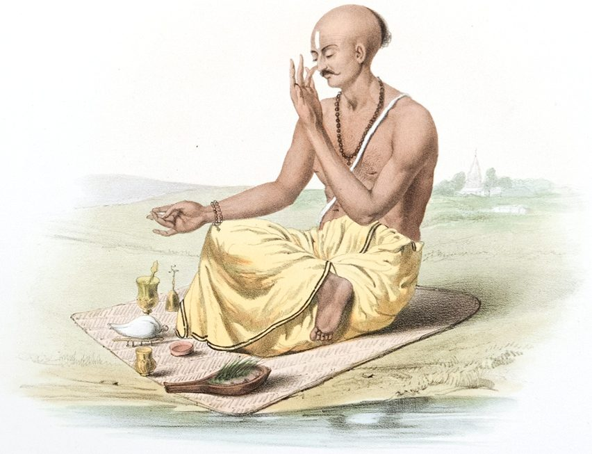

The current situation in the world presents us with a unique opportunity (timewise and otherwise) to explore and engage in the vast array of yoga practices and rituals which Babaji has bestowed upon us. One of these is breath control (pranayama).

### These practices have many benefits including:

1. Calming the mind and preparing it for meditation which further calms the mind.
2. Strengthening the respiratory system and boosting the immune system.
3. Re-directing our attention away from stress and anxiety towards mindfulness and tranquility. At a time of social isolation we have available to us practices that reinforce a “witness consciousness” which will enable us as Babaji said “to be in the world but not of it”.

For those who already have an ongoing or semi-ongoing breath control practice (perhaps including the 4 purifications, 3 bandhas and other pranayama) this is now a great opportunity to go deeper into that practice and to maintain its regularity. Consideration could also be given to including Dirgha Rechak (long exhale) and Dirgha Purak (long inhale) in that practice as Babaji frequently mentioned over the years that these two pranayama are very good for strengthening the lungs.

For those who are new to breath control practices or perhaps have done them previously but have drifted away from them this is now an opportune time to plant a seed of Sadhana or to sustain a seed that was previously planted. A very simple yet profoundly effective practice for such persons is the Eight Kriyas\* which pull the mind inward (pratyahara) and as such are done just before meditation to cultivate an inner awareness so intrinsic to meditation. This practice could for some serve as an inspiration from which other breath control methods become included in one’s practice as time goes on or could for others be just what is required now to maintain a regular daily Sadhana practice.  May you have Peace!

OM, Divakar

*\* Instructions about these practices can be found in the Ashtanga Yoga Primer.*

#### Divakar Mark Raetzen

Divakar has been practicing classical Ashtanga Yoga since 1976. He has served as President of Dharma Sara Satsang Society from the early 1980s thru to 2015 and is one of the founding members of the Salt Spring Centre of Yoga. Divakar is a long time teacher of pranayama, meditation and yoga philosophy at the SSCY Yoga Retreats, annual Yoga Teacher Training, for SSCY staff and karma yogis and with the Vancouver satsang.  He was an original member of the SSCY YTT 200 program and continues to serve on the Committee and Faculty. 

***Top image credit:** By Sophie Charlotte Belnos - This file has been extracted from another file: The Sundhya, or, the Daily Prayers of the Brahmins.djvu, Public Domain, https://commons.wikimedia.org/w/index.php?curid=59401973*
