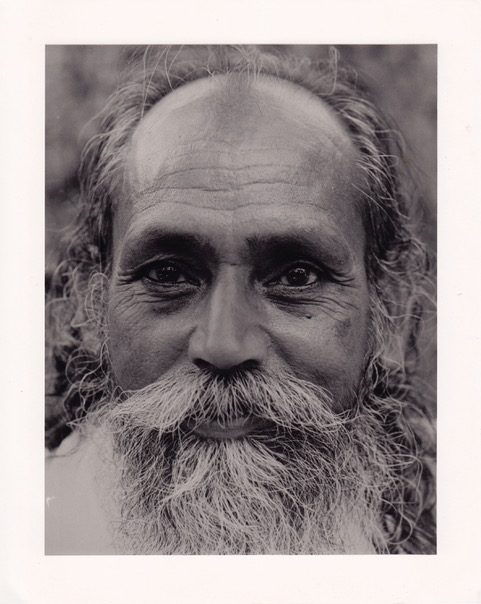

Like many of you, I’ve been reading a lot about Covid-19 - somewhat obsessively I admit. This is a difficult time, and I wish you all well. Here are some thoughts about how we can move through this time without increasing fear and anxiety.

In a conversation with a friend recently, the following question arose: “What would Babaji say?” What advice would he be giving? Babaji was always very practical, so I think he’d tell us to follow the advice given by the doctors, first making sure our sources are reliable, and he would also say, “Do your sadhana.” Regular sadhana (regular - that is, daily - spiritual practice) applies, no matter what the circumstances.

Regular sadhana includes a variety of practices, one of them being daily meditation. The purpose of meditation is to still the mind. We may not be able to control external realities, but we can learn to control our minds, albeit slowly, over time. An uncontrolled mind is a victim’s mind, fearful of what might happen. Fear is a natural response in the face of unexpected change. It can show up in many forms, but it comes down to, “ Am I going to be okay?”  Fear of death is the bottom line.

Daily meditation is not an instant fix; it will not immediately put an end to your fear, but little by little, if you sit every morning, even for 15 minutes, it will slowly erode your anxiety. Even if there’s but a moment of peace, it makes a difference.

*Sitting in silence will not go to waste; some day you will reap the harvest of peace.*

*If you work on yoga, yoga will work on you.*

What else can you do? There are lots of helpful  guidelines and recommendations being floated around in the news and on social media; let’s take a look at some of these suggestions through the lens of yoga.

*Sadhana is not only asana, pranayama, and meditation. Sadhana includes developing positive qualities, building right character, closeness with your family, friends, and society.*

The first of yoga’s ethical guidelines is ahimsa, or non-harming. Self-isolation or self-quarantine  is a practical application of that principle.

Staying home is an act of care for others. It protects you and others at the same time, and it is especially supportive of those who are vulnerable, such as older people or anyone who has a weakened immune system or an underlying health condition. Staying home, if you can do it, is the kindest thing you can do.  If you are in the vulnerable category, you provide others with the opportunity to practice selfless service, to care for you (from a distance).

Staying home helps control the spread of the virus, but it can also lead to loneliness. Here again the practice of ahimsa supports us. Technology in this instance can be a boon. You probably know many people who live on their own and can’t get out. This is a perfect time to call them and let them know you’re thinking of them and that they matter to you. Platforms like FaceTime, skype or zoom can bring you into each other’s lives, not quite as intimately as face-to-face, but the next best thing.

There are many practical ways you can help without going into someone’s house: you can drop off groceries, leave a treat or a card on someone’s doorstep, help with gardening, sit outside someone’s window and sing or play music. We all need connection, to know that we matter to someone. Giving to others also happens to be the best medicine for overcoming your own sense of isolation.

It’s springtime, nature is  flourishing, and being outdoors is very healing. Go for a walk or a bike ride on your own, or maybe your dog. Let the beauty of nature fill your being, and breathe in the fresh air. Enjoy this time by yourself.

## The Bhagavad Gita outlines the duties of a human being. This is what we can do:

1. Duties toward yourself includes taking care of your health by eating well, getting enough sleep and exercise. It also includes keeping your mind peaceful.
2. Duties toward your family means being a support to your family, providing food and shelter, teaching children, and caring for your parents.
3. Duties toward the community is an extension of the care for your family, extending care and kindness, and helping where you can. Allow the peace you develop to extend outward.
4. Duties toward one’s country expands the circle even further. It includes being prepared to help during difficult times, such as the situation we find ourselves in now. Some people are on the front lines, treating people in hospital; the rest of us can support them by following the health guidelines - washing hands, maintaining physical distance (but not emotional distance) from each other, staying home.
5. Duties toward the earth means loving and caring for nature, protecting soil, water, plant and animal life. Nature supports all life; our job is to protect nature.

We are interdependent beings; we all need each other. Let’s help each other in any way we can.

May we be filled with loving kindness,  
May we be well,  
May we be peaceful and at ease,  
May we be happy.

Contributed by Sharada  
*Quotes in italics are from writings by Baba Hari Dass*

**Sharada Filkow,** a student of classical ashtanga yoga since the early 70s, is one of the founding members of the Salt Spring Centre of Yoga, where she has lived for many years, serving as a karma yogi, teacher and mentor.
