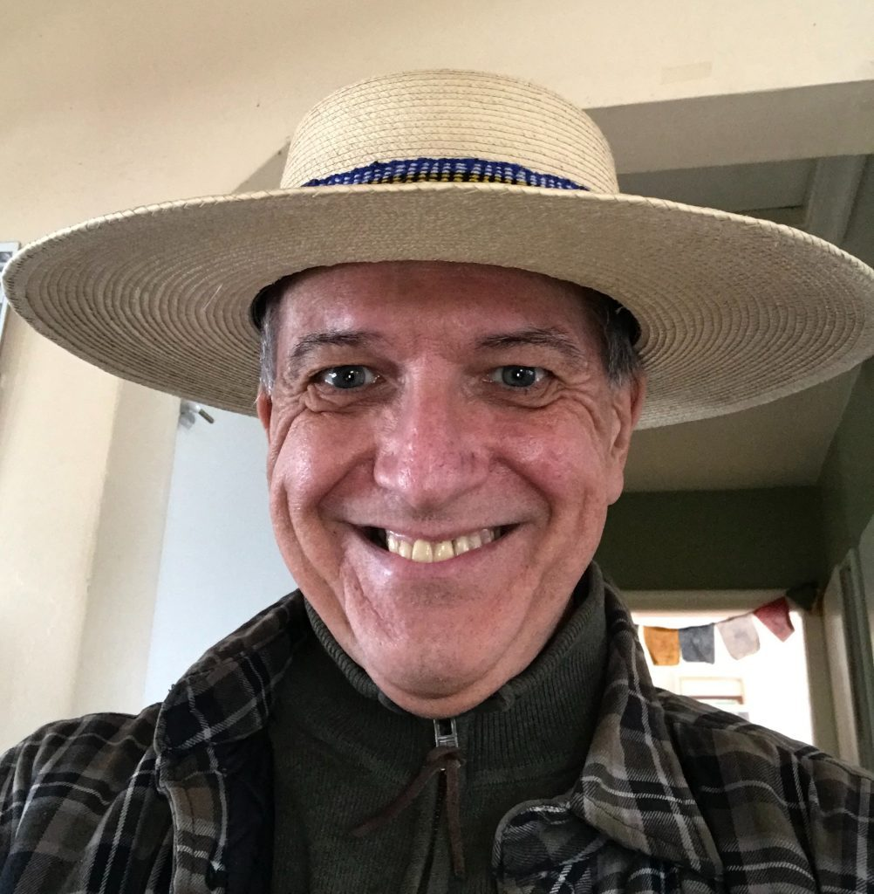
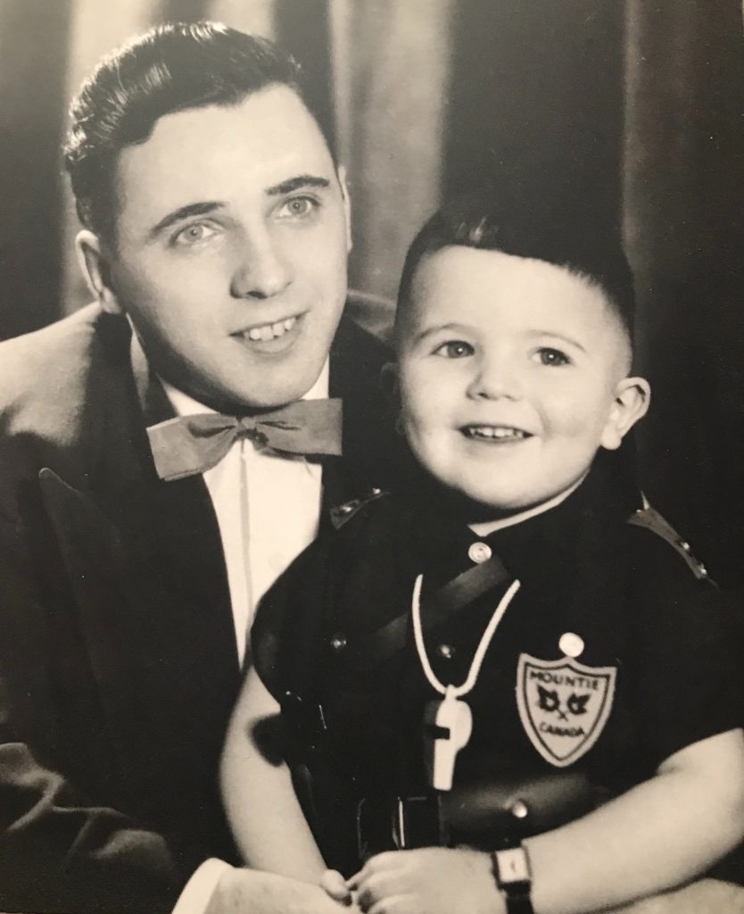
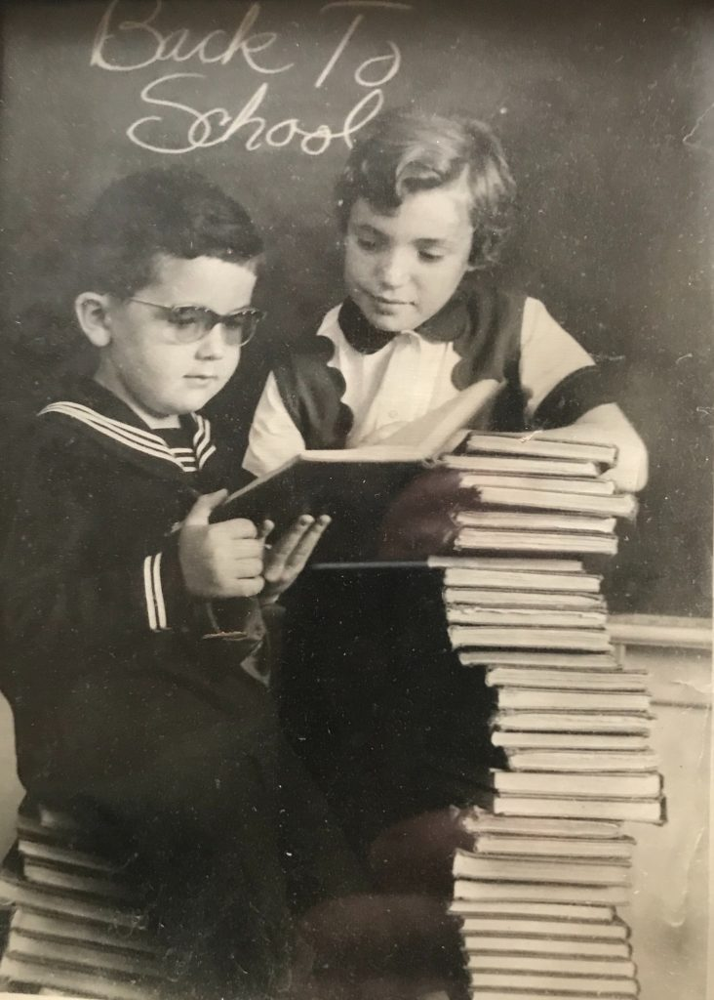
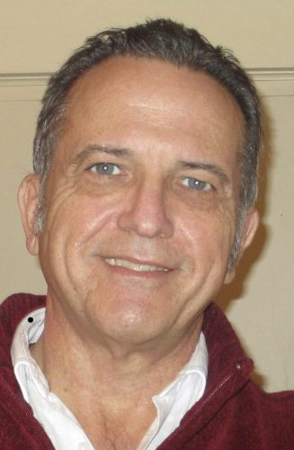
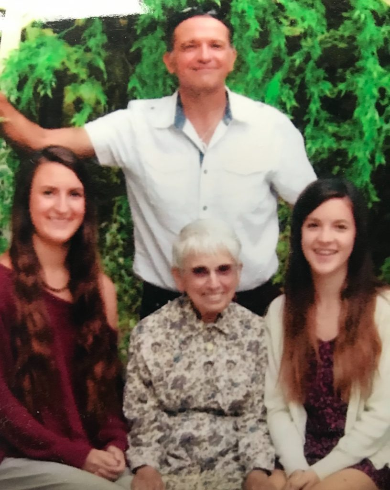
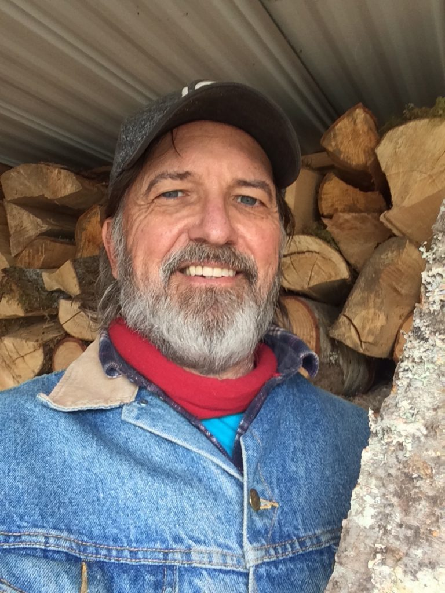
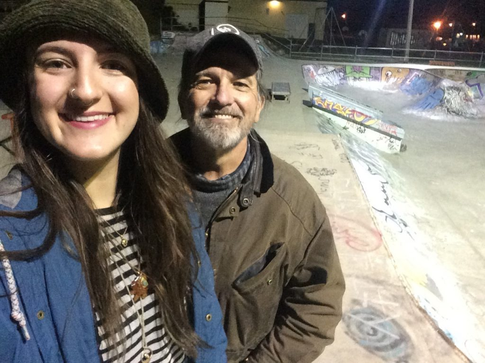

*Larry wearing a hat from Guatemala, a gift from a friend. Travelling vicariously through friends and family*.

From as far back as can remember, I have been seeking a closer relationship with the divine source of creation, a god of my own understanding. Times of emotional and physical crisis appear to have been the catalysts on this journey of self-realization. These crises were mainly due to my ego seeking comfort outwardly in my surroundings, rather than inwardly into my soul where I now have a deep sense of knowing that this is where the divine spark of creation exists and is most accessible. It seemed to me that I was continually being affected by traumatic events in the lives of family and friends. These situations I now believe to be the lessons by which I was taught by spirit to let go of attachments to places, people and things in order that I might experience truth and divine nature expressing itself within everything and everybody.

*Larry and his dad, Rolly - 1956*

My father passed away when I was 13 years old, from the effects of a car accident that took place when I was 10 months old. My only sibling and brother, Murray, passed away at 11 weeks of age as he was born premature shortly after father's car crash. My inability to find the courage to be by my father's side as he lay dying was to be a source of shame and a catalyst for a life of chaos until I was 33. Not knowing how to process these traumas, these events became the driving force of a 20 years drug addiction (including alcohol) which ended with my living on the streets of Vancouver's Downtown East Side for a number of years. I think that I was trying to seek inspiration to understand the purpose of my life ... WHY was I still alive?

The quest to find God had begun in this life at approximately age 11 when I developed an interest in communing with nature. As I sat alone in the woods near the school that I was attending, I would ask myself: “Why am I more content sitting peacefully contemplating nature, than joining my friends at playing basketball?”

*First day of school (Larry on left, unidentified child on right) - 1957*

Raised in a Catholic family, I found very little comfort in religion. Spirituality however began to make sense for me at age 33 when I sought out and joined Alcoholics Anonymous, almost 35 years ago. Members of AA introduced me to the 12 Steps and Traditions. The steps are designed to effect a spiritual awakening in the recovering person, and the traditions are guidelines on how to get along with others. The AA “program” is based on the formula discovered by Carl Jung, “Spiritus Contra Spiritum”, meaning that a spiritual experience is the cure for alcoholism. I have not had a drink of alcohol since May 10, 1985. This was my first concrete experience with the power of God, whom I now call Krishna.

The first two limbs of Ashtanga yoga philosophy, *Yama* and *Niyama* had begun to manifest in my life, though I didn't recognize them as such at that time. With the words and encouragement of many mentors that I encountered in AA, I was learning to apply the very foreign concept of the words “Be good to yourself” (*Ahimsa*) by not causing harm to myself with drug abuse, and I was also learning to recognize the divine spark within other members of the fellowship. I also began to learn and apply the spiritual principle of selfless service by carrying the message of recovery, through spirituality, to others still suffering, both individuals and families. As I began to recognize the divine in all creatures, I incorporated an awareness of *Ahimsa* by adopting a vegetarian diet. This was the beginning of the pathway into the sunlight of the spirit...into yoga!

*Just back from India - 2014*

In bringing AA's 12 steps into my life I was able to begin applying the principle of *Ahimsa* to the resentments that I had towards others - the thoughts of anger, greed, lust and attachment. I took a fearless, moral inventory of my behaviours up to that time, wrote them on paper, shared them with an Anglican minister, and asked the god of my understanding, at the time represented by Jesus, to remove these barriers to understanding the truth about God. The burden of shame that I had being packing was replaced by divine grace. Peacefulness and contentment replaced chaos. The unquenchable hunger of the walking ghost that I had become was satisfied to a great extent by seeking God and letting Him/Her direct my service to others.

After ten years of sobriety and two marriages based on perceived need rather than love, I met Wendy, whom i thought was truly an angel when she told me that although she already had two children she thought I should have the opportunity to have children of my own. As I'd had a vision of having children after some length of sobriety, I was amazed that after 10 years of preparation, it appeared that the vision would manifest. We were married in 1996, and have two beautiful daughters (Maya 1997 and Ella 2000). Although divorced in 2012, we remain friends, celebrate special occasions together with family, and lend support to each other when possible.

*Larry and his treasures: Larry (standing) with Maya, Julie (his mom), and Ella - 2015*

In 2005, I started working as a registered social worker for a nonprofit society in Kamloops, B.C. With compassion and understanding of the plight of marginalized populations and a university degree, I began a 13 year career of providing service and support to people suffering from AIDS, addiction, mental health problems and homelessness. In 2006, a coworker mentioned a very powerful book that she thought I might enjoy reading, which had been introduced to her at a counselling course she'd taken: Paramahansa Yogananda's “Biography of a Yogi” was my introduction to yoga philosophy and lifestyle.

One day the agency director noticed me speeding around town in my car as I was trying to save the homeless, and suggested that I “go do some yoga!” A few days later a friend mentioned that he'd attended a yoga class and that he'd found it to be very energizing. Having craved “energy” most of my life, with his permission I accompanied Terry to my first Hot Yoga class. Although finding it extremely challenging, after losing 30 lbs. of fat in the first three months of daily practice, I realized that for me yoga is life.

*Bringing wood to the program house - 2017*

In the past 12+ years I have found much contentment and many health benefits in a daily practice of Bikram Choudhury's intense program of Hot Hatha Yoga Beginners Series and in Paramahansa Yogananda's Lessons for Home Study. In 2014, a group of us, from the agency where I worked, raised funds to travel to Rajasthan, India with World Developing Connections to work on a community project with a local social service agency, building washrooms adjacent to preschools in small rural villages. Some of the villagers welcomed us for lunch in their homes with great respect for us. Though they were very poor in material goods and comfort, these Indian families were gracious and eager to share much of what they did have. I especially enjoyed interacting with the children who gathered at the work site daily. It was a fantastic experience of service in an ancient culture. The India experience awakened in me a much deeper appreciation and humility for the life I am experiencing in its current manifestation.

One of the most profound spiritual experiences of my life up until that time happened upon my return from India. I was complaining to God about my being overdue for a spiritual experience after “doing” yoga daily for the past spiritually uneventful 7 years. As I walked down the hallway of my house into the kitchen and found myself suddenly knocked down to my knees by an invisible force. Then I experienced a most blissful energy which rushed from the soles of my feet to the top of my shining skull, as a vision of some of the many challenges I'd experienced in this life appeared with the realization that I was never in danger and that I am part of cosmic energy, unborn and immortal. A feeling of tapping into my original home flooded my entire being. What my mind and body experienced in that blissful moment continues to motivate me today as I continue to expand my daily yoga practice and my willingness to be of service to others.

Marta, Jess, Sharada, Hope, Ellie, Racquel, Larry - 2018

Craving more knowledge and being drawn to share my yoga experience, I decided that I should become a yoga teacher. I was seeking a community where I could deepen my yoga practice and find emotional support as I struggled to cope with being the sole caregiver to an aged parent. An internet search led me to the Salt Spring Centre of Yoga (SSCY) website. What most interested me about the community is that it had been founded by an Indian monk who had taken a vow of silence in 1952, the year in which my current reincarnation began. Baba Hari Dass, a truly enlightened being, a saint, had learned many forms of yoga from true Indian masters and had many devotees around the world. I learned that some of his devotees would be involved in the yoga teacher's training program, and hundreds more would attend the Annual Community Retreat at the beginning of August. It looked and sounded like the type of place that I was searching for, situated on what I have found to be truly enchanting Salt Spring Island, B.C.

In the summer of 2016, completing the YTT200 in Ashtanga Yoga was a relatively stress-free and nurturing experience for me. Some teachers had been devotees of Baba Hari Dass for many years, and they where imparting ancient and sacred knowledge to us, for which I felt truly blessed. During the course, I learned that an individual could become a member of the Dharma Sara Satsang Society (which oversees the operations of SSCY ) and could return to the land as a Karma Yogi. I have been very fortunate in being able to return to the Centre to practice selfless service (karma yoga) for the past 3 summers.

I enjoy sharing time and space with our SSCY family and the many interesting beings I get to work with there every summer as we prepare for and host many spiritual events and ceremonies. SSCY also hosts one of the only children's yoga programs in Canada as part of ACYR, the Annual Community Yoga Retreat which is attended by a couple of hundred people. Part of the retreat includes a talent show and sometimes an acting performance of the Ramayana. My favorite moments at the Centre are when I get to listen to the wisdom of some of the founding members of the community, especially when they talk about their relationship to Babaji. I enjoy learning Sanskrit, chanting Kirtan, participating in Arati and Yajna ceremonies, and deepening my asana and meditation practice. My favorite classes are the study of Patanjali's Yoga Sutras with Yogeshwar, the Bhagavad Gita with Raven and Nonviolent Communication with Sharada. While at the Centre, I spend most days gardening, pruning trees, plants and bushes, and general maintenance. To rest, I retire to my camp in the cedar forest by the creek that makes its way across the land to Blackburn Lake. it's but a short walk down Blackburn Road to the local swimming hole!

Daily sahdana keeps the light shining on the path ahead to greater spiritual fulfillment for me in this life. During many moments in the day, since joining the Dharma Sara Satsang Society, I reflect on the gratitude that I have for the spiritual foundation of Ashtanga Yoga that I enjoy, by God's grace and with the direction of advanced yoga practitioners at SSCY. Daily, I try to apply/observe the principle of *Santosha* (contentment) by decluttering my mind and physical space of wants and desires. I try to recognize and to appreciate the gift of increased awareness in every breath to the best of my ability as I internally chant the Hare Krishna mantra.

*Larry with his daughter, Maya - exploring the skate park on Salt Spring - 2018*

Performing my dharma at home in Kamloops most of the year, I try to recreate some of the tasty organic vegetarian meals that our talented kitchen yogi's make as they aim to follow the very tasty recipes from the Centre’s cookbook while adding their own creative touch. I make a double batch of kitcheree once a week, which I share, along with roasted veggies and CCF tea, an Ayurvedic formula recommended by Dr. Jasi Lambert, with my elderly mom who has been a vegetarian since 1928. Caring for her, I feel, is not only my duty, but a valuable experience that I’ll treasure long after her passing.

Walking with Sanatan, one of the satsang’s founders, I said “When our community had a store on 4th Avenue in Kits, I was lost on the Downtown East Side.” His response still warms my heart: “Boy, you were so close to home and didn't know it.” I am now very blessed to be at home with this wonderful family of yogis. My contact with Baba Hari Dass is through his writings. My limited experience of him comes through the many books and translations that I've been fortunate to read and revisit often. In the future, I look forward to applying myself to be of service at Mount Madonna and Sri Ram Ashram as well.

Peace & Namaste,  
Larry
