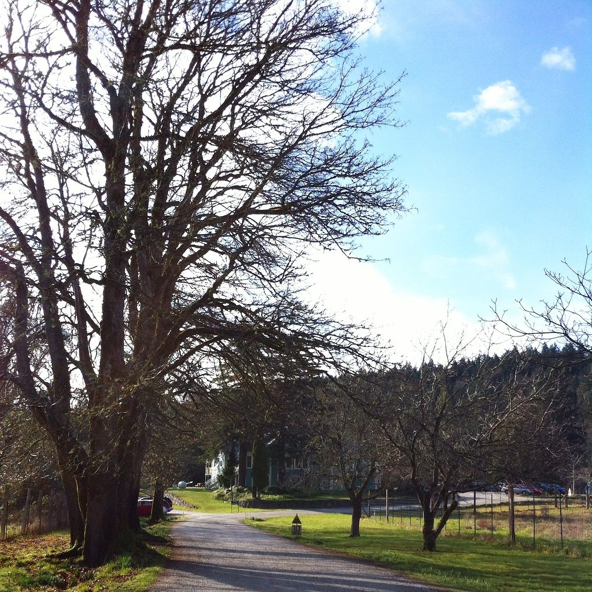
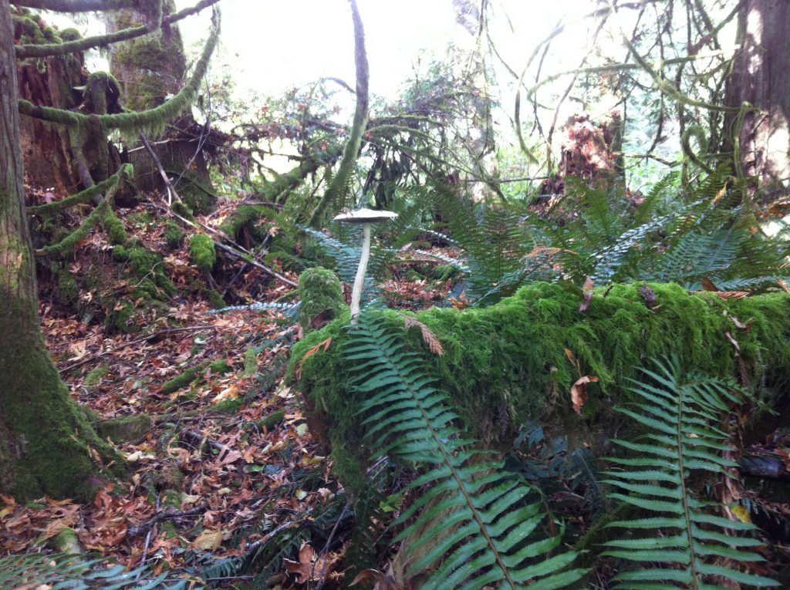
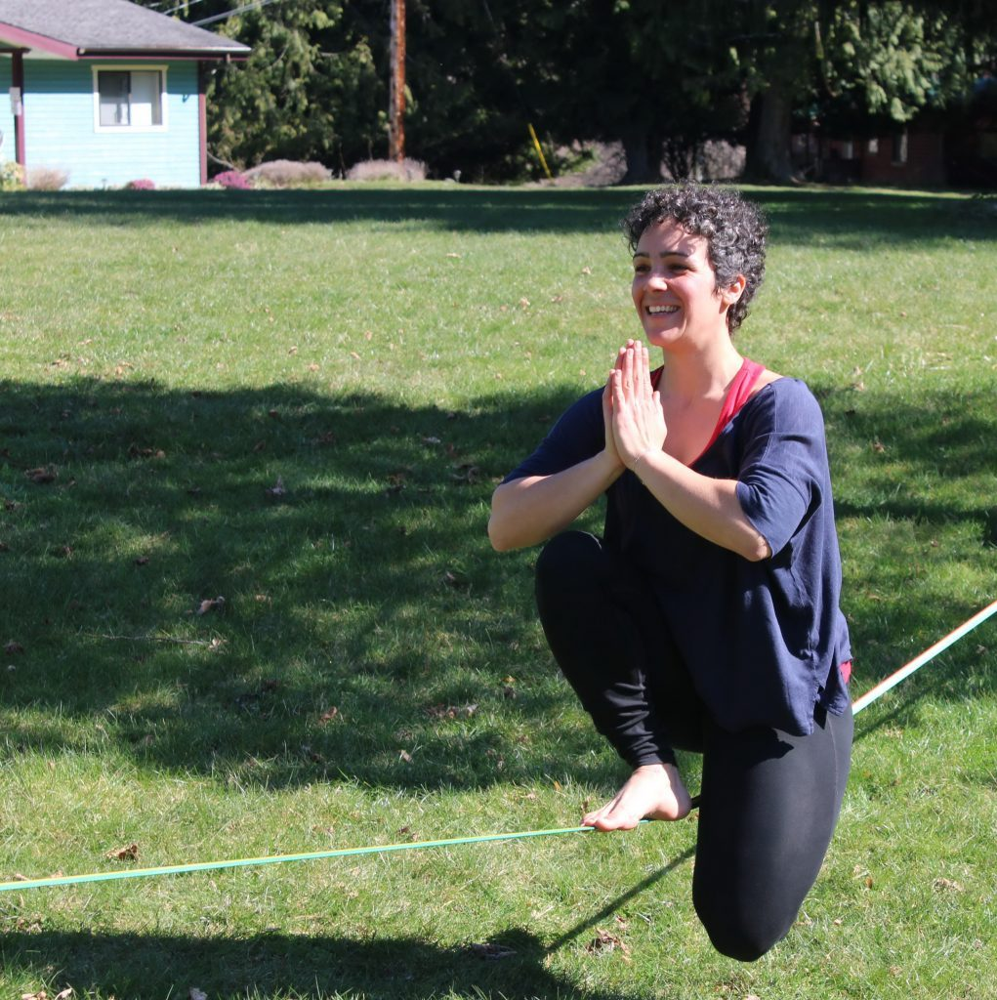
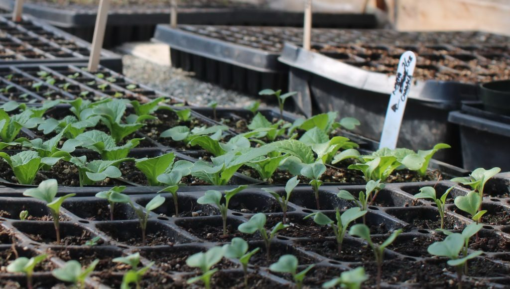
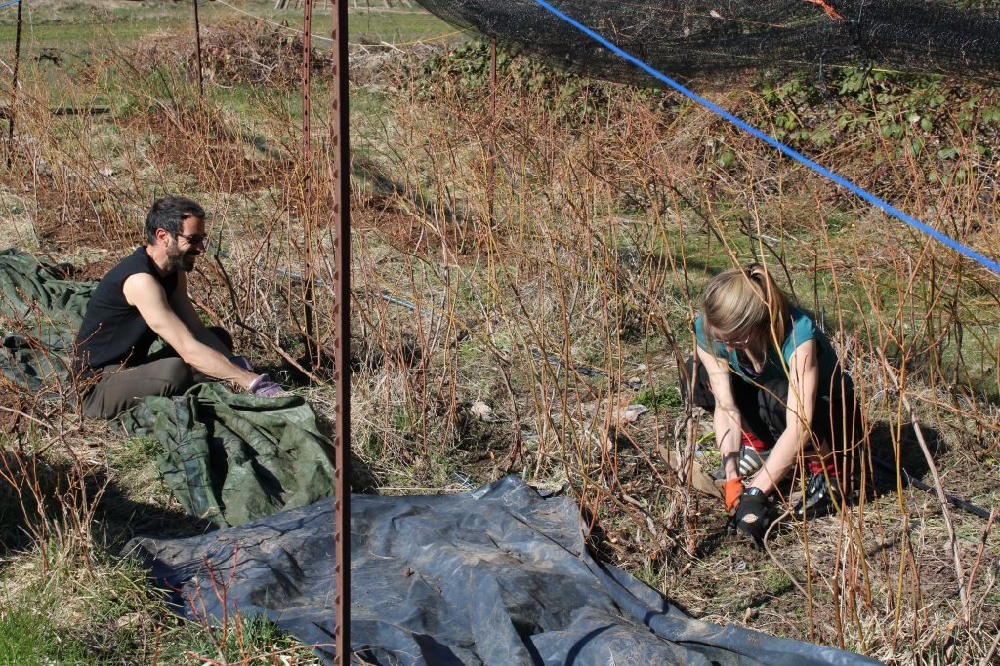
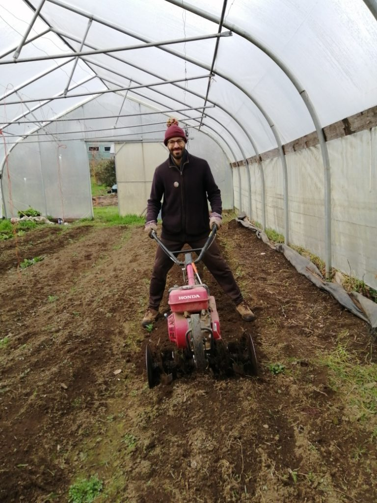
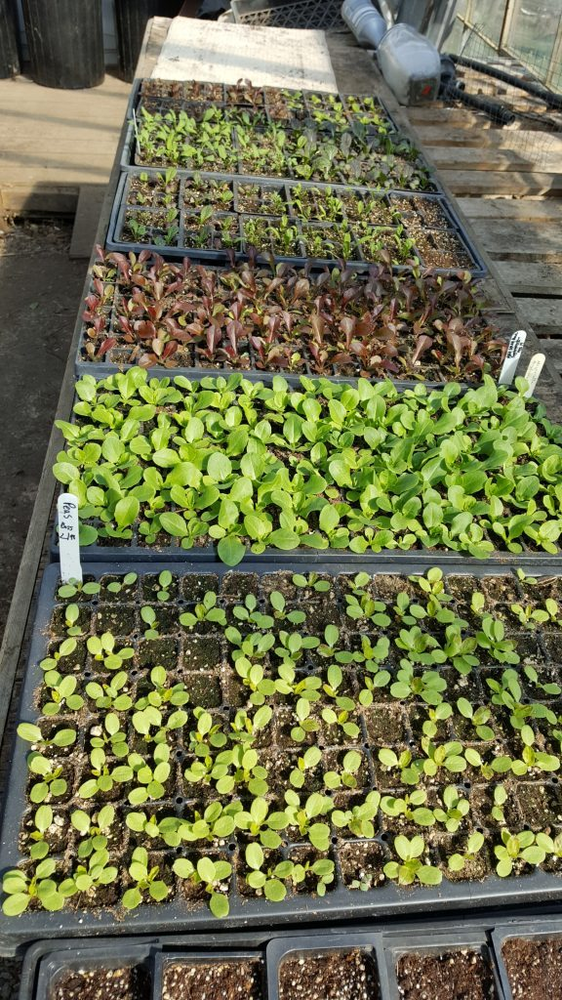
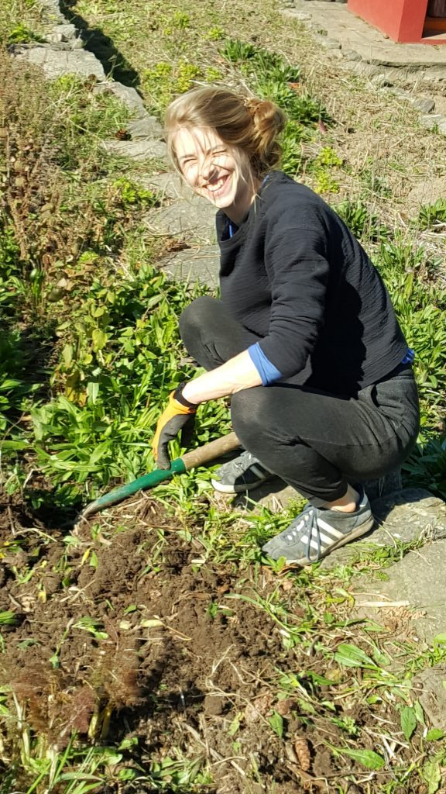
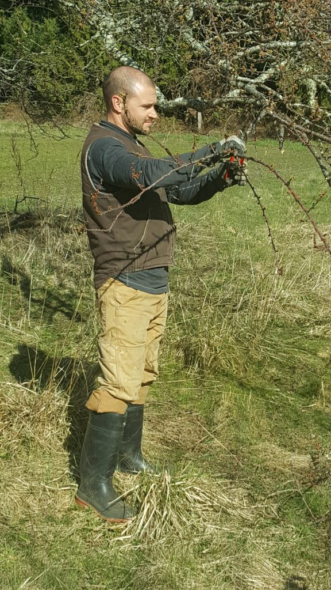
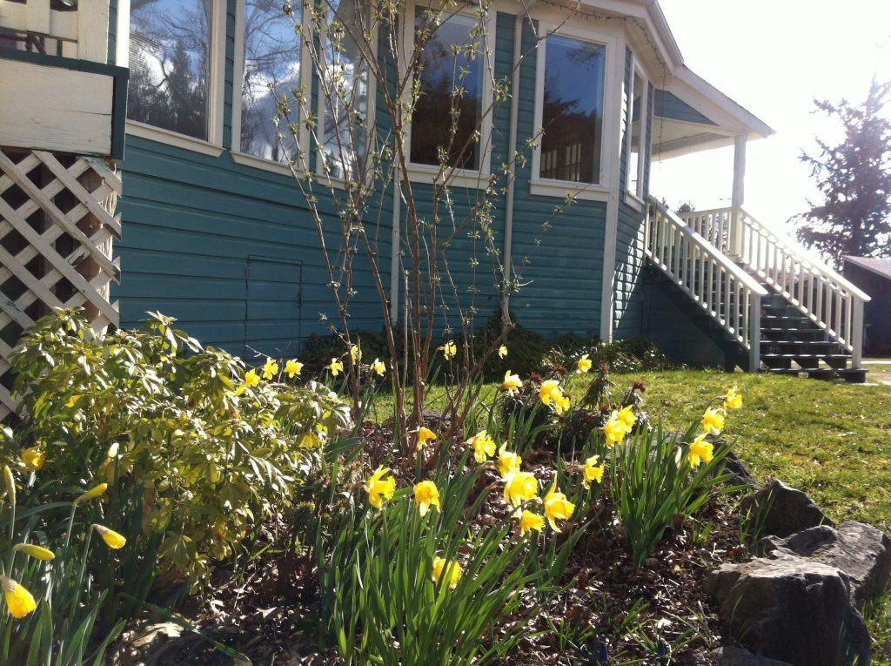

*All your prayers will be heard, your meditation will bring peace, your selfless service will remove your discontent, and your devotion to God will fill your heart with divine love. ~ Baba Hari Dass*

Dear friends,

I hope you are all well. In this strange and unsettling time, the impacts of COVID-19 are being felt all over the world. This is a new experience for all of us, although it is rapidly becoming the new normal. All of us here at the centre send our love and prayers for your well-being.

We are all well here, following all the health guidelines. For now the centre is closed to the public. All classes through to the end of May have been cancelled, and we don’t yet know when we will be able to safely resume classes in the program house. Regular updates are posted on the [Centre’s website](https://saltspringcentre.com/). The Centre School is also closed until further notice, as are all schools throughout BC, and classes will be offered online. It’s pretty quiet here; there are no sounds of children playing and laughing, but the birds are still singing and the frogs still serenade us at night.

*slackline asanas*

The small community of Centre residents continues to care for the centre, ensuring that life continues harmoniously. The office team has been very hard at work. Having made some big decisions, along with the Dharma Sara Satsang Society board of directors, regarding how to move forward during this time, they’re now turning their attention to tasks that there’s never time for during the busy months. Also during this time, the kitchen has undergone a major deep clean, and there is lots of energy going into the farm.

*Blueberry maintenance - Dan and Lotte*

*Dan tilling the soil in one of the greenhouses*

- 

  ready for transplanting
- 

  Lotte
- 

  Adam - pruning the orchard

## Here is Dan’s farm update:

> Hello to everyone.
>
> I hope we’re all remaining healthy, and keeping a safe and compassionate distance from one another these days. In the midst of these trying times, it has become even more obvious that small, local, organic, ecological, community farms and farmers are the lifeblood of our society. Farmers will become even more important to our neighbourhoods, communities and social networks in the coming months, particularly if or when we are unable to fully rely on the globalized supply chains that we have become accustomed to. If you are able to do so this season, please consider supporting your local small farmers. Nothing is more basic and essential than the food we eat.
>
> In this vein, the Salt Spring Centre farm is hoping to reopen up our farm stand to sell seedlings, herbs and vegetables as soon as it is safe to do so and once we have come up with a system that ensures that we comply with all the current protocols recommended by public health officials.
>
> In the meantime, the farm team has already begun providing for the community, whether sprouts and microgreens from our greenhouse, overwintering kale, cress and Asian greens that have been producing new shoots this spring, or last year’s carrots and parsnips that have continued to hold up well in storage. The 2020 season is also well underway, as we just put out our first lettuce transplants and pea shoots this past week, while also starting to seed arugula, carrots and radishes directly into our hoophouses. The community remains strong and has rallied together on the farm this month to help prune the orchard, weed and mulch around the blueberry patch, clean out the terrace overlooking the Madonna in order to start up a perennial herb garden, and plant some asparagus crowns.
>
> Despite the fact that we have to maintain a physical distance from one another, it also feels like a valuable opportunity to continue to connect and build our community online, as well as to create a broader movement to ensure the survival of smaller ecological-minded Canadian growers.
>
> In gratitude,  
> Daniel Naccarato

## The Year Ahead

Our residential community will remain small for a while. The spring session of the Residential Karma Yoga Program has been cancelled along with all other programs and rentals. We’re still hoping the summer session will be able to go ahead, but it’s too soon to know. We have stopped conducting interviews for the karma yoga program for now. The people who have been accepted into the spring session are considering whether they’d be interested in joining a later session, in the hope that they will go ahead.

All of these cancellations are, of course, having a big impact on the Centre’s financial stability. Recognizing that this is a situation common to all, please know that if you are in a position to be able to support the Centre during this time, donations would be most welcome.

#### Donations can be sent in the following ways:

1) sending an e-transfer to [info@saltspringcentre.com](mailto:info@saltspringcentre.com)

2) donating online using this link: <https://saltspringcentre.com/donate>

3) calling the office during office hours (Monday-Friday 10:00 am - 4:00 pm) and donate using your credit card.

We appreciate any support you’re able to offer.

## **Free online classes and offerings from Salt Spring Centre of Yoga**

During this time, the Centre is offering satsang and some classes online, using the zoom platform. At our second online satsang, 44 people attended! It was heartwarming to see so many people whom we normally see only at ACYR. Here is a list of available events and classes you can connect to. All you have to do is click the link to take part.

You can find more details about our [Public Offerings](https://saltspringcentre.com/programs-retreats/public-offerings/) online.

For information on how to access Zoom meetings, see the “**Connecting to Zoom**” section below the Yoga Class section.

**SUNDAYS**

- **Sadhana for Continuing Practitioners – 7:30 to 8:30 am**  
  This Sadhana class is open to anyone with a basic grounding in pranayama in the tradition of Baba Hari Dass. Log in at: <https://zoom.us/j/622101844>
- **Yoga-Sutra study group – 2:00 to 3:00 pm**  
  A virtual study group - An opportunity to practice Svādhyāya, or self-study, through an examination of the Yoga- Sūtra. Participants read and discuss the sūtras and the written commentary of Baba Hari Dass. Log in at: <https://zoom.us/j/673534051>
- **Virtual Satsang – 3:30 to 5:00 pm**  
  A virtual gathering that includes kīrtan, meditation, and readings from the writings of Baba Hari Dass and other spiritual teachers. Log in at: <https://zoom.us/j/533119043>  
    
  ***Please note:** Victoria Satsang is cancelled until further notice. We welcome its members to join this virtual satsang. Details on our [Satsang page](https://saltspringcentre.com/dharma-sara-satsang-society/satsa%e1%b9%85g/)*.

**TUESDAYS**

- **Bhagavad Gita study group – 7:30 – 8:30 pm**  
  Virtual study group - Through direct contact with the translated scripture and commentary by Baba Hari Dass, simple opportunities to practice sanskrit and discuss insights, beginning or seasoned students are supported in yoga with the core messages and inspiration of this ancient yogic text. Log in at: <https://zoom.us/j/432061829>

**FUTURE OFFERINGS**

- The Centre hopes to host other special events online in the future. Further information will be posted on the [website](https://saltspringcentre.com/programs-retreats/public-offerings/) as details become available. You may also wish to follow us on [Facebook](https://www.facebook.com/saltspringcentreofyoga/) to stay updated on special offerings.
- Some SSCY yoga teachers may choose to make their asana classes available online in the future. Details will be posted on the [Yoga Class Schedule page](https://saltspringcentre.com/yoga-schedule-2/) on the website as they are organized.

**CONNECTING TO ZOOM**

- Download [Zoom](https://www.zoom.us/) at least 15 – 30 minutes before the meeting starts so classes can start on time.
- If you have any trouble launching Zoom, follow the instructions on the [Zoom Support page](https://support.zoom.us/hc/en-us/articles/201362193-Joining-a-Meeting).
- At the meeting time, click the relevant class link to join.

**HANUMAN JAYANTI**

Hanuman Jayanti, on April 7, is the celebration of Hanuman’s birthday. Beginning at 9:30 am there will be chanting of 11 repetitions of the Hanuman Chalisa. Look for live-streaming on the centre’s [Facebook page](https://www.facebook.com/saltspringcentreofyoga).

## **Free online classes and offerings from the Mount Madonna Community**

Our sister centre (Mount Madonna Center) is also offering classes and other events online.

*(Please check regular updates posted on* [*mountmadonna.org*](https://msn.us20.list-manage.com/track/click?u=01cb5a9d69daaf840bb6f3f7e&id=328e6ebdcb&e=382d7b437c)*):*

- **Free Daily Yoga Practices with** **Kamalesh** – Kamalesh is offering an All Levels practice in asana, pranayama, and meditation via Zoom. Tune in via the link below from 7:00-8:00 am PST and stick around for 15 mins afterwards for a brief Q&A session! The class is All Levels and will include asana, pranayama and meditation. All are welcome!  
    
  *To access Kamalesh’s daily classes,* [*click here*](https://msn.us20.list-manage.com/track/click?u=01cb5a9d69daaf840bb6f3f7e&id=758a963055&e=382d7b437c)*.*

- **Free Pre and Post-Natal Yoga Classes with** **Hannah Muse -** Hannah is offering her Yoga Church, Postnatal and Prenatal Yoga weekly classes all available from your home! Yoga Church will be Wednesdays at 11:00 am PST. Post and Prenatal Yoga will be Thursdays at 11:00 am PST.  
    
  *To access Hannah's classes,* [*click here*](https://msn.us20.list-manage.com/track/click?u=01cb5a9d69daaf840bb6f3f7e&id=eed6f61b3f&e=382d7b437c)*.*

- **Free Recorded Practices –** Mount Madonna Institute plans to make previous and newly recorded audio files available including guided practices in Mantra, Pranayama, Meditation, and other practices.   
    
  *Coming Soon*...

- **Free Access to our Media Library** with a host of recorded materials including community discussions about the Yoga Sutras, Bhagavad Gita and other previously recorded materials.  
    
  *To access our Media Library,* [*click here*](https://msn.us20.list-manage.com/track/click?u=01cb5a9d69daaf840bb6f3f7e&id=df08d29e44&e=382d7b437c)*.*

- **Temple YouTube Channel.** Sankat Mochan Hanuman Temple has set up a YouTube channel and will be posting regular videos and will be experimenting with live streaming Aarti.   
    
  *To access the Temple YouTube Channel,* [*click here*](https://msn.us20.list-manage.com/track/click?u=01cb5a9d69daaf840bb6f3f7e&id=80da73f0b9&e=382d7b437c)*.*

I encourage you to take advantage of these wonderful offerings from both the [Salt Spring Centre of Yoga](https://saltspringcentre.com/) and [Mount Madonna Center](https://www.mountmadonna.org/).

Meanwhile I urge you to stay home if you can, maintain physical distancing, wash your hands, and continue to be kind to each other. Even when the rug is pulled out from under us, we have so much to be thankful for. These kinds of difficulties can serve to prompt us to turn inward to calm our minds - and also to reach out to connect and support each other.

## I invite you to read the following articles

This month’s SSCY community story comes from Larry Lorranger. Traumas in his youth led him on a circuitous journey, including years of addiction, in his search for God. Through his work with AA, and later as a social worker to help marginalized people struggling with addictions and homelessness, he eventually found his way to yoga, and to the Centre. Although Larry has spent quite a bit of time here the past few years, a lot of his story was new to me. I’m sure you’ll find [Larry’s Yoga Story](https://saltspringcentre.com/larrys-yoga-story/) fascinating.

[Connection in Isolation](https://saltspringcentre.com/connection-in-isolation/) is a look at our experiences during this time of COVID-19, viewed through the lens of yoga. This virus has upended our lives, and how we respond to it is important. How can we get through this without increasing fear and anxiety? We need our practices - and each other - more than ever. Babaji would undoubtedly tell us to follow the health guidelines diligently - and to do regular sadhana.

Continuing on the same theme, Divakar, a long time devotee of Babaji’s and senior teacher in our satsang community, brings us [Breathing Easy](https://saltspringcentre.com/breathing-easy/), encouraging us to practice pranayama for strengthening the lungs and supporting us on the path of peace. All the practices he mentions can be found in the Ashtanga Yoga Primer; if you’ve done YTT at the centre or spent some time here as a karma yogi, or if you’ve come to a Yoga Getaway and bought a copy of the Primer, you can use it as a reference to support your practice.

May we all be well.

*Don’t think you are carrying the whole world. Make it easy, make it play, make it a prayer ~* Baba Hari Dass

Love,  
Sharada
