I was first introduced to Sri Ram Ashram during my YTT studies at the Salt Spring Centre of Yoga in 2017.  I remember feeling very moved by this inspiration of Baba Hari Dass, and I planted a seed of hope and intention in my heart that one day I would volunteer at the ashram in India with my family.

The story of Sri Ram Ashram is beautiful and heartbreaking. Baba Hari Dass wanted a place to care for children who were abandoned in the streets, train stations and holy places of India. These children would often arrive in dire need of medical attention, nourishment, shelter and, above all, love and education. Babaji became their father and began a legacy of love, care and community in this enclave outside of Haridwar, that continues to this day.

In 2018 I was first provided with Rashmi’s contact and we began our correspondence over the next two years.  Originally from California, Rashmi has been working with the children of Sri Ram Ashram for over 32 years -- acting as mother, administrator, and advocate for the needs of the children and the ashram.

Rashmi welcomed us immediately with information, details, and volunteer opportunities for our proposed trip. Although we tried to make our trip a reality in 2019, it wasn’t until 2020 that we were able to go. My children, Ethan, 11, and Seana, 9, gathered donations from their school and local families in the months preceding our trip. And our family saved a jar of money we collected from our farm stand, streetside busking and generous donations from friends and family members.

We departed for India on March 6th, 2020. It was a long 14 hour flight from Vancouver to Delhi. The kids travelled well, enjoying the on-flight Indian meals and a host of movies. Upon arriving we were warmly received at Master Guest House in Delhi - the perfect place to acclimatize to the time change and culture shock of India. Masala chai quickly became an instant favorite and the kids loved experiencing the chaos of road traffic in Delhi, TukTuks, local markets and big sites like India Gate, Humayun’s Tomb, Hazrat Nizamuddin and the Lodhi Gardens. Delhi is now a modern city full of cell phones and modern conveniences, and yet effortlessly maintains an ancient charm from its thousand year old history.

An Uber drove us to the train station for the kids first train trip to Agra. During our train rides, we enjoyed amazing country scenery enroute, Indian snacks and chai! Our day at the Taj Mahal was spectacular, guided by our new friend Khan. Ethan and Seana felt like movie stars as Indian tourists asked them repeatedly to pose in photographs with their families.

- 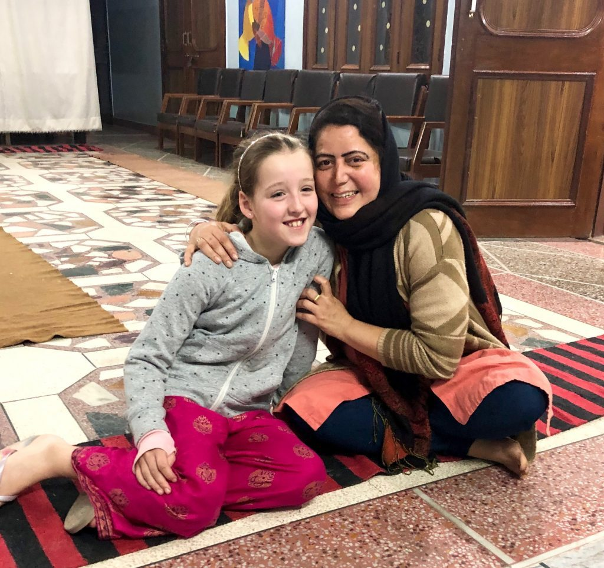

  Seana cuddling with Seema
- 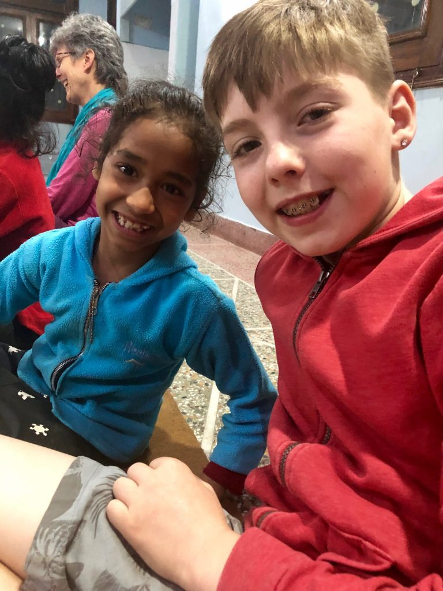

  Aarti and Ethan sharing dinner
- 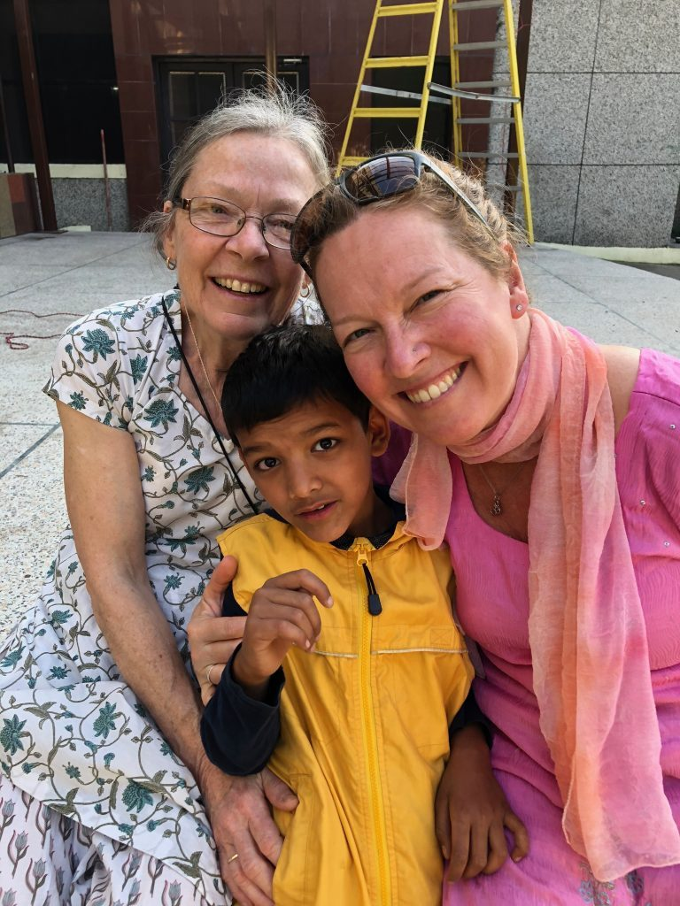

  Swapna didi and Stacy didi cuddling little Aadi!  One of my favorite buddies.

It was early on our third morning in India that we headed to Haridwar! A lovely man named Vinod met us at the train station. On our way to the Ashram we spoke of our mutual friends, Chetna and Gita didi, who were currently at Sri Ram with their tour group. Our arrival at the Ashram was just as I had imagined as we entered the colorful gates and drove down the tree-lined driveway. Devin was covering for Rashmi (who had returned to the US) and greeted us along with Sima Didi, gaggles of children, Chetna and Anuradha! Many hugs and tears were shared. Within 10 minutes, a lovely girl named Sita invited Seana to play with the girls, and Rohit took Ethan to the playground, leaving Mark and me to settle into our rooms. We felt like family from the moment we arrived as we were provided with the kids’ schedule and rules, and then shown around the complex. Soon it was afternoon chai time where we got to meet more of the children, the ‘*mothers*’ and our lovely nurse, Swatna didi. We shared food with the children in the dining hall every day, sitting upon the ground with thalis heaped with dhal, rice, rajma, dhal and the like. We shared Arati with the kids our first night, and many nights following, the children guiding us, word by word, holding our hands and excited to share their ceremony.

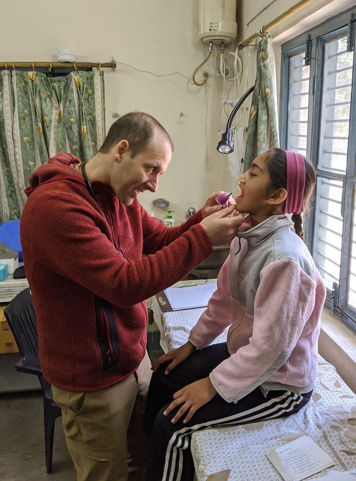

*Mark in the clinic assessing Preeti. Mark did an annual check-up on most of the children.*

We opened the medical clinic on our second day at the ashram and spent some time organizing and preparing our clinic schedule with Swapna didi.  Swapna, Mark and, at times, Sima or Savita, would share clinic visits with various children every morning, while Seana and I spent time with the babies. Mark (a family doctor) reviewed the kids’ medical histories and made suggestions on each child’s development and/or the management of various physical or emotional challenges that they faced.

- 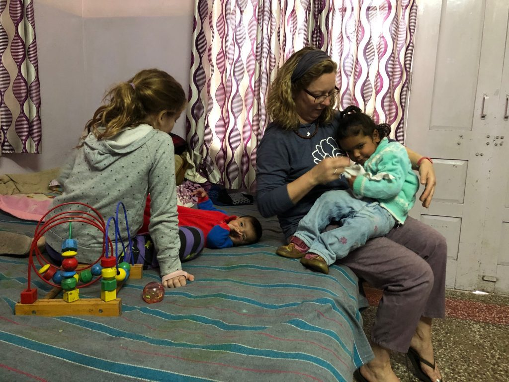

  Physio time! Stacy with Gauri; Seana with little Aanya!
- 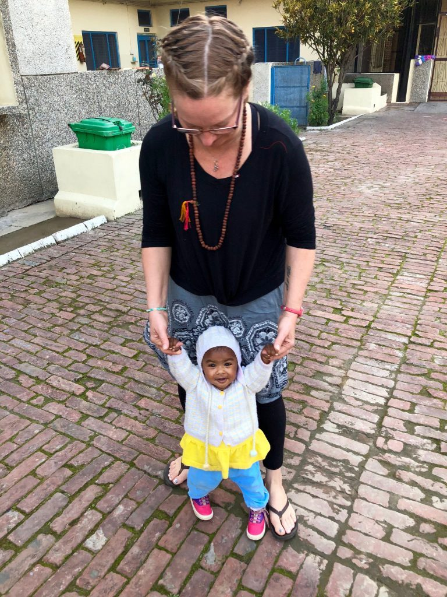

  Stacy walking little Prerna

The babies and toddlers Seana and I worked with included Gauri, Aanya, Vidi, Prerna and Aneesha. We taught Gauri to walk while pushing the stroller, and walked up and down the courtyards with Prerna. The little ones received tummy-time, exercises and lots of cuddles. Many of the babies have developmental delays and hence the one-on-one time was so important. The volunteer mothers also needed a break at times. Swapna didi shared stories of the state in which a lot of the children arrive at the Ashram. Most were so heartbreaking. It was truly inspiring to witness these same children so full of love, smiles, and thriving in their sports and school studies thanks to the attention and care they receive at Sri Ram. The kids love to learn English and to inquire about places around the world. Above all, their trust, and immediate love and acceptance of us, was so heartwarming. I desperately wanted to bring one of the children home with me – my heart was so full at the Ashram. Little Prerna still visits my dreams even now.

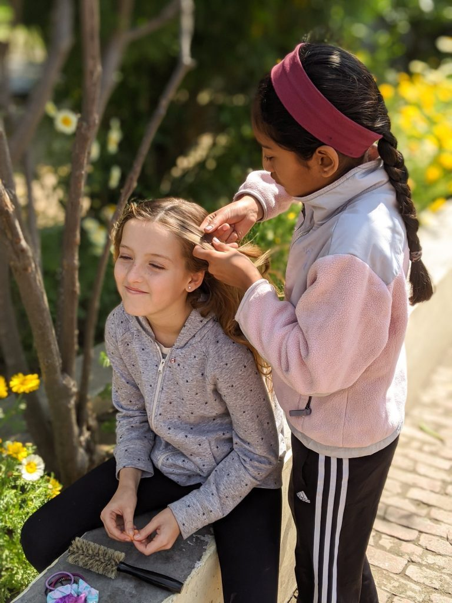

*Preeti braiding Seana's hair*

These kids need books and stimulating toys to encourage their development. The list of potential needs kept growing in my head during our stay. We made a financial donation that allowed for the Ashram to purchase soft, interlocking mats for the babies for their tummy-time and play, as well as a safe place for the younger ones if the mothers need to prepare a bottle or leave the room for a moment. Our family helped organize the clinic’s many medication donations and purchases to make it easier for Swapna didi and others to attend to the health care needs of the Ashram. Mark made a list of things that were required, based on our clinical assessments, and tried to focus on herbs, medications and food recommendations that were readily available in the region. Many of the children are low in calcium and iron and so we made picture charts for their dining hall to remind them of good, healthy foods in their diet.

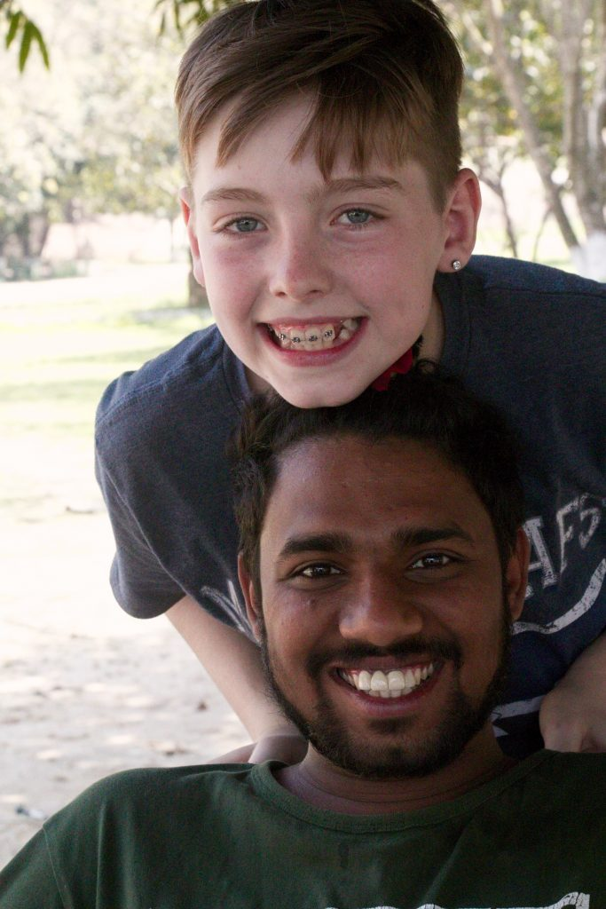

*Ethan and Big Deepak - true friendship*

Ethan spent many a day with ‘big’ Deepak learning photography and exploring the grounds of the Ashram. Seana learned the art of hair braiding and making woven hand bracelets thanks to the kind patience of Anjula, Sima and the other girls. The progression of COVID-19 in India resulted in all the schools being closed as of March 16th, and so the kids (including University students) were home on the Ashram more than usual.

- 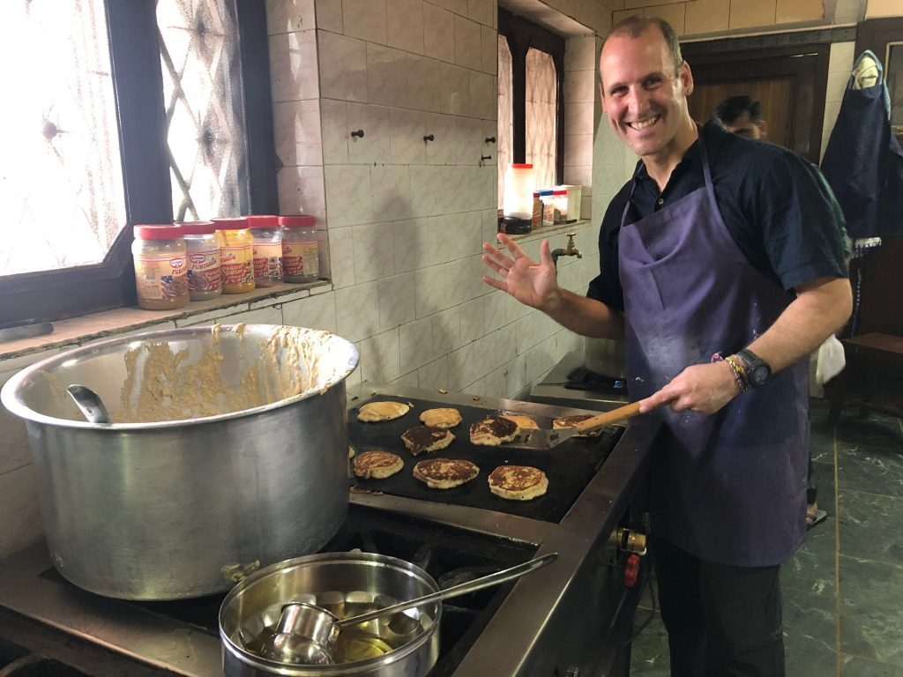

  Mark cooking up banana pancakes for 80!
- 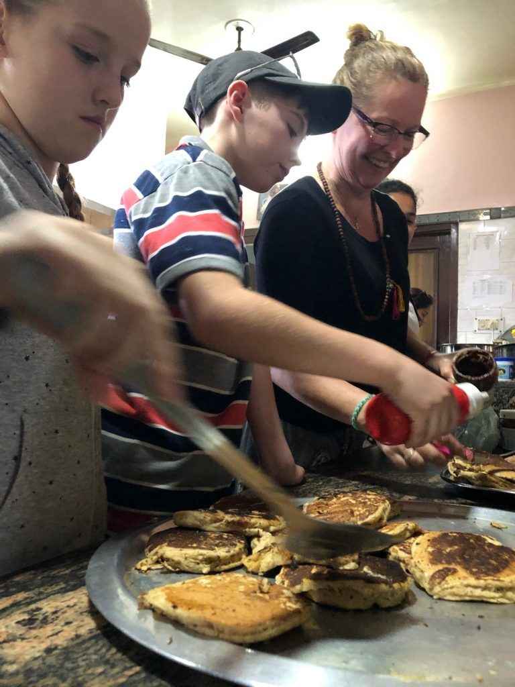

  Ethan served the Canadian maple syrup!
- 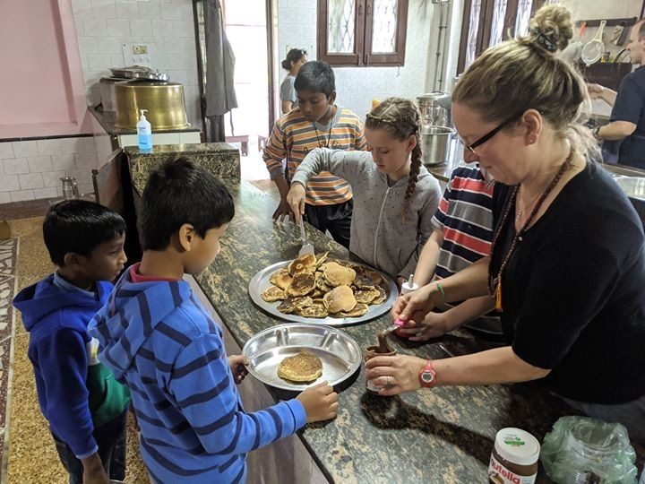

  The boys loved the pancakes!!  Many of them came back for 2nd and third helpings!

One of the highlights of our visit was when our family made banana pancakes for a Sunday chai time. We served them with Canadian maple syrup and Nutella. The pancakes were a huge hit for the kids and we had a lot of help in the kitchen! It was the first time we had ever made pancakes for 80 people! I remember holding an outdoor yoga class in the garden for our aspiring yogis, and Mark teaching 7/11 breathing for anxiety, and jala neti to the kids for all the nasal congestion. I cherished the daily walks with the kids, hand in hand, as we shared stories and laughter.  Our kids played together – all day, every day! Ultimate Frisbee was an afternoon favourite.

- 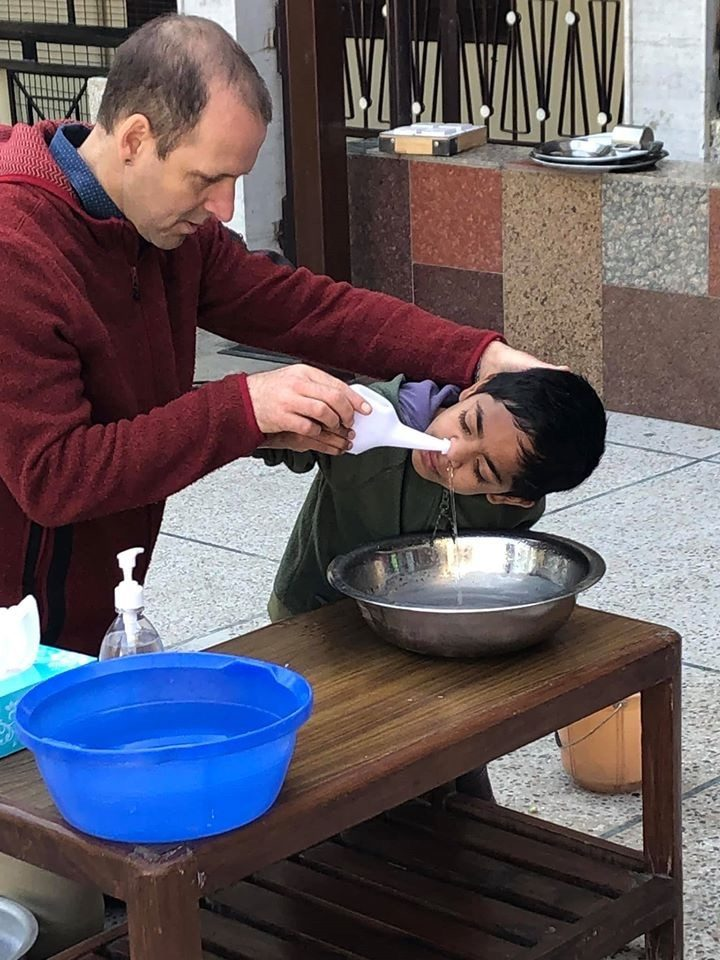

  Mark demonstrating jala neti with Rohit
- 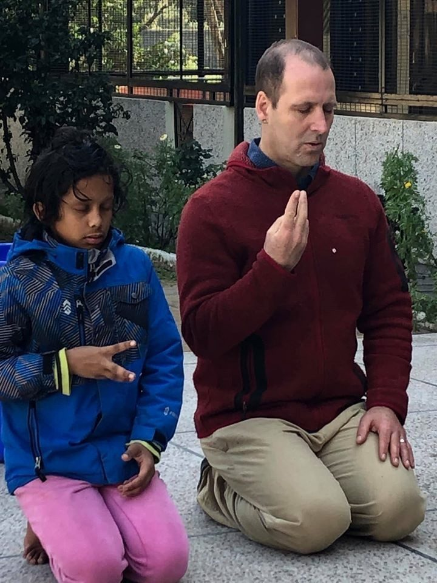

  Mark teaching 7/11 breathing for anxiety with his buddy Simi

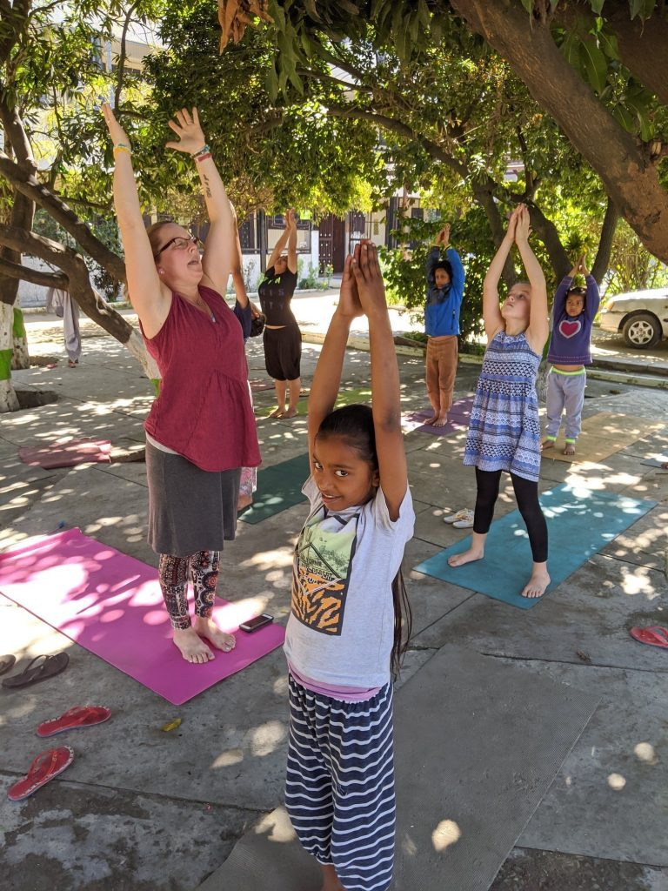

*Stacy's yoga class*

Our last night was marked by an outdoor feast and dance performance by the kids.  We all shared a dance party, complete with DJ Deepak, lights and balloons! We were showered with kind words, gifts and hand made thank-you cards.

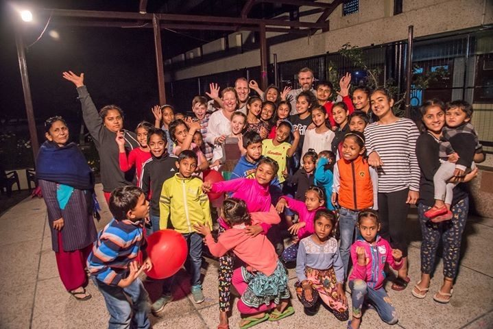

*Our family with the kids following our dance party!*

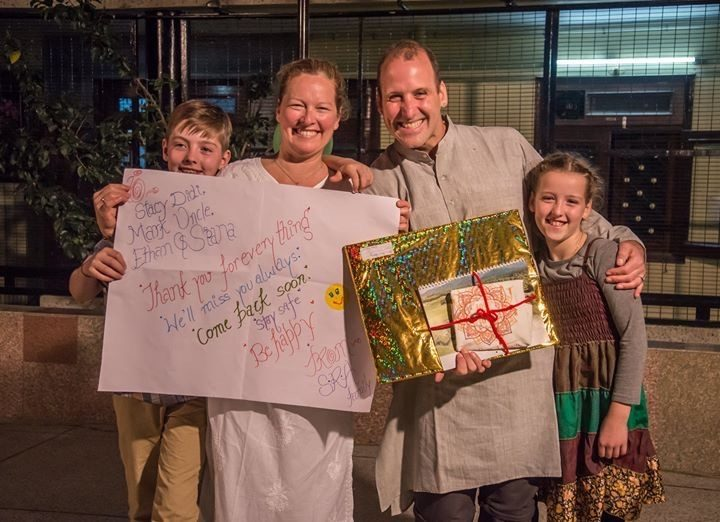

*Our lovely homemade thank-you card and gifts on our final evening.*

Our short visit was so appreciated and the children of Sri Ram Ashram will forever live in our hearts and prayers. We still email often, and stay posted on their updates. The Ashram continues to be on lock down and, thankfully, no cases of COVID-19 have been reported. Devin, Jai and Swapna are all still there as they are unable to get out of India due to the lockdown and pandemic. Thankfully, the Ashram college students are home and helping with the kids. There have been lots of sporting tournaments and pujas celebrating first solid foods, birthdays and other auspicious events! Life moves on with love and laughter at the Ashram, despite the challenges of our current time.

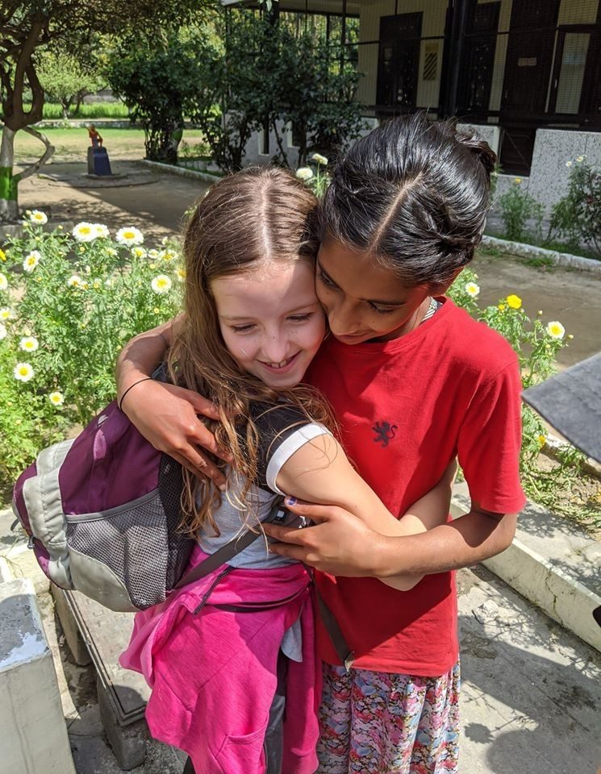

*Sad good-bye between Seana and Ansula*

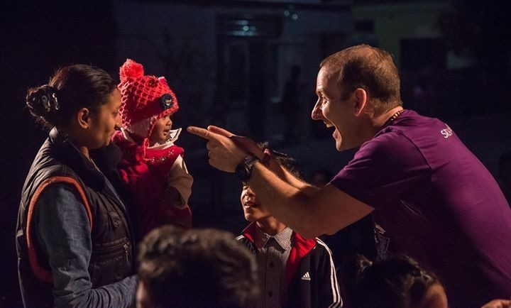

*Mark being cheeky with little Prerna being held by Soniya didi*

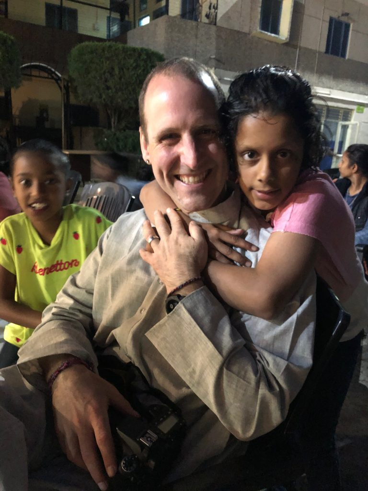

*An emotional goodbye with Mark and Simi*

Devin Bhai has been coming to the Ashram for many years.  He mentioned on a few occasions how foreigner visits have decreased significantly since the passing of Baba Hari Dass. The Ashram was Baba Hari Dass’ favorite place, and sitting in his meditation room I felt like he was still there, smiling beatifically. The kids shared numerous stories of growing up with him around, and the memory and presence of Babaji are very much alive at Sri Ram. The Ashram thrives on volunteers and various professional supports/services. The current staff is limited, overworked and needing to slow down. Our humble hope is to return to Sri Ram Ashram again and again, to offer what we can as a family. Perhaps, through our collective efforts at Salt Spring Centre and Mt Madonna, we can foster continued donations and volunteerism at the Ashram. As was our own experience, those who visit this special place, where Babaji’s children and Spirit still live, leave with far more than they can ever offer. After all, Love lives here...

Namaste,  
Stacy didi
