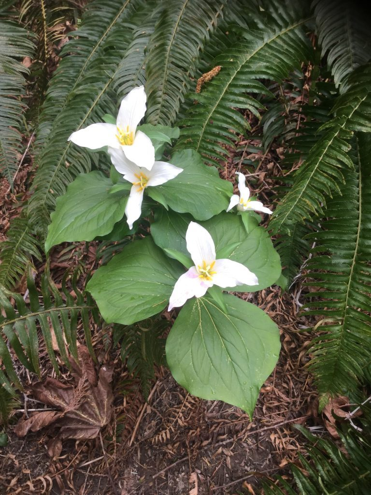

*When the heart gets softer by being closer to God, one begins to feel love everywhere. Animals, trees, plants, people, and a blade of grass all shower love. I wish you deep, deep in love of God. I wish you to dissolve in God.* ~ Baba Hari Dass

Dear friends,

I hope you are all doing well, staying healthy and taking care of yourselves. Life at the Centre remains quiet, and will likely be so for quite some time. The question on everyone’s mind is: When will life get back to normal? The answer, ‘nobody knows’, doesn’t satisfy our desire to know, to feel some sense of security. All we really have is this moment; we don’t know what will happen in the future.  *If the present is passing in peace, it will make a peaceful past and sow a seed of peace to grow in the future. The present is the most important thing in life.*

While I self-isolate indoors, nature continues to display its annual spring splendour. The lilac trees outside my window are getting ready to burst into bloom. All over the land daffodils, tulips and other flowers are blossoming, and the meadows are covered with golden dandelion flowers. (To me they’re always flowers, not weeds.)

- 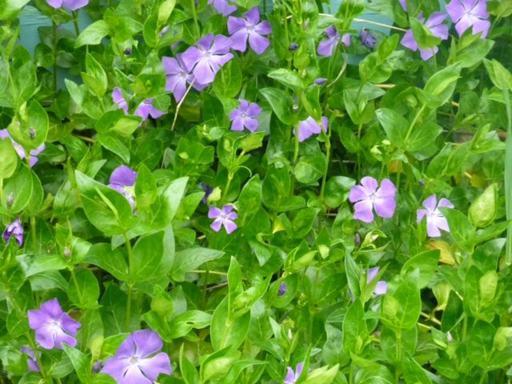
- 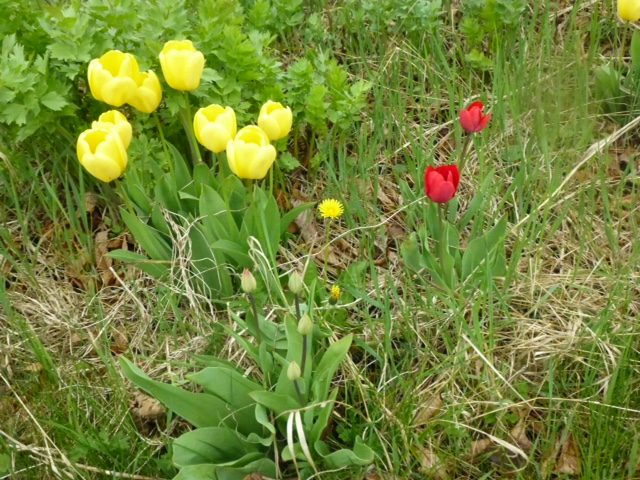
- 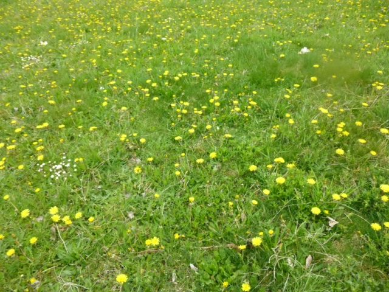

Life goes on here, although much of it looks different. The Centre is closed except to those who live here, something that’s never happened before. Easter and Passover celebrations happened in the past month, by zoom, our new virtual reality. While it’s not the same as being together in person, all the available online platforms are making it possible for us to stay in touch with each other.

## Meet us online

There are many [public offerings](https://saltspringcentre.com/programs-retreats/public-offerings/) from the Centre available by zoom. All you have to do is click the link. Both the Salt Spring Centre satsang and the Vancouver satsang are drawing many participants. People we often see only once a year at ACYR are now able to come to satsang every week. Last week’s satsang was attended by people from all over Canada and the US, and also from as far away as Japan and Morocco! If you haven’t yet joined, please come. Although we’re not together physically, our hearts are all connected, and it is so uplifting to see our many satsang brothers and sisters at satsang and online classes.

## ACYR

While the COVID-19 pandemic has limited our ability to connect in person, we still feel it is important to connect as a community and share Babaji's teachings as we have for the past 45 years at the Centre's Annual Community Yoga Retreat (ACYR).

This year, the Centre is planning to host the 46th annual ACYR in a virtual format so we can continue to connect with one another - even if we can't meet in person. Hosting an online retreat is completely new to the Centre and we are still in the early planning stages, so there are still a number of details to be sorted out.

More information about the retreat will follow in the coming weeks and months, but please be sure to **save the date for 46th Annual Community Yoga Retreat - the weekend of July 31, Aug 1, Aug 2, August 3** (*exact dates to be determined as retreat planning continues*)

## Can you help?

Many, many people over the years have experienced profound changes in their lives by their connection with Babaji, with the satsang community, and the yoga teachings and practices. Whether  you’ve attended a yoga retreat, a yoga getaway, YTT,  or been here as a karma yogi, if you think of the Centre as your spiritual home, please stay connected.  If you’re able to help support the Centre financially, we could use your help since we have no programs, and therefore no income. Every little bit helps; it all adds up. [Here’s how you can make a donation](https://saltspringcentre.com/donate/).

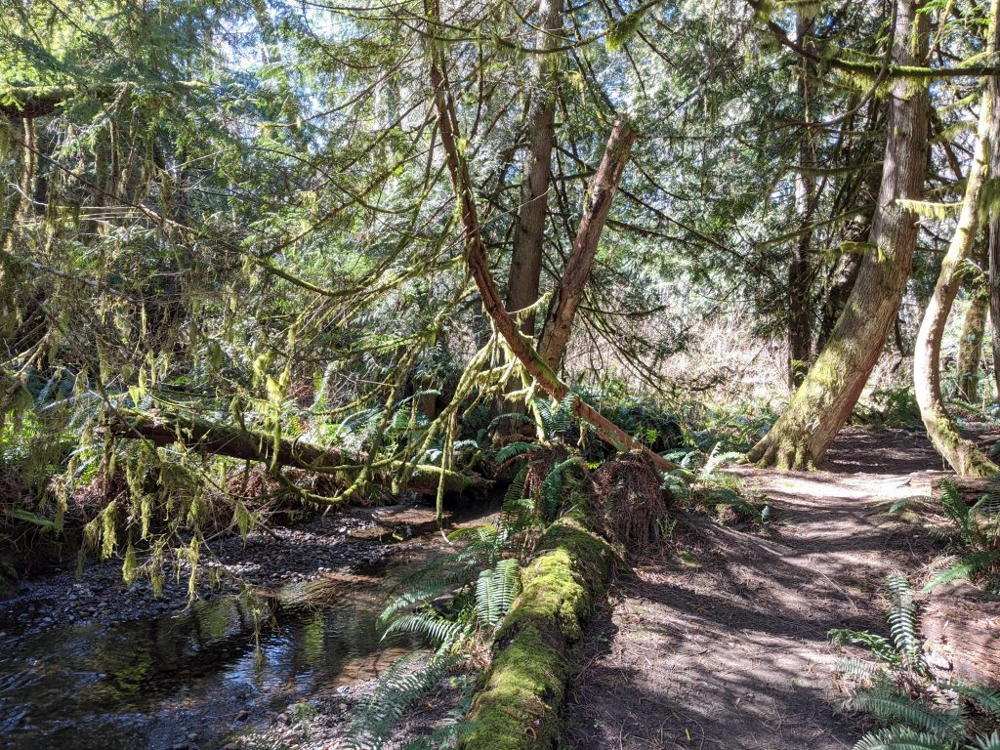

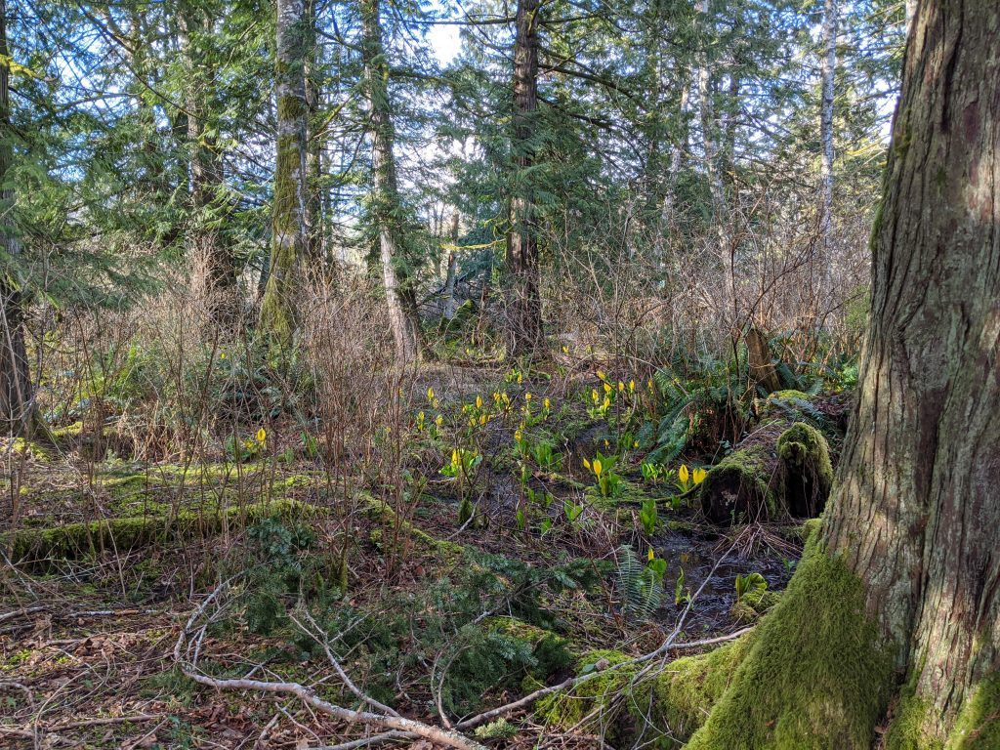

Work still continues at the Centre. The office folks are addressing  systems upgrades, the program house is sanitized daily and meals are prepared. There are weekly work projects to keep everything running, with the farm being a key area of focus. With extra hands on deck, it’s looking like this will be an abundant year for the farm.

## Dan’s farm update

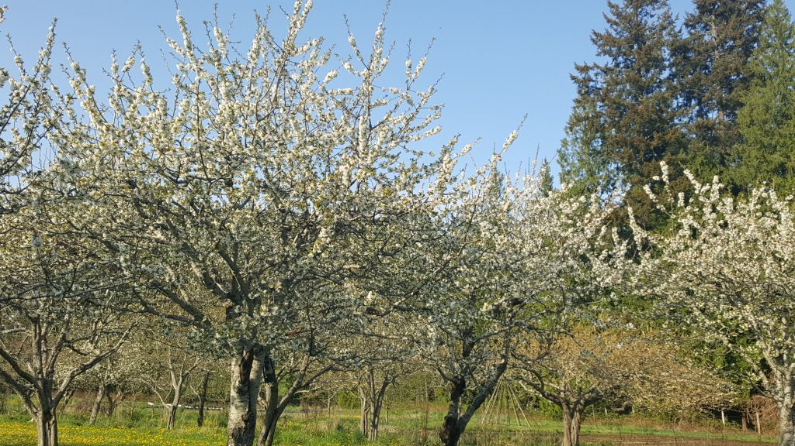

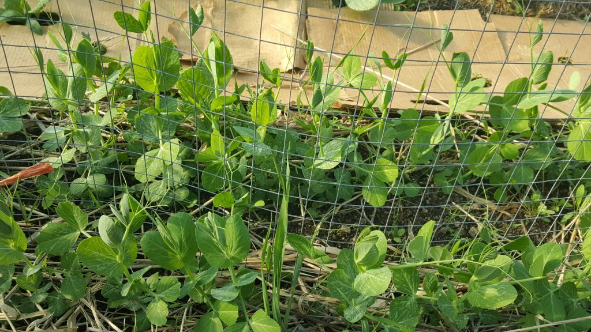

- 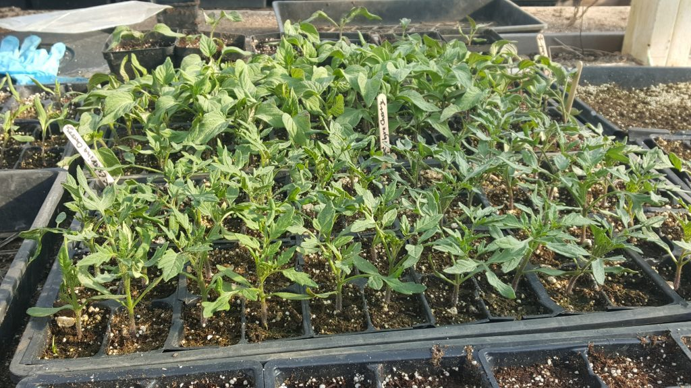
- 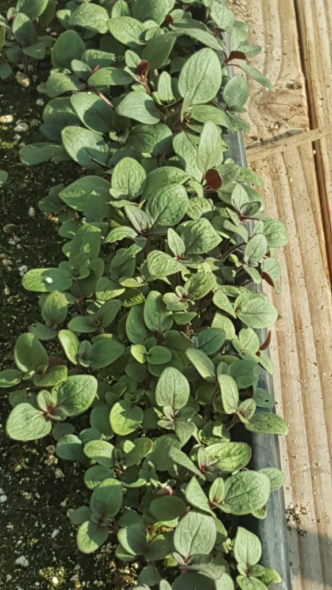
- 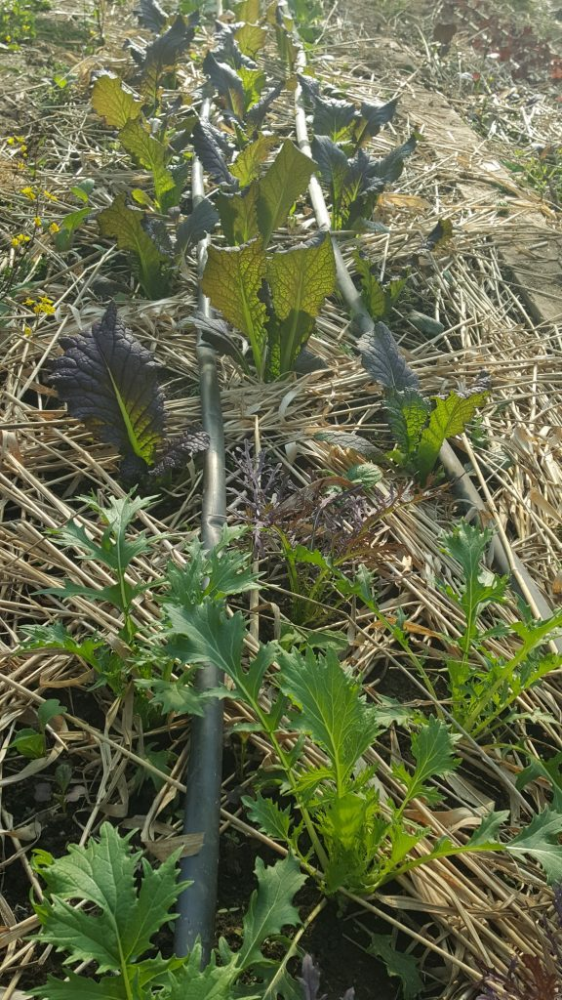
- 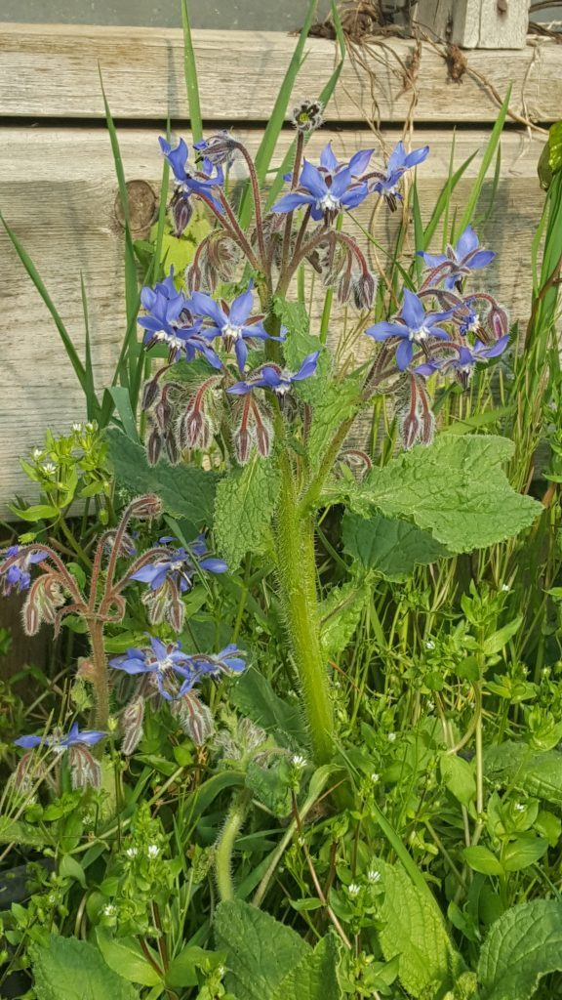
- 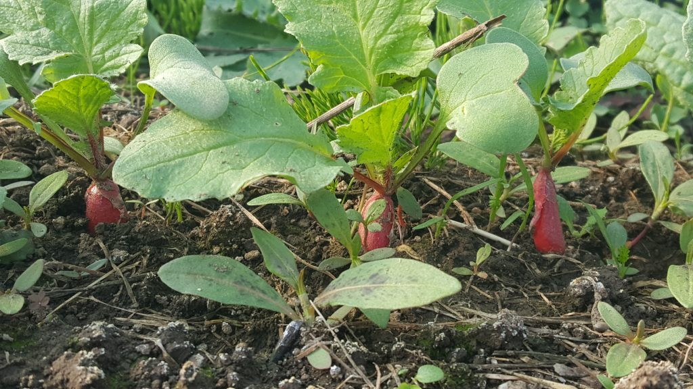

> With the start of the new online KY program at the centre this week, there have been many discussions about the practice of karma yoga—performing right action and selfless service without being attached to or motivated by the outcome of such actions. I am overjoyed at the opportunity of being able to grow food as my form of selfless service at the centre, but as an organic farmer, I do struggle with the notion of remaining neutral to the outcome of a growing season more than I’d like to admit. 
>
> Of course I want to see the fields teeming with abundance and variety, and in my attempts to achieve them, I have begun to notice how my mind and spirit can become tense and unsettled at times over the course of a season. So my lesson over the coming months will be to approach the farm with a bit more balance and non-attachment and contentment with all of the positive experiences in the garden and a little less fear or anxiety about what could potentially go wrong.
>
> Fortunately, this season has gotten off to a rousing start, even with a smaller team. The field greenhouses are chock full of vegetables such as radishes, turnips, peas, and greens ranging from lettuce and spinach to mustard and bok choy. The farm team has already begun harvesting greens for the community, while some of the radishes will likely be accompanying those greens on our plates by the time this newsletter is sent out.
>
> Thanks to Lotte’s determination and dedication, much of our irrigation system has now been set up, which has allowed the farm team to step up our transplanting game. We transplanted nearly 1100 leeks over the past two days, with a few hundred more to come by the end of the month, all of which will be companion planted with carrots and beets. With any luck, once the earliest leeks become harvestable in July, we could have enough leeks to supply the community for the remainder of the calendar year. Several other crops are nearing their optimal transplanting size, including ground cherries, tomatoes, broccoli, cilantro, parsley, and some flowers.
>
> We have also been selling some seedlings at our farm stand, primarily greens and kale, and we’re hoping to have a wider variety of options available in the coming weeks, including the hot crops, herbs, and possibly even some flowers. Messages are sent out to an e-mail list at the beginning of the week with the availability and price of seedlings for sale. If you would like to be added to this e-mail list, please contact either [farm@saltspringcentre.com](mailto:farm@saltspringcentre.com) or [info@saltspringcentre.com](mailto:info@saltspringcentre.com). Wishing everyone a happy and safe growing season.
>
> In gratitude,  
> Daniel Naccarato

## Here’s a selection of offerings to read this month:

Upon her return from Ireland, Courtenay spent her quarantine time with her dad, where she is still living, and from there, undertook to do an interview with Kris Cox. Since her arrival to take on the role of Centre Manager, Kris has been dealing with the massive changes at the Centre, brought about by the advent of the Covid pandemic and the closing of the Centre to guests. Fortunately for us, Kris is an incredibly organized and capable person. Here’s Coutenay’s interview, [Time Out with Kris Cox](https://saltspringcentre.com/time-out-with-kris-cox/).

Here’s a story for you about life at Sri Ram Ahram in India. Stacy Sherman, a YTT grad from 2017, and her family - husband Mark and kids Ethan and Seana, took a long-awaited trip to India earlier this spring, and spent time at Sri Ram Ashram, helping and spending time with the ashram kids. Some special notes from Ethan and Seana: Ethan loved lizard hunting on the property and had fun doing photography with Big Deepak; Seana loved hanging out with Kiran, singing songs and braiding her hair with Anjula and Preeti, and playing with Sita. Baby time was her favourite and she wishes she could have Prerna as her little sister. I hope you enjoy [Love Lives Here](https://saltspringcentre.com/love-lives-here-sri-ram-ashram/) with many photos and the story of life at Sri Ram Ashram.

How are you faring during this time of coronavirus? A number of people responded to my questions about their experience of staying  home. You might want to reflect on these questions while you’re stuck at home, so I’ll share them with you:

- **How has the coronavirus affected your life?**
- **Are you working? At home or at your place of work? How is that going?**
- **What is the most difficult part of this situation?**
- **What practices help you stay positive?**
- **What are you doing to keep yourself occupied during this time?**

Here are the responses I received from Chetna Boyd, Mahavir (aka Raven) Hume, Kishori Hutchings, and Rajani Rock. You’ll find them in [Staying Home, Staying Safe](https://saltspringcentre.com/staying-home-staying-safe/).

*Life is not a burden. We make it a burden by not accepting life as it is. Wish you happy.* ~ Baba Hari Dass

Love,  
Sharada
