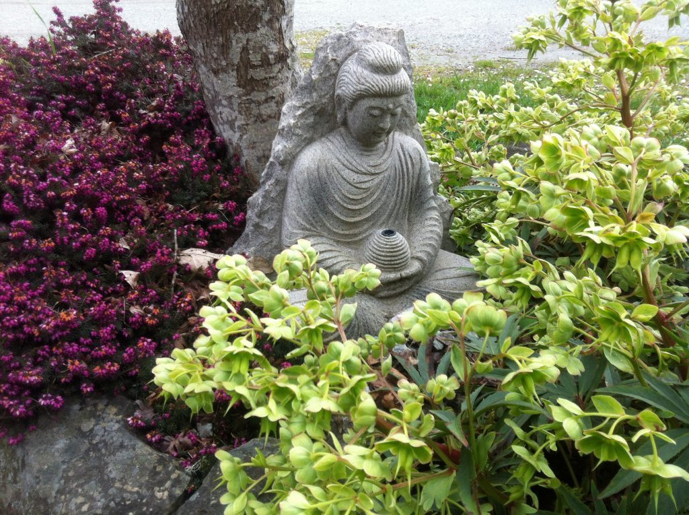
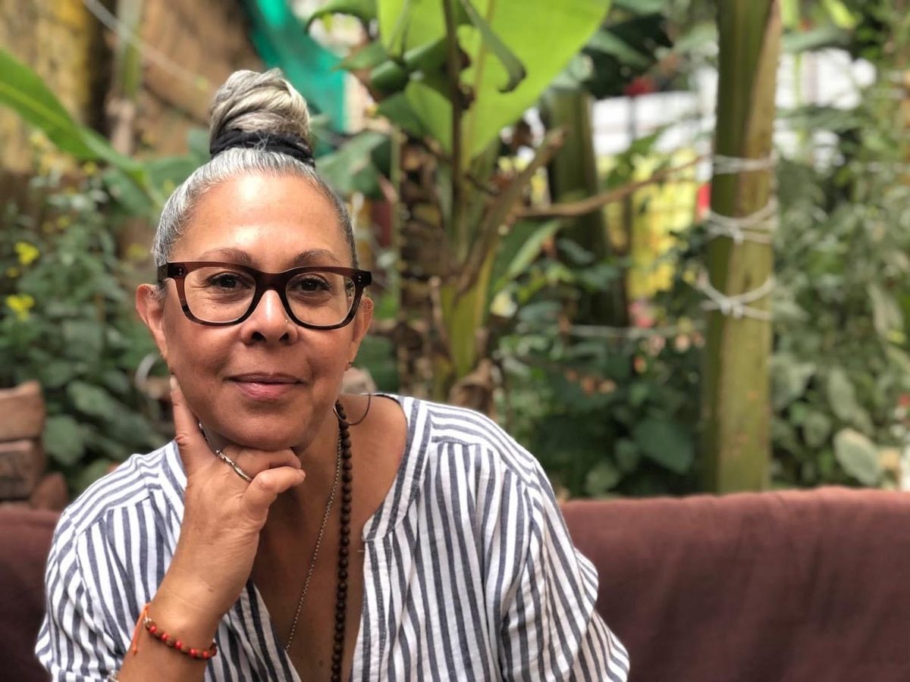
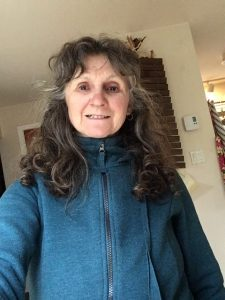
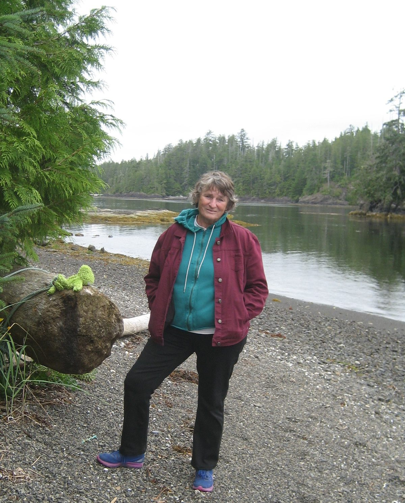

**How are you faring during this time of coronavirus?**

## Chetna

Thank you, for reaching out and encouraging a different type questioning and connectivity. On the surface, these questions seem simple and straight forward, but as I started to really look at what each of them means, what they brought up in me seems more complex. Ask me from one day to the next and my answers may be quite different.

**How has this coronavirus affected your life?**  
As you may know, I was leading a retreat in India at the time C-19 really took off and was forced end the retreat early and return home. It was abrupt! I miss the Ashram and friends in India. Upon returning, I got quite ill and was quarantined for 21 days along with being tested for C-19 due to my recent travel history…the results you ask: a resounding negative!

What I really notice is how much I took things for granted, such as my ability to go where I wanted and when. My ability to visit with family and friends or have a spontaneous visit – yes, this is happening virtually, but for me there is nothing like face to face. So much communication happens in person that is unspoken. I miss that a lot.

**Are you working? At your place of work or at home? How is that going?**I am offering an online meditation for a supportive cancer care organization via Zoom from my home and I am just getting my mind around offering asana classes for Dancing Lotus Yoga. This is where the question gets complex for me. It has been interesting watching the many (and I mean many) classes go online so quickly and then contemplate what have I to offer that will be helpful at this time! It has been a tricky one for me. But slowly, slowly I have come to the remembrance that each of us has something different to offer that cannot be offered by another – so I am going to jump in and be me! I have received positive feedback from the meditation classes, and they been going well. What is more important is that the participants really value the time they spend together.

**Are you with your family or housemates, or are you alone? How is that for you?**  
I am grateful not to be alone - I am with my husband. We live in our condo and thankfully we have access to a balcony when we need to get fresh air or take space. Because we are spending so much time together now, I have had to remind myself that he cannot be all the things to me; husband, lover, counsellor, girlfriend, workout buddy – you get my point!? Some days are better than others, but all in all we have a nice rhythm. We are comfortable sharing silence and we are comfortable sharing household duties – thank goodness. The cooking is a biggie; we like to eat out from time to time and since social/physical distancing measures have been implemented have cooked every meal. It has been challenging to stay creative with meals. Again, some days are better than others – but we are not hungry, that is for sure!

**How are you faring during this time of physical isolation & distancing? What is the most difficult part of the situation? What practices help you stay positive?**   
All in all, I am faring well. The isolation that is retirement has been good practice for me. The most challenging part is “having” to stay home and not being able to see my other family members or hug them. Of course, my Yoga practice that includes RS (regular sadhana) and asana helps me stay positive. I am so grateful for that gift. Jai Gurudev!

**What are you doing to keep yourself occupied during this time?**I am doing several things to stay occupied and on occasion, honestly, there’s grief that seems to stop me in my tracks! Mostly though, it is practicing yoga, reading, studying online, talking on the phone, going for the occasional physically distanced walk with friends, and yes, sometimes Netflix! Most recently I started to teach myself the harmonium, along with a little help from my musician husband, friends, and the internet. I have wanted to do this for a long time. It has been super fun and rewarding for me – sorry neighbours!

---

## Mahavir

The emergence of the pandemic has fanned the flames of  my inquiry and showed me the importance of regular sadhana -  how it keeps the home fires burning so that no matter what the weather, I’m always able to attain peace. Being at the centre has been astonishing. This place was created with gatherings in mind, and we have been hosting and serving people here for decades. So when all that stopped it felt so disorienting. Nonetheless, I’ve been happy to busy myself serving the satsang through getting Satsang and Bhagavad Gita Study available online. One upside is that we get to see brothers and sisters from all over the world! It’s a wonderful time to deepen in sadhana, and study. I’ve been rereading Babaji’s latest release, his autobiography, what gems are there! And there are of course many projects like landscaping the temples, revamping the compost flow, getting after the scotch broom encroachment in the northeast field, pitching in in the kitchen, and doing the various ceremonial practices offered by Babaji, like full moon yajnas, aratis, and offerings to Ganesh and Hanuman.

I have to say I’ve come to realize that general speaking, I’m a card-carrying introvert, so the physical distancing tends to play to my strengths.

---

## Rajani

In this time of Coronovirus isolation I have gratitude for the opportunity to be with Ompk tending the home fires, something we infrequently do together during our busy days of working life and supporting our KY duties either at SSCY, Mt. Belcher Water District, with family or any of our other projects.  Some KY projects continue as there are no requirements of gatherings and are simply solo work.  Our work at home continues with spring cleaning, reorganizing and going through our attic which contains many old books, tapes, CD’s and storage of old paraphernalia including some of Mamata’s childhood belongings. Great to go through some of our lives from years back…

After isolating for the required period, we made our way up to spend time with Mamata, Kris, Honey and Ash, which is always a joy.  We cut and stacked firewood for next winter, built a greenhouse on their land and had so much fun filling it with seeds for all the flowers, veggies and berries they want to grow.  Honey, being 4 years old was absolutely delighted with putting seeds into soil and watching them grow daily as well as finding slugs and making sure they do not enter the greenhouse. Honey has dance classes on Facetime as well as FaceTime visits with various friends.  Ash is happy to hold a hand while walking, be pushed on his trike or sit on a blanket by the fire pit while lunch is being prepared.  It bring me so much joy to be together as a family. We share our time at home and with our family, making sure we do not get out of the car once we have left our property or theirs.

Ompk does our shopping and follows strict protocols of showering and sterilizing clothing upon return. When a neighbour or friend walks or drives into the driveway, we visit at a distance, which works well for us. FaceTime and phone calls are our way of staying in touch with friends and our Ontario families  Ompk’s mother, who will turn 90 in December, lives in a retirement home in Ottawa and fortunately there are no COVID cases in that facility. She is strong and alert and very together, so we chat with her a few times a week, which brings her much pleasure.

More time for sadhana, walking, quiet reflection, reading, studying, working together and doing the things we love right here at home….

May we all be happy, healthy and strong.  
Much love and many blessings,  
Rajani :)

---

## Kishori

I’m at home with my sweetie SN, as we have been for the last number of years. We have worked with each other for years on different businesses, and also at the Centre, and we’ve learned how to give each other space when needed. Our fights are behind us; we work things out.

The difficult thing about staying home now is that I miss hugs, and I miss being able to go to the Centre. Physical isolation is hard, but physical distancing is easy as long as others are paying attention.

Daily walks with my mantra keep me balanced – couldn’t do without them. Also, we have a wonderful dog named Misty. She is a light in our lives – lots of long walks, play and cuddles.

To keep busy I’m doing house jobs I’ve put off for years – cabinets and drawers that need cleaning and clearing. I’m in the “use it or lose it” mode. SN does a lot of gardening, but my back won’t let me do that, so I do other jobs where I can stand,  like painting the railings on the outside stairs to the garden. Also, SN and I love doing crossword puzzles and jigsaw puzzles, and we’ve just started a really hard one.

I have recently joined Facebook – you CAN teach an old dog new tricks! Now I can message my buddies. I also skype with my sister, and with our daughter Mallika. During these times of not being able to go to the Centre I zoom in to satsang, and stay in touch with satsang friends from all over the world, which I love.
