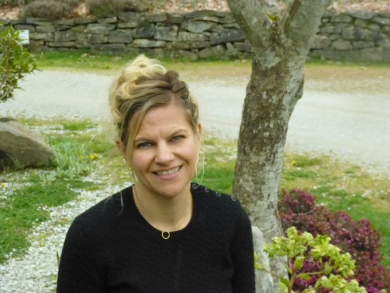

Often, interviews begin by setting the scene: perhaps the interviewer has arrived early, and describes her surroundings - a cozy cafe, a park bench, a hotel lobby - before the arrival of the subject. This also invites you in as the reader, giving you time to find your own bearings and settle in for the story.

However, as we all know, norms are currently all out the window, and so is meeting for interviews in person. As such, rather than pulling up to a nice frothy cappuccino at a comfortable table for two, this particular meeting involved me sitting down at an awkward folding TV table, wedged between two bookshelves in the corner of my childhood bedroom, then trying to call Kris unsuccessfully over multiple video platforms. Here we had barely begun and I was already at a loss. The kittens on my (very) old wallpaper smirked down at me, disdainfully shaking their pink and purple heads. Thankfully Kris, ever practical, came to our rescue and kindly reminded me of the existence of actual telephone lines. We were back in business.

With our shaky scene set, we started chatting. First about what it’s been like lately, being the team on the ground right now. Of course, with the Centre closed until further notice, and the summer season up in the air, nothing is business as usual.

Rather than the regular rhythm of preparing for, hosting, then saying goodbye to retreats - that familiar inhale and exhale that normally defines the Centre’s busy season - current residents are simply holding their breath. It’s hard to know when to exhale when no one knows what’s coming next, when the excited voices of guests will fill the land, or when friends will once again join hands with them in the Satsang Room.

Everyone is still busy, but the tasks have changed: now there is the daily sanitization of the whole Program House; completing maintenance that would normally wait for guests’ departure; taking the time to reconfigure the office’s network (yikes); and having extra hands join the Farm Team, so that more planting and production can help provide more food in the coming months. Not least of these tasks has been moving so many of the Centre’s offerings online, so that those of us not on the land can still connect with the teachings, and with each other. I know from my perspective, sitting here in Port Coquitlam, this transition online has appeared seamless. However, we all know that these new undertakings are rarely without obstacles, and the fact that so many are now tuning in from near and far to classes and gatherings is a testament to how this team has steered through with grace and aplomb. And helping to do a lot of that steering is Kris.

For anyone lucky enough to have met Kris, you know she is a glowing ball of energy and efficiency. She doesn’t just have great ideas, she gets them done. Someone recently referred to her as a “dynamo,” and I thought that was just it. But even dynamos are human beings with limits, and it was clear from our chat that Kris has been stretching hers these days. I get it, it’s a big job during normal times. So when we finally turned to my interview questions, I quickly realized that the in-depth probing I had planned was not where she was able to go just now. She’d just completed another all-out day, and it wasn’t fair to ask her to dig way back down. Not now, in the evening, after a full day, dinner, and even a dish shift - all before talking to me.

So we turned to the questions I had saved for the end - lighter, fun ones that hopefully help us get to know Kris a bit better, and remind us of our own most cherished moments at the Centre. These, I think, are enough. And hopefully they make her, and all of us, smile.

## My Centre Moments - with Kris

**What is your favourite ever Centre meal?**

Kris: Hmm...pasta night with dessert.

Me: Which dessert?

Kris: Hannah’s chocolate cake from 8 years ago. Except nobody could ever find the recipe again [sighs]

Me: Which pasta?

Kris: ANY pasta [laughs]

**What is your biggest ‘AHA’ moment at the Centre? Was there something that just ‘clicked’ for you?**

Kris: One moment that has totally changed my life is from Parmita years ago. At that time, I was very much like, ‘this is right, and this is wrong.’ Whereas she said that she operated from ‘what is the *kindest* thing?’ And that has just taken over my life. It doesn’t mean that everyone gets their way, it means, the kindest way for *everything*.

**What is your favourite place on the land? Maybe somewhere with a special moment tied to it?**

Kris: The porch at the Sage House, which is where Mathew [now-husband] and I had our first kiss.

Me: Awww!

Kris: I know.

**What is your weirdest moment? Was there ever something that felt like more than a coincidence?**

Kris: Well, I remember when I first applied for the programs position, and I actually had, like, a visualization of me, standing in the parking lot, with a name tag that said *Programs Coordinator* on it. And then when I interviewed, I said “I’m coming. This is my destiny, I’m coming,” and they kind of laughed, but I was like “no, I’m serious.” And I had never been to a yoga centre before, never been to Salt Spring Island, never been to the Gulf Islands...didn’t actually know where the Gulf Islands really *were*, haha...but I just saw this image - me standing in the parking lot, in front of the stairs with the blue house behind me, with a name tag that said ‘Kris Cox - Programs Coordinator.’ Except I never got a name tag when I got here, [laughs].

Me: We really need to get you that name tag.

Kris: Right?!

**Is there a moment that kind of sums up how you feel about the Centre? Or something that’s been particularly special for you?**

Kris: I would say, when I was Programs Coordinator, I would try to attend a lot of the Yoga Getaway opening and closing circles, and… People would walk in, it’s like 3 o’clock, they don’t know where their room is, they want to make sure they’re on time, they’re filling out the forms, and their shoulders are like, UP, close to their ears, right? And literally in less than 48 hours, their shoulders are dropped, their face is relaxed, their eyes are bright. And when they go around the closing circle, some of whom have come for the first time, say things like, ‘This place has changed my life,’ or, ‘I have reconnected with myself.’ Or there are people who come back every year because they get to be reunited with their deeper selves. And that, for me, in those smaller groups, where people really felt supported on an individual level...or sometimes they’re coming as mother daughter, sometimes sisters... that, to me, was like: Okay, this is *special*. This is what we’re here for. Creating this container where people can have this *moment*..that got me every time.

*I want to thank Kris for taking the time to talk with me, and to continue to lead and inspire during such an incredibly challenging time. I know we all offer these thanks to her, and to every person currently holding it down for us all at the Centre. We see you, and we are so grateful.*

*xoxo*  
*Courtenay*
