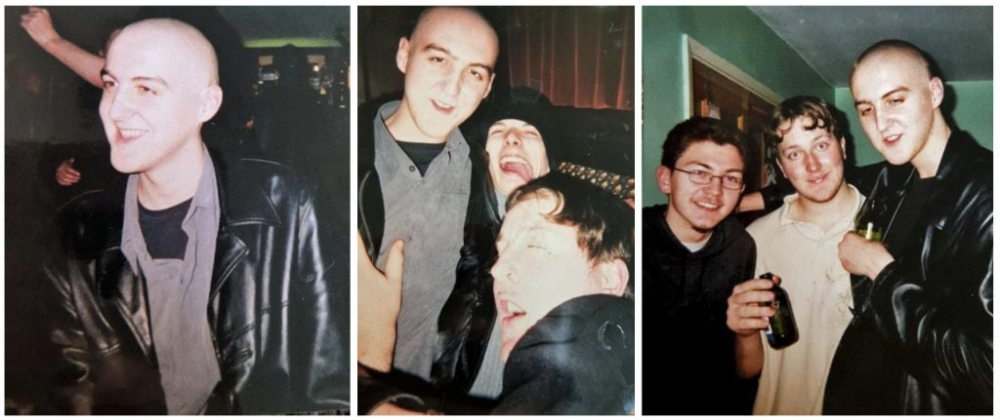
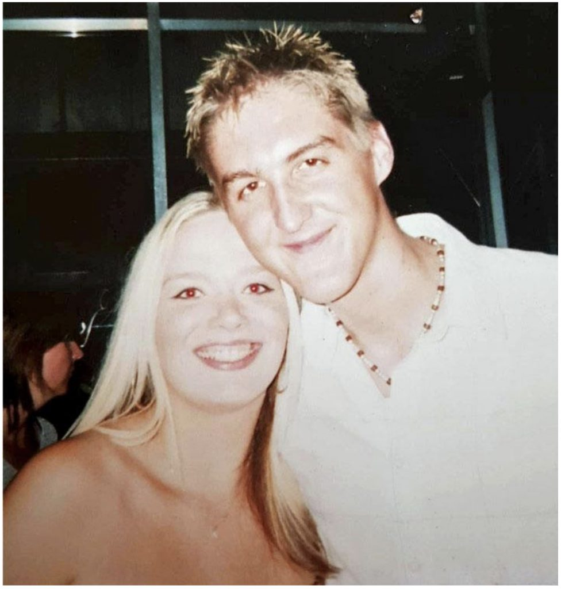
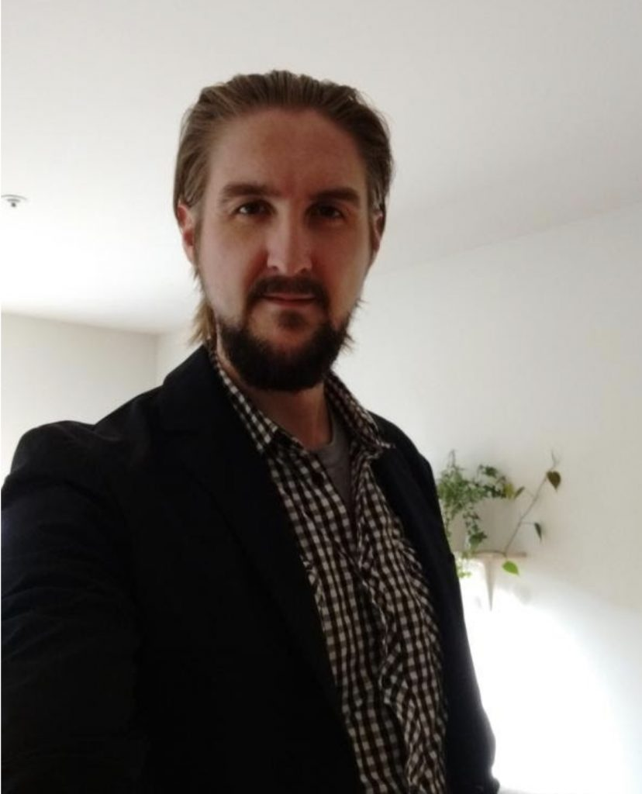

Here I am, programs coordinator at the Salt Spring Centre of Yoga during COVID-19. What a bizarre time to be at the Centre; well, what a bizarre time to be anywhere right now. My wife, Kris Cox, and I came back to the centre at the very beginning of February this year, not knowing what was coming. Kris has taken the daunting role of being Centre manager and I definitely don’t envy her position. Even during normal operations at the Centre, the Centre manager is a tough role to fill.

So how did I end up here? What brought me here? Or should I say, what drew me here? Well I will do my best to explain the journey that has unfolded to this point in time, trying not to, as the English say, bang on (talk too much). I will try to keep the story spiritually focused as much as I can.

## **Where it all Began**

So the story starts in little old England, in a small town called Stourbridge, which is in the West Midlands region. I lived here until the age of 25 with my parents and younger sibling until I moved out to go to University. There isn’t much to say about my childhood. I was very quiet and shy. I am the middle sibling out of three boys and definitely had characteristics of that classic middle child syndrome. I spent a lot of my youth playing video games whilst still getting outside to play basketball here and there. I remember my Dad used to laugh at me because he said ‘every time you ask Mathew (that’s me by the way) a question, he replies with “what?’. The reason for this was that my mind used to (well still does) absorb all my attention. I also remember my mom telling me how much I cried when I was born. Eckhart Tolle has said that some children are born with a heavy pain body. For those of you who are not familiar with Eckhart’s teaching, if my understanding is correct, the pain body is a collection of emotions or pain from the past that one is identified with or feels. I have a feeling this was the case for me. I remember as a child feeling really low or sad for no particular reason. My family would tease me for being moody or irritable, which I experienced a lot as a child. I could also be very selfish and express a lot of self pity. All the classic signs of a big ego, but of course at the time I did not realize this.

Things got even more problematic when I hit the teenage years, as it does for us all. I would experience intense blushing and sweating in social situations, which got worse throughout my teenager years. How did I try to tackle all this? By going down the pub with my mates and drinking myself stupid. Obviously I must have thought drinking all that alcohol was going to somehow miraculously cure me, and of course it didn’t. I wasn’t an alcoholic but probably would have ended up becoming one if I had carried on down this road. I think that the years I was 18 to 19 were the darkest years of my life. I was suffering from depression, constantly felt the urge not to live, and had suicidal thoughts. When I was 19 I remember coming home from the pub, somewhat drunk but not too bad, and sitting in the living room with my mom. I can’t remember what we were talking about but I do remember having this very subtle feeling that something had to change and that I could not carry on the way I was going. At the time I didn’t think too much about it, but looking back now I realize that this was a vital turning point in my life. It was at this time I started looking into self help. I started to see a counsellor, and my half sister recommended that I read the book ‘Feel the Fear and Do It Anyway’ by Susan Jeffers. This started me on the journey of positive thinking.

*Photographs of me at the pub in my late teens.*

## The Beginning of a New Outlook on Life

Positive thinking definitely did help and my life, whilst not completely changed, did start to improve, or should I say, my attitude improved. I started exercising, I started listening to new age meditative and relaxing music, I tried to practice positive thinking on a daily basis, and it was my first real look at what was going on in the inside state of my consciousness. This was the first stepping stone to a more spiritual/conscious life. Whilst the social anxiety, depression and drinking still existed for me, I felt like for the first time I was actually heading in the right direction in life.

## Positive Thinking Only Gets You so Far

I had this moment in my early twenties, waking up at my girlfriend’s house, grabbing my positive thinking folder, which held lines of sentences of positive thoughts, and my practice was to read them every day, for a set number of times. I remember having the subtle feeling something was missing. Was positive thinking not the answer I had been looking for? It had helped me so much so far so why did I feel like something wasn’t right all of a sudden? At this time in my life I was convinced that my social anxiety was my biggest problem and if I got this fixed, everything would be alright. I had spent some time looking through the Waterstones website for self help books, looking for books that dealt with confidence and self esteem issues. Under the category of self help books was the ‘The Power of Now’ by Eckhart Tolle. I remember reading that it had many positive reviews and, so I read the summary. I can’t remember what the summary said but I remember thinking it was not for me as it was not specific to confidence or self esteem issues. So I didn’t give it much more thought. One day I was in WH Smith and when I turned the corner in the book section I saw on the end shelving unit a whole line of copies of ‘The Power of Now’. I can’t remember exactly what happened but I remember picking it up out of curiosity due to the reviews I had seen online. Then thinking, why the hell not give it a read? I’ve got nothing to lose other than the small price of the book, so I purchased it. I can’t remember what I thought when I read it for the first but it was not an instant ‘I love this book’. It was more of an mmmmm, I think I might read that again. It took about a year or two, over a process of rereading it many times, until I realized that this book contained all the answers that I had been searching for my whole life without realizing it. I then read his other books, watched a lot of his talks, books that he recommended or talked about, and watched films that aligned with his teaching.

## The Power of Now

Eckhart’s work has changed my life completely. He has played such an important role in turning my life around, or should I say shifting my inner state of consciousness. It has been a long and still continuing process of staying present in everyday life, a practice that I will take to my grave. By the time I was 25 I left my small hometown of Stourbridge and went to the southwest of England, to Falmouth, to study Graphic Design at University. University was a mixture of surfing a lot, not studying as much as I should have, and still continuing to drink too much here and there, as one does at University. I still suffered from social anxiety and depression but nowhere near as much as when I was in my late teens. The third and final year of University was a strange time; I ended up renting a studio apartment by myself after the first two years of living in shared accommodation. I spent a lot of time reflecting during my third year and realized, or thought, that ‘Graphic Design’ wasn’t really for me. After this realization I decided I wanted to go travelling. I spent the next two years saving money, some of this time spent living with my parents in my hometown, and a children’s activity/adventure centre in Devon.

## Canada Here I Come

I originally wanted to travel to America so I could spend some time surfing on the west coast, amongst other things, but the visa restrictions we too strict, so I ended up coming to Canada instead. During my travels I came to Salt Spring Island for the day, as the host of the home stay I was doing really advised me to go there. I remember falling in love with its simple and chilled nature and thinking to myself, I need to come back here and spend some more time on the island, so eventually I ended up organizing a two week stay on the island. In the first week a friend of mine from England whom I had met though setting up an Eckhart Tolle mediation group with whilst at University, messaged me about the Salt Spring Centre of Yoga. I got in touch with the Centre, found out that the Karma Yoga program, at that time a three month program, had already being running for a month. Luckily, for me anyway, two people had left the program, therefore providing space for me to join. Before I applied though, I had to visit just once as I had never heard of Baba Hari Dass before, and wanted to check things out. I remember sitting in on a session of Kirtan after getting a guided tour from the lovely Sue-Ann. Though the music of Kirtan was not really my jam I could definitely feel the spiritual energy from the music, and from watching everybody go silent in between songs. I could clearly see that the people at the Centre were practicing the wonderful art of stilling their minds. I was convinced the Centre would be a great place for me to be part of a community of people that were interested in conscious living and where I could practice more deeply. The following day I applied for the Karma Yoga program and I was accepted.

*Photograph of me down the pub again, but this time looking a lot healthier and happier. This was a farewell night-out party that I had with my friends before leaving for Canada.*

## Meeting the Love of My Life

I fell in love with Centre; it was so wonderful to be part of a community and organization whose priority was to practice and encourage/teach conscious living. It’s also a bonus that it was on this beautiful island that we call Salt Spring, which I found great pleasure in exploring during my time at the Centre. It was 2014 and this was Kris’s second year at the Centre being Programs Coordinator. Whilst not going into too much detail, after getting over my social anxiety and building up the courage, I finally made a move on Kris, two weeks prior to both our time ending at the Centre, and we kissed. The rest is history; as soon as we kissed we were pretty much a couple from the get go. I went back with her to Calgary, her home city, where months later we got married and then after two very happy years in Calgary eventually we ended up moving to Vancouver.

*Kris’s and my wedding day, April 24th, 2015 (healthier and happier)*

## Coming Back to the Centre

Whilst both Kris and I loved living in Vancouver, I was never happy with the work I was doing. I’ve always done work to pay the bills, so to speak. I never found a career or job that I found rewarding or fulfilling; I was going to work because I had to. Eventually both Kris and I felt the urge to go back to the Centre and work in the office, since office work is what I have done for most of my life. Also I really wanted to go back to try and help the Centre thrive again. After doing all the studying with Eckhart I have a huge interest in the awakening consciousness in human beings. As we all know this is the Centre’s main purpose, this is what Baba Hari Dass’s teachings point to, that deeper reality within us all where we are all connected and bound by love and peace. We just forget all the time because the noise of our minds covers it up. Not only is the Centre important to me and has changed my life, I firmly believe in what we do here and that it is needed now more than ever. Human beings will never be at peace until there is a shift in consciousness and I’m here at the Centre doing what I can to help the teachers spread the words of Baba Hari Dass that point to that eternal one life that we all are.

Thank you for reading.

I wish you peace and love on your journey.

*Photograph of me taken late 2019, before Kris's and my date night.*
