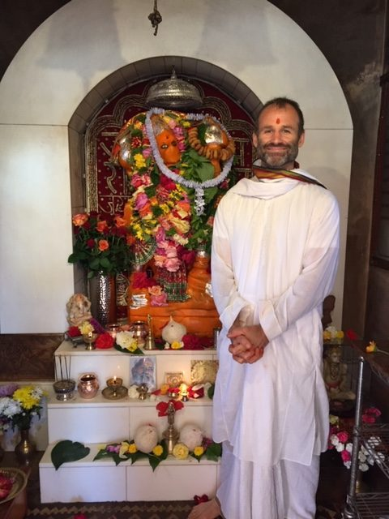
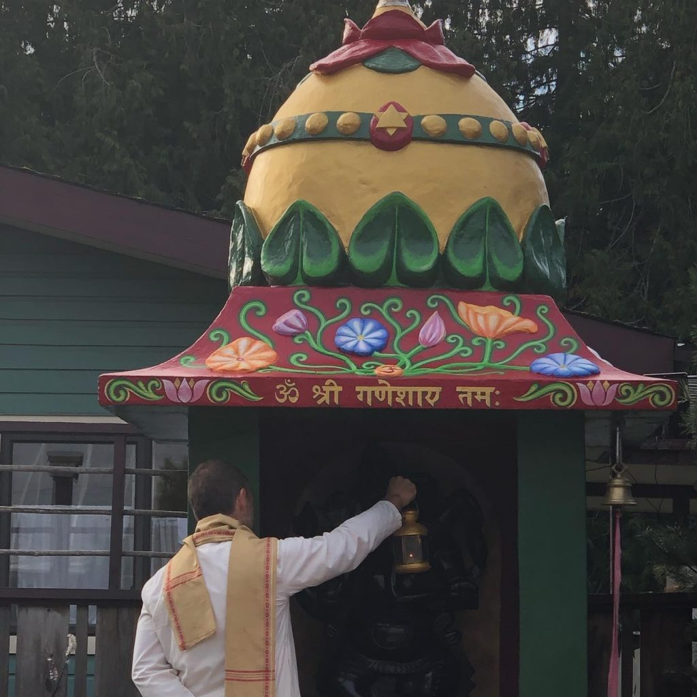

***by Raven Mahavir Hume***

By the time I came into the Satsang and met Babaji  I had been excelling for over a decade in the practices of Hatha Yoga, but ultimately I had become a fervent Jnana Yogi. I had taken a headlong dive into the sacred art of the “aha-moment”, and had immersed myself in teachings and considerations which hit the deepest spiritual sweet spots in me and yet seemed to require no ritual, no learning of systems, no special language, no group affiliation, no practice even! Beings like Krishnamurti and later Eckhart Tolle or Gangaji seemed to be able to reason their way directly into spiritual truth with aspirants and show how it generates right conduct, simply through direct conversation and the subsequent insight.

So when I came to serve at the Salt Spring Centre and began to see monthly full moon ceremonies, Arati (a ceremonial offering of light) at retreat time, and chants to "the names of God", I felt nervous. In my studies, it seemed that the use of ritual, ceremony or even chanting was sometimes being admonished as superstitious, “woo-woo”, flakey, ineffective for generating true transformation and understanding. The classical example was often the phenomenon of the person who goes to church on Sunday, engages the ceremony and song there, and then treats people poorly all week. There was, of course, more I had to learn.

As I deepened in understanding over the years and witnessed the mastery and generosity by which Babaji led his life, the inspiration from the aspects of Babaji's teaching that I did resonate with began to irrigate my spiritual life and practice. That, combined with feeling delighted by the kindness and compassion I was witnessing in people of the Satsang, generated a stability by which I was able to deepen my trust of Babaji's presentation of ceremony, prayer, and notions of God. I had always joined in the ceremonial and devotional proceedings, but truth be told, not without a certain amount if skepticism and hesitancy. Eventually, however, the inner arguments I had been carrying to resist these offerings held no water. I had no good reason not to try these practices with energy and open mindedness, and when I did, I found them profoundly supportive in ways that I never could have imagined. I began to step up my involvement and engagement to the point where now, amazingly, supported by the profound experience, blessings and guidance of original community elders and adepts in this regard, I do puja (or ceremonial worship) in Babaji's tradition of practice wherever and whenever I can.  Most frequently I'm able to practice at the Salt Spring Centre, or Mount Madonna Centre if I'm lucky.

Perhaps you're as curious as I am about how that shift happened. It's something about how, for me, the yoga teachings at their core come from and invite us to admit a phenomenon that is deeper than our notion of ourselves. “When we have had enough suffering”, it is said sometimes, we are ready to hear these gentle invitations. We hear that identification with the body, mind and the “mental noise” therein is the root of the conflict and undue pain in our experience, and that this identification can be forsaken.  In one of the central scriptural approaches to this, a foundation stone of practice called Ishvara Pranidana becomes important. Given its important placement, it is spoken about relatively infrequently, I notice, amongst most practitioners of popular western yoga. Perhaps this is because it is often translated as “surrender to God,” and eeek! As if we children of empire, rugged individualists and captains of industry are going to hold each other to that!! Many of us, I notice, have such trouble with the religious languaging, perhaps not without reason.  Nonetheless, there it is:  Surrender to God!

 In chewing this over through the decades, I’ve come to appreciate the increasingly popular phrase, “the higher power.” And if you’re reading this you’ve already surrendered to this so-called "higher power" hundreds of times and experienced the benefits. See, in order to even get into yoga or meditation, you had to trust somebody else. When your friend invited you to a class, you had to surrender to their suggestion. When a teacher said, “here, try this: Bend over and touch your toes, and now find the sensations of your breathing," you did it. You willingly handed your life over to the care and recommendation of a force outside your usual sphere of power, knowledge and influence. You submitted. That implies a figurative lower/higher relationship. Now this doesn't mean that you are lower than anybody else, but rather that forsaking attachment to your personal perspective for a moment can be a good thing.

Yoga shows us that in regard to suffering, or in generating a life of meaning, "handing it over" in a certain way is an inner device that helps us allow for inspired change. Going to the doctor is a form of surrender to a "higher" power, and just look at how much reassurance and assistance we can get from that. Sometimes the doctor can merely give a placebo, and the patient will get better. There’s something about the break we get from our own story - from sourcing "the story of 'me'" - that can allow the body and mind to breathe a little. When we see this deeply, when we clearly hear and experience for ourselves that the "story of I-me-mine" is the source of our troubles, no longer satisfied with mere bandaids we want to put that story in its correct place once and for all.  We become devoted to centring our life around a known or projected "higher power" that we trust - through experience - has our best interests in mind.

The notion of God isn't necessary for ceremony to exist or work. Buddhism is renowned for not using the notion of “god,” and while ceremony does take place, following the recommendations of the teacher is essential, and we are instructed to acknowledge experientially the awareness that is deeper than our own typical sense of self. All of yoga has this quality of returning “again and again” to this place of humility, this place of inquiry, this place of surrender - of "choiceless awareness". “Sur” implies “under” and “render” implies the malleability of material. Is my conduct or my experience going to be shaped by my idea of myself, or by something deeper (or more expansive, or "higher")?

So was in this spirit of reasoning that I came to accept Babaji's invitations to ceremony, prayer and chant. Babaji's explicit advice is that all of our practices are to be undertaken in the spirit of non-attachment (not making it all about me. Not relating "to the outer world as a means of self-fulfillment”), and also without craving some effect to come in the future.  Rather, we are invited to take up these practices to weaken selfishness… to weaken the inner obsession with self-aggrandizement.  We are affirming a benevolent presence at the heart of the here and now. A quality of “thy will be done” or “dispassion” is invoked.  This doesn’t speak to some kind of martyrdom or masochism, but profoundly, through experience we find that weakening our degree of self-centredness is precisely how our lives get better, more energized and more vital, and how we attain the ultimate point of yoga.

When this is clear, the ceremonies are potent and beautiful. They are something like a form of sacred theatre, and like other practices of yoga, they often give back what we put into them, and much more, in ways that we never could have imagined.

Offering is the central device. Firstly, we are offering our presence, our attentiveness.  What does offering do? Offering is a gesture of humility, appreciation and veneration.  Think of a birthday party... we are offering song, the light of a candle, veneration of our friend and sweets to lighten the mood. In the yoga ceremonies we are trying on or celebrating the idea that something is more expansive than merely "me and my ideas"… that something outside of my sphere of influence is venerable, is beautiful.  We are humbling ourselves before beings who are wiser and more "spiritually accomplished" than we are, who exhibit qualities we hope to cultivate within ourselves. The Pujari is chanting mantra which affirms our "bit part" in nature. It is mantra that is ceaselessly venerative of others and the Great Spirit at the heart if it all.  We offer to the directions, the planets, indeed all aspects of nature. We offer to all different aspects of the Great Spirit in its manifestations as "Gods".  We offer to the elements, the senses: light, sound, food, scent and touch.  We offer for the cultivation of positive qualities. We acknowledge qualities like commitment, demonstrating to ourselves through gestures that we are indeed committed to surrendering to a deeper peace, a deeper love. The notion of divine purity is theatrically celebrated through gestures like wearing  clean clothes’, the presence of flowers, and an aim towards cleanliness. We are mirroring the purity that is to be found in the Great Spirit and its works in creation, the purity of the principles we aim to live by such as peace, love, kindness or service. With all the fanfare and pomp, we are ejecting the body/mind out of its typical perspectives to support and allow for something deeper to take place. The more complex ceremonies are a virtual cavalcade of gestures of humility and gratitude which hold a space where we can explore our sense of commitment and austerity.

Like a typical asana session, it's often quite demanding of our attention.  Often one may sit relatively still and focused for long periods of time, and fasting and repetitive chanting are an option. Bold colours, sounds, smells, tastes and an accent on gesture all flood the senses, which are all handed over to a source that is deeper than my thoughts about myself.   For some, this can be an important healing adventure, and certainly can act as an affirmation and a support for intuiting the next step on one's heart path.

Many of us now seem to understand and appreciate Kirtan, the life affirming practice in which differing and varied aspects and names of the Great Spirit are sung with appreciation.  Well, what if we bring the visual into play, putting an inspiring picture of that higher power in front of us? And what if in addition to singing, we symbolize our devotion by waving a candle or lamp in front of it?  And what if we express our willingness to deepen and prioritize the moment with a steadily ringing  bell?  And what if we show our appreciation and gratitude with incense, decoration, food and flowers?  This is, to my mind, the essence of ceremony... really, we've just created 3D, IMAX kirtan.  We've made musical theatre. We've flooded the senses with beauty and helped them reattune to something deeper than our thoughts and interpretations about ourselves and our life’ and this can be very healing, supportive and focusing.

In the yoga tradition of ceremony the content is prescribed, so that isn't about "me" either.  We're doing the things our yoga teacher and the scriptural tradition told us to do.   I'm not "making it up" according to my personal likes or dislikes.  Not that generating authentic ceremony isn't something one could do, but rather that for us, as students of Babaji, following a tradition is an additional support to the benefits of humility and also a way to support others in their practice by way of a shared set of expectations. Moreover, like learning to drive a car, it can help to have a teacher and a tradition - saves time and mistakes!  At the least we can hear the wisdom of being unattached while doing ceremony for the sake of yoga... of making it merely a celebration of the divine in the present moment.

The most important ritual that Babaji encouraged us to undertake is regular sadhana - the daily commitment to a spiritual practice which speaks to our deepest, meditative sense of inner peace.  Along with that, regular or occasional ceremony that carries a theatrical element can certainly be undertaken.   Sometimes people carefully light a candle while they meditate or pray, letting it represent the light of love and peace at the heart of all things. Sometimes yogis regularly chant a prayer, or visualize an image that fills them with divine associations.

If you wish to experiment and learn more, feel free to connect with practitioners in the Satsang and/or read about and experiment with the Arati ceremony in the back of Babaji's book, The Ashtanga Yoga Primer. Also, come to the virtual ceremonies at this year’s retreat!

Thanks to Babaji and all of you for your part in this beautiful journey.

Mahāvīr
