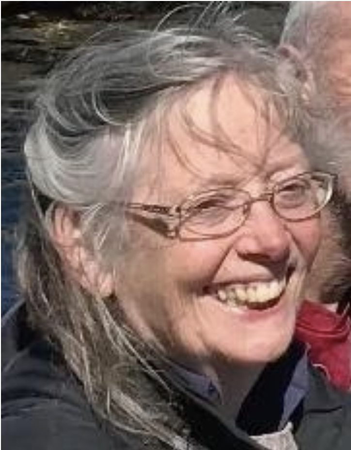

### **How has this coronavirus affected your life?**

Firstly - not very much change because I have been living contentedly in unintended self-isolation! But the new coronavirus has affected my life in that others have reached out to offer me help, which I have been delighted to accept and revel in.

I have become intensely aware of how my past life choices have made me safe, feeling secure, since I am free of concerns about being able to pay the rent or having to take care of small children. While I had sufficient income, I behaved rather oddly in supplying myself with sufficient wonderful books to read that I have not yet read, and enough art and craft supplies to keep me busy being creative and making things for decades more than I could expect to live! I am not at a loss for how to spend my time, not have I been bored (ever, in my whole life…) I have spent a large part of my life being thoroughly involved in community and loving that so much - but also savouring solitude when it could be attained. I realise I have been perfecting the art of enjoying my own company - and now recognise what a blessing that is.

### **Are you working? At your place of work or at home? How is that going?**

I am over-working, at home, although all that work is volunteer, since I am retired from paid work. By “work” I mean things done for others. Some of that has been sewing, and knitting, which I do all over the place. Most of the “work” I do for others is researching on the Internet (and transcribing audio and video on my computer). I think that being able to be of assistance to others is the most grounding, reassuring, peaceful, steadying way to keep oneself occupied, free of one’s own possible concerns!

I have "lived alone" now for more than 30 years - never my intention! But I’m always rather surprised to be confronted with that “fact”. I do not feel that I am alone, not like other people live alone. I have so many people to love. My life has been filled with friendship - so I am never really “alone”.

### **What is the most difficult part of the current situation**?

I suppose my autonomy has been restricted - I am not heading out or joining in as I would normally. But I feel no objection to this. I understand why it is happening and fully support the restrictions.

### **What practices help you stay positive?**

The same practices that have kept me positive for so many years before now. Making Peace. Achieving Balance when knocked off-balance. Watching my thoughts, and observing their nature and origins, so as not to get caught up in them. Babaji's Turning of the Mind. Journaling, to observe those thoughts! and regain a sense of perspective, and my sense of humour, especially about myself, where the mind and emotions can go, which tend to surprise me STILL, even at the age of more than 70. Surprise at how low I can go, how self-sabotaging old behaviours remain; and also at how insightful and self-rescuing I can be. I don’t know that I’d call it “staying positive”. It is far more motivated by a desire, a requirement, to keep myself fearless. Yes, fearless, even in the face of great danger.

#### **Past practices that have helped me stay positive**:

Beneficial past practices I am I thinking I should revive, include singing daily, drawing daily, even more reading of fiction! When I was young, that was what saw me through the reality of times I’d rather not be living through! Easily done - just immerse oneself in another time, another place, another circumstance entirely - distraction can be a great healer, easer of a troubled mind and heart, peacemaker, grounder.

But maintaining loving kindness in one’s heart, for all and everything; and the knowledge and perspective gained from yoga; these are all one really needs.

#### **Different practices:**

Reconnecting with my vast family in England. Maintaining connection with the younger people who love me, and whom I neglect, under the impression that me loving them without them knowing that, is somehow sufficient - for them, for me. But in truth, the more company I can reach out to and enjoy, or suffer beside, or simply chatter on and on with, the further I am from anything like "feeling down”. Regaining a personal connection with the old friends, of my own generation, who have known me longest, apart from my family - from when I was a student in “high school” and in university. We have never been out of touch - but are now close, though so very far apart physically. I had decided long ago, for the planet, not to return to my homeland for a visit again (last time 2005) - but we are now visiting from afar. I’m finding that positive, the sharing of hard times, in part.

### **What are you doing to keep yourself occupied during this time?**

**Body:** Paying intentional attention to my body’s needs, to be fully hydrated, well nourished, and exercised, indoors and out (not enough! but with more intention than before). And I am getting done some hard physical labour, too. So surprised that I can do it, and that it is uplifting to the spirit.

**Mind:** Keeping myself thoroughly informed - listening the CBC Radio One, listening to the updates from experts, interviews with ordinary people and how they are managing, wonderful stories of human resilience, ingenuity, kindness, goodness.

**Spirit:** Reading, Writing, Making Things; doing things for other people (doing things for others is always a great uplift, to my surprise, still, after all these years!)

### **Another effect on my life.**

I am keenly aware of the high likelihood of the unpleasant death looming, of people I love and care for, whose death I would infinitely prefer to be an easeful peaceful even beautiful experience, if at all possible. I have an odd kind of Faith, in the unknowing of what Death is. There’s not much one can do about death. What I struggle with more is Letting Go of the loss of what CAN be remedied - and isn’t.

I find what CAN be done exciting, joyous, amazing! - politically, financially, environmentally.

I find how the BC Government is handling everything is stunningly impressive, uplifting - eye-opening, extraordinary - wonderful. I am so glad to have taken Canada to be my chosen home.

And I find the swift and astounding benefit of the effects of the coronavirus on the planet truly inspiring. This what we CAN do! That keeps me amazed, excited, uplifted - so much so I just feel hopeful for the future. And to be honest, I find the climate crisis far more troubling and urgent and needed - COVID-19 will pass.

I am so thankful for the signs of respite to the planet’s air achieved by bringing to a halt, globally, our current excessive way of life - thanks to the threat of COVID-19. But I am not keen to Let Go of the option to tackle the Climate Change Emergency with as much dedication as the coronavirus has illustrated we all can do, together.

That’s very much a part of “this strange time” for me.
