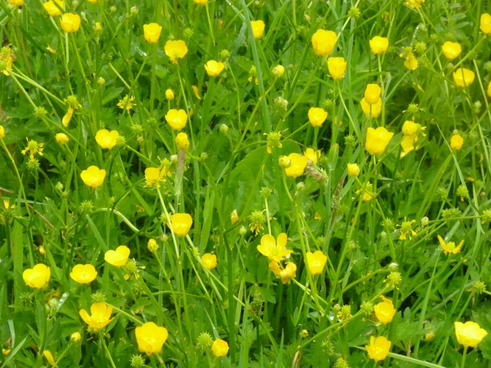

#### *If the only prayer you say in your life is thank you, that would suffice. ~ Meister Eckhart*

Dear friends,

I hope you are all doing well, and finding ways to stay connected and enjoy the beauty of nature during these Covid times. Those of us here in Canada, and especially in British Columbia, are fortunate to be guided by Dr. Bonnie Henry, BC’s chief medical officer. She gives briefings every day, ending each one with, “Be kind, be calm, and be safe.”

Here at the Centre, life goes on quietly. The office is a hub of planning online offerings and exploring how we can slowly and carefully move toward in-person small gatherings while following all the required protocols so everyone stays safe. This will take some time. So far we’ve opened the trail for  islanders to enjoy. The farm is another very busy place. Plants started in the propagation greenhouse have been planted in the ground. So far the alternating sun and rain have helped everything grow well.

Here are some community photos.

- 

  Marion back from Vancouver
- 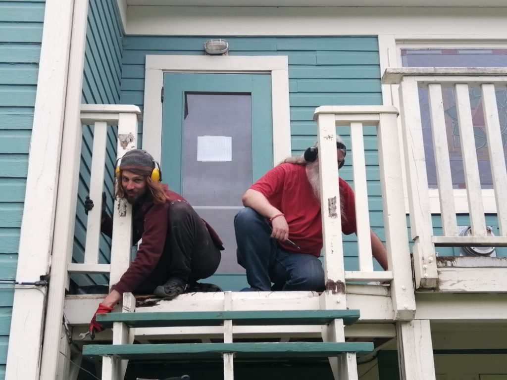

  Daniel and Suneel repairing the back deck
- 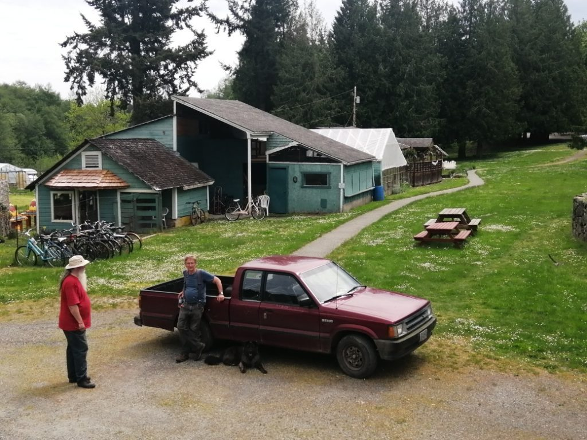

  Suneel, SN, and Misty
- 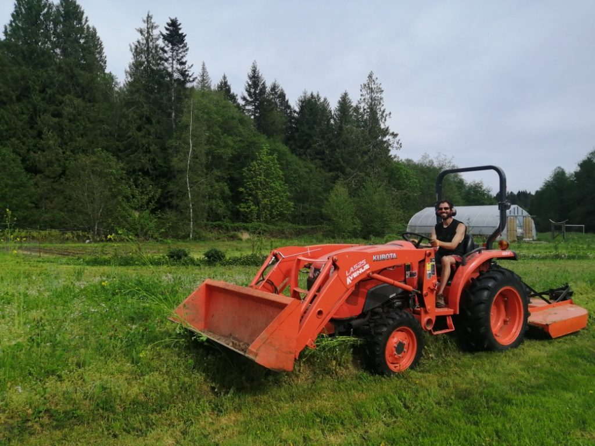

  Dan on the tractor
- 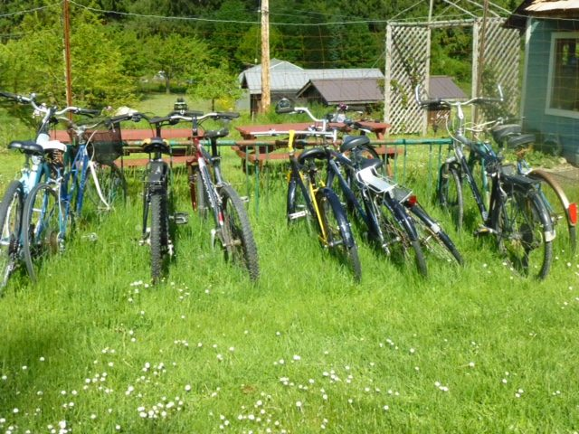

  bikes in a row
- 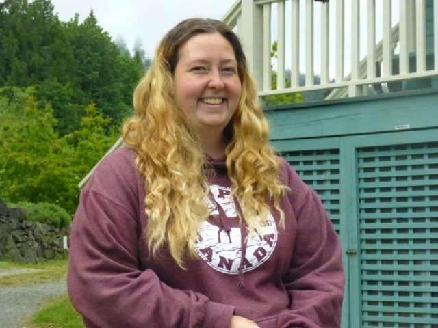

  Jocelyn
- 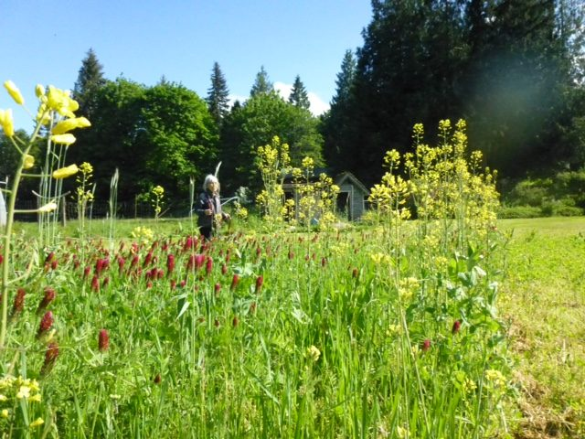

  Sharada walking through the garden

## Dan’s monthly farm update

#### *“The ultimate goal of farming is not the growing of crops, but the cultivation and perfection of human beings.”  — Masanobu Fukuoka, The One-Straw Revolution*

- 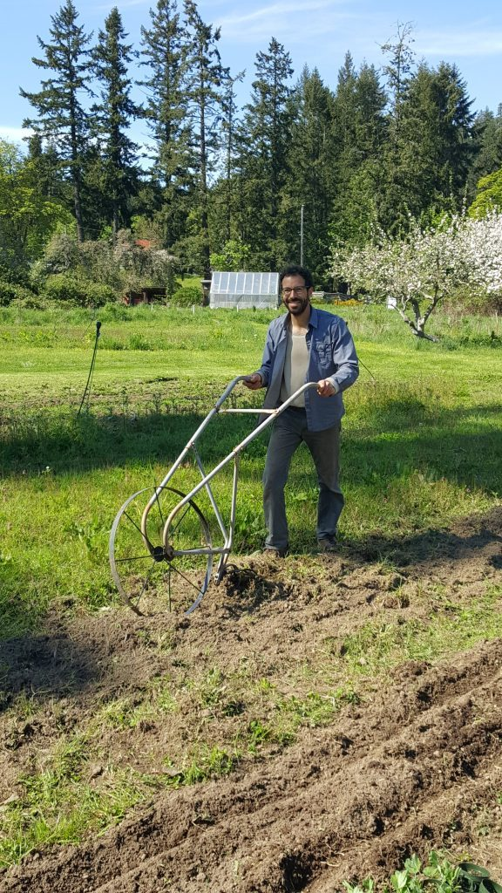

  Dan weeding the flower beds
- 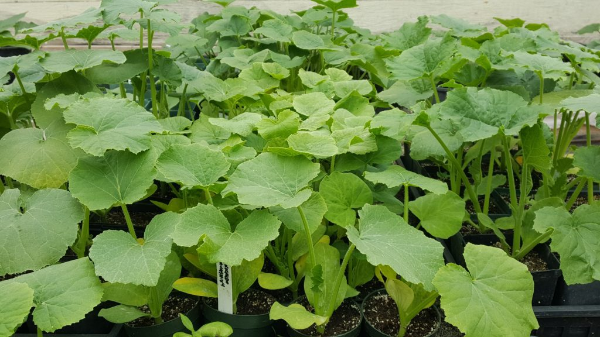

  winter squash waiting to go into the ground
- 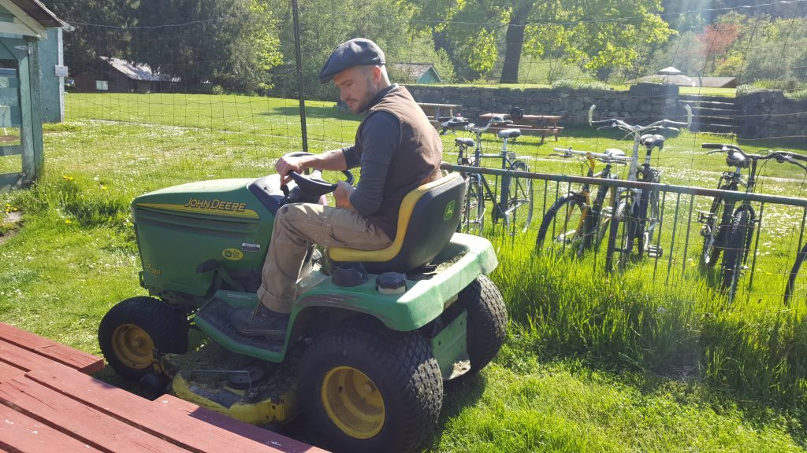

  Adam mowing the lawn
- 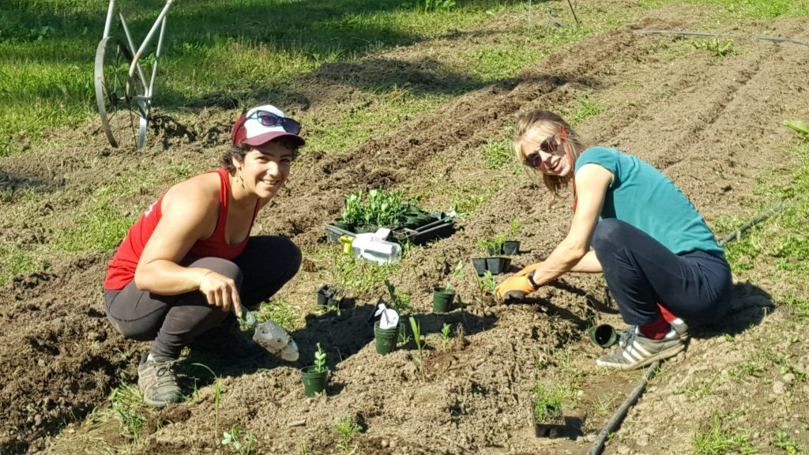

  Marion and Lotte transplanting flowers
- 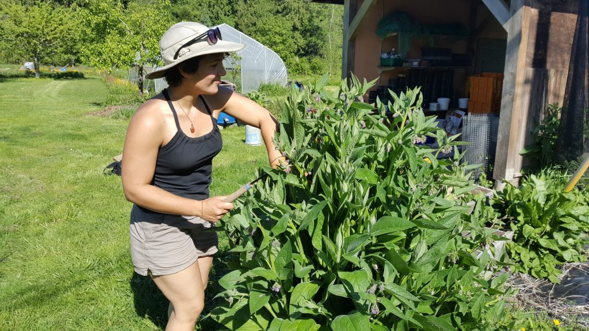

  Marion trimming some comfrey for mulch
- 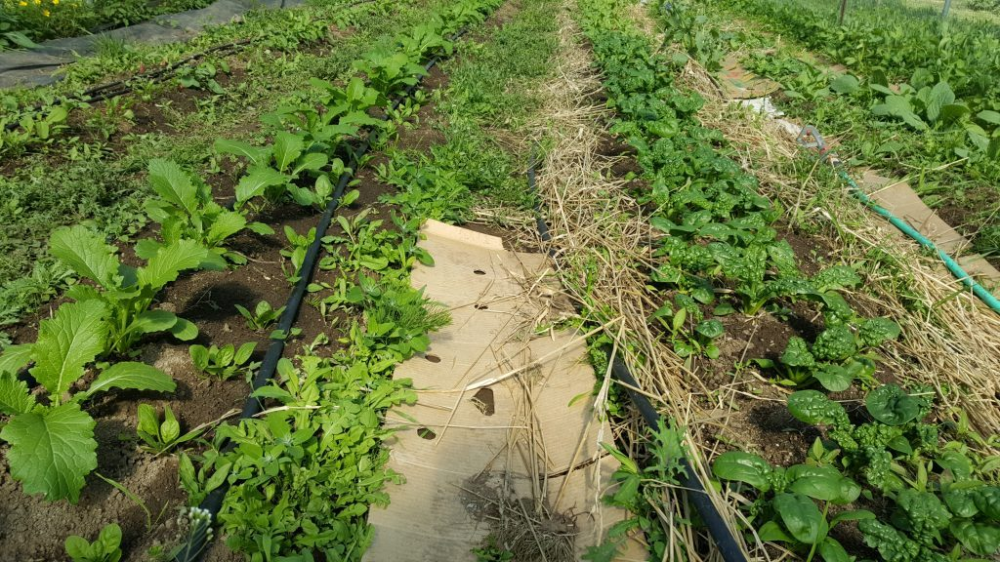

  our greenhouse coming alive with transplant - turnips on the left, spinach on the right

> I recently read *The One-Straw Revolution*, Masanobu Fukuoka’s contemplative book that conveys his modest approach to both farming and life. At a time when the trend in agriculture around the world was moving towards larger but less diverse fields and dependence on herbicides and insecticides, he chose to grow vegetables, fruit, rice and other grains in unity with nature in direct contrast to most modern industrial agriculture, condemning the use of chemicals and machinery and letting the earth supply its own compost and mulch at its own pace.
>
> We have been adopting a comparably simple approach to farming (and life) here at the yoga centre in recent months, in some ways as a matter of necessity, given the limited budget and relatively small community at the moment, but also as a way to experiment and develop techniques that reduce our impact on the land and create a more harmonious environment. This has included weeding and tilling far less than usual so that we leave more wildflowers in bloom for all the pollinators on the property, included honeybees that have been brought here by a former farm coordinator Milo Stuart, as well as transplanting some tomatoes and zucchini plants directly into cover crops that act as a living mulch and fix nitrogen into the soil, removing only what is in the immediate vicinity of the seedlings beforehand.
>
> Transplanting has definitely been the theme of the past few weeks. In addition to the tomatoes and zucchinis, the farm team has been busy moving almost everything from the greenhouse into the fields, including cilantro, peppers, eggplants, ground cherries, peas, sweet potatoes, several types of flowers and more, while also seeding beans, turnips and carrots. We have also been gathering nettles and comfrey around the property to make compost teas that we dilute down to 10% with plain water for an extra boost of nutrition on almost everything we plant out. Nettle fertilizers are high in nitrogen, which makes them particularly good for leafy greens, while comfrey fertilizers are a great amendment for fruiting plants that crave more potassium and calcium such as tomatoes, peppers and cucumbers, especially when they’re just starting to flower.
>
> We also appreciate the support of our newsletter subscribers on the island who have been buying some of our starter plants over the past few weeks. And although we’ve nearly sold out of starters, other than a few cucumbers, winter squash and basil plants, we are planning to continue selling various fresh produce and baked goods one or two days a week at the farm stand when available, starting on June 1 to welcome back parents of students at the Salt Spring Centre School. Stay tuned for more details about this.
>
> In gratitude,  
> Daniel Naccarato

## Join us on Zoom

Check the Centre’s website to see what [classes and events](https://saltspringcentre.com/programs-retreats/public-offerings/) you can join via zoom. One of the benefits of virtual events is that you can come, no matter where you live. Satsang, Yoga Sutras, Bhagavad Gita, Vancouver Satsang, asana classes offered by several people….. You can also check our Facebook page for regular updates. Seeing you at satsang and classes has been uplifting and heart-warming.

## Home Yoga Retreat: June 26-28 & July 17-19

Following in the footsteps of our very popular Yoga Getaways, we are now offering an online version called [Home Yoga Retreat](https://saltspringcentre.com/home-yoga-retreat/). The first one will be June 26-28, and the next one will be July 17-19.

## Save the Date: Bringing it Home - Virtual ACYR, July 31-August 2

*photo of last year's Annual Community Yoga Retreat*

We’re looking forward, as we always do, to the Annual Community Yoga Retreat. This year, our [46th consecutive annual retreat will be online](https://saltspringcentre.com/programs-retreats/annual-community-yoga-retreat/) like so much of the rest of our lives. But it will still be special: There will be all the traditional classes, plus opportunities to visit and chat at a virtual picnic table on the mound. Some events will be pre-recorded for you to enjoy when you wish, and others will be live. There’s no travelling involved, but if you want to enjoy some of the flavour of being on the land, you might consider camping in your backyard. Wherever you are, we can still join together to study, practice and play together, enjoying the blessings of connection with our satsang community.

## Support the Centre

As you may be aware, the Centre is still unable to offer on-site programs due to Covid-19. Until we're able to open the doors to in-person gatherings again, the Centre is operating with severely limited financial reserves. If you've been nourished by the Centre, [please consider donating today](https://saltspringcentre.com/donate/); we need your help now. You can make a one-time donation or you can choose to become a patron by making a monthly donation. This is a wonderful opportunity for each of us to practice generosity, to support the Centre in being able to continue sharing Babaji's teachings and providing a place of peace for everyone for many years to come.

[**Make a donation**](https://saltspringcentre.com/donate/)

## To read this month

There are a lot of offerings in this month’s newsletter, and I hope you enjoy them all. We’d love to hear from you. It’s super easy to write a comment at the bottom of the page of any article you read, and we’re alway happy to read them.

Continuing the theme of Staying Home, Staying Safe, here are [Usha’s reflections on her life during quarantine](https://saltspringcentre.com/staying-home-staying-safe-2/), telling us about what she’s doing and what is helping her stay grounded. As you’ll see, her life hasn’t changed all that much; Usha has always had projects on the go and people to connect with.

Adding to the collection of SSCY Community stories, [Mathew Bentley shares his story](https://saltspringcentre.com/mathew-bentleys-story/). Mathew first came to the Centre for the karma yoga program in 2014, and along with attending classes and working in the kitchen, he met Kris, the love of his life. In this story, we find out more about Mathew’s background, his struggles and his search for meaning. We’re so glad you’re here, Mathew.

Girija, a longtime satsang member from the earliest days, is a talented, versatile woman. She is a marine engineer, an Ayurvedic practitioner and teacher, and an avid trail  runner and mountain hiker. Not long ago she was interviewed by Aparna Sridhar of the Center for Soft Power, and Girija agreed to share [that story in this newsletter](https://saltspringcentre.com/five-time-canadian-olympic-medalists-daughter-discovers-science-of-health-in-ayurveda/). I think you’ll find it inspiring.

Mahavir (aka Raven) shares how his yoga studies and practice have evolved over the years. First drawn to yoga by asana and then study, he slowly found himself inspired to step into the richness of ritual and ceremony. You can read about this shift in [Yoga Ceremony](https://saltspringcentre.com/my-opening-to-yoga-ceremony/).

#### *The flow of energy in the body is blocked when the mind indulges in anger, hatred and selfishness. Keep your mind pure and you will see how easily the energy moves.   ~ Baba Hari Dass*

May you be filled with lovingkindness,  
May you be well,  
May you be peaceful and at ease,  
May you be happy.

Love,  
Sharada
