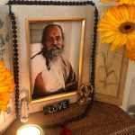

While Salt Spring Centre of Yoga has been unable to safely open its doors for guests to visit the land during the COVID-19 outbreak, we have developed a number of online programs to bring the Salt Spring Centre experience to you at home. We hope you'll join one of our exciting new programs!

### **Home Yoga Retreat**

**June 26 to 28**  | **July 17 to 19**

Join us for an online offering; develop and strengthen your personal practice at home. Begin or enhance your yoga practice from the comfort of your own home with this online yoga retreat. This is the perfect program for support, structure, and connection with like minded people, virtually.  **[Learn more >>>](https://saltspringcentre.com/home-yoga-retreat/)**

### **Yoga as Medicine: An Online Workshop Series**

**July 21**, **July 28**, **August 4** **and August 11**

These modular workshops will cover Ayurveda basics and introduction, as well as: how breathing, meditation and asana can be used as medicine to help nourish our mind and body from physical and mental imbalances. Register in one workshop or all four! **[Learn more >>>](https://saltspringcentre.com/yoga-as-medicine-online-workshop-series/)**

### **Virtual Annual Yoga Retreat**

**July 31 to August 2, 2020**

Every year, the Salt Spring Centre of Yoga hosts an annual retreat – giving our community an opportunity to connect, practice, and share the teachings of Baba Hari Dass (Babaji). This year is no exception. The only difference is we’re moving online! **[Learn more >>>](https://saltspringcentre.com/home-yoga-retreat/)**

---

You are also welcome to join our virtual public offerings, such as Satsang, Sutra Study, and more. Check our **[Public Offerings page](https://saltspringcentre.com/programs-retreats/public-offerings/)** for more details.

## Other Programs

The following programs are currently cancelled or on-hold due to the COVID-19 pandemic.

**[AYURVEDA AND YOGA RETREAT](https://saltspringcentre.com/programs-retreats/ayurveda-and-yoga-retreat/)** - Pending

**[GOING DEEPER MEDITATION RETREAT](https://saltspringcentre.com/meditation-retreat/)** - To be announced

**[ON-SITE WORKSHOPS AND EVENT](https://saltspringcentre.com/programs-retreats/workshops/)****[S](https://saltspringcentre.com/programs-retreats/public-offerings/)** - Currently on hold

**[PERSONAL RETREATS](https://saltspringcentre.com/programs-retreats/personal-retreats/)** - Currently on hold

**[RESIDENTIAL KARMA YOGA PROGRAM](https://saltspringcentre.com/programs-retreats/karma-yoga-program/)** - Currently on hold

**[VOLUNTEER PROGRAM](https://saltspringcentre.com/programs-retreats/volunteer-program/)** - Currently on hold

**[YOGA GETAWAYS](https://saltspringcentre.com/programs-retreats/yoga-getaways/)** - Currently on-hold

**[YOGA TEACHER TRAINING](https://saltspringcentre.com/programs-retreats/yoga-teacher-training/)** - Cancelled for 2020
