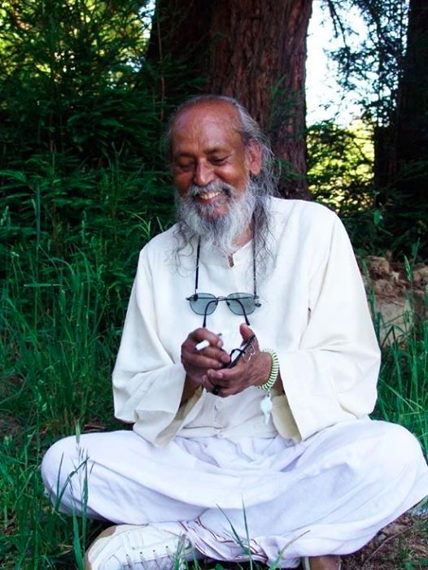

This is a test.

You’ve been stuck at home for three months. You haven’t been able to go out to concerts, to the pool or to the mall (depending on where you live). You can’t travel, and you can’t visit a friend who’s in the hospital. When you do go out, you wear a mask and carry hand sanitizer with you. You don’t know when this is going to end or even if it’s going to end, your income may be unstable, and your future is unknown. Nature is flourishing, yet climate change hasn’t gone away.  Racism and injustice, which have been with us for a very long time, are front and centre, calling us to dive deep into our own hidden biases; this is important work, though not always comfortable.

How are you responding to this test? It is very easy to fall into fear, worry, impatience, frustration, or  anger. When we’re stuck and our usual distractions are not available - and we’re getting pretty tired of it - what can we do? This is the perfect time for spiritual practice. Living through this time (all times in fact) and keeping your mind and heart clear and open is a big practice. There are two possibilities: go under or learn to swim. What’s happening right now in our lives is where our inner work lies: This is our sadhana (spiritual practice).

The tendency to think things are bad and will likely get worse, that there isn’t a happy ending to this story, is a common thought pattern. But what if it’s equally possible that something good will grow out of all this? A question arises:  What does it mean for something to be good or bad?

The belief that things are either good or bad is deeply rooted; we learn it in early childhood, and we apply it in all kinds of situations. It goes something like this: This is terrible and it shouldn’t be happening to me. Yet, just because we believe something doesn’t make it true. As Shakespeare said: Nothing is either good or bad but thinking makes it so.

The Story of the Chinese Farmer, told by Alan Watts,  illustrates this well.

*In our everyday life we identify things as good or bad. If something doesn’t support our ego, the mind labels it as bad, and if it does support our ego, the mind says it is good.*

*The mind is the creator of everything. You create heaven and you create hell. Both are in the mind.*

*Identification with the mind is the cause of all suffering.*

This might be difficult to accept because it suggests we have to take responsibility for our own experience: probably not the external events, but our own response to life. Even in the most difficult situation, it is possible to notice your reactions and *switch the angle of the mind*, as Babaji puts it. When you do this, your understanding will grow, and that will change your experience - not necessarily the outcome, but your experience of it.

You have practices in your practice toolkit that you can call upon. In the midst of grief and unhappiness, there is a light that still shines. Your task is to remember this, and to choose to use the gifts you’ve been given. *Yoga is skill in action.* You may get lost in your thoughts, but you can come back to the wisdom within you at any time. Don’t give up.

*The future is unknown. Whenever we walk toward the unknown, we carry a lamp. In worldly-minded people that lamp is the ego, and in spiritually-minded people, the lamp is divine essence. Both are walking toward the same unknown, dark space; one is afraid and the other is fearless.*

Contributed by Sharada  
All quotes in italics are from writings by Baba Hari Dass

---

**Sharada Filkow,** a student of classical ashtanga yoga since the early 70s, is one of the founding members of the Salt Spring Centre of Yoga, where she has lived for many years, serving as a karma yogi, teacher and mentor.
