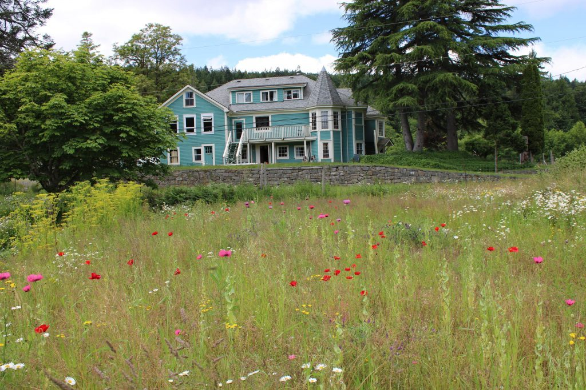

***Ob-la-di, ob-la-da, life goes on, bra,  
La-la, how the life goes on.***   
***~ The Beatles***

Dear friends,

I hope you are well and that you’re enjoying the summer weather (unless you’re in the southern hemisphere which is moving toward winter). Life at the Centre continues to be quiet, as it will be for many months yet. Yet, the satsang community is alive and well, and I’m grateful I get to see many of you on zoom calls.

Here’s an update from the farm, where life in real time continues.

## Dan's Monthly Farm Update

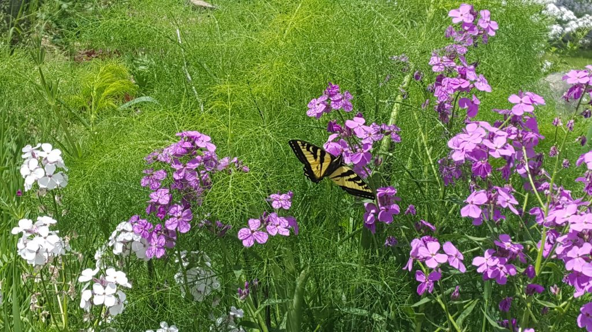

*Swallowtail butterfly amongst the phlox and fennel fronds*

- 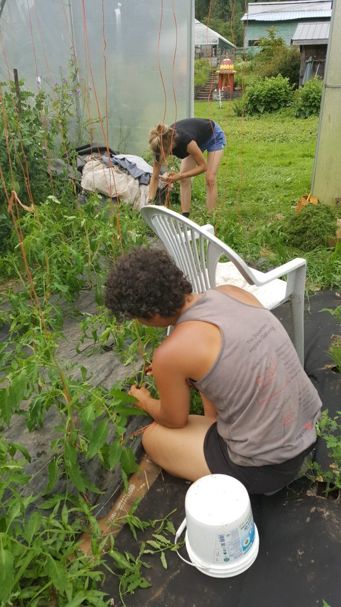

  Lotte and Marion tying up tomato plants
- 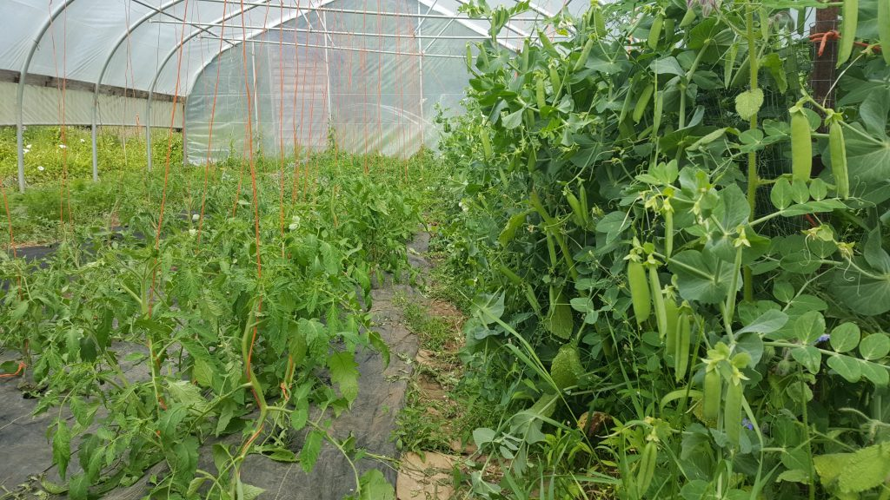

  Jungle of peas and tomatoes
- 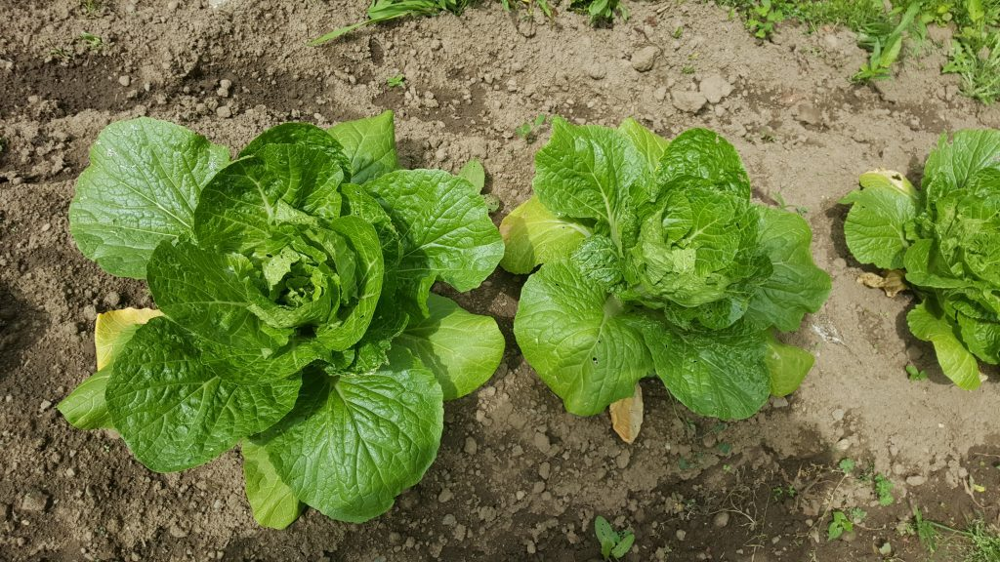

  Nappa cabbage heads

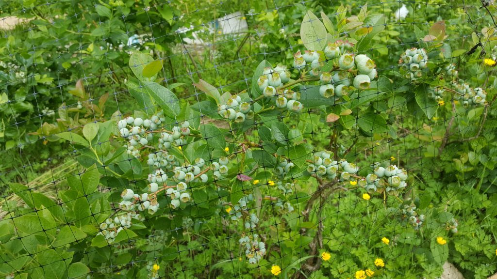

*Awaiting the bounty of blueberries*

> I recently had a dream that a giant blueberry bush teeming with ripe and juicy berries was growing in the Satsang room while numerous elders, members and karma yogis from past and present gathered around to celebrate and share in the abundance. I woke up from the dream feeling hopeful that, despite the adversities the Centre is facing at the moment, there will come a day in the not-too-distant future when the centre will once again flourish and become the beating heart of the island.
>
>  Although our blueberries are still a few weeks away from being ready to harvest, the abundance is starting to become evident in other corners of the farm. The cool and damp weather of June has been a boon for our numerous varieties of lettuce, some of which have still been providing going strong nearly 2 months after their first cuttings. Meanwhile, our first planting of snap peas and shelling peas have been yielding so many peas that we had to reinforce our trellising to keep them upright.
>
>  Just over the past few days, we have completed our first of many upcoming harvests of carrots, Nappa cabbage and rainbow chard for the community, but the most anticipated crop at the moment is the cherries, which should be ready to pick by the time this newsletter comes out. The farm team has assembled a veritable modern art project of CDs and shiny packaging in the orchard in the hopes of scaring off some of the robins, starlings and other birds that enjoy cherries as much as we do.
>
>  Earlier in the month, we experienced a setback when the rainy weather and cool nights spread powdery mildew among most of our cucumber and squash plants. Fortunately, we noticed the disease early enough and treated the leaves and stems of all the plants with neem oil diluted in water and a milk solution, and it seems like the majority of the plants will survive while some are even looking healthier than ever.
>
>  Thanks to the diligence of Lotte and Marion, our herb garden has really come together nicely and has become a handy one-stop shop for the kitchen and the community kitchen to gather herbs like chives, thyme, parsley, mint and dill, and even a bit of lettuce and kale. And the first blooms of calendula, marigold, poppies, cosmos and snapdragons are adding a rich palette of colour to the land. Happy summer to everyone.
>
> In gratitude,  
> Daniel Naccarato

Here are a few other photos of life on the land.

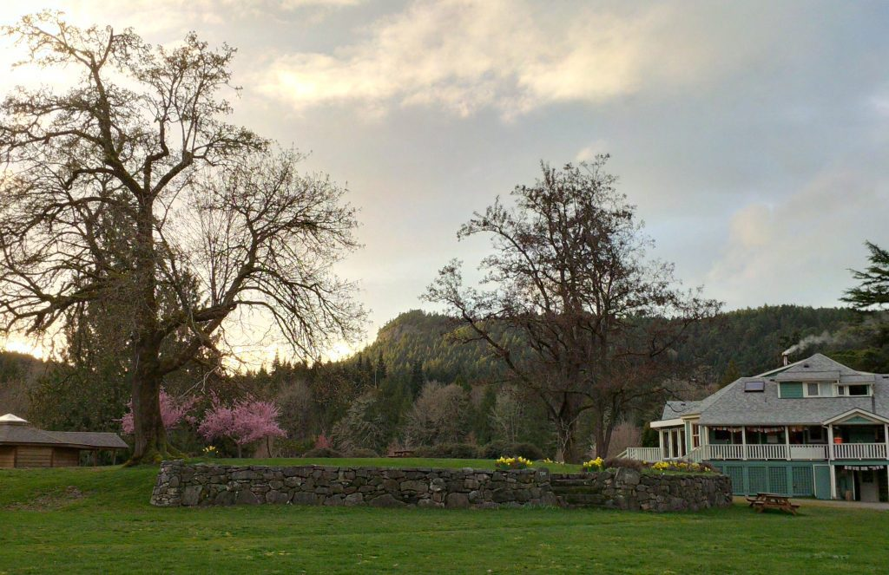

*Spring colours at the Centre*

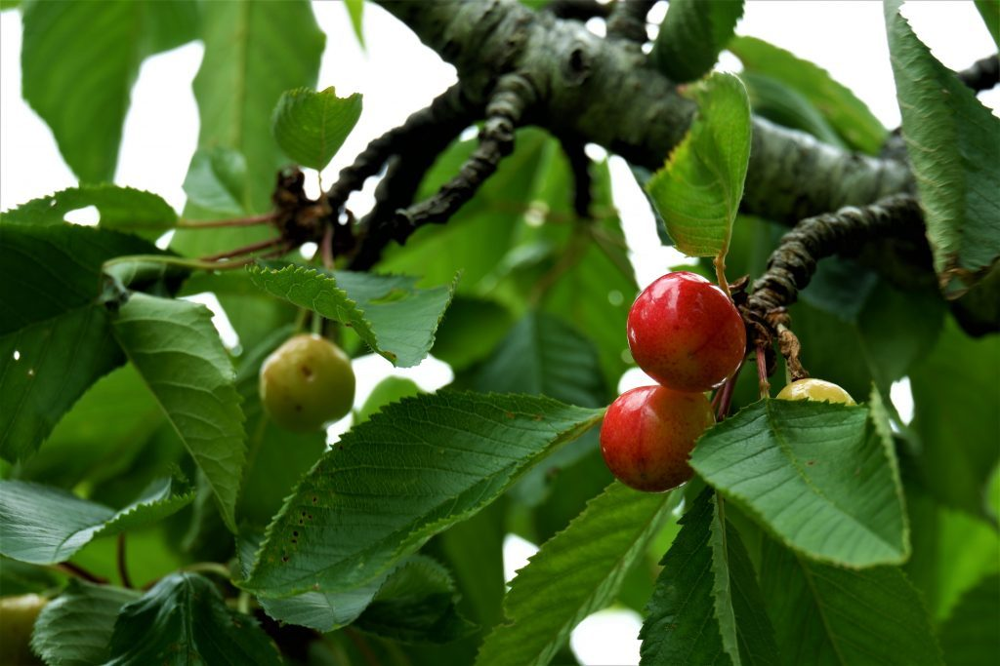

*Cherries ripening*

- 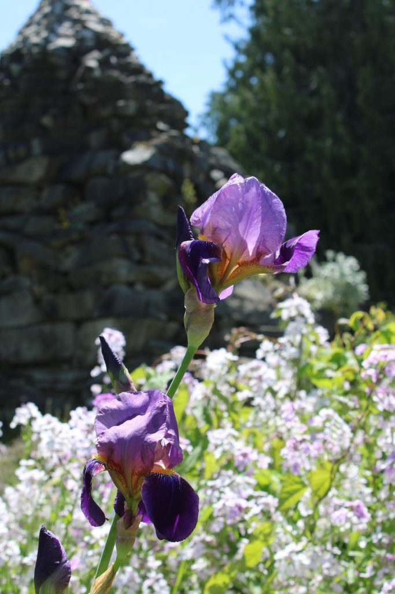

  irises in bloom
- 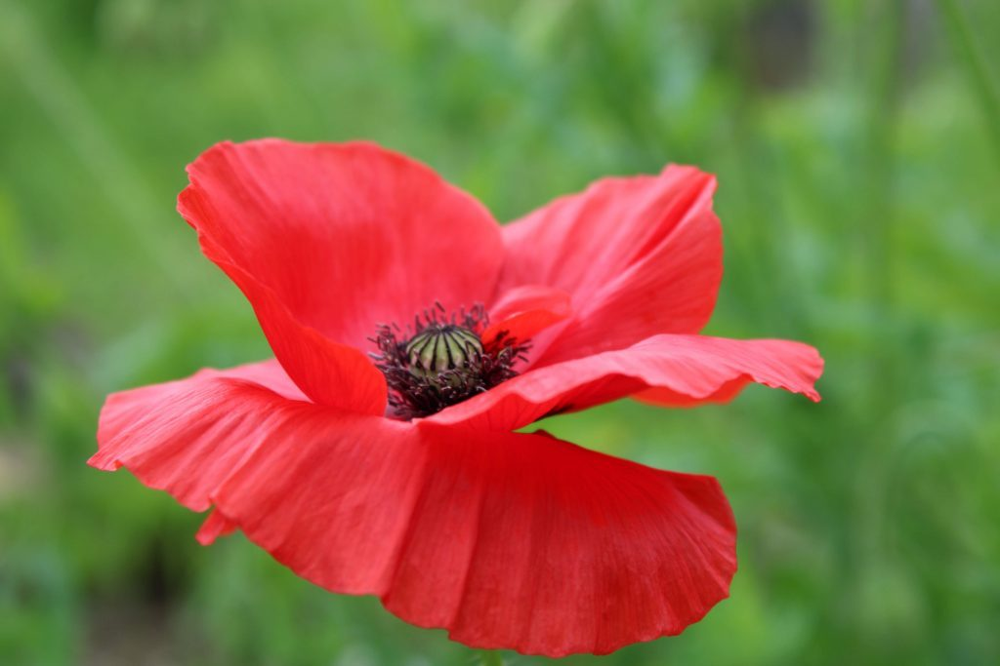

  poppies in bloom
- 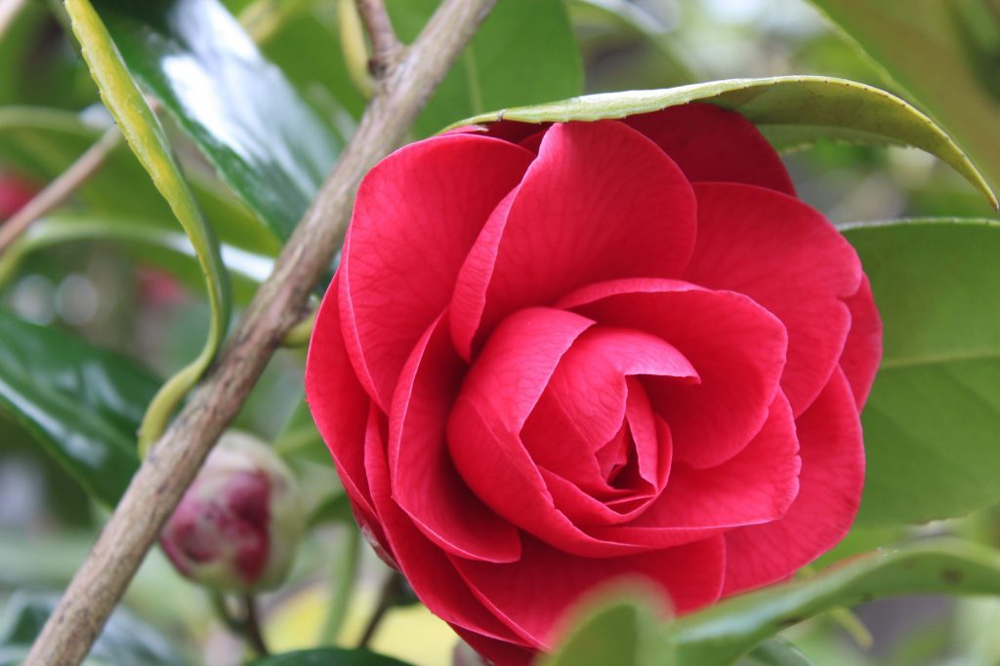

  camelias in bloom
- 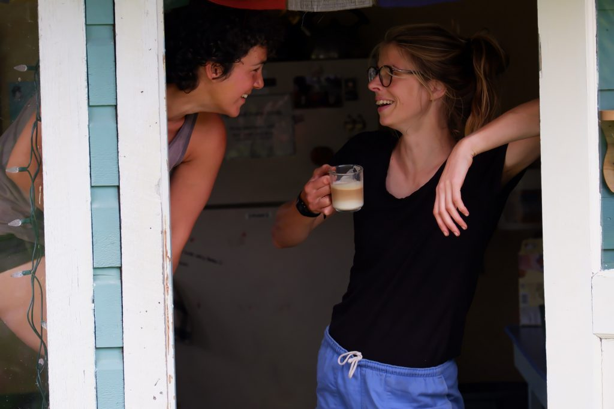

  Marion and Lotte
- 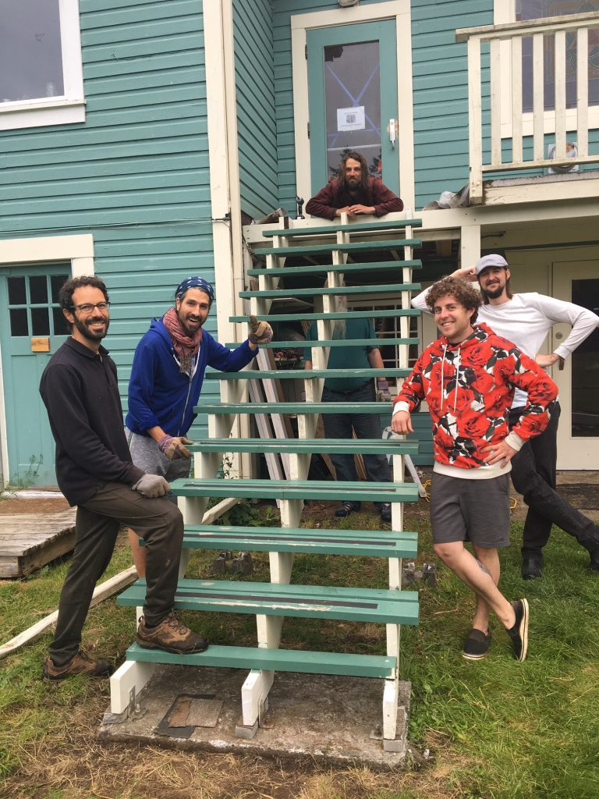

  Repair of the back stair almost complete - Daniel at the top, and his "helpers" - Dan, Angelo, David and Mathew
- 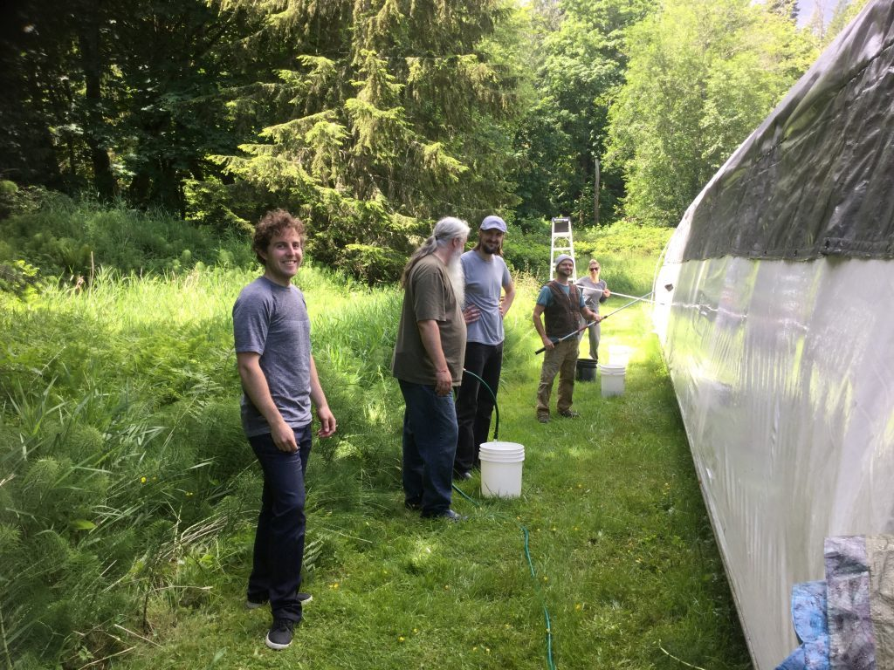

  Cleaning the pond dome - David, Suneel, Mathew, Adam, Lotte

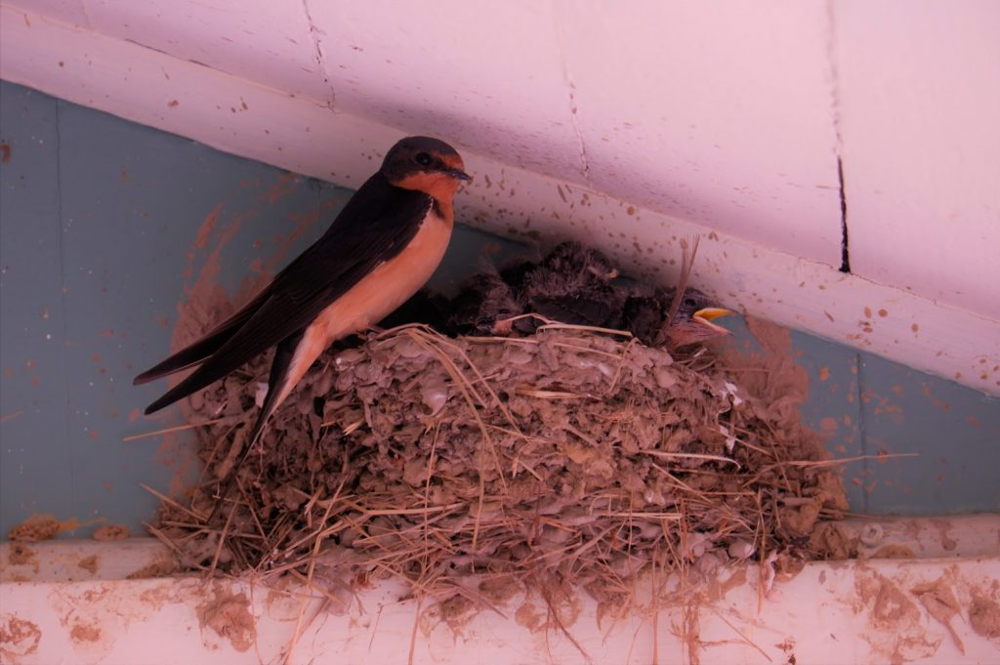

*Swallows nesting*

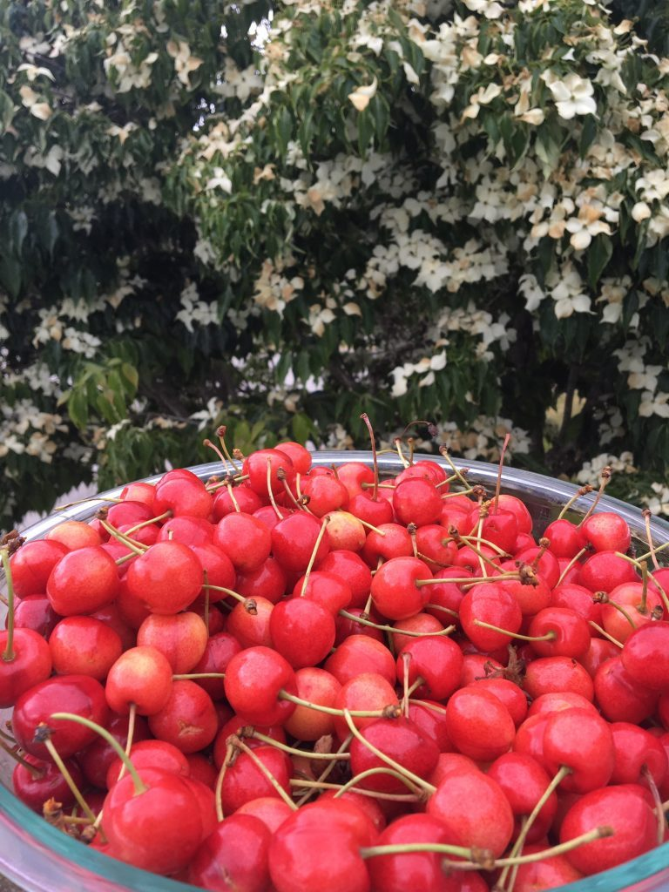

*bountiful cherry harvest*

## Our Programs are Online!

Programs have moved onto zoom, the first [Home Yoga program](https://saltspringcentre.com/programs-retreats/home-yoga-retreat/) taking place on the last weekend in June, as an online version of our popular Yoga Getaways, with some of our favourite, popular teachers. If you missed that one, you can register for the next one on July 17-19.

Following that is a series of four classes called [Yoga as Medicine](https://saltspringcentre.com/yoga-as-medicine-online-workshop-series/), taught by Natasha Jyoti Samson, focussing on yoga and ayurveda. Of the four modules, you can choose to sign up for individual classes or for the full series. Find details and costs [here](https://saltspringcentre.com/yoga-as-medicine-online-workshop-series/).

Although we probably all prefer visiting with people in person, we’ve  found that the zoom format works well for keeping us connected.  It’s designed for meetings, but we’ve been figuring out how to make satsang and classes nourishing despite zoom’s  limitations. One benefit to meeting on-screen is that you can join the calls no matter where you live. It’s been heartwarming to see people whom we otherwise get to see only once a year, and some we haven’t seen for years. I hope to see you at satang or one of the online classes.

Please remember, all these gatherings are open to you at no cost. For more information and passwords to join, visit our [Public Offerings](https://saltspringcentre.com/programs-retreats/public-offerings/) page.

**Tuesdays**

- 9:15-10:45 am: Mount Madonna Yoga Sutra class ([zoom link](https://zoom.us/j/228838829))
- 7:30-8:30  pm: Salt Spring Bhagavad Gita study group ([zoom link](https://zoom.us/j/432061829?pwd=dDBkMjdRT2dKMDNGRnpkOXA3bWxHZz09))

**Thursdays**

- 9:15-10:45 am: Mount Madonna Bhagavad Gita class ([zoom link](https://zoom.us/j/758913072))

**Saturdays**

- 7:30-9:00 am: Mount Madonna meditation class ([zoom link](https://zoom.us/j/703645311))
- 2:00 pm: Salt Spring Yoga Sutra study group ([zoom link](https://zoom.us/j/673534051?pwd=S3hzNVlta3lYanI0YkowZmJPdW05dz09))

**Sundays**

- 3:30-5:00 pm: Salt Spring satsang ([zoom link](https://zoom.us/j/533119043?pwd=QllXanBWYURCNGNUZG41UWpOYkJ1dz09))
- 7:30-9:00  pm: Vancouver satsang ([details & link](https://saltspringcentre.com/dharma-sara-satsang-society/satsa%e1%b9%85g/#vancouver))

It is a blessing to be able to share these teachings with you, and we aim to continue to do so for many years to come, online for now and in person when we are able to gather together again.

## Grateful for your Support

We are very grateful to those of you who have made [donations to the Centre](https://saltspringcentre.com/donate/) to support us during this challenging time. We definitely need financial support, and your help makes a big difference.  If you would like to become a patron, you can make a monthly donation. Thank you again for your continuing support.

[**Donate Now**](https://saltspringcentre.com/donate/)

## Guru-Pūrṇimā

Guru-Pūrṇimā is a traditional day upon which to honour the guru, or spiritual teacher. In Vedic astrology, it falls on the full moon of the month of Āṣhāḍha, which is usually in July. As the full moon symbolizes the fullness of form and manifestation, Guru-Pūrṇimā is a day to honour the way in which divine wisdom manifests in the form of the spiritual teachers in our lives. In our satsaṅg this is especially a time to honour and remember Bābājī and the many gifts and blessings he's given through teachings, spiritual practices, and the inspiring example of his own life.

Guru-Pūrṇimā will not be open to the public this year, but Mount Madonna Center will be livestreaming the Guru-Pūrṇimā celebration from [Sankat Mochan Hanuman Temple youtube channel](https://youtu.be/6s8wTyq_spc).

## Virtual Annual Yoga Retreat - Bringing it Home, July 31-August 2

https://youtu.be/pEhJz1KeZbE

A retreat like no other in our 46 years! With all the turmoil in our lives, it’s time to bring our hearts back home. We will be online together, joining together from wherever we are. No travel expenses! Here’s  a taste of what’s available: sadhana and asana classes, yoga sutra study, zoom room ‘picnic tables’ to visit together, and even Latte Da, with chai and bagel tutorials.  Top-notch performances at Latte Da Stage, including a few special surprises. Parents will be happy to know that there is a ‘Kids Program in a package’ with minimal screen time. Everyone welcome - newcomers, old-timers, and everyone in between! It would be missing something without you! Will you be there?

[**Full schedule and all details online.**](https://saltspringcentre.com/virtual-annual-community-yoga-retreat)

[**Register Now**](https://saltspringcentre.com/virtual-annual-community-yoga-retreat/)

## Transitions

We send our love, prayers and condolences to our dear satsang brother, Maheshwar, on the recent passing of his mother, who died of Covid in a care home, while he was working in the hospital in Montreal, doing the very important job of taking care of medical equipment in the hospital, including ventilators. One bit of good news that we were happy to hear about was that Maheshwar has now retired from that job, which he’d been contemplating for a while. Maybe once travel normalizes, he will find his way back to the West Coast.

We also send our love, prayers, and condolences to Piet, Maya, Max and Marina on the very recent passing of their dad, Marc/Satyanand/Dancing Bear, who was a shining light of kindness, generosity and play. Satyanand has been part of the satsang family for several decades, and all who knew him remember him for  his  loving heart and his creative,  playful spirit. From the early days when he helped develop Off-Centre Stage, the earliest precursor of Artspring, his story-telling for children in the belly of a colourful whale, his spoon playing at satsang, and his delight in talking to everyone, he brought himself fully to whatever he did, joyfully sharing his endless ideas with others.

## To Read this Month

Courtenay, this newsletter’s intrepid reporter/interviewer, brings us [A Conversation with Amita](https://saltspringcentre.com/a-conversation-with-amita-kuttner/), an interview with Amita Kuttner. Amita, born into this satsang community and raised on the philosophical teachings of the yoga sutras, has continued to live by the yogic values instilled since early childhood, approaching each of various interests and projects in alignment with those same values. Among other things, Amita has a PhD in astronomy and astrophysics, having done their doctorate on black holes,  and is now running for the federal leadership of the Green Party.

As we continue to face the challenges of life during this time of world-wide pandemic, economic troubles, political unrest, the exposure of long-present systemic racism and injustice, it can be helpful to step back and view this difficult time from a bigger perspective while at the same time inviting some loving compassion to yourself and those around you. I invite you to read [Changing the Angle of the Mind](https://saltspringcentre.com/changing-the-angle-of-the-mind-2/).

*If we understand the truth that attachments are a mental construct that cause pain, then we can be sane and live in the world peacefully.  ~ Baba Hari Dass*

Love,  
Sharada
