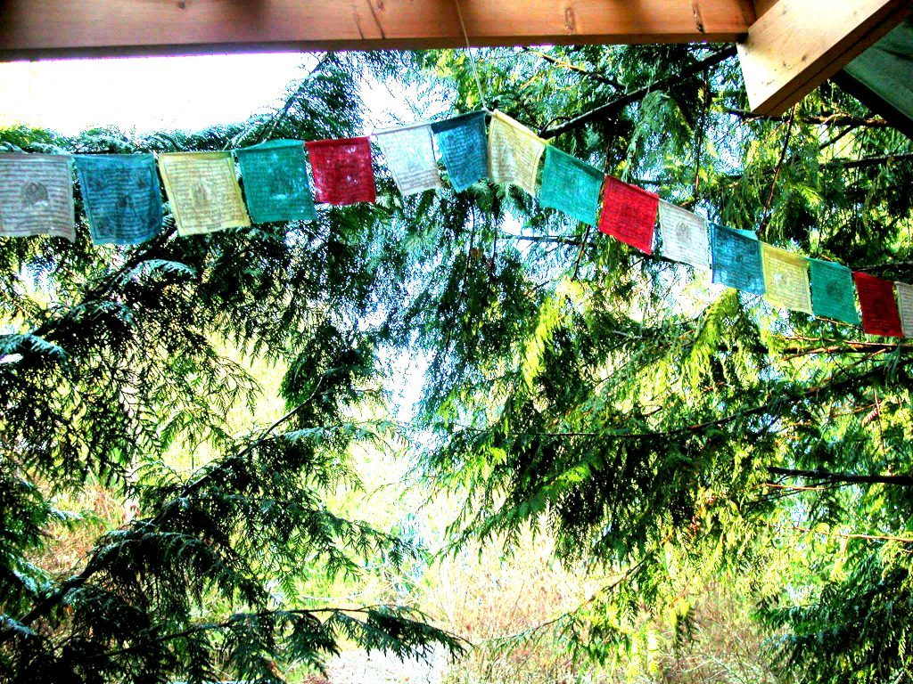
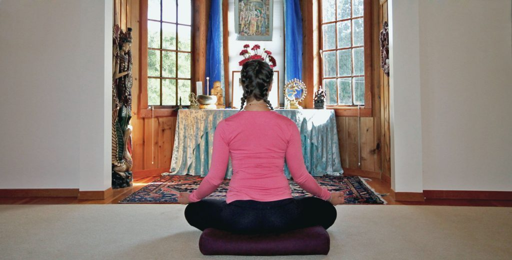

It's hard to know what to expect from an online yoga retreat. As a person who has lived and worked for some time here at the Salt Spring Centre of Yoga, I know the special energy, or container, that is created when like-minded spirits come together to connect and practice in earnest. It's a kind of magic, and each combination of souls creates its own unique flavour. You go through something together over the weekend, and while you may have started as strangers, you leave with a shared bond that is hard to describe.

I was recently asked to attend and help out at the Centre's first Home Retreat, and over the weekend I found myself incredibly surprised. I had my doubts headed in - *how can we do this on screen*, I nervously thought to myself, *this thing that always feels so vital and personal?* We met in our opening circle as usual, except that rather than sitting together on the floor in the same room, we all brought our different, often beautiful backdrops with us. Two of our participants cleverly went on their own cabin retreat to nearby Pender Island, and two others joined us all the way from Bermuda! How interesting that we were about to practice together in such different locations.

The next morning during Sadhana, which consists of breathing practices and meditation, I found myself dropping into a deep state of calm. The simple practices and beautiful, gentle guidance had just the same effect on me as they always did. Our morning asana class was a perfect blend of familiar yet challenging postures (no turning my head all around saying "okay, *what* is she doing?") and accessible bits of philosophy...leaving me with some juicy questions to ponder and journal about. During our afternoon Restorative class, our teacher expertly coached us into the most delicious positions of comfort from her own studio in North Carolina. It didn't matter to my body that she was far away - the relaxation I achieved was very real, and very much needed! Our evening program, in this case "How to Create a Home Practice," was a very relevant, accessible conversation that shone a light on how to take the wisdom of the Yoga Sutras home into our own sacred spaces. I didn't want it to end.

By the time our closing circle arrived on Sunday, I felt connected to our teachers, and each one of the other participants - and felt the same bittersweet feeling I always do as retreats come to an end. Somehow, we had still created our own special container, despite our vastly different locations. One of our wonderful teachers, Anuradha, has said it is because we are all beings of energy and light after all, and that this energy can reach across time and space....and apparently right out our computer screens! Whatever it is, it is so liberating and fascinating to know that this is possible, because it has truly opened us up to a world of new connections and opportunities to practice together.

*- by Courtenay Cullen*

**Upcoming [Home Yoga Retreat](https://saltspringcentre.com/programs-retreats/home-yoga-retreat/)** **weekends:**

**July 17 – 19, 2020  
August 21 – 23, 2020  
September 25 – 27, 2020**

