**Written by Maya and Piet Suess**

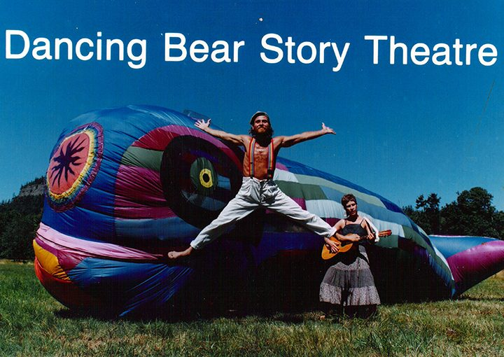

*Dancing Bear Story Theatre Press image, with Gaia Belle and Mayana Williamson, 1988*

As the birds began to chirp at 4:07 am on June 22nd of this year, with his sons Piet and Max at his side, our dad Marc Alan Mendle Satyanand Dancing Bear Suess took his last breath. It was the end of 73 eventful years in this realm.

He was a man of many names, each rich in meaning and symbolism, marking the various eras of his life. One of his names, Satyanand, was given to him by Babaji and means *Bliss of Truth,* a concept which deeply resonated with him.

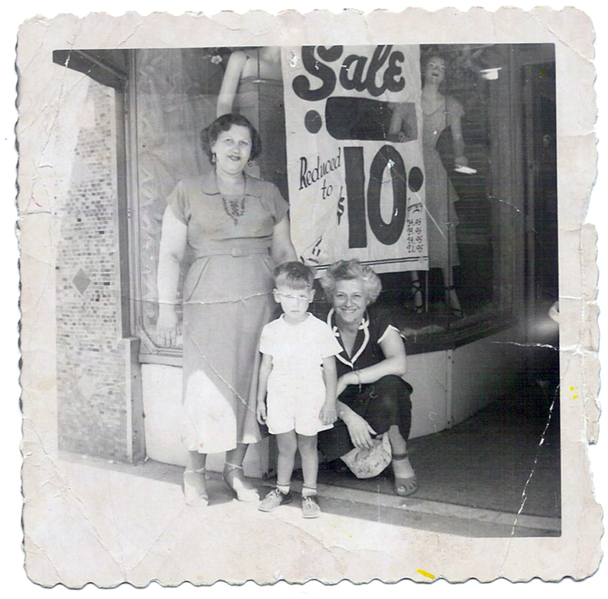

*Little Marc outside his mother Mae's (standing) Dress Shop in Brooklyn, 1950.*

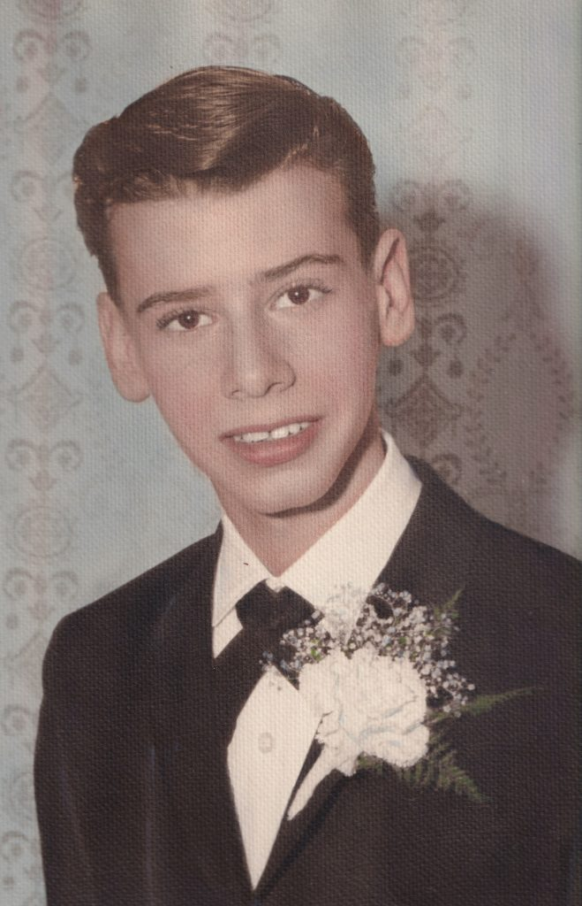

*Marc about age 13, perhaps middle school graduation or Bar Mitzvah*

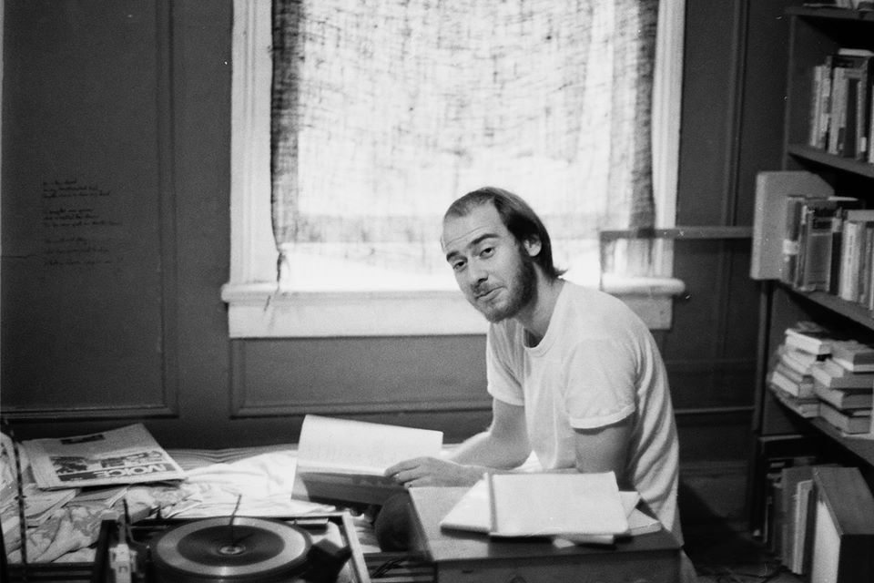

*Marc in an apartment in NYC during college. Taken by his theatre collaborator Franklin Feinberg, 1969*

Marc was born in Brooklyn, NY, to first generation American Jewish parents. He considered himself part of a meaningful generation, born under the conception of the Nuclear Bomb and coming of age during a time of great social change, political rebellion and spiritual renewal. As with many people of his age, he sought new models on which he could pattern his life. This seeking spirit brought him to Salt Spring Island - following a Jewish congregation from Victoria on a last minute day trip with his wife Janis. As with many things, he was introduced to the Centre community through one of his children, when in 1981 his three year old daughter Maya met Nayana Priya Filkow the daughter of Sharada and Sudarshan (Sid), who were already deeply involved with the Dharma Sara community.

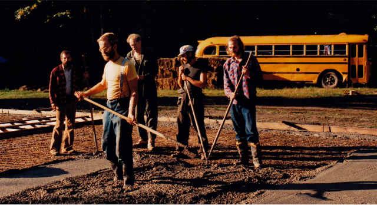

*Laying the foundation for the Centre School: Sid, SN, Martti, Satyanand, Tao, early 80s*

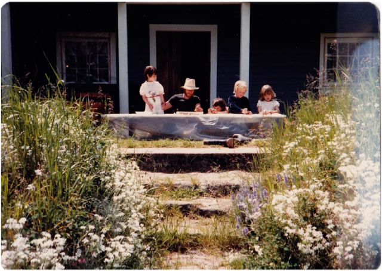

*Outside the basement classroom: Maya, Satyanand, Nayana, Rohan, Ariel, 1983*

1981 was also the year that the land for the Salt Spring Centre of Yoga was purchased and the Centre established. Satyanand became connected to the Centre at the perfect moment to get his hands dirty and help in renovating the “big house” and constructing some of the early out buildings. A tidbit he liked to tell his children was that under the tutelage of Martti, a Swedish resident of the land in those years - who famously swore and smoked and drank profusely - Satyanand helped to build a proper Swedish style sauna (no longer on the land).

Any of us present in those days will remember the talent shows, Jai bazaars, yearly Ramayana, Hanuman Olympics, Halloween parties, kitchen sing-a-longs and other creative and playful endeavors that made up our shared time. In that environment, Satyanand found a kindred band of seekers willing to explore the deep questions of life and existence, bring a joyous devotion to their queries, and play with delighted abandon. Satyanand loved to practice Bhakti Yoga at Satsang, playing a set of attached wooden spoons in full rapture. Within this fertile landscape Satyanand co-founded *Centre Stage*, a theatre company based out of the barn, which stood where the Wellness Centre is now. *Centre Stage* only had a short run, as it grew to become a gallery and theatre space in Ganges called *Off Centre Stage*, which hosted both local and off-island talent, providing theatre, art exhibitions, stand-up comedy, workshops and other mayhem.

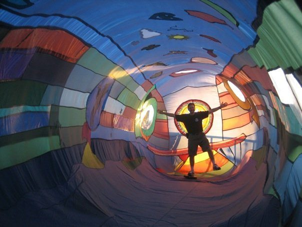

*Dancing Bear inside Gaia Belle - date unknown*

In 1988 Satyanand adopted a new name, becoming Dancing Bear and founding the Dancing Bear Story Theatre. In order to make a venue for this new project, Dancing Bear enlisted the help of textile artist Evelyn Roth who facilitated a community sewing project in the then new Centre School building. Many Dharma Sara members and other islanders helped assemble a 40 ft, multi-coloured, inflatable, patchwork whale they named Gaia Belle, which was in fact a portable theatre where Dancing Bear could perform original stories for children. He and his whale toured schools, festivals and other events for over 20 years. The signature image used on all the Dancing Bear Story Theatre press material features him jumping in mid air, full star pose, in front of Gaia Belle the whale and Mayana Williamson holding a guitar. Mayana wrote and performed many original songs that became a key part of the touring show. The photograph was taken in the front field of the Salt Spring Centre, Mt. Maxwell rising behind them. Anuradha recently told a story about Babaji coming across Gaia Belle inflated on the mound during a Summer Retreat, and how much he seemed to enjoy the experience. Anuradha had the sense that Babaji felt that he and Satyanand were in “cahoots,” working together to bring more children to the land.

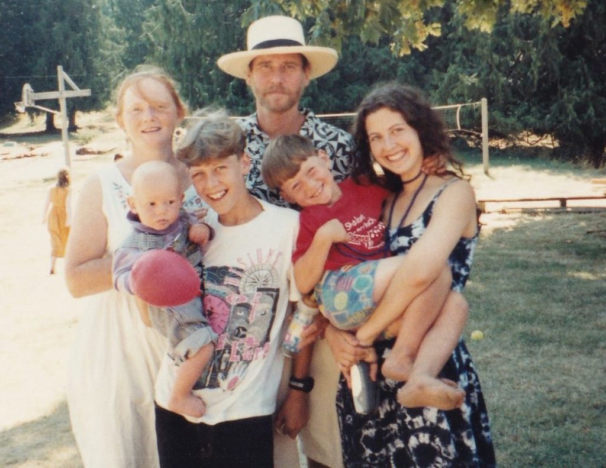

*Satyanand, Lori Justus, Piet, Marina, Maya and Max. 1994, at Daya and Josh's wedding at the Centre*

Not long after Dancing Bear Story Theatre was founded, Satyanand followed his kids and their mom, Janis to Vancouver. Now busy with telling stories, located elsewhere and growing his family, he became less involved with the Centre community. Although every so often, he would return to the land to play the spoons, share meals, help build rock walls, or just sit in the shade of the big maple tree and talk to old friends.

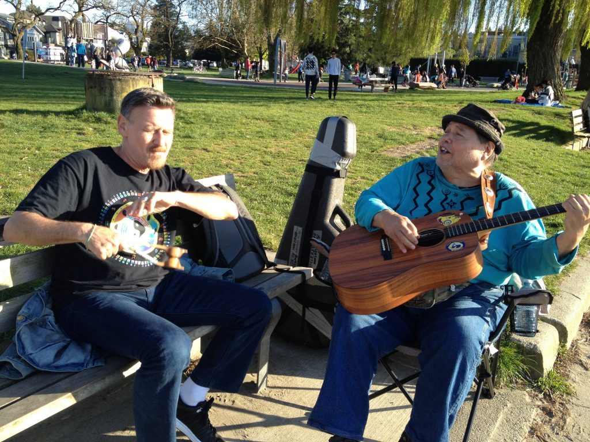

*Playing spoons with Adam at Kits Beach in Vancouver, 2019*

In his more recent life, after he stopped touring as Dancing Bear, Marc returned to using the name given him by his parents, but with a slight twist. He would write it as Arc13, M being the 13th letter in the alphabet. It was a name he had created when he was young that still had deep meaning for him. He began writing again, stories not to be performed, but read. His interest in the i-ching, symbolism, lunar cycles, and Eastern mysticism formed the foundation of a large work that spanned many time periods and continents. After having a dream encouraging him to seek darshan, he met with Babaji who told him that his “mind [was] inside a great project.” Satyanand asked, “is it good?” Babaji nodded, *yes*. Arc13 was still working on this project at the time he became ill.

In the days that he lay in hospice, with his family visiting, his son Max read to him from Silence Speaks. Right up to the end of his life, Marc, Satyanand, Dancing Bear had a deep affinity and connection to the Salt Spring Centre of Yoga and Babaji's teachings. He was very proud and encouraging as his children, Maya, Piet, Max and Marina, maintained a relationship with the Centre in their various ways. He knew that it was one of his greatest accomplishments and great joys to have found and been associated with Babaji and the Salt Spring Centre of Yoga.

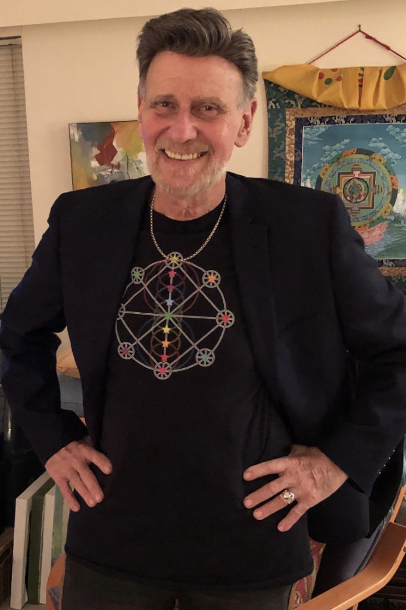

*New Years Eve, 2020, wearing a T-Shirt of one of his own designs*

In loving memory of our dad, Marc (Arc13) Alan Mendle Satyanand Dancing Bear Suess.

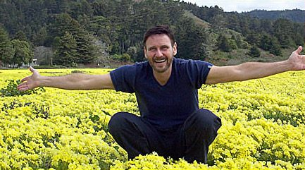

*Satyanand in a field of flowers, 2005 (wild guess)*
